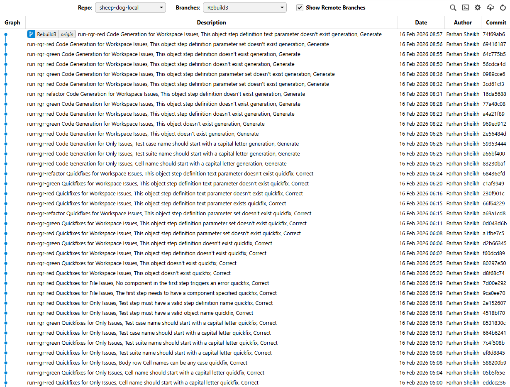
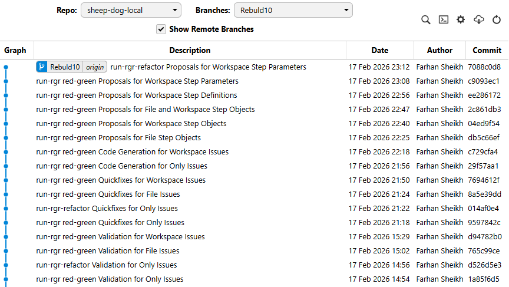
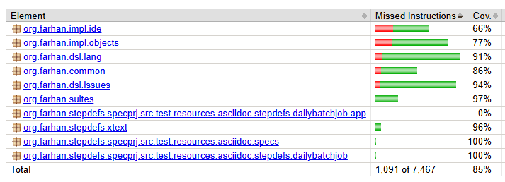

* TOC
{:toc}

---

# What Darmok does

These are my notes on the current version of a small program I call [Darmok][darmok].
Darmok is currently a powershell script which puts back the java code in [`src/main/java`][issues] after I delete the implementation.
It iterates though a sequence of test cases going through the red-green-refactor cycle for each of them.

## What is Rebuilt

- **Issues Package**: [`src/main/java/org/farhan/dsl/issues`][issues] can be put back completely after I empty out the method bodies
- **Language Package**: [`src/main/java/org/farhan/dsl/lang`][lang] isn't currently being auto-generated. Its tests are non-Gherkin style tests which I'll be converting this week.
- **MBT Code**: [`src-gen/test`][src-gen-test] is off-limits for Claude and has the `.feature` test scenario files and and `.java` glue code and interfaces. I'll move more of the boiler plate code from [`src/test`][src-test] to this directory.
- **Non MBT Code**: [`src/test`][src-test] is also off-limits for Claude. It has code that connects the generated test automation to the main code. Though Claude can generate this, it occasionally hardcodes responses just to make the test pass so I excluded it for the first set of fully automated runs. I'll update the MBT code generation to address that. It's because of this, that I have to empty out the method bodies rather than outright deleting the class or the code won't compile.

## Prepping for a Run

Before I attempted to delete everything, I went through a few cycles of renaming.
This was going to be important for when I asked Claude to create tests in the DSL to fill in gaps; I'll explain more below.

I asked Claude to read a definition of my domain, in this case the Xtext language grammar [`SheepDog.xtext`][sheepdog-xtext] and compare it to the main code class, public method and enum names.
Its output was the contents of the [`sheep-dog-test/site/uml`][site-uml] directory.

I also had to provide it with other terms which altogether act as variables such as `{Language}` or `{Issue}`
The complete list of variables for `sheep-dog-test` is in [`site/uml-overview.md`][uml-overview].
Below is an example of the [`SheepDogUtility`][sheepdogutility] class
Anything that didn't fit a pattern, I decided to make those utility methods `private` and let them be duplicated.

```
# {Language}Utility

Static helper methods for grammar element operations. Separates utility operations from grammar model classes, keeping interfaces focused on data access.

## get{Assignment}AsString

**Desc**: Converts a list of grammar elements into a formatted string representation for display or comparison purposes.

**Rule**: SOME method names follow get{Assignment}AsString pattern.
 - **Name**: `^get{Assignment}AsString$`
 - **Return**: `^String$`
 - **Parameters**: `^\(List<I{Type}>\s+\w+\)$`
 - **Modifier**: `^public\s+static$`

**Examples**:
 - `public static String getCellListAsString(List<ICell> list)`
```

## After It Runs

Even though I had tests, they weren't all good enough for Claude to infer the complete implementation.
Before I deleted and recreated the code, I asked it to use **JaCoCo** reports and walk through the code and find parts of the code that had coverage but whose logic wouldn't be implied by the current tests. It was interesting because though I thought my test was clear about the expectations, I had implemented things that it wouldn't have thought of.

After watching a few runs, I decided to take another approach. I tried to rebuild parts of the code with the tests I had.
I deleted parts selectively, one method body at a time to focus it.
I asked Claude to compare the branches and it pointed out what was missing and made a test for that.
Then I deleted the code and it tried again and identified the next gaps, sometime for the same method body but for a branch it missed the last time.

I'm interested in this approach because I'm curious about how easily I can get it to take over any project of mine and figure out what the testing gaps are.
I'd have it go in a loop until it concluded there were no gaps and I had a set of characterisation tests for the project. At that point I'd trust it to maintain that code.

When I work on the [`src/main/java/org/farhan/dsl/lang`][lang] package, I'll start with a few examples but use this approach to make an alternative red-green-refactor process.
Here, the red phase will generate new test cases in the [`sheep-dog-qa/sheep-dog-specs`][sheep-dog-specs] project based on the branch comparison rather than iterate what's already there.
The process will stop once no more tests are being suggested implying the code has been migrated.

## Red-Green-Refactor

- The red phase is the test automation generation using traditional code generation techniques from model driven development.
- The green phase is a simple prompt telling Claude to fix the failing test.
- The refactor phase is a skill that Claude uses to remove duplication. It does run some python scripts to validate the structure and content of the [`uml*.md`][site-uml] files.

Previously I was making a commit after every scenario but this was a bit much



Now the files are staged after each green cycle so I can see the changes while it works but they're only committed at the end of a feature file.



Most of the interesting information is in the log files. These are samples:
1. [`Red`][red-log]
2. [`Green`][green-log]
3. [`Refactor`][refactor-log]
4. [`Darmok`][darmok-log]

### Red Cycle

The red cycle does 4 things:
1. Invoke the [`sheep-dog-dev-svc-maven-plugin`][dev-svc-plugin] to [`convert asciidoctor files to the UML model`][convert-asciidoctor] for tagged tests
2. Invoke the plugin again to [`convert the UML model to Cucumber with Guice code`][convert-uml-cucumber]
3. Create a test runner class if it's not already there
4. Run the tests to make check for a failure. The green cycle is skipped if there isn't one. This happens when Claude overdoes the previous tests.

I'll be converting the powershell script into a Maven goal.
It'll create more of the boiler plate code in [`src/test/java/org/farhan/common`][common] but put it in `src-gen/test` so that the only thing left in `src/test/java` is mapping code that Claude can't use to cheat :).

### Green Cycle

The red cycle prepares the tests for the green cycle.
Just before this prompt is run, the red cycle has made sure that there's a failing test with similar passing tests if available.

```
Run `mvn verify -Dtest={runnerClassName} -Dmaven.test.failure.ignore=true` in {projectPath} and fix any failing tests:
  a. **IMPORTANT** Only modify code in src/main/java **NOT** in src/test/java
  b. Use `{projectPath}\site\uml\uml-interaction.md` or the `{projectPath}\site\uml\uml-class-*` files as guidance when creating new classes and methods.
  c. Use `{projectPath}\target\site\jacoco-with-tests` to guide your analysis of what has previously been implemented for similar tests
  d. Use logging statements to help you debug
  e. Run mvn test to make sure all the project tests pass
```

### Refactor Cycle

I don't specify too much here. I assume there's other tools out there that will probably take care of this and so I'd use one of them for this cycle. For now though, the refactor cycle does these tasks:

1. Eliminate duplication with utility files. There's one main utility class. Over the several runs, I've watched Claude figure out what it can refactor out in to that utility class. Each time I rebuild the code, I leave that utility class alone and the subsequent green cycles need less refactoring.

2. Eliminate duplication between class methods. Though the class body is deleted each time, Claude does a consistent enough job of breaking up methods into smaller ones, it's not always needed but just a personal preference of mine.

3. Apply code quality improvements to deduplicated code for nesting, logging, error messages, defensive coding, import optimization etc. Once I have a tool/service to do this, I'll move the previous 2 tasks into the green cycle.

---

# Factors Affecting the Quality and Speed

## Agents and Models

### Haiku vs Sonnet vs Opus

Sonnet and Sonnet works best. I tried Opus and Opus and the code isn't that much better but it takes noticably longer.
Haiku for the green cycle with Opus or Sonnet for refactoring is noticably faster but there's more refactoring done.
For example it'll hardcode and duplicate a lot of stuff. Then in the refactor cycle that's all cleaned up. The duplication seems to come from it doing the least work to make the test pass.

Let's say I have n scenarios in a feature file, most times Sonnet would understand what needs to be done and implement the first scenario so well that the other scenarios would just pass. Haiku though would need to make a change for each scenario and as a result go back and rework the previous scenarios, the code would get bigger and then the refactor cycle would clean it up. With Haiku, I need to do all three cycles because clean-up is needed for often. With Sonnet, I can do red and green cycles for multiple scenarios before needing a refactor cycle once per feature file.

These branches in **sheep-dog-local** map to the combinations
- [`Rebuild 10`][rebuild-10]: Sonnet Sonnet
- [`Rebuild 9`][rebuild-9]: Haiku Sonnet
- [`Rebuild 8`][rebuild-8]: Haiku Opus

### Multi-Agent experiments

I've tried these two experiments:

1. I tried having two agents concurrently work on a feature on separate branches but ran into two problems.
    1. First, I hit my session limit faster
    2. Second, I realised I'd have merge conflicts to deal with for common classes like the utility one. I'll change the refactor process to avoid this in the future. I might use a combination of Beads and Gas Town to orchestrate this.

2. Given that I tried rebuilding the project a few times, I asked Claude to compare the branches and copy the best implementations into the baseline that I used. What was interesting is that no branch followed all the rules perfectly. But when Claude considered all 4 (Rebuild 7 - 10) it copied the best practices from each. This made me wonder if instead of refactoring after every red-green cycle, if I should pick the best patterns from multiple agents competing to make the best code?

## Graph and UML Models

### Graph Model Traversal

There's much to explain here but I'll keep it short until I have diagrams to visualise it.
The process isn't using a graph model currently.
I manually walk through the test cases simulating the depth first traversal and sorting the test cases in the `scenario-list.txt` file.
That file is created by a python script which also creates this plant uml diagram


#### What is a test case?

I'll start with what I call a test case for the purpose of my explanation; it's a path through a graph model.
The test steps are the vertices and the directed edges represent which step preceeds another.

#### Why give it only one failing test case?

If I give more than one test at once, Claude bounces all over the place. It'll run a test, look at some failure and try and fix it. Then another test behaviour changes and now it tries to fix that. It can go for minutes without fixing anything at all.

#### What effect does the order have?

If I gave one test case at a time but each one was very different from the previous one, then it didn't have a similar successful implementation as a reference. It would then attempt to search the entire code base.
So whenever I give it a failing test case, I give it examples of succesful ones and their jacoco with tests reports



You could randomly give test cases, each time including similar ones and it would work fine.
I don't do that for two reasons.

1. I'm sequencing them manually and I assume a depth first traversal for the way I model them would produce the same order.

2. When it refactors the code, I want it to look at all the related changes together instead of revisiting the same class again and again which slows it down.

When switching features, the last test for a feature might not look like the first test for the next feature.
In the case of the Validate, Quickfix, Generate, they are because I iterate through them in that order.
However if I jumped from one feature to another randomly (this happened by accident in the begining) it can take almost 15 minutes to do one test case compared to the average 4 minutes.
If the first test case is small enough, then it doesn't matter as much because in these specific runs, all the tests have a similar setup so their steps are the same.

#### What effect does the length difference have?

The goal is to have a sequence of test cases such that they are slightly different from each other.
If multiple test cases are on the same path, they're sorted in order from shortest to longest.
The importance of being slighty different is that Claude will then have to make a smaller code change.
The bigger the difference, the more it has to think, the more the variation in the resulting code and the more time it takes.
I can reduce that time by adding more examples to [`uml-interaction.md`][uml-interaction].

I've tried two extremes:
1. If I give it all the tests and then a set of examples which is basically the original code in [`uml-interaction.md`][uml-interaction] file.It'll just copy and paste entire chunks of code which defeats the purpose of having it figure out what to do. When Claude created the [`uml-interaction.md`][uml-interaction] file it did just that. It reviewed the entire code base and came up with the minimum number of examples to demonstrate how to implement stuff. That list was too long and I had to delete examples. I think the list is still too long.

2. If I do the other extreme, and give it one edge/pair of steps at a time, it needs less examples, and can quickly figure out what to implement. It's harder for me to do this manually so I didn't experiment with this too much.
I'll need an actual graph model to generate these different length paths and attempt a breadth-first traversal.

### UML Patterns

Instead of a uml diagram, I'd like it to follow uml patterns per project found in [`site\uml\*.md`][site-uml].
It's basically naming conventions and relationships between them or code snippets for method bodies.

These are the types in order of importance:

1. **overview**: This contains the DSL description. I will rework it this week. The version you see has been maintained by Claude when it was creating the class patterns.

2. **class**: These are basically lists of regex defining what the public method signatures are and what each class or method is responsible for.

3. **interaction**: Instead of a sequence diagram, these are code snippets like the ones I'd find on Stack Overflow. I had it create the samples used here but I have a feeling it's overkill and it doesn't need all of them. Once I can delete the [`src/test`][src-test] directory and build the project from scratch, I'll confirm if it actually uses it. For xtext specific stuff, I think it'll need it or maybe even for test code creation but I don't think it needs it for much else.

4. **package**: I try to focus it on specific classes and not read the entire code base. This is done by using **JaCoCo** runs for a passing test. Sometimes it needs to know where the other classes are and this file describes what each class does.

5. **communication**: Right now the refactoring is between methods in the class or methods from the single [`SheepDogUtility`][sheepdogutility] class. However each test case has a corresponding pattern in the code. I was trying to capture that here so that the refactoring phase could determine how to divide up the work between more than one class. The labels like `Suggest` or `Correct` correspond to these patterns. I'll test how effective it is once I can delete the whole project after resolving the [`src/test`][src-test] issues.

## DSL Vocabulary and Grammar

### Capturing the intention

I haven't had to write much of a description for my features or scenarios.
I invest my time in having a good automated test and already plan on upgrading my DSL to be more expressive (As suggested by Claude so it can express itself better :)).

That said, I feel having a good description at the top of the feature file to capture the intention makes up for gaps in my DSL.
1. feature intention
2. happy path
3. exception paths, typically don't need implementation if the first two bullets are done well enough.

### Statistical Process Control

Some short test cases take longer than a long test case. I wonder if that's because the longer test case is more descriptive or is it something else?

Perhaps I have a hammer and am just looking for a nail but I think I need to make a chart to look for common cause and special cause variation here! It'll be a fun exercise to find the causes of what makes some tests take longer than the average, sometimes twice as long. I'd then feed that data back into the overall process so that it can try a sequence of smaller tests or automatically add an example to the `uml-interaction.md` file to help it jump to the conclusion if it consistently struggles with a test case.

[darmok]: https://www.startrek.com/en-ca/news/one-trek-mind-deciphering-darmok
[darmok-log]: https://github.com/farhan5248/specificationbyprompt/blob/main/architecture-and-capabilities/run-rgr-20260218-164707.log
[red-log]: https://github.com/farhan5248/specificationbyprompt/blob/main/architecture-and-capabilities/rgr-red-20260218-170754.log
[green-log]: https://github.com/farhan5248/specificationbyprompt/blob/main/architecture-and-capabilities/rgr-green-20260218-170831.log
[refactor-log]: https://github.com/farhan5248/specificationbyprompt/blob/main/architecture-and-capabilities/rgr-refactor-20260218-170211.log
[rebuild-8]: https://github.com/farhan5248/sheep-dog-local/tree/Rebuild8
[rebuild-9]: https://github.com/farhan5248/sheep-dog-local/tree/Rebuild9
[rebuild-10]: https://github.com/farhan5248/sheep-dog-local/tree/Rebuild10
[sheep-dog-specs]: https://github.com/farhan5248/sheep-dog-qa/tree/main/sheep-dog-specs/src/test/resources/asciidoc/specs
[site-uml]: https://github.com/farhan5248/sheep-dog-local/tree/main/sheep-dog-test/site/uml
[uml-overview]: https://github.com/farhan5248/sheep-dog-local/blob/main/sheep-dog-test/site/uml/uml-overview.md
[uml-interaction]: https://github.com/farhan5248/sheep-dog-local/blob/main/sheep-dog-test/site/uml/uml-interaction.md
[sheepdog-xtext]: https://github.com/farhan5248/sheep-dog-local/blob/main/sheepdogxtextplugin.parent/sheepdogxtextplugin/src/org/farhan/dsl/sheepdog/SheepDog.xtext
[src-gen-test]: https://github.com/farhan5248/sheep-dog-local/tree/main/sheep-dog-test/src-gen/test
[src-test]: https://github.com/farhan5248/sheep-dog-local/tree/main/sheep-dog-test/src/test
[common]: https://github.com/farhan5248/sheep-dog-local/tree/main/sheep-dog-test/src/test/java/org/farhan/common
[issues]: https://github.com/farhan5248/sheep-dog-local/tree/main/sheep-dog-test/src/main/java/org/farhan/dsl/issues
[lang]: https://github.com/farhan5248/sheep-dog-local/tree/main/sheep-dog-test/src/main/java/org/farhan/dsl/lang
[sheepdogutility]: https://github.com/farhan5248/sheep-dog-local/blob/main/sheep-dog-test/src/main/java/org/farhan/dsl/lang/SheepDogUtility.java
[convert-asciidoctor]: https://github.com/farhan5248/sheep-dog-local/blob/main/sheep-dog-dev/src/main/java/org/farhan/mbt/asciidoctor/ConvertAsciidoctorToUML.java
[convert-uml-cucumber]: https://github.com/farhan5248/sheep-dog-local/blob/main/sheep-dog-dev/src/main/java/org/farhan/mbt/cucumber/ConvertUMLToCucumberGuice.java
[dev-svc-plugin]: https://github.com/farhan5248/sheep-dog-cloud/tree/develop/sheep-dog-dev-svc-maven-plugin
