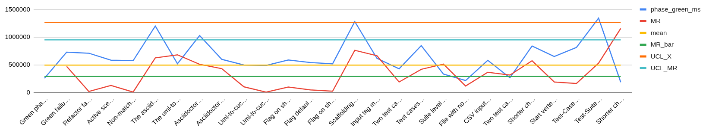
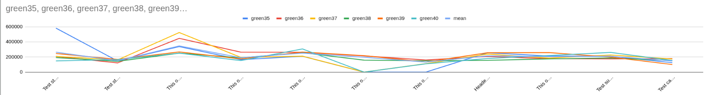

* TOC
{:toc}

---

# Beyond the Goal

I recently finished Goldratt's *Beyond the Goal*. His central argument is that a new technology delivers benefits only to the extent that it diminishes a real limitation, and that capturing those benefits requires four questions to be answered honestly:

1. What is the power of the technology?
2. What limitation does it diminish?
3. What rules, behaviors, and policies did we adopt to accommodate that limitation, back when we couldn't diminish it?
4. What new rules should we use now?

Goldratt's favourite cautionary tale is ERP. Companies spent years and small fortunes installing it, then kept all of their old batch-and-queue, monthly-cycle, departmental-silo policies in place. The technology that could have enabled smaller batches and faster response simply automated the old behavior. The fourth question is the one that matters, and it's the one most organizations skip.

I decided to apply those four questions to Claude Code.

---

# Reflecting on Telus Health

When I think about Claude Code through Goldratt's lens, the answers come out like this.

**The power of the technology** is that it translates between natural language and code in both directions. It is, in the most literal sense, a universal translator between the people who understand the business and the machines that run it.

**The limitation it diminishes** is the natural-language-to-code translation bottleneck that has historically forced every contribution to a codebase to route through a developer. For decades, the rule has been: if you don't speak code, you can't change the code. Every other role in the system of work has been organized around accommodating that constraint.

**The rules we adopted to accommodate the limitation** are everywhere once you start looking for them. Only developers touch the codebase. Testers inspect after the fact instead of specifying upfront. Service desk agents file tickets, they don't contribute fixes. Business analysts write requirements documents that get re-translated into code by someone else. Code review is a developer-to-developer ritual. Even "shift left" somehow has come to mean shifting work earlier *within the development team*, not outside of it.

**The new rules** are Testers, BSAs, and even service desk agents should be able to contribute pull requests directly, expressing their changes in the ubiquitous language they already use. Developers should shift from writing the code to building and maintaining the guardrails — the architecture, the interfaces, the test automation framework — that make safe self-service possible for everyone else. The system of work should treat Claude not as a productivity tool bolted onto the developer role, but as a lever that re-distributes who gets to participate by re-assigning some of the work upstream. 

---

# Testers Driving the Development

I've written about the new-rules half of this argument in detail in [Testers Driving the Development][1], so I won't rebuild the whole case here. The short version, for anyone who read that piece weeks or months ago and wants the refresher:

The 2010 NeoNurture incubator was built out of Toyota car parts so that car mechanics, not medical technicians, could keep it running in places where medical technicians weren't available. The engineers didn't give the mechanics better medical training; they redesigned the *interface to the problem* so that the people who were already there could solve it.

Testers are skilled at two things: inspection (verifying after the fact that what was built matches what was intended) and specification (defining behavior upfront through concrete examples). When the examples are precise and executable, there's nothing left to inspect afterward — the code either passes the specification or it doesn't. The tester moves from inspector to author. We need less of the first skill and more of the second, and Claude Code is what makes that move economically viable. I'm not saying you don't do any testing afterwards; just that a lot of the tester's input is more valuable in the beginning and throughout.

The IaaS-to-platform-engineering arc is the precedent. Before Infrastructure as Code, operations teams owned infrastructure and developers raised tickets. After IaC, operations didn't disappear — they became platform engineers, building the templates and paved roads that developers self-serve from. I think developers are about to make the same move with respect to testers and other domain contributors.

---

# Understanding Variation

I would not be comfortable telling a QA team to start contributing to a codebase through Claude Code using an unstable process. In the worst case, I'd have to redo all the code. If they don't understand code, how would they know that what was just implemented was what they intended? Specifically: I wanted the system to be able to give the tester or BSA feedback — a reverse prompt, in effect — when their request wasn't clear enough for Claude to act on it without making things up. I can use two claude code instances per test and compare outputs but I wanted something more deterministic than that rather than relying on AI to audit itself.

A couple of weeks ago I was on John Willis's [Profound][3] podcast (which, as a nerd, I'm very proud of :)). At the time I was eyeballing Plan-Do-Study-Act cycles to see whether a Process Behavior Chart could be used on Claude's runs the same way it gets used on a manufacturing line. My hunch was that special cause variation in run-to-run behavior would be a reliable indicator of when a human is needed in the loop. 

Since the podcast I've been running more experiments. The setup is deliberately constrained: I use only GitHub issues and tests as inputs, I let Claude run for a few hours, and I only look at the code afterward. What surprised me most was the similarity between independent runs. That's the chart at the top of the page.  Two separate sessions, given the same issue and a clear test, mostly produce comparable output and take comparable amounts of time. That row-level consistency for the clear tests is what makes the wide-range tests stand out — and iterating on the chart is itself how I'm bringing the harness into control. 

Two charts I'm running surface what look like two distinct kinds of problem — patterns I'm continuing to validate.

The first chart works on **pairs of runs** and detects ambiguous test expectations. For clear tests, two separate Claude sessions take a similar amount of time to implement against. When the run-to-run range for a test is much wider than the rest, the two resulting work-trees have so far had *functional* differences — different behavior, not just different code. The correlation I'm leaning on is wider range, more variation, less stable, worse specification. What seems to be happening is that if it trips, like picking the wrong OS or version of python, it goes in unpredictable directions, scanning files that pollute its context, basically down a rabbit hole. The natural assumption would be that the worker (the agent or the model) is the source of variation, but in my case it's been the system: the testing harness, the quality of the tests, and the order in which I provided them. It feels a bit like the red bead game. The variation lives in the system, not in the worker. By detecting this, Claude can express the functional difference as a test case, raise it and the tester can be prompted to select which implementation they intended.

The second chart works on **individual runs** and looks for contradictions — tests that conflict with existing functionality and can't be implemented as written. The signal here is different in shape but the principle is the same. So far the cases I've looked at suggest the specification is wrong, not Claude. One example needed the me to review the test because the change had downstream impacts that would have required significant existing test expectations to be updated. The other was more for a developer; I don't let Claude add libraries/dependencies on the fly so it'll spend minutes trying to build them from scratch.

I've published a detailed walkthrough of both techniques, with the actual data, in [PBC for Claude Code: Research][2]. The short summary is that, after the iterative work to identify and exclude the assignable causes, run-to-run variation can become a control chart for *specification quality*. 

---

# Conclusion

The platform I want to build makes it easier for non-programmers to contribute to the codebase earlier in the process. I'm starting with testers because they already write specifications in a DSL, but the argument generalizes. Instead of augmenting how developers alone work with Claude Code, I'm experimenting with re-assigning the work upstream and augmenting the existing tools that the upstream roles already use.

There are still open questions I haven't explored. I've focused mostly on special cause variation so far; I haven't done much with common cause yet, and I suspect the common-cause band itself is interesting. For example looking at the local jsonl files, sometimes claude spends seconds trying to figure out which OS it's on or how to read a large log file. I can run all my tests on Ubuntu and pre-grep the failure information at the start to prevent those problems.

I'm currently integrating GraphWalker into the flow as part of this research, so Claude updates the test model and GraphWalker generates tests from it instead of Claude writing tests directly. If the chart proves it can reliably detect ambiguity in the specifications derived from those tests, the next investment is layering a BPMN model on top so the BPMN drives changes to the GraphWalker model and the GraphWalker model drives Claude. The longer arc, conditional on each step holding up, is to use Claude to connect the developer's tools, the tester's tools, and the business's tools into a single chain — which is, I think, what answering Goldratt's fourth question actually looks like in practice.

---

[1]: testers-driving-the-development
[2]: pbc-research
[3]: https://www.buzzsprout.com/1758599/episodes/18909101
