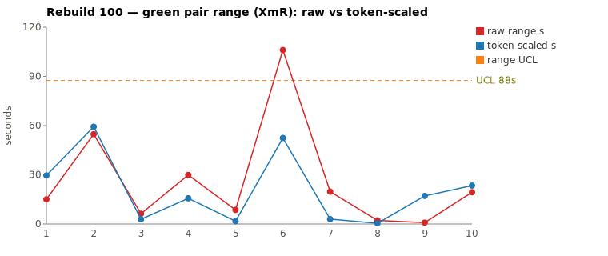
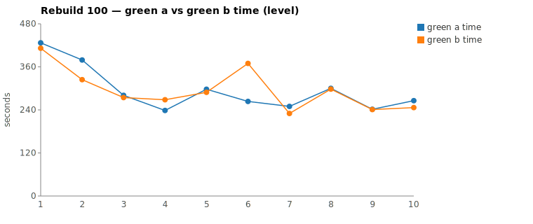

* TOC
{:toc}

---

# Context

This is a batch-level companion to [pbc-83][5], [pbc-84][4], [pbc-85][13], [pbc-86][15], [pbc-87][18], [pbc-88][19], [pbc-90][22], [pbc-92][26], [pbc-93][27], [pbc-94][29], [pbc-95][30], [pbc-96][32], [pbc-97][33], [pbc-98][34], and [pbc-99][35], using the same in-run pair methodology: since [issue #434][7] every Darmok scenario runs its green phase **twice** — worktree `_a` and `_b`, both branched from the *same red commit*, minutes apart — so the pair-range `|green_a − green_b|` from one metrics row nets out model-of-the-day, red commit, and server window, leaving **work** versus **per-token generation rate**. The charted quantity is the **Selected range** `min(raw, token-scaled)` fixed in [pbc-94][29].

**Rebuild100's contribution is the sharpest split yet between the two detectors: the range chart is fully in control, and the behavioural detector is not.** The two widest pairs — picked by the sheet's top-2 `|green_a − green_b|` — both resolve to **common cause**: each did a real but *converged* exploration-volume difference (both **26.5 % NET**, both `No functional diff between pair`), and no Selected point breaches the limit. By the *timing* signal, Rebuild100 looks as clean as [pbc-99][35]. But the run-wide functional-diff scan returns **three** `Functional diff between pair` warns — and all three land on scenarios with the run's **narrowest** raw ranges (8.6 s, 2.2 s, 0.8 s), exactly the pairs the top-2 range pick never sees. Rebuild100 is the concrete counter-example to reading a clean range chart as "in control": the behavioural detector caught three ambiguities the timing detector was blind to. This is why [step 3b][33] scans functional diffs **run-wide** rather than trusting the range ranking.

Rebuild100 ran the Issues **Quickfixes** family (`ListQuickfixesAction`) — the quickfix counterparts of the validation scenarios reviewed in [pbc-99][35]: only-issues and workspace-issues quickfixes for cell-name, suite/case/step names, object existence, and the step-definition / parameter-set / text-parameter sub-scenarios. Picked by the sheet's top-2 (widest `|green_a − green_b|`, which agree with the top-2 by Selected this run, only swapping order), the two reviewed pairs are a **both-common-cause** batch:

| Scenario | Commit | Green `_a` | Green `_b` | Raw range | Token-scaled | **Selected** | Verdict |
|---|---|---|---|---|---|---|---|
| This object step definition doesn't exist quickfix | `21ce6af5` | **4:23** | 6:09 | 106,107 ms | 52 s | **52 s** (scaled) | **common cause — real exploration-volume difference (26.5 % NET, 4 vs 2 mvn cycles) that converged on byte-identical committed code, no functional diff** |
| Cell name should start with a capital letter quickfix | `f1fe8c73` | 6:19 | **5:24** | 54,795 ms | 59 s | **55 s** (raw) | **common cause — near-identical tool structure (both Write + 3 Edit + 3 mvn); the slower half explored a little wider (26.5 % NET) and the clock captures it; converged, no functional diff** |

(Bold = the winning half, brought back and refactored — the faster half in each pair: `_a` in Pair 1, `_b` in Pair 2.) The two rows sit on **opposite** branches of the `min`: Pair 1 is `scaled` (token-scaled 52 s < raw 106 s — the ruler strips 54 s of rate from a real work difference), Pair 2 is `raw`-kept (token-scaled 59 s > raw 55 s — the token gap implies *more* time than the clock, so the clock is the looser bound and survives). Over all **ten** deduped run-order rows (nothing excluded — nothing is assignable *by the range detector* this run) the XmR limits on **Selected** are `range_mean` **16.6 s**, `range_MR_bar` **26.7 s**, `range_UCL` **87.5 s**. **No row breaches.** The widest Selected point is Pair 2 at **55 s**, sitting well under the 87.5 s UCL; Pair 1's 52 s is just behind it.

*(Data note: the pair-range values were computed from the authoritative 17-column `metrics.csv` (which carries the Edit/TodoWrite deduction columns from issue #566); the chart script deduped to ten rows and computes the same Selected values and `range_UCL` 87.5 s. The Google Sheet tab (gid `25826237`) was not reachable for a live cross-check this run — its export redirect returned an error — so the local CSV is the source of truth here per the [skill's][33] "prefer local CSV" rule; no divergence is expected since both dashboards read the same upload.)*

---

# Charts

Scenarios are numbered in run order; the tables below say which index each is. The Moving-Range chart plots **raw** (red) and **token-scaled** (blue) together so `Selected` — their lower envelope — is visible, with the UCL (off Selected, nothing excluded) as the dashed orange line. The Green chart is the absolute level.





---

# The token-scaled pair-range (recap)

Wall-clock fuses **real work** (≈ green output tokens) with the **per-token generation rate** (server load, queue, context-prefill jitter — uncontrollable). The full token-scaled derivation is in [pbc-83][5]; [pbc-90][22] added the NET refinement (deduct Edit/Write/TodoWrite bookkeeping) and [pbc-94][29] fixed the selection rule:

- `raw` = `|a − b|`, the wall-clock gap.
- `net_x` = `raw_tokens_x − edit_x − todo_x`, stripping verbose TodoWrite re-emissions and whole-method Edit payloads.
- `token-scaled` = `|net_a − net_b| × fast_time / fast_raw`, the gap implied by **work** tokens at the faster half's rate.
- **`Selected = min(raw, token-scaled)`.** Scaling only removes variation (rate, bookkeeping); a token-scaled value larger than the clock gap is a phantom, so we keep the clock.

The two reviewed pairs land on the two different branches of the `min` — which is itself the finding of the run's timing side. Pair 1's 106 s clock rides on a 26.5 % NET work gap that scales to only 52 s at the faster half's rate, so 54 s of the clock was generation rate and is discarded (`scaled`). Pair 2's 55 s clock is the *tighter* bound: its 26.5 % NET gap scales to 59 s, so the token gap would predict *more* time than the clock actually spent — a phantom on the token side, and the clock survives (`raw`, the [pbc-98][34] surviving-range branch). Rebuild100 exercises **both** branches in its top-2, where [pbc-99][35] exercised only the phantom-collapse side.

---

# Pair 1 — `21ce6af5` (This object step definition doesn't exist quickfix): the widest raw, converged over more work (common cause)

The run's **widest raw** range (106 s, run index 6), which demotes to **52 s Selected** (scaled). The mojo logged **`Green: No functional diff between pair`**, winner `_a` (the faster half).

| | `_a` 6785a252 | `_b` 442cf520 |
|---|---|---|
| Green wall-clock | **4:23** | 6:09 |
| Green output tokens | 6,721 | 10,622 |
| **NET tokens** | 3,699 | 5,036 |
| Read / Grep | 12 / 8 | 13 / 13 |
| Read tool-result bytes (input) | 131,107 | 145,964 |
| Writes / Edits | 0 / 2 | 0 / 7 |
| `mvn verify` cycles | 2 | **4** |

Output tokens differ **36.7 %** and **NET 26.5 %** — both well over the 15 % threshold; the halves did materially different-volume work. The raw time-range is 40.3 % of the faster half, so time reads "different" and tokens read "different": the [pbc-94][29] decision matrix's CELL 3 — *real work difference, investigate*. The chart value is **token-scaled 52 s** (< raw 106 s): scaling the 26.5 % NET gap to the faster half's rate accounts for 52 s of the 106 s clock and leaves 54 s as rate. No stall — every per-minute bucket is non-zero in both halves (`_a` bottoms at 121 in its final `end_turn` minute, `_b` at 679), so the extra time is exploration + two more verify cycles, not a hang.

The divergence walk shows the extra work led to the *same place*, not a different one:

```
identical through ~call 10 (ToolSearch→TodoWrite seed, uml reads,
      grep "COMPILATION ERROR" / "Guice configuration errors")
_a 6785a252: reads jacoco-shortlist + 4 issue-detector files, grep
             TEST_STEP_STEP_DEFINITION_NAME_WORKSPACE, 2 Edits, grep
             IStepObject, mvn → grep → mvn (2 Edits, 2 mvn)
_b 442cf520: greps BUILD/Tests-run/AssertionError, getTestDocument,
             IStepObject, ITestProject; 7 Edits across four
             edit→mvn→grep loops (7 Edits, 4 mvn)
```

Both committed the **identical rule**: extend the `ValidateActionImpl` cascade with the workspace step-definition-doesn't-exist quickfix plus the matching detector method and enum type. `_b` simply globbed and grepped the issues package more widely, probed `ITestProject`/`getTestDocument` that `_a` never opened, and paid for **two extra `mvn verify` cycles** (4 vs 2) with **seven edits** (vs two) — its patches didn't compile/pass first time and it iterated. That is a real ~26 % more NET exploration, but it reached the code `_a` wrote after a shorter look, and the functional-diff gate stayed silent.

**Verdict: common cause — no fix; stays in the limits.** Its 52 s Selected is the run's second-widest and sits far under the 87.5 s UCL. This is a stronger version of the [pbc-99][35] Pair 1 pattern — a wide range that *converged this run*, here with the largest raw gap of the batch and a 4-vs-2 `mvn` iteration difference. Convergence can be luck rather than proof of a well-pinned scenario, but the per-pair walk finds no design disagreement and the functional-diff scan is silent on this commit, so there is no assignable cause to act on. Excluding it would be tampering.

---

# Pair 2 — `f1fe8c73` (Cell name should start with a capital letter quickfix): the surviving range over near-equal work (common cause)

The run's **second-widest raw** range (55 s, run index 2) *and* its **widest Selected** (55 s, `raw`-kept). The mojo logged **`Green: No functional diff between pair`**, winner `_b` (the faster half).

| | `_a` e85da32b | `_b` c3b3d3aa |
|---|---|---|
| Green wall-clock | 6:19 | **5:24** |
| Green output tokens | 10,584 | 9,022 |
| **NET tokens** | 6,218 | 4,568 |
| Read / Grep | 17 / 11 | 14 / 9 |
| Read tool-result bytes (input) | 109,855 | 105,269 |
| Writes / Edits / Globs | 1 / 3 / 2 | 1 / 3 / 1 |
| `mvn verify` cycles | 3 | 3 |

Output tokens differ **14.8 %** (just inside threshold) but **NET 26.5 %** (over it); the halves did near-equal *total* work but the slower half explored a little wider. The raw time-range is 16.9 % of the faster half, so time reads "different." The chart value is **raw 55 s** (< token-scaled 59 s): scaling the 26.5 % NET gap to the faster rate would predict 59 s — *more* than the clock actually spent — so the token side is the phantom here and the clock is kept (the [pbc-98][34] surviving-range branch). No stall — every per-minute bucket is non-zero in both halves.

The tell distinguishes this from a rate phantom: **the slower half `_a` read *more* bytes** (109.9 KB vs 105.3 KB) and did more Reads/Greps/Globs (17/11/2 vs 14/9/1). If the gap were pure generation rate, the two halves would have explored equally and only decoded at different speeds; instead the slower half genuinely explored more, which is why the ruler keeps the clock rather than scaling it away. The walk confirms the two halves did the same thing by near-identical routes:

```
identical through ~call 9 (ToolSearch→TodoWrite seed, uml reads,
      grep "COMPILATION ERROR" / "Guice configuration errors")
_a e85da32b: grep CellIssueResolver, 2 Globs (**/issues/*Resolver*),
             grep getNameIndex, Write resolver, 2 Edits, mvn; then extra
             greps (setVertexStep, processInputOutputsText, static properties)
             + reads, 1 Edit, 2 more mvn  (1 Write, 3 Edit, 3 mvn, 17 Read)
_b c3b3d3aa: grep CellIssueResolver, 1 Glob, grep getNameIndex,
             Write resolver, 2 Edits, mvn → read → Edit → mvn → mvn
             (1 Write, 3 Edit, 3 mvn, 14 Read)
```

Both committed the **identical rule**: a new `CellIssueResolver` (using `getNameIndex`) wired into the only-issues quickfix cascade to propose capitalising a lower-case cell name. The only difference is that `_a` grepped a few blind alleys (`setVertexStep`, `processInputOutputsText`, `static properties`) before landing the same one-resolver fix. The functional-diff gate was silent; the two halves converged.

**Verdict: common cause — no fix; stays in the limits.** The 55 s Selected is the run's widest and sits well under the 87.5 s UCL. It is a *surviving* range — real, small exploration variation the clock represents faithfully — but converged and sub-UCL, so there is nothing assignable to remove.

---

# Batch synthesis — a clean range chart hiding three behavioural ambiguities

Rebuild100's two worst raw pairs are both from the Quickfixes family (workspace step-definition and only-issues cell-name), and by the *timing* detector the run is in control: both demote or survive to sub-UCL Selected values over converged, byte-identical code, and no Selected point breaches 87.5 s. Read only the range chart and this run is a twin of [pbc-99][35].

But that reading would miss the run's real signal:

1. **Pair 1 is a converged work difference, scaled.** 106 s raw, 26.5 % NET, **4 vs 2** `mvn` cycles → a real exploration+iteration gap that Selects to 52 s, yet the halves committed **byte-identical code**. Wide-but-converged.
2. **Pair 2 is a converged work difference, kept.** 55 s raw survives the ruler (token-scaled 59 s is the phantom) because the slower half genuinely explored more — but again converged, no functional diff. The two top pairs demonstrate the `min`'s two branches side by side.
3. **The functional-diff scan is NOT empty — it fires three times, all off-pick.** Every warn lands on a scenario the top-2 range pick never inspected, and all three have the run's *narrowest* raw ranges: `This object doesn't exist quickfix` (raw 8.6 s, index 5), `...parameter set doesn't exist quickfix` (raw 2.2 s, index 8), `...parameter set exists quickfix` (raw 0.8 s, index 9 — the tightest pair in the run).

The methodological point completes the [pbc-97][33]/[pbc-98][34]/[pbc-99][35] arc from the other side. Pbc-99 showed what "clean on both detectors" looks like; **Rebuild100 shows what "clean on the range detector but dirty on the behavioural detector" looks like — and that the two are genuinely independent.** A batch whose two widest timing pairs are both common cause can still carry three unpinned behavioural ambiguities, and the narrower the range, the more the range chart is blind to them (the two tightest pairs in the whole run both committed divergent code). The clean range chart is not a clean bill of health; the run-wide scan is what produces the actionable signal this run.

---

# The Fix, or Why No Fix

**No fix for the two reviewed pairs — both common cause, both converged.** Pair 1 did a real exploration+iteration difference (26.5 % NET, 4 vs 2 `mvn`) but **converged on byte-identical committed code**; Pair 2's slightly wider exploration also converged. Neither traces to a scenario defect on the timing side; excluding either — or "fixing" a scenario whose two halves already agree — would be tampering. No prompt, harness, or model change is ever proposed, and the chart generator ran with **no** `--exclude` argument (nothing is assignable *by the range detector*).

**The actionable output of this run is on the behavioural side, and it is input for the downstream Test-Case authoring skill, not a scenario-timing fix.** The three `Functional diff between pair` warns each name a differentiating input that the corresponding quickfix scenario does not pin — see the next section. Those are candidate Test-Case create/tighten items (each pins the input that split the two halves so a future pair cannot diverge), not changes to the harness or the Darmok prompt. None of the three is one of the reviewed top-2, so the range-based review would have shipped a "clean run" verdict without them; the run-wide scan is what surfaces them.

---

# Functional Diffs Found

A `Green: Functional diff between pair` warn fires when the two green halves committed **behaviourally divergent** code that *both* pass the current test — so each warn names a **differentiating input the scenario does not pin**, which is exactly the raw material for creating or tightening a Test-Case. This list is **run-wide** (every scenario, not just the reviewed top-2), because a functional diff routinely lands on a scenario whose pair-range is mid-pack — and this run is the extreme case: all three fired on the run's *narrowest*-range pairs, none of which the top-2 pick inspected.

`.claude/scripts/rgr-review-functional-diffs.sh 100` returned **3** warns:

| # | Scenario (raw range, run index) | Commit | Differentiating input the Test-Case must pin |
|---|---|---|---|
| 1 | This object doesn't exist quickfix (8.6 s, idx 5) — *not a reviewed top-2* | `7585d741` | A test step whose **object has a non-empty component** (`Component/Object` form). Pin that the proposal ID is built from the **raw `stepObjectName`**, not the composed `getTestStepFullName()` string — the two halves produce different proposal IDs otherwise. |
| 2 | This object step definition parameter set doesn't exist quickfix (2.2 s, idx 8) — *not a reviewed top-2* | `d588b0a7` | A **cursor on a non-first row of a multi-row table**. Pin which row's cells the "Generate" proposal uses (cursor-row vs first-row) — the halves split on this. |
| 3 | This object step definition parameter set exists quickfix (0.8 s, idx 9) — *not a reviewed top-2* | `9e1a3711` | A **matching StepParameters that follows a non-matching one** (ordering). Pin whether a later match after an earlier non-match **clears** accumulated proposals or **retains** them — one half returns empty, the other keeps them. |

Verbatim warn text (for the downstream skill's exact wording):

> **#1 (`7585d741`)** — Candidate B extracts the `object` for proposal ID from the composed `getTestStepFullName()` string instead of the raw `stepObjectName`, producing a different proposal ID for any step with a non-empty component.

> **#2 (`d588b0a7`)** — "Generate" proposal uses first-row cells (A) vs cursor-row cells (B) when the cursor is on a non-first row of a multi-row table.

> **#3 (`9e1a3711`)** — When a matching StepParameters follows a non-matching one, Candidate A clears accumulated proposals (returns empty) while Candidate B retains them.

All three are **off the reviewed top-2** and sit at the tight end of the range chart (8.6 s / 2.2 s / 0.8 s) — the clearest evidence in the series so far that the range pick and the functional-diff scan are complementary, not redundant.

---

# Mapping to the Research

| Predicted ([pbc-research][2]) | Observed across Rebuild100 |
|---|---|
| Wide pair-range fires the signal | the sheet fired on `...step definition doesn't exist` (106 s) and `Cell name` (55 s); Pair 1 demoted to 52 s (scaled), Pair 2 kept 55 s (raw) |
| A breach of the limit marks a special cause | **no breach** — every Selected point sits under the 87.5 s UCL; the *timing* process is in control |
| The special cause is in the input, not the system | confirmed, but on the **behavioural** detector: the three functional diffs each name an unpinned *input* (component non-empty, cursor row, StepParameters ordering) — the fixes are Test-Case inputs, never the harness |
| Both halves pass the same test | yes — all halves passed verify; both reviewed pairs converged **byte-identical**, while three *other* scenarios passed the same test with **divergent** code (the functional-diff warns) |
| Two work-trees differ | Pair 1: in exploration volume + 2 extra `mvn` cycles (26.5 % more NET) yet same rule; Pair 2: slightly wider exploration by the slower half; three off-pick scenarios: in *behaviour*, not just time |

---

# Findings by Variable

*Each subsection records this run's findings about one [Wheeler variable][3].*

## green time pair range

Charted on `Selected = min(raw, token-scaled)` per [pbc-94][29]. Limits over all 10 deduped rows (nothing excluded): mean 16.6 s, MRbar 26.7 s, UCL 87.5 s. No row breaches. The two reviewed pairs land on **opposite** branches of the `min`: Pair 1's 106 s → 52 s (`scaled`, 54 s of rate stripped from a real work difference), Pair 2's 55 s → 55 s (`raw`-kept, token-scaled 59 s is the phantom). The widest Selected is Pair 2 at 55 s, well inside the 87.5 s UCL.

## green time pair range moving range

MRbar 26.7 s — wider than [pbc-99][35]'s 8.5 s, inflated by the single 106 s raw point (Pair 1) driving two ~50 s links: 50.7 s into index 6 (index 5→6, 1.7 s → 52.4 s) and 49.4 s out of it (index 6→7, 52.4 s → 3.0 s). MR-UCL (3.267 × MRbar ≈ 87.2 s) is not breached; both links sit under it, so even the transition into the run's second-widest Selected point is common cause.

## green time

Claude-only per [#568][23]. No absolute-level excursion this run. The Quickfixes family's greens run heavier than validation (each writes a new resolver): Pair 1's levels (4:23 / 6:09) and Pair 2's (6:19 / 5:24) sit among the run's higher greens but show no developer-signal breach — the whole family is uniformly in the 4–6 min band, not one scenario spiking.

## scale & green tokens

Both reviewed pairs carry an identical **26.5 % NET** gap, but the ruler treats them oppositely, which is the run's token-side lesson: at Pair 1's higher token volume the gap scales to 52 s (well below the 106 s clock → phantom rate stripped), while at Pair 2's lower volume the same NET fraction scales to 59 s (above the 55 s clock → the token estimate is the phantom, clock kept). NET fraction alone does not determine the branch — the interaction of token volume with the clock does.

## functional diff between pair

**Three warns run-wide**, all on scenarios *outside* the reviewed top-2 and at the narrowest end of the range chart (raw 8.6 s / 2.2 s / 0.8 s). This is the inverse of [pbc-99][35] (zero warns) and the strongest demonstration in the series that the behavioural detector is independent of the range detector: the two tightest pairs in the entire run both committed divergent code (component-composition proposal ID, cursor-row vs first-row cells, StepParameters clear-vs-retain). Convergence at a narrow range was luck, not proof of pinning. The run-wide scan is what makes these visible; the range ranking never would.

## surviving vs phantom range (from pbc-98)

Rebuild100 exercises **both** branches of the `min` in its top-2, unlike [pbc-99][35] (all `scaled`) and [pbc-98][34] (whose surviving range was a single pair). Pair 1 is the phantom-collapse branch (token-scaled < raw); Pair 2 is the surviving branch (token-scaled > raw, clock kept). The distinction the prior runs established holds: "wide raw" and "assignable" are independent, and here a surviving range (Pair 2) is still common cause because its extra work converged.

## silent stall / timeout (recurring)

No stall in any of the four halves. Every per-minute bucket is non-zero; the softest minutes align with `mvn verify` cycles or the green-compile→green-verify `--resume` seam. ([#569][24] remains open, no new data.)

## green-window attribution

All four halves' surveys were clipped to each half's last green `end_turn` per the [#570][25] rule; no phantom worktree escapes or refactor-read contamination appeared. Refactor phases logged `No changes, skipping verify` for both reviewed commits — the winners' brought-back code needed no further edits.

## detector independence (new this run)

Rebuild100 is the first reviewed batch that is **clean on the range detector and dirty on the behavioural detector at the same time** — the complement of [pbc-99][35]. It establishes that a sub-UCL range chart with converged top pairs is *not* sufficient to certify a run in control: the run-wide functional-diff scan, cheap and independent of the range pick, found three ambiguities the timing signal could not see, precisely because they sat at the narrow end of the chart. The two detectors must both be read before concluding a run is in control.

---

# Open Questions From This Case

- **Does functional-diff frequency correlate *inversely* with pair-range?** All three warns this run landed on the narrowest pairs. If narrow-range scenarios are systematically *more* likely to carry an unpinned ambiguity (because a small, well-scoped quickfix has more room for two equally-valid micro-decisions that both finish fast), the range chart is not just incomplete but anti-correlated with the behavioural signal — which would argue for weighting the functional-diff scan *above* the range pick, not beside it.
- **Should the recurrence ledger (carried from [pbc-98][34]/[pbc-99][35]) now be built?** The `...parameter set` family fired functional diffs in runs 97, 98, and now 100 (and was silent in 99). A per-scenario recurrence counter would separate "chronically ambiguous" (parameter-set family) from "diverged once" and let the downstream Test-Case skill prioritise the repeat offenders.
- **Are the three off-pick ambiguities pinnable with one Test-Data row each?** Each warn names a single differentiating input (component non-empty, cursor row, StepParameters ordering). Whether a single added Test-Case/Test-Data row per scenario is enough to force convergence — or whether the quickfix proposal logic admits further unpinned axes — is the empirical question the downstream authoring skill will answer.

---

[2]: wheeler-understanding-variation
[3]: wheeler-understanding-variation
[4]: 84
[5]: 83
[7]: https://github.com/farhan5248/sheep-dog-main/issues/434
[13]: 85
[15]: 86
[18]: 87
[19]: 88
[22]: 90
[23]: https://github.com/farhan5248/sheep-dog-main/issues/568
[24]: https://github.com/farhan5248/sheep-dog-main/issues/569
[25]: https://github.com/farhan5248/sheep-dog-main/issues/570
[26]: 92
[27]: 93
[29]: 94
[30]: 95
[32]: 96
[33]: 97
[34]: 98
[35]: 99
