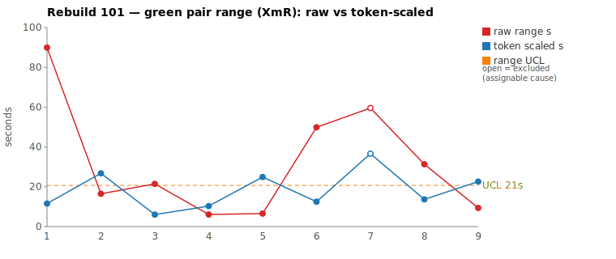
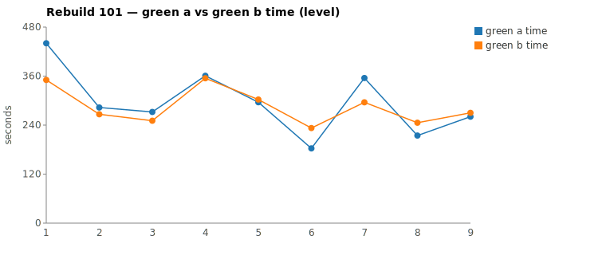

* TOC
{:toc}

---

# Context

This is a batch-level companion to [pbc-83][5], [pbc-84][4], [pbc-85][13], [pbc-86][15], [pbc-87][18], [pbc-88][19], [pbc-90][22], [pbc-92][26], [pbc-93][27], [pbc-94][29], [pbc-95][30], [pbc-96][32], [pbc-97][33], [pbc-98][34], [pbc-99][35], and [pbc-100][36], using the same in-run pair methodology: since [issue #434][7] every Darmok scenario runs its green phase **twice** — worktree `_a` and `_b`, both branched from the *same red commit*, minutes apart — so the pair-range `|green_a − green_b|` from one metrics row nets out model-of-the-day, red commit, and server window, leaving **work** versus **per-token generation rate**. The charted quantity is the **Selected range** `min(raw, token-scaled)` fixed in [pbc-94][29].

**Rebuild101 is the mirror image of [pbc-100][35]'s split: where run 100 was clean on the range detector and dirty on the behavioural one, run 101 is a run where the two detectors *agree* on the worse of the two reviewed pairs — and where the behavioural detector fires *five* times, its densest showing in the series.** The two widest *selected* pairs are a **split**: Pair 1 (`Cell name … quickfix`) is **common cause** — the run's widest raw clock (90 s) demotes to a **12 s** Selected as 78 s of generation-rate jitter is stripped, over byte-identical committed code; Pair 2 (`… parameter set doesn't exist quickfix`) is **assignable** — it carries a `Green: Functional diff between pair` warn and is the run's widest Selected (37 s), so the range detector and the behavioural detector point at the *same* scenario. Pair 2 is the identified special cause, excluded from the limits; with it removed the XmR limits on **Selected** over the remaining eight rows are `range_mean` **10.4 s**, `range_MR_bar` **3.9 s**, `range_UCL` **21 s**, and Pair 2's 37 s sits well above that UCL as the flagged assignable point.

Rebuild101 ran the Issues **Quickfixes** family (`ListQuickfixesAction`) — the only-issues quickfixes reviewed alongside [pbc-100][36], plus the **workspace-issues** quickfixes (Issues/7) that dominate this run. The run-wide functional-diff scan returns **five** warns, **all** in the Issues/7 workspace-quickfix subtree, and **all about the same axis**: how the "Generate" / proposal value is *constructed* (proposal-id source, unconditional-vs-conditional Generate, proposals for preceding non-matching entries, the proposal *value*, and accumulate-vs-clear ordering). This is the strongest evidence in the series that an entire spec *family* can share one unpinned interpretation axis. Unlike run 100 (all three warns off the reviewed top-2), **one of the five here (`4a383472`) is reviewed Pair 2** — but the other four are off-pick and span the whole range spectrum (raw 6 s to 50 s), so the run-wide scan is again what makes the family-wide pattern visible.

| Scenario | Commit | Green `_a` | Green `_b` | Raw range | Token-scaled range | Selected range | Verdict |
|---|---|---|---|---|---|---|---|
| Cell name should start with a capital letter quickfix | `b65fd7c7` | 7:20 | **5:50** | 89,907 ms | 12 s | **12 s** (scaled) | **common cause — equivalent work (8.0 % raw / 7.6 % NET token diff), identical tool structure, both committed the same `CellIssueResolver`; the 90 s clock is generation-rate jitter, no functional diff** |
| This object step definition parameter set doesn't exist quickfix | `4a383472` | 5:55 | **4:55** | 59,567 ms | 37 s | **37 s** (scaled) | **assignable — `Functional diff between pair`: the two halves committed *different proposal-value rules* (A: `sp.getName()` + cloned StepObject; B: table cell-list strings + empty string); the scenario does not pin the generate-proposal value** |

(Bold = the winning half, brought back and refactored — the faster half `_b` in both pairs.) The two rows sit on the **same** branch of the `min` (both `scaled`, token-scaled < raw) but split on the verdict: Pair 1's 90 s clock rides on an ≈8 % token gap that scales to 12 s (78 s was rate → common cause), while Pair 2's 60 s clock demotes to 37 s but the demotion is irrelevant to its verdict — the **functional-diff warn overrides the token gate** ([pbc-commit rule][33]): two halves that pass the *same* assertions with *different* rules prove the test case is ambiguous, no matter how the clocks compare. Over the nine deduped run-order rows, **Pair 2 is excluded** (identified assignable cause), and no *remaining* row breaches the 21 s UCL; had Pair 2 been left in, the (self-inflated) UCL would have been ≈38 s and Pair 2's 37 s would sit just under it — the exclusion is what lets the chart tell the truth.

*(Data note: pair-range values were computed from the authoritative 17-column `metrics.csv` (which carries the Edit/TodoWrite deduction columns from issue #566); the chart script deduped to nine rows and computes the same Selected values and `range_UCL` 21 s. The Google Sheet tab (gid `839470155`) export redirect returned HTTP 400 and was not reachable for a live cross-check this run, so the local CSV is the source of truth here per the [skill's][33] "prefer local CSV" rule; no divergence is expected since both dashboards read the same upload.)*

---

# Charts

Scenarios are numbered in run order; the tables below say which index each is. The Moving-Range chart plots **raw** (red) and **token-scaled** (blue) together so `Selected` — their lower envelope — is visible, with the UCL (off Selected, Pair 2 excluded) as the dashed orange line; Pair 2 is drawn as an open circle. The Green chart is the absolute level.





---

# The token-scaled pair-range (recap)

Wall-clock fuses **real work** (≈ green output tokens) with the **per-token generation rate** (server load, queue, context-prefill jitter — uncontrollable). The full token-scaled derivation is in [pbc-83][5]; [pbc-90][22] added the NET refinement (deduct Edit/Write/TodoWrite bookkeeping) and [pbc-94][29] fixed the selection rule:

- `raw` = `|a − b|`, the wall-clock gap.
- `net_x` = `raw_tokens_x − edit_x − todo_x`, stripping verbose TodoWrite re-emissions and whole-method Edit payloads.
- `token-scaled` = `|net_a − net_b| × fast_time / fast_raw`, the gap implied by **work** tokens at the faster half's rate.
- **`Selected = min(raw, token-scaled)`.** Scaling only removes variation (rate, bookkeeping); a token-scaled value larger than the clock gap is a phantom, so we keep the clock.

Both reviewed pairs land on the `scaled` branch (token-scaled < raw), which for the *timing* signal makes them look alike: Pair 1's 90 s → 12 s and Pair 2's 60 s → 37 s. But the timing branch is not the verdict. Pair 1 is common cause because its token gap is ≈8 % (equivalent work, the residual clock is rate). Pair 2 is assignable **not** because of its Selected value but because the mojo's byte-level compare of the two committed impls fired `Functional diff between pair`: the two halves encoded different proposal-value rules. The token side (Pair 2's 27.9 % raw / 21.5 % NET gap) merely *corroborates* that the halves did materially different work — but the functional-diff warn is what makes it decisive.

---

# Pair 1 — `b65fd7c7` (Cell name should start with a capital letter quickfix): the widest raw, all rate (common cause)

The run's **widest raw** range (90 s, run index 1), which demotes to **12 s Selected** (scaled). The mojo logged **`Green: No functional diff between pair`**, winner `_b` (the faster half).

| | `_a` 1137e869 | `_b` 44b1f6e2 |
|---|---|---|
| Green wall-clock | 7:20 | **5:50** |
| Green output tokens | 13,226 | 12,162 |
| **NET tokens** | 5,318 | 4,916 |
| Read / Grep | 18 / 12 | 18 / 11 |
| Read tool-result bytes (input) | 112,861 | 108,897 |
| Writes / Edits | 4 / 6 | 4 / 6 |
| `mvn verify` cycles | 3 | 3 |

Output tokens differ **8.0 %** and **NET 7.6 %** — both inside the 15 % threshold; the halves did **equivalent** work. The raw time-range is 25.6 % of the faster half, so time reads "different" while tokens read "same": the [pbc-94][29] decision matrix's CELL 2 — *same work, different speed → a rate cause*. The chart value is **token-scaled 12 s**: scaling the ≈8 % NET gap to the faster half's rate accounts for only 12 s of the 90 s clock and leaves **78 s as pure generation-rate jitter**. No stall — every per-minute bucket is non-zero in both halves (`_a` bottoms at 910 in its 16:02 minute, `_b` at 473 in its 16:02 minute), so the extra 90 s is slower per-token generation, not a hang.

The tool structure is near-identical, which is what a pure-rate pair looks like:

```
identical through ~call 8 (ToolSearch→TodoWrite seed, uml-overview/package/
      interaction-main/interaction-test reads, grep "COMPILATION ERROR" /
      "Guice configuration errors" / "No implementation for",
      grep ListQuickfixesAction)
_a 1137e869: Write CellIssueResolver, 3 Edits, mvn; then grep CellIssueResolver
             ×2, getNameIndex, 3 more Writes, 3 Edits, mvn, mvn
             (4 Write, 6 Edit, 3 mvn, 18 Read, 12 Grep)
_b 44b1f6e2: Write CellIssueResolver, 3 Edits, mvn; then grep class
             CellIssueResolver, getNameIndex, 3 Writes, 3 Edits, mvn, mvn
             (4 Write, 6 Edit, 3 mvn, 18 Read, 11 Grep)
```

Both committed the **identical rule**: a new `CellIssueResolver` (using `getNameIndex`) wired into the only-issues quickfix cascade to propose capitalising a lower-case cell name. Tool counts match to within one Grep, Read-result bytes are within 4 %, both ran three `mvn verify` cycles. There is no exploration difference to attribute — the 90 s is the server generating `_a`'s near-identical token stream more slowly. **UML consultation was symmetric and identical**: both halves read exactly `uml-overview`, `uml-package`, `uml-interaction-main`, `uml-interaction-test`, and neither opened a per-class `uml-class-*.md` (none exists for the resolver) — no spec-discovery asymmetry.

**Verdict: common cause — no fix; stays in the limits.** Its 12 s Selected is mid-pack, far under the 21 s UCL. This is the cleanest rate-only pair in the batch: the widest clock in the run, entirely explained by generation rate, with matching tool actions and byte-identical code. Reacting to it would be tampering.

---

# Pair 2 — `4a383472` (This object step definition parameter set doesn't exist quickfix): the functional-diff pair (assignable)

The run's **second-widest raw** range (60 s, run index 7) *and* its **widest Selected** (37 s). The mojo logged a **`Green: Functional diff between pair (warn)`**, winner `_b` (the faster half). This is the decisive line and it overrides the token gate.

| | `_a` 8136fd56 | `_b` 4cf02c06 |
|---|---|---|
| Green wall-clock | 5:55 | **4:55** |
| Green output tokens | 11,194 | 8,076 |
| **NET tokens** | 4,652 | 3,652 |
| Read / Grep | 11 / 11 | 15 / 4 |
| Read tool-result bytes (input) | 129,752 | 131,992 |
| Writes / Edits | 1 / 2 | 1 / 2 |
| `mvn verify` cycles | 2 | 2 |

Output tokens differ **27.9 %** and **NET 21.5 %** — both over threshold; the halves did materially different *exploration* work. The raw time-range is 20.1 % of the faster half, so time and tokens both read "different": the [pbc-94][29] matrix's CELL 3 — *real work difference, investigate*. But the investigation is short-circuited by the mojo bracket:

> **`Green: Functional diff between pair (warn): Proposal values differ: A uses sp.getName() and a cloned StepObject; B uses table cell-list strings and empty string for generate proposal`**

Darmok's byte-level compare of the two committed impls proves `_a` and `_b` encoded **different rules** for what the "Generate" proposal *value* should be, yet **both passed the same Then-assertions**. That is only possible because the scenario is **ambiguous** — it asserts that a Generate proposal appears, but never pins *what value it carries*. The token gap and Selected value are corroborating detail, not the signal.

The divergence walk shows the two halves genuinely exploring different constructions:

```
identical through ~call 11 (ToolSearch→TodoWrite seed, uml reads, grep
      "COMPILATION ERROR"/"Guice configuration errors", TodoWrite jacoco seed)
_a 8136fd56 (Grep-heavy, 11 Grep / 11 Read): greps Tests-run/BUILD/AssertionError,
             grep "parameter set doesn't exist quickfix", Glob RowIssueResolver,
             grep "This object step definition exists quickfix", grep
             createStepParameters, grep cloneStepObject, Write, 2 Edit, mvn, mvn
             -> proposal value from sp.getName() + a cloned StepObject
_b 4cf02c06 (Read-heavy, 15 Read / 4 Grep): greps FAILED/BUILD, reads the
             sibling resolvers directly, Glob RowIssueResolver, Write, 2 Edit,
             mvn, mvn
             -> proposal value from table cell-list strings + empty string
```

`_a` reached for the *object model* (`sp.getName()`, `cloneStepObject`, `createStepParameters`) to build the proposal; `_b` reached for the *table cells* (the raw cell-list strings, empty string for the generate case). Both compiled, both passed the assertions, both committed — and the two proposals differ for any real input. **UML consultation was symmetric and identical** (both read the same four core uml files, no per-class file), so this is not a spec-discovery asymmetry — it is the *scenario* leaving the proposal value unspecified. The 60 s clock and the 21.5 % NET gap are the *cost* of the two halves exploring two different constructions; the functional diff is the *proof* they landed in different places.

**Verdict: assignable — the scenario is ambiguous; excluded from the limits.** Pair 2 is the one point in the run assignable on **both** detectors: it is the widest Selected range *and* it carries a functional-diff warn. It is drawn as an open circle and dropped from the mean/MRbar/UCL so the limits describe common-cause variation only; its 37 s sits well above the 21 s UCL. The fix is a disambiguating Test-Case (see The Fix), not anything in the harness.

---

# Batch synthesis — a split top-2, and a whole family unpinned on one axis

Rebuild101's two worst *selected* pairs are a **split**, and the split is the point:

1. **Pair 1 is pure rate (common cause).** The run's widest clock — 90 s — is 78 s generation-rate jitter over byte-identical code and matching tool actions. It Selects to 12 s and stays in the limits. Wide clock, zero signal.
2. **Pair 2 is the special cause (assignable).** 60 s raw, 37 s Selected, and a `Functional diff between pair` warn: the two halves committed different proposal-value rules. Here the range detector (widest Selected) and the behavioural detector (functional diff) **agree** — the mirror image of [pbc-100][36], where they disagreed.
3. **The functional-diff scan is not a lone warn — it fires five times, all in one family.** Every warn is an Issues/7 workspace-quickfix scenario, and every warn is about **proposal construction**: proposal-id source, unconditional-vs-conditional Generate, proposals for preceding non-matching entries, proposal *value*, accumulate-vs-clear. One (`4a383472`) is reviewed Pair 2; the other four are off-pick and span raw 6 s → 50 s.

The methodological completion: [pbc-100][36] showed the detectors are independent by giving a run clean on range and dirty on behaviour. **Rebuild101 shows the other half of independence — a run where, on one scenario, both detectors fire together, *and* where the behavioural detector reveals a family-wide pattern the range chart cannot see.** Two of the five functional-diff scenarios (`b40b60f4` 50 s, `c877c466` 31 s) have *wide* raw ranges yet were not in the top-2 (Pair 1 and Pair 2 were wider), so even a range-ranked review that went three or four deep would have caught them by accident, not by design. The family signal — *the workspace-issues quickfixes systematically leave proposal construction unpinned* — only emerges from the run-wide scan.

---

# The Fix, or Why No Fix

**No fix for Pair 1 — common cause.** Its 90 s clock is generation-rate jitter over byte-identical committed code and matching tool actions; there is no scenario defect and no divergence to act on. Excluding it or "fixing" a scenario whose two halves already agree would be tampering. No prompt, harness, or model change is ever proposed.

**Pair 2 is assignable, and the fix is a disambiguating Test-Case — an input change, never the harness.** The `Functional diff between pair` warn names the exact ambiguity: the `… parameter set doesn't exist quickfix` scenario asserts a Generate proposal appears but does not pin its **value**, so one half built it from `sp.getName()` + a cloned StepObject and the other from the table cell-list strings + empty string. The fix is a Test-Case whose Then-assertion pins the *intended* proposal value for a step-definition parameter-set that doesn't exist — cross-checking the sibling `… parameter set exists quickfix` case (`c877c466`, itself functional-diff-flagged) for the intended construction. This is the raw material for the downstream Test-Case authoring flow ([`/rgr-review-specs`][33] consumes exactly the functional-diff list below), not a change to Darmok's prompt or the model. The chart generator ran with `--exclude 7` (Pair 2), the one identified assignable point.

**The actionable output of this run is the five-warn family, and it is all input for the downstream skill.** Because every warn is in the same Issues/7 family and on the same axis (proposal construction), the downstream fix is likely a *set* of coordinated Test-Data rows pinning each proposal's value/id/ordering, not five unrelated one-off cases — see the next section.

---

# Functional Diffs Found

A `Green: Functional diff between pair` warn fires when the two green halves committed **behaviourally divergent** code that *both* pass the current test — so each warn names a **differentiating input the scenario does not pin**, which is exactly the raw material for creating or tightening a Test-Case. This list is **run-wide** (every scenario, not just the reviewed top-2). This run is the series' densest: **five** warns, **all** in the Issues/7 workspace-quickfix subtree, **all** about how the "Generate" / proposal is constructed.

`.claude/scripts/rgr-review-functional-diffs.sh 101` returned **5** warns:

| # | Scenario (raw range, run index) | Commit | Differentiating input the Test-Case must pin |
|---|---|---|---|
| 1 | This object doesn't exist quickfix (6.1 s, idx 4) — *not a reviewed top-2* | `89977348` | A step with a **parseable step-object reference**. Pin whether the proposal id is built from the **raw `stepObjectName`** (regex never matches → object empty) or from **`getTestStepFullName()`** (regex matches → object populated) — the halves produce different ids. |
| 2 | This object step definition doesn't exist quickfix (6.5 s, idx 5) — *not a reviewed top-2* | `52be2704` | A **testStep whose StepObject file is absent** from the project. Pin whether `correctStepDefinitionNameWorkspace` adds the "Generate" proposal **unconditionally** when `fullName` is non-empty, or **only when a matching StepObject is found** — the halves split on this. |
| 3 | This object step definition exists quickfix (50 s, idx 6) — *not a reviewed top-2* | `b40b60f4` | A **matching step definition that is not first** in the list. Pin whether preceding **non-matching** SDs contribute proposals (B) or the result is **empty** until the match (A). |
| 4 | This object step definition parameter set doesn't exist quickfix (60 s, idx 7) — **reviewed Pair 2** | `4a383472` | The **generate-proposal value** for an absent parameter-set. Pin whether it is built from `sp.getName()` + a cloned StepObject (A) or from the **table cell-list strings + empty string** (B). |
| 5 | This object step definition parameter set exists quickfix (31 s, idx 8) — *not a reviewed top-2* | `c877c466` | A **matching StepParameters that follows non-matching ones** (ordering). Pin whether a later match **retains** accumulated proposals (A) or **clears** them and returns empty (B). |

Verbatim warn text (for the downstream skill's exact wording):

> **#1 (`89977348`)** — Candidate A passes raw stepObjectName to getObject() (regex never matches, object is always empty), while Candidate B passes getTestStepFullName() (regex matches, object is populated); any step with a parseable step-object reference produces a different proposal id.

> **#2 (`52be2704`)** — correctStepDefinitionNameWorkspace adds "Generate" proposal unconditionally when fullName is non-empty (A) vs only when a matching StepObject is found (B); differentiating input is a testStep whose StepObject file is absent from the project

> **#3 (`b40b60f4`)** — When the matching step definition is not first in the list, Candidate B returns proposals for preceding non-matching SDs while Candidate A returns empty proposals

> **#4 (`4a383472`)** — Proposal values differ: A uses sp.getName() and a cloned StepObject; B uses table cell-list strings and empty string for generate proposal

> **#5 (`c877c466`)** — When a matching StepParameters is found after non-matching ones, A returns accumulated proposals while B clears them and returns empty

Four of the five are **off the reviewed top-2** (only #4 is Pair 2), and they span the whole range spectrum (6 s / 6.5 s / 50 s / 60 s / 31 s) — so the range pick alone would have surfaced at most #4 and #3. The unifying signal — *the Issues/7 workspace-quickfix family systematically leaves proposal construction (id source, Generate condition, ordering, value) unpinned* — is only visible run-wide.

---

# Mapping to the Research

| Predicted ([pbc-research][2]) | Observed across Rebuild101 |
|---|---|
| Wide pair-range fires the signal | the sheet fired on `Cell name` (90 s) and `… parameter set doesn't exist` (60 s); Pair 1 demoted to 12 s (scaled), Pair 2 to 37 s (scaled) |
| A breach of the limit marks a special cause | Pair 2's 37 s Selected exceeds the 21 s UCL (Pair 2 excluded); the *timing* process is otherwise in control |
| The special cause is in the input, not the system | confirmed on **both** detectors for Pair 2 (widest Selected *and* a functional diff) — and the five functional diffs each name an unpinned *input* (proposal id/condition/value/ordering); every fix is a Test-Case input, never the harness |
| Both halves pass the same test | yes — all halves passed verify; Pair 1 converged **byte-identical**, while five scenarios (including Pair 2) passed the same test with **divergent** code |
| Two work-trees differ | Pair 1: only in generation *rate* (equivalent work, same rule); Pair 2: in exploration volume (27.9 % NET) *and* behaviour (Grep-heavy object-model vs Read-heavy table-cell constructions) |

---

# Findings by Variable

*Each subsection records this run's findings about one [Wheeler variable][3].*

## green time pair range

Charted on `Selected = min(raw, token-scaled)` per [pbc-94][29]. Limits over the eight non-excluded deduped rows (Pair 2 excluded): mean 10.4 s, MRbar 3.9 s, UCL 21 s. **No remaining row breaches.** Both reviewed pairs land on the `scaled` branch: Pair 1's 90 s → 12 s (78 s of rate stripped) and Pair 2's 60 s → 37 s. Pair 2 (37 s) is the run's widest Selected and, as the identified assignable cause, is dropped from the limits and drawn as an open circle above the UCL.

## green time pair range moving range

MRbar 3.9 s (excluded-row bridged) — tighter than [pbc-100][36]'s 26.7 s, because run 101's common-cause pairs are genuinely close (Selected 6–16 s) once Pair 2 is removed. The MR chain bridges across the excluded index-7 point (link |14−13| = 1 s from index 6 to index 8), so the run's one assignable excursion does not inflate the common-cause moving range. MR-UCL (3.267 × MRbar ≈ 12.7 s) is not breached by any included link.

## green time

Claude-only per [#568][23]. No absolute-level excursion this run. The Quickfixes family greens run 4:55–7:20; Pair 1's levels (7:20 / 5:50) are the run's highest but reflect rate, not task difficulty, and Pair 2's (5:55 / 4:55) sit mid-family — no developer-signal breach, the family is uniformly in the 5–7 min band.

## scale & green tokens

Pair 1 carries an ≈8 % token gap (equivalent work → the clock is rate). Pair 2 carries a 27.9 % raw / 21.5 % NET gap — a real exploration difference — but here the token side is *secondary*: the functional-diff warn is the verdict, and the token gap merely corroborates that the halves did different work. The run's lesson on the token axis is that a large NET gap is neither necessary (Pair 1 diverged in *nothing*) nor sufficient (it is the behaviour, not the volume, that makes Pair 2 assignable) — the token gap tracks with the functional diff here but does not cause the verdict.

## functional diff between pair

**Five warns run-wide** — the densest in the series — **all** in the Issues/7 workspace-quickfix family and **all** on the proposal-construction axis (id source, Generate condition, preceding-non-matching proposals, proposal value, accumulate-vs-clear). One (`4a383472`) is reviewed Pair 2; the other four are off-pick and span raw 6–50 s. This is the counterpart to [pbc-100][36] (three warns, all off-pick, all narrow): here the warns are *dense* and *family-clustered*, and one coincides with the range detector's widest pair. The family clustering is itself a finding — a whole subtree sharing one unpinned axis argues for a coordinated Test-Data fix, not five isolated cases.

## detector agreement (new this run)

Rebuild101 is the first reviewed batch where the range detector and the behavioural detector **agree on the same scenario** (Pair 2: widest Selected *and* a functional diff), the complement of [pbc-100][36]'s disagreement. Together the two runs bracket the independence claim: the detectors *can* fire together (run 101, Pair 2) and *can* fire apart (run 100, all three off-pick). Agreement makes the assignable cause unmistakable; independence is why the run-wide scan is still mandatory (four of run 101's five warns were off the range pick).

## surviving vs phantom range (from pbc-98)

Both reviewed pairs are on the phantom-collapse branch (token-scaled < raw): Pair 1 collapses 90 s → 12 s, Pair 2 collapses 60 s → 37 s. Neither is a surviving range this run. The distinction the prior runs established still holds — "wide raw" is not "assignable": Pair 1 is the widest raw and is common cause, while Pair 2's assignability comes from the functional diff, not from its (smaller) raw range.

## silent stall / timeout (recurring)

No stall in any of the four halves. Every per-minute bucket is non-zero; the softest minutes align with `mvn verify` cycles or the green-compile→green-verify `--resume` seam. ([#569][24] remains open, no new data.)

## green-window attribution

All four halves' surveys were clipped to each half's last green `end_turn` per the [#570][25] rule; no phantom worktree escapes or refactor-read contamination appeared. Refactor phases logged `No changes, skipping verify` for both reviewed commits — the winners' brought-back code needed no further edits.

---

# Open Questions From This Case

- **Should a family-clustered functional-diff signal trigger one coordinated Test-Data fix instead of N one-off cases?** All five warns are Issues/7 workspace-quickfixes on the same proposal-construction axis. If the family shares one underlying under-specification (what a "Generate" proposal's value/id/ordering must be), a single spec addition pinning the proposal contract might resolve all five — cheaper and more durable than five isolated Test-Cases. The downstream authoring skill can test this.
- **Does the reviewed-pair coincidence (`4a383472` is both widest-Selected and functional-diff) generalise?** Run 100 had zero overlap; run 101 has one. If, over more runs, functional diffs *tend* to land on wider-range pairs when the ambiguity forces materially different exploration (as here, 21.5 % NET), the range chart would be a partial pre-filter for the behavioural scan — worth measuring, but the four off-pick warns this run caution against relying on it.
- **Is the `… parameter set exists/doesn't exist` pair (`c877c466` / `4a383472`) chronically ambiguous?** The parameter-set family fired functional diffs in runs 97, 98, 100, and now both members in 101. A per-scenario recurrence ledger (raised in [pbc-98][34]/[pbc-100][36]) would mark this family as a repeat offender and prioritise it for the downstream skill.

---

[2]: wheeler-understanding-variation
[3]: wheeler-understanding-variation
[4]: 84
[5]: 83
[7]: https://github.com/farhan5248/sheep-dog-main/issues/434
[13]: 85
[15]: 86
[18]: 87
[19]: 88
[22]: 90
[23]: https://github.com/farhan5248/sheep-dog-main/issues/568
[24]: https://github.com/farhan5248/sheep-dog-main/issues/569
[25]: https://github.com/farhan5248/sheep-dog-main/issues/570
[26]: 92
[27]: 93
[29]: 94
[30]: 95
[32]: 96
[33]: 97
[34]: 98
[35]: 99
[36]: 100
