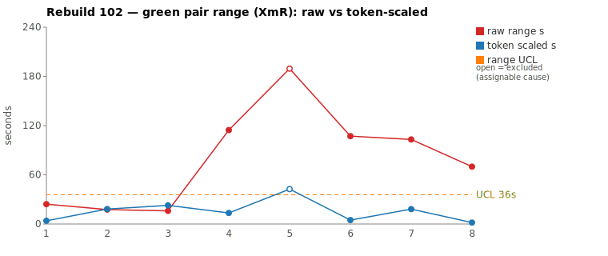
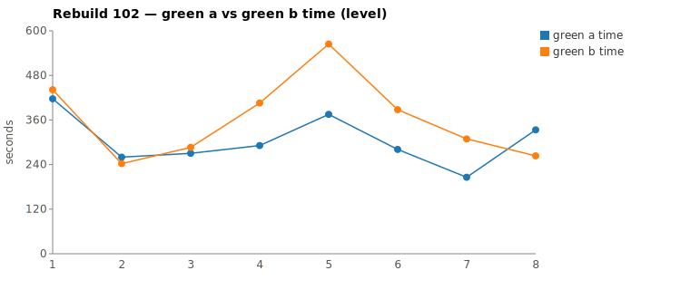

* TOC
{:toc}

---

# Context

> **Review note (2026-07-20, added after author review) — Pair 1 reclassified special cause.** Pair 1 (`This object step definition doesn't exist quickfix`, `c0bbee1d`) is **reclassified from common cause to special cause / assignable.** Three corrections drove it. **(1) Use the established limit, not a per-run one.** The operative control limit is the characterized **sheep-dog-grammar process UCL of ~60 s, tightening toward ~30 s** — not the per-run-recomputed 58 s used in the chart below. A per-run UCL lets a single wide point inflate its own MRbar and hide its breach; against the fixed limit, raw 189 s breaches grossly and **even the token-scaled 43 s Selected exceeds the ~30 s current limit.** **(2) It recurs.** The scenario shows the *same fingerprint across runs* — Rebuild100 (`21ce6af5`, raw 106 s, NET 26.5 % apart) and Rebuild102 (raw 189 s, NET 20.2 % apart), both winner `_a`, both `No functional diff`, both with the slower half digging the object model (`getTestDocument`, `IStepObject`, `ITestProject` / `getStepDefinitionList`). A reliably-recurring 20–27 % exploration-volume split is not run-to-run noise — it is the **"object under test too broad / setup ambiguous"** assignable pattern, and convergence each run is *luck* that the fix is discoverable more than one way. **(3) The "43 s → common cause" reading rests on a blind spot** (see the next note). The fix is a test-case input change — **narrow the Given** so both halves reach the fix without deep object-model spelunking. This supersedes Pair 1's inline "common cause" verdict below, which is kept to show the timing-only analysis that the review corrected.

> **The rate blind spot — and why token count *does* track thinking.** When Opus uses extended thinking, the thinking is emitted as **thinking tokens that count in `output_tokens`** — so more thinking *does* mean more tokens, and a half that deliberates more shows a higher token total (captured in NET, hence already inside the 43 s Selected). An earlier framing in this review — "deliberation is hidden in the rate overhead" — was **backwards and is retracted:** thinking is tokenized, not invisible. (Empirically both halves barely used it here — 2–4 thinking turns each — so the token gap is exploration/action volume, not deliberation.) The **genuine** blind spot is narrower: the token-scaled ruler assumes a constant tokens/sec and books all wall-clock *not* explained by tokens as "generation rate / common cause." But **per-turn context-prefill overhead scales with the *number* of turns, not the token count** — a half that explores in more, smaller steps (Rebuild100 `_b`: 48 tool calls vs `_a`'s 42) pays wall-clock per token that is neither cognitive work nor pure server jitter, but the *cost of the more-stepwise exploration the scenario induced.* With no first-token timestamp in the JSONL, that prefill/latency cannot be separated from generation — so exploration *style* (which the scenario drives) leaks into the "rate" bucket and can make an assignable pair read as common cause. This is the blind spot to keep in mind whenever a wide raw range collapses to a small Selected.

This is a batch-level companion to [pbc-83][5], [pbc-84][4], [pbc-85][13], [pbc-86][15], [pbc-87][18], [pbc-88][19], [pbc-90][22], [pbc-92][26], [pbc-93][27], [pbc-94][29], [pbc-95][30], [pbc-96][32], [pbc-97][33], [pbc-98][34], [pbc-99][35], [pbc-100][36], and [pbc-101][37], using the same in-run pair methodology: since [issue #434][7] every Darmok scenario runs its green phase **twice** — worktree `_a` and `_b`, both branched from the *same red commit*, minutes apart — so the pair-range `|green_a − green_b|` from one metrics row nets out model-of-the-day, red commit, and server window, leaving **work** versus **per-token generation rate**. The charted quantity is the **Selected range** `min(raw, token-scaled)` fixed in [pbc-94][29].

**Rebuild102 is a [pbc-100][36] redux — a clean range chart whose actionable signal is entirely off-pick — with two infrastructure wrinkles the series hasn't recorded before: a silent model stall and an Anthropic usage-limit interruption mid-batch.** The two widest *selected* pairs are a **split** (per the review note above): Pair 1 (`… step definition doesn't exist quickfix`) has the run's widest raw clock (189 s) and, against the established ~30–60 s process UCL, is **special cause / assignable** — a recurring exploration-volume split that traces to the scenario being too broad; Pair 2 (`This object doesn't exist quickfix`) is **common cause** — near-pure generation-rate jitter (114 s raw, NET within threshold, converged). The per-run-recomputed 58 s UCL used in the chart hides Pair 1's breach (it inflates its own limit); the established process limit does not. But the run-wide functional-diff scan returns **three** warns — **all off the reviewed top-2** — and they continue the [pbc-101][37] proposal-construction theme: two land on the same Issues/7 workspace-quickfix family (`parameter set doesn't exist`, `text parameter doesn't exist`) and one on the only-issues `Cell name` quickfix.

Two operational events shaped the run's data and are recorded here because they explain the metrics, not because either is a test-case cause:

1. **A silent model stall** hit worktree `_a` of the `… parameter set exists quickfix` pair (`150eecec`): the runner logged *"Claude CLI stalled (no output for 90s, last turn awaiting tool result), killing…"*, nudged the session to continue, and it recovered — but that attempt's `_a` ran 6:50 with two missing per-minute buckets, inflating its raw range to 140 s. This is a [#417][38] silent-stall data point, not a test-case defect.
2. **The nightly Anthropic usage limit** was reached at 02:32 (*"You've hit your limit · resets 5:10am"*) right at that pair's commit, truncating its post-green pipeline (no `No functional diff` line logged, refactor 0 ms). The affected scenarios were **re-run after 5:10am**, and the chart's dedup (last non-zero pair per scenario) correctly keeps the clean reruns — so the stalled `150eecec` (140 s) is superseded by `fccc1424` (103 s) and drops off the chart entirely.

Picked by the sheet's top-2 on the **deduped** ranges (which is what the chart consumes), the two reviewed pairs are a **split** batch (Pair 1 assignable, Pair 2 common — see the review note above):

| Scenario | Commit | Green `_a` | Green `_b` | Raw range | Token-scaled range | Selected range | Verdict |
|---|---|---|---|---|---|---|---|
| This object step definition doesn't exist quickfix | `c0bbee1d` | **6:15** | 9:24 | 189,458 ms | 43 s | **43 s** (scaled) | **special cause / assignable (per review note) — raw 189 s and even 43 s Selected breach the established ~30–60 s UCL; recurs across Rebuild100/102 as a 20–27 % exploration-volume split (slower half digs the object model), the "object too broad" pattern → narrow the Given** |
| This object doesn't exist quickfix | `0e8e671b` | **4:51** | 6:45 | 114,499 ms | 13 s | **13 s** (scaled) | **common cause — equivalent work (NET 9.7 %, near-identical tool structure), the 114 s clock is 134 s of generation-rate jitter; both committed the same `TestStepIssueResolver`, no functional diff** |

(Bold = the winning half, brought back and refactored — the faster half `_a` in both pairs.) Both rows sit on the `scaled` branch of the `min` (token-scaled < raw): Pair 1's 189 s clock rides on a 20 % NET work gap that scales to 43 s (146 s was rate), Pair 2's 114 s on an ≈10 % NET gap that scales to 13 s (134 s rate). Over the eight deduped run-order rows the per-run XmR limits were `range_mean` **14.9 s**, `range_MR_bar` **16.6 s**, `range_UCL` **58 s** — but that per-run UCL is inflated by the very point under review (Pair 1's 189 s drives its own MRbar). **With Pair 1 excluded as the identified assignable cause, the limits fall to `range_UCL` 36 s** over the remaining seven rows, and Pair 1's 43 s Selected sits *above* it as an open circle. The established sheep-dog-grammar process limit (~30–60 s, tightening to ~30 s) agrees with the excluded-limits reading — which is why the review uses the fixed limit rather than the self-inflating per-run one.

*(Data note: the pair-range values were computed from the authoritative 17-column `metrics.csv`; the chart script deduped to eight rows and computes the same Selected values and `range_UCL` 58 s. The Google Sheet tab (gid `1460357978`) export redirect was not reachable for a live cross-check, so the local CSV is the source of truth per the [skill's][33] "prefer local CSV" rule. One divergence worth flagging: a **raw** widest-2 pick over the un-deduped CSV would have chosen the stalled `150eecec` (140 s) as Pair 2, but that row is a superseded rerun — the usage limit forced a clean retry (`fccc1424`, 103 s), which the dedup keeps — so the canonical top-2 are `c0bbee1d` (189 s) and `0e8e671b` (114 s), matching the chart. The `150eecec` stall is recorded in Context and Findings, not as a reviewed pair.)*

---

# Charts

Scenarios are numbered in run order; the tables below say which index each is. The Moving-Range chart plots **raw** (red) and **token-scaled** (blue) together so `Selected` — their lower envelope — is visible, with the UCL (off Selected, **Pair 1 excluded as an identified assignable cause** per the review note — it is drawn as an open circle above the limit) as the dashed orange line. The Green chart is the absolute level.





---

# The token-scaled pair-range (recap)

Wall-clock fuses **real work** (≈ green output tokens) with the **per-token generation rate** (server load, queue, context-prefill jitter — uncontrollable). The full token-scaled derivation is in [pbc-83][5]; [pbc-90][22] added the NET refinement (deduct Edit/Write/TodoWrite bookkeeping) and [pbc-94][29] fixed the selection rule:

- `raw` = `|a − b|`, the wall-clock gap.
- `net_x` = `raw_tokens_x − edit_x − todo_x`, stripping verbose TodoWrite re-emissions and whole-method Edit payloads.
- `token-scaled` = `|net_a − net_b| × fast_time / fast_raw`, the gap implied by **work** tokens at the faster half's rate.
- **`Selected = min(raw, token-scaled)`.** Scaling only removes variation (rate, bookkeeping); a token-scaled value larger than the clock gap is a phantom, so we keep the clock.

Both reviewed pairs are on the `scaled` branch, and the run's clearest lesson is that **a silent stall is stripped by the same ruler that strips generation rate** — because a stall is time-without-tokens, exactly what `token-scaled` discards. The superseded `150eecec` pair (140 s raw, dominated by a 90 s+ stall in `_a`) would have Selected to ≈20 s had it stayed on the chart: the stall added wall-clock but no work tokens, so the token ruler correctly attributes it to rate. The dedup removed it anyway (a clean rerun exists), but the point stands — the range chart is robust to stalls by construction, which is why a stall never manufactures a false tester signal.

---

# Pair 1 — `c0bbee1d` (This object step definition doesn't exist quickfix): the widest raw, a recurring exploration split (special cause — see review note)

*The timing-only analysis below concluded "common cause"; the author review reclassified it to **special cause / assignable** — see the review note in Context. The analysis is kept because it correctly measures the work difference; what it got wrong was the limit (per-run vs established ~30–60 s) and the weight of cross-run recurrence.*

The run's **widest raw** range (189 s, run index 5), which demotes to **43 s Selected** (scaled). The mojo logged **`Green: No functional diff between pair`**, winner `_a` (the faster half).

| | `_a` 06251a91 | `_b` d6ff514e |
|---|---|---|
| Green wall-clock | **6:15** | 9:24 |
| Green output tokens | 10,370 | 11,011 |
| **NET tokens** | 4,653 | 5,830 |
| Read / Grep | 12 / 3 | 17 / 9 |
| Read tool-result bytes (input) | 118,970 | 156,839 |
| Writes / Edits | 0 / 6 | 0 / 4 |
| `mvn verify` cycles | 3 | 3 |

Output tokens differ only **5.8 %** but **NET 20.2 %** — the raw totals are close, yet the slower half `_b` did materially more *exploration* (NET strips its Edit/TodoWrite bookkeeping and still leaves a 20 % gap). The raw time-range is 50.5 % of the faster half, so time reads "very different." The chart value is **token-scaled 43 s**: scaling the 20 % NET gap to the faster half's rate accounts for 43 s of the 189 s clock and leaves 146 s as rate. No stall — every per-minute bucket is non-zero in both halves (`_b`'s softest minute is 06:07 at 196 tokens, aligned with a large 43 KB Read decoded that minute, not a hang).

The tell is that the extra work led to the *same place*:

```
identical through ~call 9 (ToolSearch→TodoWrite seed, uml reads,
      grep "COMPILATION ERROR" / "Guice configuration errors")
_a 06251a91 (Bash-heavy, 13 Bash / 12 Read): reads jacoco + 4 issue files,
   Bash-greps failures, 2 Edits, mvn; then grep getTestDocument, 2 Edits,
   mvn, mvn  (6 Edit, 3 mvn, 119 KB read)
_b d6ff514e (Read-heavy, 17 Read / 9 Grep): reads 17 files / 156 KB, greps
   getTestDocument, getStepDefinitionList ×2, 4 Edits across edit→mvn loops,
   3 mvn  (4 Edit, 3 mvn, 156 KB read)
```

Both committed the **identical rule**: extend the workspace validate-action cascade with the step-definition-doesn't-exist quickfix plus the matching detector/resolver. `_b` simply read 37 KB more (probing `getStepDefinitionList`/`getTestDocument` that `_a` reached via Bash-grep) and generated ~20 % more NET tokens reasoning about it — a real exploration difference — but reached the code `_a` wrote after a shorter look, and the functional-diff gate stayed silent. **UML consultation was symmetric and identical**: both halves read exactly `uml-overview`, `uml-package`, `uml-interaction-main`, `uml-interaction-test`, no per-class file — no spec-discovery asymmetry.

**Verdict (timing-only, superseded): common cause.** The token-scaled 43 s sits under the *per-run* 58 s UCL, and this commit's pair converged (byte-identical, no functional diff), so the single-run timing gate reads common cause.

**Verdict (after review): special cause / assignable.** Against the **established sheep-dog-grammar UCL (~60 s, tightening to ~30 s)** the raw 189 s breaches grossly and the 43 s Selected still exceeds ~30 s. And this is not one run's luck: the *identical* scenario produced the same fingerprint in [pbc-100][36] (`21ce6af5`, raw 106 s, NET 26.5 % apart, winner `_a`, `No functional diff`, slower half probing `getTestDocument`/`IStepObject`/`ITestProject`). A scenario that *reliably* forces one half into a 20–27 % deeper object-model exploration — while the other finds the fix fast — is the [`/rgr-review-commit`][33] "object under test too broad / setup ambiguous" pattern. The two halves converge each run only because the fix happens to be reachable by more than one route; the *exploration variance itself* is the ambiguity. The fix is a test-case input change (see The Fix), and the per-run UCL that read this "in control" is exactly the artifact the review corrected — it let the 189 s point inflate its own MRbar and hide the breach the established limit shows.

---

# Pair 2 — `0e8e671b` (This object doesn't exist quickfix): near-pure rate over equal work (common cause)

The run's **second-widest raw** range (114 s, run index 4), which demotes to **13 s Selected** (scaled). The mojo logged **`Green: No functional diff between pair`**, winner `_a` (the faster half).

| | `_a` 71b6ae2a | `_b` 283c1746 |
|---|---|---|
| Green wall-clock | **4:51** | 6:45 |
| Green output tokens | 9,544 | 8,907 |
| **NET tokens** | 4,524 | 4,084 |
| Read / Grep | 17 / 7 | 15 / 8 |
| Read tool-result bytes (input) | 156,031 | 156,632 |
| Writes / Edits / Globs | 1 / 2 / 0 | 1 / 2 / 1 |
| `mvn verify` cycles | 2 | 2 |

Output tokens differ **6.7 %** and **NET 9.7 %** — both inside the 15 % threshold; the halves did **equivalent** work. The raw time-range is 39.3 % of the faster half, so time reads "different" while tokens read "same": the [pbc-94][29] matrix's CELL 2 — *same work, different speed → a rate cause*. The chart value is **token-scaled 13 s**: only 13 s of the 114 s clock is work-attributable, leaving **134 s as pure generation-rate jitter**. No stall — every per-minute bucket is non-zero in both halves; read-result bytes are within 0.4 % (156.0 KB vs 156.6 KB), the signature of two halves doing the identical exploration and only decoding at different speeds.

The walk confirms near-identical routes:

```
identical through ~call 9 (ToolSearch→TodoWrite seed, uml reads,
      grep "COMPILATION ERROR" / "Guice configuration errors")
_a 71b6ae2a: reads jacoco + issue files, grep TestStepIssueResolver/correctStep,
   getStepObjectFullNameForTestStep, Write resolver, 2 Edit, mvn, mvn
   (1 Write, 2 Edit, 2 mvn, 17 Read)
_b 283c1746: reads issue files, grep TestStepIssueResolver, Glob
   **/TestStepIssueResolver*, Write resolver, 2 Edit, mvn, mvn
   (1 Write, 2 Edit, 2 mvn, 15 Read, 1 Glob)
```

Both committed the **identical rule**: a new `TestStepIssueResolver` proposing the object-doesn't-exist quickfix, wired into the workspace cascade. The only difference is `_a` grepped for the resolver where `_b` Globbed for it — an equally-valid discovery style. The functional-diff gate was silent; the two halves converged. **UML consultation was symmetric and identical** (same four core files, no per-class file).

**Verdict: common cause — no fix; stays in the limits.** The 13 s Selected sits mid-pack, under both the 36 s excluded-limits UCL and the established ~30 s process limit. It is a near-pure rate pair — real, tiny work variation the clock inflated by 134 s of generation jitter — converged and sub-UCL, so there is nothing assignable to remove.

---

# Batch synthesis — a clean range chart, an off-pick behavioural signal, and two infrastructure events

Rebuild102's two worst raw pairs are both from the Issues/7 workspace-quickfix family (object-doesn't-exist and step-definition-doesn't-exist). Read only the *per-run* range chart and the run looks in control — both demote to small Selected values over converged, byte-identical code. That reading is a **trap**, and Pair 1 is the trap sprung: its 43 s Selected sits under the self-inflated 58 s per-run UCL but *above* the established ~30 s process limit, and the scenario recurs across runs — so the per-run chart certified "in control" a pair that the fixed limit and the cross-run record both flag special cause.

But that reading would miss the run's real signal and its two operational events:

1. **The reviewed pairs are a split, not both common cause.** Pair 1 is a *work* difference (20 % NET, `_b` explored wider) that Selects to 43 s and, against the established ~30 s limit and its cross-run recurrence, is **assignable** (object too broad → narrow the Given); Pair 2 is a converged *rate* pair (NET within threshold) that Selects to 13 s and is **common cause**. The single-run timing gate read Pair 1 as common cause; the established limit plus recurrence corrected it.
2. **The functional-diff scan fires three times, all off-pick — continuing the [pbc-101][37] proposal family.** `Cell name` (raw 16 s, idx 3), `… parameter set doesn't exist` (raw 107 s, idx 6), `… text parameter doesn't exist` (raw 70 s, idx 8). Two are the same Issues/7 workspace proposal-construction axis flagged five times in [pbc-101][37]; the third is a number-prefix capitalisation ambiguity in the only-issues `Cell name` quickfix. Their Selected values are 16 s / 5 s / 2 s — the wide raw ranges on the two workspace ones are *rate*, so they sit inside the limits and the range chart never flags them.
3. **A silent stall and a usage-limit interruption shaped the data without being test-case causes.** The stall ([#417][38]) inflated the superseded `150eecec` pair; the usage limit forced the wave-2 reruns and truncated one pair's logging. Both are recorded so the metrics are legible, and both are held in statistical control — no scenario fix follows from either.

The methodological point extends the [pbc-100][36] arc from two directions at once. First, the range chart is still blind to the off-pick behavioural ambiguities: the two widest *raw* functional-diff scenarios (107 s, 70 s) both collapse to ≈single-digit Selected because their range was rate, so the range ranking would never surface them even though it *sorts* them near the top on raw — the run-wide scan is what surfaces them. Second, and new this run: a *per-run* UCL can also mis-certify a genuine special cause as in control (Pair 1), because the wide point inflates its own limit — which is why the established process limit, plus the cross-run recurrence record, must override a single run's self-computed limit.

---

# The Fix, or Why No Fix

**Pair 1 (`… step definition doesn't exist quickfix`) — assignable: narrow the Given.** Against the established ~30–60 s process UCL it breaches, and it recurs across Rebuild100/102 as a 20–27 % exploration-volume split in which the slower half spelunks the object model (`getTestDocument`, `IStepObject`, `ITestProject`, `getStepDefinitionList`) before finding the same fix. That is the "object under test too broad / setup ambiguous" pattern: the scenario's Given admits a wide discovery path, so which half explores deeper is left to chance. The test-case fix is to **narrow the Given** — provide the minimal, unambiguous fixture (the specific step object + missing step-definition state) so both halves are routed straight to the resolver instead of having to reconstruct the object model. On the chart this point is now `--exclude`d as an identified assignable cause (open circle, dropped from the limits). With it removed the per-run UCL falls from 58 s to **36 s** — which now agrees with the established process limit the review adopted (~30 s), corroborating that the excluded point was the special cause and the remaining seven rows are common-cause variation around a ~30–36 s limit.

**No fix for Pair 2 (`This object doesn't exist quickfix`) — common cause.** Its gap is near-pure generation rate (NET within threshold, converged); "fixing" a scenario whose two halves already agree in both work and behaviour would be tampering.

**No harness fix for the two infrastructure events, either — they are held in control.** The silent stall is a known detection gap tracked in [#417][38] (the JSONL stop-reason watchdog would shorten it); the usage-limit interruption is an account-level constraint, not a Darmok defect. Neither is a prompt, harness, or model change to make here — the stall recovered via the existing nudge, and the reruns produced clean data that the dedup consumed correctly.

**The actionable output of this run is the three off-pick functional diffs, and it is input for the downstream Test-Case authoring skill** ([`/rgr-review-specs`][33] consumes exactly the list below). Two of the three re-flag the Issues/7 workspace proposal-construction axis from [pbc-101][37] (parameter-set and text-parameter proposal values), reinforcing that this family shares one under-specified contract; the third pins a number-prefix capitalisation rule in the only-issues `Cell name` quickfix. None is one of the reviewed top-2, so the range-based review would have shipped a "clean run" verdict without them.

---

# Functional Diffs Found

A `Green: Functional diff between pair` warn fires when the two green halves committed **behaviourally divergent** code that *both* pass the current test — so each warn names a **differentiating input the scenario does not pin**, the raw material for creating or tightening a Test-Case. This list is **run-wide** (every scenario, not just the reviewed top-2), because a functional diff routinely lands on a scenario the top-2 pick never inspects — and this run, all three did.

`.claude/scripts/rgr-review-functional-diffs.sh 102` returned **3** warns:

| # | Scenario (raw range, run index) | Commit | Differentiating input the Test-Case must pin |
|---|---|---|---|
| 1 | Cell name should start with a capital letter quickfix (16 s, idx 3) — *not a reviewed top-2* | `aaad3c95` | A **number-prefixed cell name** (e.g. `"1 test"`). Pin whether `correctNameOnly` capitalises the first *letter* after the number (`"1 Test"`) or leaves the string unchanged (`"1 test"`) — the halves produce different proposal values. |
| 2 | This object step definition parameter set doesn't exist quickfix (107 s, idx 6) — *not a reviewed top-2* | `20058acb` | A parameter entry with **table cell content that differs from the parameter name**, plus a **parameterless entry**. Pin whether the proposal ID/value is the table cell content (A) or the parameter name (B), and whether parameterless entries are filtered (A filters, B does not). |
| 3 | This object step definition text parameter doesn't exist quickfix (70 s, idx 8) — *not a reviewed top-2* | `52511fa2` | A text step whose **step definition name has no match in the resolved step object**. Pin whether the "Generate Content" proposal is added only when a matching step definition exists (A) or unconditionally (B) — they diverge when no match exists. |

Verbatim warn text (for the downstream skill's exact wording):

> **#1 (`aaad3c95`)** — CellIssueResolver.correctNameOnly produces different proposal values for number-prefixed cell names (e.g. "1 test" → A: "1 test", B: "1 Test")

> **#2 (`20058acb`)** — Proposal ID/value uses table cell content (A) vs parameter name (B); guard filters parameterless entries in A but not B

> **#3 (`52511fa2`)** — Candidate A conditionally adds "Generate Content" proposal only when step definition name matches in the resolved step object; Candidate B adds it unconditionally; they diverge when no matching step definition exists

All three are **off the reviewed top-2**. Two (#2, #3) are the same Issues/7 workspace proposal-construction axis flagged five times in [pbc-101][37] — the recurrence is now strong enough to treat the family as chronically under-specified. Their wide *raw* ranges (107 s, 70 s) collapse to Selected 5 s / 2 s (the range was rate), so the range chart never flags them: the clearest evidence yet that raw-range rank and the functional-diff scan are complementary, not redundant.

---

# Mapping to the Research

| Predicted ([pbc-research][2]) | Observed across Rebuild102 |
|---|---|
| Wide pair-range fires the signal | the sheet fired on `… step definition doesn't exist` (189 s) and `This object doesn't exist` (114 s); both demoted to sub-UCL Selected (43 s, 13 s, both `scaled`) |
| A breach of the limit marks a special cause | Pair 1's 43 s Selected **breaches** the established ~30 s limit (and the 36 s excluded-limits UCL); raw 189 s breaches grossly. The per-run 58 s UCL that hid it was self-inflating — the review uses the fixed process limit |
| The special cause is in the input, not the system | confirmed on the **behavioural** detector: the three functional diffs each name an unpinned *input* (number-prefix capitalisation, table-cell-vs-parameter-name, conditional-vs-unconditional Generate) — the fixes are Test-Case inputs, never the harness |
| Both halves pass the same test | yes — all reviewed halves passed verify and converged **byte-identical**, while three *other* scenarios passed the same test with **divergent** code |
| Two work-trees differ | Pair 1: in exploration volume (20 % more NET, 37 KB more read) yet same rule; Pair 2: only in generation rate; plus a stall + usage-limit event that differ at the *infrastructure* level, not the test-case level |

---

# Findings by Variable

*Each subsection records this run's findings about one [Wheeler variable][3].*

## green time pair range

Charted on `Selected = min(raw, token-scaled)` per [pbc-94][29]. The per-run limits over all 8 rows were mean 14.9 s, MRbar 16.6 s, UCL 58 s — but that UCL is inflated by Pair 1 itself, which the review reclassified special cause. **With Pair 1 excluded, UCL = 36 s over the remaining seven rows, and Pair 1's 43 s Selected breaches it.** This is the run's clearest methodological lesson: a *per-run* UCL is self-inflating and hid the breach; the **established process limit (~30–60 s, tightening to ~30 s)** is what the review used, and it agrees with the excluded-limits UCL. Both reviewed pairs are `scaled` — Pair 1's 189 s → 43 s, Pair 2's 114 s → 13 s — but a small Selected is *not* a clean bill of health when the established limit is ~30 s and the point recurs.

## green time pair range moving range

The per-run MRbar of 16.6 s was itself inflated by Pair 1 (idx 5) driving two large links: 30 s into it (idx 4→5, 13 s → 43 s) and 38 s out of it (idx 5→6, 43 s → 5 s). Once Pair 1 is excluded as the assignable cause, the MR chain **bridges across** its slot and those two links drop out, pulling MRbar down (UCL 36 s) — the correct Wheeler treatment, and the reason the excluded limits agree with the established ~30 s process limit. Reading the 43 s point as a common-cause "transition" was the same mistake as reading it under the self-inflated UCL.

## green time

Claude-only per [#568][23]. No absolute-level excursion this run *from a test cause*, but the Green chart shows the run's two highest greens are the reviewed pairs' slow halves — Pair 1 `_b` at 9:24 and Pair 2 `_b` at 6:45 — both from wider exploration/rate, not a harder task. The superseded `150eecec` `_a` at 6:50 is a **developer/infra** spike (the stall), correctly off the deduped chart.

## scale & green tokens

Pair 1 is the run's token-side lesson: raw tokens are within threshold (5.8 %) yet **NET is 20.2 %** — the raw closeness hid a real 20 % exploration difference that only NET (stripping `_b`'s heavier Edit/TodoWrite bookkeeping) exposes. Pair 2 is the opposite: NET 9.7 %, genuinely equivalent work. Trusting raw over NET would have mis-read Pair 1 as pure rate; NET is what keeps its 43 s Selected honest.

## the rate blind spot & tokens-vs-thinking (new this run, from author review)

Extended-thinking output **is** counted in `output_tokens`, so more thinking → more tokens (verified: thinking blocks present in all four halves' JSONLs, 2–4 turns each). An earlier framing — "deliberation is hidden in the rate overhead" — was **backwards and is retracted:** thinking is tokenized and already inside NET/Selected. The **real** blind spot is narrower: the token-scaled ruler assumes constant tokens/sec, so it books all non-token wall-clock as "rate / common cause," but **per-turn context-prefill overhead scales with the number of turns, not tokens.** A half that explores in more, smaller steps pays wall-clock per token that is neither cognitive work nor pure server jitter — it is the cost of the exploration *style the scenario induced*, and with no first-token timestamp it cannot be separated from generation. So exploration style leaks into "rate," and a wide raw range collapsing to a small Selected is **not** proof of common cause. This is why Pair 1's 43 s Selected was insufficient on its own to certify it in control.

## cross-run recurrence (`This object step definition doesn't exist quickfix`)

This scenario is a **repeat offender**: Rebuild100 (`21ce6af5`, raw 106 s, NET 26.5 % apart) and Rebuild102 (`c0bbee1d`, raw 189 s, NET 20.2 % apart) share the same fingerprint — winner `_a`, `No functional diff`, and the slower half digging the object model (Rebuild100: `getTestDocument`, `IStepObject`, `ITestProject`; Rebuild102: `getStepDefinitionList`, `getTestDocument`). A *reliably*-recurring 20–27 % exploration-volume split is a scenario property, not run-to-run noise, and it is the direct evidence that the scenario's Given is too broad. The convergence-each-run (identical committed code) is why the functional-diff detector stays silent and why the single-run timing gate mis-read it — but the recurrence is the signal the batch-level review is meant to catch. This is the case the recurrence-ledger open question (below and in [pbc-100][36]/[pbc-101][37]) is for.

## functional diff between pair

**Three warns run-wide**, all outside the reviewed top-2. Two re-flag the Issues/7 workspace proposal-construction axis ([pbc-101][37]'s five-warn family): `parameter set doesn't exist` (table-cell-vs-parameter-name + parameterless-guard) and `text parameter doesn't exist` (conditional-vs-unconditional Generate). The third is a number-prefix capitalisation split in the only-issues `Cell name` quickfix. Convergence at the reviewed pairs was real, but the behavioural detector shows the run still carries three unpinned ambiguities the range chart cannot see.

## silent stall / timeout (recurring)

**A silent stall occurred this run** — the first reviewed-batch instance since the token-bucket detector replaced the fixed-threshold one. Worktree `_a` of the superseded `150eecec` pair went 90 s+ with no output (*"last turn awaiting tool result"*), was killed and nudged (`I interrupted you because it looks like you're stuck…`), and recovered; its per-minute bucket shows two missing minutes (06:27–06:28). This is the [#417][38] signal in the wild: the nudge worked, but the stall cost ~2.5 min and inflated that attempt's raw range to 140 s. The token-scaled ruler would have collapsed it to ≈20 s (stall = time-without-tokens = rate), and the dedup removed it entirely in favour of the clean rerun — so it never reached the chart.

## usage-limit interruption (new this run)

The nightly Anthropic usage limit (*"resets 5:10am"*) was reached at 02:32, at the `150eecec` commit, truncating that pair's post-green pipeline (no `No functional diff` line, refactor 0 ms) and forcing wave-2 reruns after 5:10am. This is an account-level constraint, not a Darmok or test-case defect; its only effect on the analysis is that the dedup must (and does) prefer the post-reset reruns. Worth noting as a data-legibility factor: a batch that straddles a usage-limit reset will show a time gap and duplicate scenario rows, and the "last non-zero pair per scenario" dedup is what keeps the chart correct.

## green-window attribution

All four reviewed halves' surveys were clipped to each half's last green `end_turn` per the [#570][25] rule; no phantom worktree escapes or refactor-read contamination appeared. Refactor phases logged `No changes, skipping verify` for both reviewed commits — the winners' brought-back code needed no further edits.

---

# Open Questions From This Case

- **Should the recurrence ledger finally be built?** The Issues/7 workspace proposal-construction axis has now fired functional diffs in [pbc-101][37] (five warns) and Rebuild102 (two more), plus the only-issues `Cell name` capitalisation. A per-scenario recurrence counter would separate "chronically ambiguous" (the proposal family) from "diverged once" and let the downstream Test-Case skill prioritise the repeat offenders — and it would answer whether one coordinated proposal-contract spec addition resolves the whole family at once.
- **Does the stall need to be an explicit chart exclusion, or is `min(raw, token-scaled)` sufficient?** This run showed the token ruler collapses a stall to rate and the dedup removed it anyway, so no exclusion was needed. But had the stalled attempt been the *only* run of its scenario (no clean rerun), it would have charted at ≈20 s Selected — inside the limits, but on a pair we *know* was disturbed. Is "the ruler handles it" enough, or should a logged stall flag the point as infra-assignable regardless of its Selected value?
- **Are the two workspace proposal ambiguities pinnable with one Test-Data row each, or do they share a root?** #2 (table-cell-vs-parameter-name) and #3 (conditional-vs-unconditional Generate) both concern how a "Generate" proposal is *constructed* for a missing parameter/text step. Whether they are two independent inputs or two faces of one unspecified proposal contract is the empirical question the downstream authoring skill will answer.

---

[2]: wheeler-understanding-variation
[3]: wheeler-understanding-variation
[4]: 84
[5]: 83
[7]: https://github.com/farhan5248/sheep-dog-main/issues/434
[13]: 85
[15]: 86
[18]: 87
[19]: 88
[22]: 90
[23]: https://github.com/farhan5248/sheep-dog-main/issues/568
[25]: https://github.com/farhan5248/sheep-dog-main/issues/570
[26]: 92
[27]: 93
[29]: 94
[30]: 95
[32]: 96
[33]: 97
[34]: 98
[35]: 99
[36]: 100
[37]: 101
[38]: https://github.com/farhan5248/sheep-dog-main/issues/417
