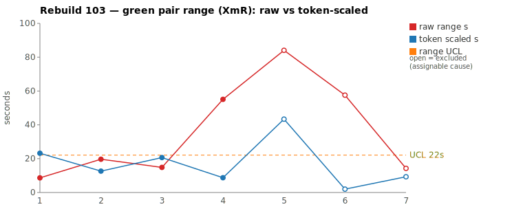
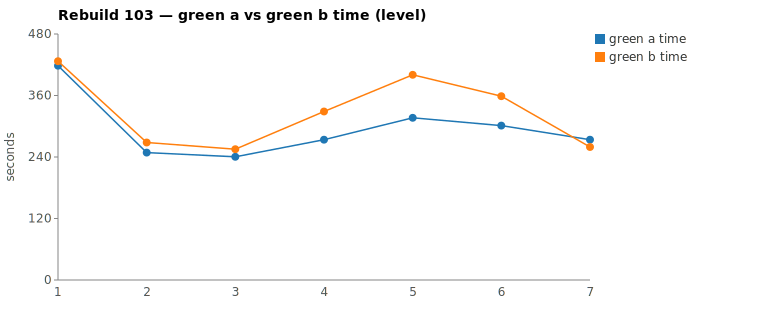

* TOC
{:toc}

---

# Context

This is a batch-level companion to [pbc-83][5], [pbc-84][4], [pbc-85][13], [pbc-86][15], [pbc-87][18], [pbc-88][19], [pbc-90][22], [pbc-92][26], [pbc-93][27], [pbc-94][29], [pbc-95][30], [pbc-96][32], [pbc-97][33], [pbc-98][34], [pbc-99][35], [pbc-100][36], [pbc-101][37], and [pbc-102][39], using the same in-run pair methodology: since [issue #434][7] every Darmok scenario runs its green phase **twice** — worktree `_a` and `_b`, both branched from the *same red commit*, minutes apart — so the pair-range `|green_a − green_b|` from one metrics row nets out model-of-the-day, red commit, and server window, leaving **work** versus **per-token generation rate**. The charted quantity is the **Selected range** `min(raw, token-scaled)` fixed in [pbc-94][29].

**Rebuild103 is the inverse of [pbc-102][39], and the run that most cleanly vindicates running the two detectors independently.** In pbc-102 all three functional diffs landed *off* the reviewed top-2, and the range chart looked deceptively clean. Here the opposite happens: **two of the run's three functional diffs land squarely on the two widest-range pairs**, and the third is one rerun row away. The two widest selected pairs are **both assignable** — but for *different reasons on different axes*, which is the lesson of the run:

- **Pair 1** (`… step definition doesn't exist quickfix`) is assignable on **both** axes at once — the run's widest raw range (84 s → 43 s Selected, a real 21 % NET work split) *and* a functional-diff warn. When both symptoms fire on the same pair, there is no ambiguity about ambiguity.
- **Pair 2** (`… parameter set doesn't exist quickfix`) is the textbook **near-miss**: its timing **fully converged** (NET 1.7 %, Selected **2 s**, no stall) — the pair-range detector alone would certify it common cause and move on — yet the **functional-diff detector fires**. The two halves took the *same time* and came to *different conclusions*. Convergence in time was luck; the scenario is ambiguous, and only the behavioural detector saw it.

| Scenario | Commit | Green `_a` | Green `_b` | Raw range | Token-scaled range | Selected range | Verdict |
|---|---|---|---|---|---|---|---|
| This object step definition doesn't exist quickfix | `ad0cbe94` | **5:16** | 6:40 | 84,078 ms | 43 s | **43 s** (scaled) | **assignable — widest raw range *and* functional diff; `_b` explored ~21 % more (NET), and the halves committed divergent proposal code (A leaks sibling-SD proposals, B returns empty). Both axes fire.** |
| This object step definition parameter set doesn't exist quickfix | `dc47c3d9` | **5:01** | 5:58 | 57,554 ms | 2 s | **2 s** (scaled) | **assignable (behavioural only) — timing converged (NET 1.7 %, no stall) so the range chart reads common cause, but the functional-diff warn fires: A cell-match-filters + conditionally adds "Generate", B adds all StepParameters names unconditionally. The near-miss the range detector cannot see.** |

(Bold = the winning half brought back and refactored — the faster half `_a` in both pairs.) Both rows sit on the `scaled` branch of the `min`: Pair 1's 84 s clock rides on a 21 % NET work gap that scales to 43 s (41 s was rate); Pair 2's 58 s clock rides on a ~2 % NET gap that scales to **2 s** — i.e. essentially all 56 s of Pair 2's clock is generation-rate jitter, none of it work.

Over the seven deduped run-order rows the Selected column is `[9, 13, 15, 9, 43, 2, 9]` s. **Excluding the three identified assignable causes** (all three functional-diff scenarios — rows 5, 6, 7), the limits over the remaining four rows are `range_mean` **≈11.5 s**, `range_MR_bar` **≈4 s**, `range_UCL` **≈22 s**. Against that limit Pair 1's **43 s Selected breaches** (drawn as an open circle above the line); Pair 2's 2 s does *not* breach — it is assignable on behaviour, not timing, so it leaves the timing limits undisturbed and is excluded only because a functional diff is by definition an identified assignable cause.

*(Data note: pair-range values were computed from the authoritative 18-column `metrics.csv` — which carries the edit/todo columns the NET deduction needs; the chart script deduped 30 raw rows to seven and computes the same Selected values. The Google-Sheet export redirect (gid `321670438`) was not reachable for a live cross-check, so the local CSV is the source of truth per the [skill's][33] "prefer local CSV" rule. The un-deduped CSV holds several early-abort rows (green 0/0) and a wave-2 re-run block on commit `a1e24f7e`; the dedup — last non-zero pair per scenario — keeps the clean pairs, and the top-2 raw picks `ad0cbe94` (84 s) and `dc47c3d9` (58 s) match the chart. The third-widest raw was `This object doesn't exist quickfix` (55 s), which is *not* reviewed and is common cause — 55 s → 9 s Selected — see Findings.)*

---

# Charts

Scenarios are numbered in run order; the tables below say which index each is. The Moving-Range chart plots **raw** (red) and **token-scaled** (blue) together so `Selected` — their lower envelope — is visible, with the UCL (off Selected, **the three functional-diff scenarios excluded as identified assignable causes** — drawn as open circles) as the dashed orange line. The Green chart is the absolute level.





---

# The token-scaled pair-range (recap)

Wall-clock fuses **real work** (≈ green output tokens) with the **per-token generation rate** (server load, queue, context-prefill jitter — uncontrollable). The full token-scaled derivation is in [pbc-83][5]; [pbc-90][22] added the NET refinement (deduct Edit/Write/TodoWrite bookkeeping) and [pbc-94][29] fixed the selection rule:

- `raw` = `|a − b|`, the wall-clock gap.
- `net_x` = `raw_tokens_x − edit_x − write_x − todo_x`, stripping verbose TodoWrite re-emissions and whole-method Edit/Write payloads.
- `token-scaled` = `|net_a − net_b| × fast_time / fast_raw`, the gap implied by **work** tokens at the faster half's rate.
- **`Selected = min(raw, token-scaled)`.** Scaling only removes variation (rate, bookkeeping); a token-scaled value larger than the clock gap is a phantom, so we keep the clock.

The run's clearest lesson is not about the ruler at all — both reviewed pairs are on the `scaled` branch and Selected behaves exactly as designed (Pair 1's 84 s → 43 s keeps a real work signal; Pair 2's 58 s → 2 s correctly discards a pure-rate gap). The lesson is that **`Selected` is a *timing* ruler, and timing is only one of the two ways the scenario's ambiguity can show.** Pair 2's 2 s Selected is *correct* — the halves genuinely did equivalent-cost work — and it is *also* not the whole story, because they did equivalent-cost work that reached **different behaviour**. No timing statistic can catch that; the functional-diff gate is the other half of the instrument.

---

# Pair 1 — `ad0cbe94` (This object step definition doesn't exist quickfix): both detectors fire at once

The run's **widest raw** range (84 s, run index 5), demoting to **43 s Selected** (scaled). The mojo logged a **`Green: Functional diff between pair` warn**, winner `_a` (the faster half).

| | `_a` f6468 44d | `_b` 910f9b19 |
|---|---|---|
| Green wall-clock | **5:16** | 6:40 |
| Green output tokens | 9,122 | 11,880 |
| **NET tokens** | 4,609 | 5,860 |
| Read / Grep | 13 / 9 | 15 / 12 |
| Read tool-result bytes (input) | 115,646 | 110,623 |
| Writes / Edits | 0 / 3 | 0 / 7 |
| `mvn verify` cycles | 2 | 3 |

Output tokens differ **23.2 %** and **NET 21.3 %** — both *above* the 15 % threshold, so the halves did materially different **exploration/generation** work. The raw time-range is 26.6 % of the faster half. The chart value is **token-scaled 43 s**: scaling the 21 % NET gap to the faster half's rate accounts for 43 s of the 84 s clock and leaves 41 s as rate. No stall — every per-minute bucket is non-zero in both halves.

The divergence walk shows the extra work was real and the halves reached *different behaviour*:

```
identical through ~call 9 (ToolSearch→TodoWrite seed, uml reads,
      grep "COMPILATION ERROR" / "Guice configuration errors")
_a f646844d (13 Read / 9 Grep, 3 Edit): reads jacoco + issue files, greps
   getTestDocument|getStepObject, IStepObject|ITestDocument,
   getStepDefinitionList|IStepObject; 3 Edit, 2 mvn
_b 910f9b19 (15 Read / 12 Grep, 7 Edit): grep correctStepDefinitionNameWorkspace,
   more reads, repeated getStepObject greps, 7 Edits across edit→mvn loops, 3 mvn
```

Both extend the workspace validate-action cascade with the step-definition-doesn't-exist quickfix, but they did **not** land on identical code — the mojo's byte-compare fired:

> **`ad0cbe94`** — When the matching step definition exists alongside other definitions, A leaks sibling-SD proposals while B correctly returns empty (input: 2+ SDs where one matches stepDefName)

Note the winner `_a` (faster, brought back) is the half with the **leaky** behaviour: when 2+ step definitions exist and one matches, `_a` proposes the siblings too, `_b` correctly returns empty. The scenario's fixture apparently has ≤1 step definition, so both pass the current test — the divergence only manifests on an input the test never presents.

**Verdict: assignable — both axes.** The 43 s Selected breaches the ~22 s excluded-limits UCL, so the *timing* detector already flags it; and the functional diff names the *behaviour* the timing gap was a symptom of. This is the unambiguous case: wide-because-the-halves-explored-differently, and they explored differently because the scenario admits more than one conforming proposal rule. The fix is a test-case input (see The Fix).

---

# Pair 2 — `dc47c3d9` (This object step definition parameter set doesn't exist quickfix): the near-miss — converged clock, divergent behaviour

The run's **second-widest raw** range (58 s, run index 6), demoting to **2 s Selected** (scaled). The mojo logged a **`Green: Functional diff between pair` warn**, winner `_a` (the faster half).

| | `_a` 17a53edb | `_b` 3f9e2b04 |
|---|---|---|
| Green wall-clock | **5:01** | 5:58 |
| Green output tokens | 9,306 | 8,805 |
| **NET tokens** | 3,648 | 3,710 |
| Read / Grep | 11 / 7 | 11 / 8 |
| Read tool-result bytes (input) | 91,332 | 86,973 |
| Writes / Edits / Globs | 1 / 2 / 1 | 1 / 6 / 1 |
| `mvn verify` cycles | 2 | 3 |

Output tokens differ **5.4 %** and **NET just 1.7 %** — both well inside the 15 % threshold; the halves did **equivalent-cost** work. The raw time-range is 19.1 % of the faster half — [pbc-94][29]'s CELL 2, *same work, different speed → a rate cause*. The chart value is **token-scaled 2 s**: only 2 s of the 58 s clock is work-attributable, leaving **56 s as pure generation-rate jitter**. No stall — every per-minute bucket is non-zero in both halves; read-result bytes are within 5 % (91.3 KB vs 87.0 KB), the signature of two halves doing the same exploration at different decode speeds.

By timing alone, this pair is **common cause and would not be touched.** But the byte-compare fired:

> **`dc47c3d9`** — Proposal generation logic differs: A filters by cell-match and conditionally adds "Generate"; B unconditionally adds all StepParameters names and always adds "Generate" when rowCells non-empty.

The two halves spent the *same effort* and produced two *different proposal-construction rules* — `_a` filters candidate parameter-set names by matching the table cell and only offers "Generate" conditionally; `_b` offers every `StepParameters` name and always offers "Generate" when the row has cells. Both pass the current test because the fixture doesn't contain the input that splits them (a cell whose content differs from the parameter names, or a populated-vs-empty rowCells case).

**Verdict: assignable — behavioural only.** This is the run's most instructive pair. Its Selected of 2 s sits at the *bottom* of the chart, dead inside any limit; a range-only review ships it as "clean." The functional-diff detector is the sole reason we know the scenario is ambiguous. The fix is a test-case input (see The Fix); it does **not** enter the timing limits as an excursion — it is excluded because a functional diff is an identified assignable cause, not because 2 s is large.

---

# Batch synthesis — the run where the two detectors agree, and why that is the point

pbc-102's synthesis warned that a clean *range* chart is a trap because the behavioural signal was entirely off-pick. Rebuild103 is the same instrument telling the opposite story: this time the range pick and the functional-diff scan **overlap** — two of three warns are on the two widest pairs. That overlap is not redundancy, it is confirmation that the two detectors measure the same underlying thing (the halves thinking differently ⇒ the test is ambiguous) from two independent angles:

1. **Pair 1 fires on both angles.** Wide range *and* functional diff. This is what full agreement looks like: an ambiguity large enough to cost time and to change behaviour.
2. **Pair 2 fires on only the behavioural angle.** The clock converged to a 2 s Selected; without the byte-compare the scenario would read as perfectly specified. It is the empirical proof that **a narrow pair-range is not a clean bill of health** — convergence in time can be luck while the ambiguity sits unpinned, exactly the [`/rgr-review-run`][33] methodology note about near-misses.
3. **The third warn is off-pick, as usual.** `… text parameter doesn't exist quickfix` (`2dbb7bae`, run idx 7, raw 14 s → 9 s Selected) carries a functional diff but a *narrow* range — the recurring pattern that a run-wide scan is needed because the range ranking would skip it.

All three warns are the **same Issues/7 workspace-quickfix proposal-construction family** flagged five times in [pbc-101][37] and twice more in [pbc-102][39]. Rebuild103 adds three more (two of them now *also* range-visible), pushing that family from "chronically under-specified" toward "the single highest-value spec target in the batch series."

---

# The Fix, or Why No Fix

**Both reviewed pairs are assignable, and both fixes are test-case inputs — the harness/prompt/model are held in control.** They are two faces of one under-specified contract: *how a "missing X" quickfix constructs its list of proposals.*

- **Pair 1 (`… step definition doesn't exist`) — pin the sibling-definition case.** Add a Test-Data row where the step object has **2+ step definitions, one of which matches** `stepDefName`, and assert the proposal list is **empty** (the `_b` behaviour). Today the fixture admits both `_a`'s leak-siblings and `_b`'s return-empty rules; the row forces the correct one. This point is `--exclude`d on the chart as an identified assignable cause (open circle above the ~22 s UCL).
- **Pair 2 (`… parameter set doesn't exist`) — pin proposal source + the Generate condition.** Add Test-Data with (a) a parameter-set entry whose **table-cell content differs from the parameter name**, asserting which string the proposal uses (cell-match vs raw name), and (b) an **empty-rowCells** case, asserting whether "Generate" is offered. That disambiguates `_a`'s filtered/conditional rule from `_b`'s unconditional one.

**No harness or model fix follows from either** — no stall, no usage-limit event, no infrastructure disturbance this run. Both pairs passed verify and both fixes live entirely in the `pit.<model>.orig.graphml` Test-Cases the downstream [`/rgr-review-specs`][33] skill consumes.

---

# Functional Diffs Found

A `Green: Functional diff between pair` warn fires when the two green halves committed **behaviourally divergent** code that *both* pass the current test — so each warn names a **differentiating input the scenario does not pin**, the raw material for creating or tightening a Test-Case. This list is **run-wide** (every scenario, not just the reviewed top-2); this run is notable because **two of the three land on the reviewed top-2** — the range pick and the scan overlap for once.

`.claude/scripts/rgr-review-functional-diffs.sh 103` returned **3** warns:

| # | Scenario (raw range, run index) | Commit | Differentiating input the Test-Case must pin |
|---|---|---|---|
| 1 | This object step definition doesn't exist quickfix (84 s, idx 5) — **reviewed Pair 1** | `ad0cbe94` | A step object with **2+ step definitions where one matches** `stepDefName`. Pin that the proposal list is **empty** (B) rather than leaking the sibling definitions (A). |
| 2 | This object step definition parameter set doesn't exist quickfix (58 s, idx 6) — **reviewed Pair 2** | `dc47c3d9` | A parameter-set entry whose **table-cell content differs from the parameter name**, plus an **empty-rowCells** case. Pin whether the proposal value is the cell content (A, filtered) or every `StepParameters` name (B, unconditional), and whether "Generate" is offered conditionally (A) or always when rowCells non-empty (B). |
| 3 | This object step definition text parameter doesn't exist quickfix (14 s, idx 7) — *not a reviewed top-2* | `2dbb7bae` | A text step where a **Content `StepParameters` with a Content-cell row already exists**. Pin whether "Generate Content" is suppressed when such a row exists (A) or always proposed (B). |

Verbatim warn text (for the downstream skill's exact wording):

> **#1 (`ad0cbe94`)** — When the matching step definition exists alongside other definitions, A leaks sibling-SD proposals while B correctly returns empty (input: 2+ SDs where one matches stepDefName)

> **#2 (`dc47c3d9`)** — Proposal generation logic differs: A filters by cell-match and conditionally adds "Generate"; B unconditionally adds all StepParameters names and always adds "Generate" when rowCells non-empty.

> **#3 (`2dbb7bae`)** — Candidate A suppresses "Generate Content" proposal when a Content StepParameters with a Content cell row already exists; Candidate B always proposes it

All three are the **Issues/7 workspace-quickfix proposal-construction family** — the recurrence now spans pbc-101 (5), pbc-102 (2), and pbc-103 (3), all about *how a missing-X quickfix builds its proposal list* (which candidates, filtered or not, and when "Generate" is added). The consistency is strong enough to justify one coordinated Test-Data pass across the whole family rather than three isolated rows.

---

# Mapping to the Research

| Predicted ([pbc-research][2]) | Observed across Rebuild103 |
|---|---|
| Wide pair-range fires the signal | the sheet fired on `… step definition doesn't exist` (84 s) and `… parameter set doesn't exist` (58 s) |
| A breach of the limit marks a special cause | Pair 1's 43 s Selected **breaches** the ~22 s excluded-limits UCL; Pair 2's 2 s does **not** — yet Pair 2 is still assignable, on the behavioural axis the limit cannot see |
| The special cause is in the input, not the system | confirmed twice on the **behavioural** detector: both warns name an unpinned *input* (sibling-definition set; table-cell-vs-name + empty-rowCells) — the fixes are Test-Case inputs, never the harness |
| Both halves pass the same test | yes — all four halves passed verify while committing behaviourally divergent code (both reviewed pairs), the direct evidence that the tests admit more than one conforming answer |
| Two work-trees differ | Pair 1: in exploration volume (21 % more NET) *and* behaviour; Pair 2: **not** in cost (NET 1.7 %) but *still* in behaviour — the case that timing-difference and behaviour-difference are independent |

---

# Findings by Variable

*Each subsection records this run's findings about one [Wheeler variable][3].*

## green time pair range

Charted on `Selected = min(raw, token-scaled)` per [pbc-94][29]. Selected over the seven deduped rows was `[9,13,15,9,43,2,9]`; excluding the three functional-diff scenarios the limits are mean ≈11.5 s, MRbar ≈4 s, **UCL ≈22 s**, and Pair 1's 43 s breaches. The run's finding: the range detector caught Pair 1 (both axes) but was **blind to Pair 2** (Selected 2 s) — a real ambiguity with a converged clock. The pair-range is necessary, not sufficient.

## green time pair range moving range

The MR chain bridges across the three excluded slots (5, 6, 7); the remaining links are small (|13−9|, |15−13|, |9−15| = 4, 2, 6 → MRbar ≈4), so the four common-cause rows form a tight, in-control band around ~11 s with UCL ~22 s. No moving-range excursion among the retained points — the only excursion is the excluded Pair 1.

## green time

Claude-only per [#568][23]. No absolute-level excursion from a test cause. The Green chart's two highest greens are the reviewed pairs' slow halves (Pair 1 `_b` 6:40, Pair 2 `_b` 5:58), both from wider exploration/rate, not a harder task.

## scale & green tokens

Pair 1 is a clean case of NET and raw agreeing (23 % raw, 21 % NET — a real work gap that survives the Edit/TodoWrite strip). Pair 2 is the opposite and the more important reading: NET **1.7 %**, genuinely equivalent work — so the token axis correctly says "same effort," and it is precisely *because* effort was equal that the behavioural divergence is surprising and worth pinning. Tokens measured the cost honestly; they simply cannot measure the conclusion.

## functional diff between pair (the run's headline variable)

**Three warns run-wide, two of them on the two widest-range pairs** — the first run in the series where the range pick and the behavioural scan substantially overlap. Pair 2 is the exhibit: converged timing (Selected 2 s), divergent behaviour. This is the direct evidence that the two detectors are independent and both required — a scenario can be clean on range and flagged on behaviour, and vice-versa. All three warns are the Issues/7 proposal-construction family (now 10 warns across pbc-101/102/103).

## near-miss / convergence-is-luck (new emphasis this run)

Rebuild103 supplies the concrete near-miss the methodology note has described abstractly: Pair 2's two halves converged in *time* but not in *behaviour*. Reading only the range chart would have certified it "well specified." The finding: **treat a narrow pair-range as "no timing signal," never as "no ambiguity"** — always cross-check the run-wide functional-diff scan before concluding a scenario is in control.

## silent stall / timeout

**None this run** — every per-minute bucket in all four reviewed halves is non-zero; no kill/nudge in the runner log for either pair. The wide raw ranges are exploration (Pair 1) and pure rate (Pair 2), not stalls.

## green-window attribution

All four reviewed halves' surveys were clipped to each half's last green `end_turn` per the [#570][25] rule; refactor phases logged `No changes, skipping verify` for both reviewed commits — the winners' brought-back code needed no further edits.

---

# Open Questions From This Case

- **Should the Issues/7 proposal-construction family get one coordinated spec pass?** Ten functional-diff warns across three runs (pbc-101/102/103) all concern how a missing-X quickfix builds its proposal list — which candidates, filtered how, and when "Generate" is added. Are these N independent Test-Data rows or one shared under-specified proposal contract that a single set of rows (candidate source, filter predicate, Generate condition) would close for the whole family at once?
- **Now that a near-miss is documented (Pair 2), should the review protocol formalise "always run the behavioural scan, even on a clean range chart"?** pbc-102 (all off-pick) and pbc-103 (Pair 2 converged-but-diverged) are two independent demonstrations that the range chart alone is insufficient. Is it time to state the run-wide functional-diff scan as a *mandatory* gate rather than a supplementary one?
- **Does winner-selection ever ship the *worse* behaviour?** In Pair 1 the winner `_a` is the half with the leaky sibling-proposal rule. The mojo picks the faster half; when the halves diverge, "faster" is orthogonal to "more correct." Should a functional-diff warn influence which half is brought back, or is that out of scope until the scenario is disambiguated?

---

[2]: wheeler-understanding-variation
[3]: wheeler-understanding-variation
[4]: 84
[5]: 83
[7]: https://github.com/farhan5248/sheep-dog-main/issues/434
[13]: 85
[15]: 86
[18]: 87
[19]: 88
[22]: 90
[23]: https://github.com/farhan5248/sheep-dog-main/issues/568
[25]: https://github.com/farhan5248/sheep-dog-main/issues/570
[26]: 92
[27]: 93
[29]: 94
[30]: 95
[32]: 96
[33]: 97
[34]: 98
[35]: 99
[36]: 100
[37]: 101
[39]: 102
