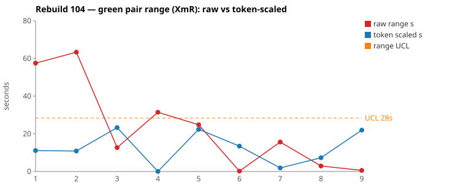
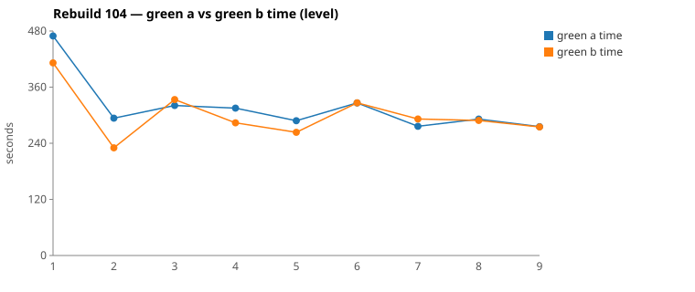

* TOC
{:toc}

---

# Context

This is a batch-level companion to [pbc-83][5], [pbc-84][4], [pbc-85][13], [pbc-86][15], [pbc-87][18], [pbc-88][19], [pbc-90][22], [pbc-92][26], [pbc-93][27], [pbc-94][29], [pbc-95][30], [pbc-96][32], [pbc-97][33], [pbc-98][34], [pbc-99][35], [pbc-100][36], [pbc-101][37], [pbc-102][39], and [pbc-103][40], using the same in-run pair methodology: since [issue #434][7] every Darmok scenario runs its green phase **twice** — worktree `_a` and `_b`, both branched from the *same red commit*, minutes apart — so the pair-range `|green_a − green_b|` from one metrics row nets out model-of-the-day, red commit, and server window, leaving **work** versus **per-token generation rate**. The charted quantity is the **Selected range** `min(raw, token-scaled)` fixed in [pbc-94][29].

**Rebuild104 is the first run in the series that contains its own before-and-after.** The two widest selected pairs are **both common cause** — a quiet result on its own. The run's single functional diff landed on neither of them; it landed on `Step Parameters - Parameter combination doesn't exist quickfix - Replace` (`39342753`), which was then **diagnosed, disambiguated in the Test-Case, and re-run inside the same batch** as `c9e93d3b` — coming back with **no functional diff and a 56 s → 3 s collapse in raw range**. The batch therefore holds both the symptom and the cure, measured on the same instrument minutes apart.

That gives the run three distinct lessons, only one of which is about the two reviewed pairs:

- **Both reviewed pairs are common cause.** Pair 1's halves committed near-identical code (one redundant guard apart); Pair 2's halves committed **byte-identical** code. Neither warrants a scenario-level fix — proposing one would be tampering.
- **The one real signal was off-pick, again.** As in [pbc-102][39], the range ranking did not surface the functional diff; the run-wide scan did.
- **The fix is now empirically validated.** Prior reports proposed disambiguating Test-Data rows and left verification to a future batch. Here the disambiguation was applied and re-measured within the run, and both detectors went quiet.

| Scenario | Commit | Green `_a` | Green `_b` | Raw range | Token-scaled range | Selected range | Verdict |
|---|---|---|---|---|---|---|---|
| Step Definition doesn't exist quickfix - Generate | `d5af6eca` | 4:48 | **4:23** | 24,827 ms | 22 s | **22 s** (scaled) | **common cause** — no functional diff; identical dispatch edit, `_b` adds one redundant `StepDefinitionRefFragments.getAll` guard after reading `SheepDogUtility.java` that `_a` never opened. Equally valid discovery style. |
| Cell name should start with a capital letter quickfix | `cdef4566` | **5:20** | 5:33 | 12,670 ms | 23 s | **13 s** (raw) | **common cause** — no functional diff; the written `CellIssueResolver.correctNameOnly` is **byte-identical** in both halves. Selected keeps the clock because the token-scaled value (23 s) exceeds it — a phantom the `min` discards. |

(Bold = the winning half brought back and refactored.) The two rows sit on opposite branches of the `min`: Pair 1 is `scaled` (a 25 s clock riding on a NET work gap that scales to 22 s), Pair 2 is `raw` (a 13 s clock the token axis would have inflated to 23 s).

Over the nine deduped run-order rows the Selected column is `[11, 11, 13, 0, 22, 0, 2, 3, 1]` s. **Nothing is excluded** — the one functional-diff scenario's charted row is its *fixed re-run*, not the flagged attempt (see the data note). The limits over all nine rows are `range_mean` **7 s**, `range_MR_bar` **8 s**, `range_UCL` **28 s**. Pair 1's 22 s Selected is the run's maximum and **does not breach**. On the timing axis, Rebuild104 is entirely in control.

*(Data note: picks came from the current pair-range sheet (gid `612140882`), whose nine rows and Selected values agree exactly with `.claude/scripts/rgr-review-charts.py 104` reading the local `metrics.csv` — the first clean cross-check of the two sources in the series. The sheet's own `range mean` 8.45 / `MR bar` 6 / `UCL` 24.1 differ slightly from the chart script's 7 / 8 / 28; the script's are used here. Scenarios absent from the sheet (`Test Step Name Quickfix - Invalid`, `Step Parameters … - Generate`) are early-abort rows with green 0/0 and are correctly outside both. The dedup rule — last non-zero pair per scenario — is what makes the `Step Parameters … Replace` row the fixed re-run `c9e93d3b` rather than the flagged `39342753`.)*

---

# Charts

Scenarios are numbered in run order; the tables below say which index each is. The Moving-Range chart plots **raw** (red) and **token-scaled** (blue) together so `Selected` — their lower envelope — is visible, with the UCL (off Selected, no exclusions this run) as the dashed orange line. The Green chart is the absolute level.





---

# The token-scaled pair-range (recap)

Wall-clock fuses **real work** (≈ green output tokens) with the **per-token generation rate** (server load, queue, context-prefill jitter — uncontrollable). The full token-scaled derivation is in [pbc-83][5]; [pbc-90][22] added the NET refinement (deduct Edit/Write/TodoWrite bookkeeping) and [pbc-94][29] fixed the selection rule:

- `raw` = `|a − b|`, the wall-clock gap.
- `net_x` = `raw_tokens_x − edit_x − write_x − todo_x`, stripping verbose TodoWrite re-emissions and whole-method Edit/Write payloads.
- `token-scaled` = `|net_a − net_b| × fast_time / fast_raw`, the gap implied by **work** tokens at the faster half's rate.
- **`Selected = min(raw, token-scaled)`.** Scaling only removes variation (rate, bookkeeping); a token-scaled value larger than the clock gap is a phantom, so we keep the clock.

Rebuild104 exercises both branches in the top-2 and shows the `min` doing its job in each direction. Pair 2 is the cleaner demonstration: its halves wrote *byte-identical* code, so any range above the clock's 13 s is definitionally phantom — and the token axis proposed 23 s. Had the earlier three-tier rule been in force, Pair 2 would have charted 23 s and sat near the limit for no reason at all.

---

# Pair 1 — `d5af6eca` (Step Definition doesn't exist quickfix - Generate): a redundant guard, not a divergence

The run's **widest Selected** range (22 s, run index 5; raw 25 s). The mojo logged **`Green: No functional diff between pair`**, winner `_b` (the faster half).

| | `_a` 26c27250 | `_b` f44ef472 |
|---|---|---|
| Green wall-clock | 4:48 | **4:23** |
| Green output tokens | 7,714 | 7,428 |
| **NET tokens** | 3,545 | 2,913 |
| Assistant turns | 49 | 49 |
| Read / Grep | 13 / 5 | 14 / 3 |
| Read tool-result bytes (input) | 130,236 | 115,224 |
| Writes / Edits | 0 / 2 | 0 / 3 |
| `mvn verify` cycles | 2 | 2 |

Output tokens differ **3.7 %** — well inside the 15 % threshold; NET differs **17.8 %**, just outside it. The raw time-range is **9.4 %** of the faster half, inside the 10 % band, so on the time axis the halves are similar. No stall: every per-minute bucket is non-zero in both halves, and the one quiet stretch (~21:19:30 → 21:20:18) is the harness's `green-compile` → `green-verify` handoff, bracketed by the mojo's `Writing jacoco-shortlist.md` line, not a silent model pause.

The divergence walk is short — the halves agree on everything but one guard:

```
identical through ~call 12 (ToolSearch→TodoWrite seed, four uml reads,
      grep "COMPILATION ERROR" / "Guice configuration errors", jacoco-shortlist)
_a 26c27250 (13 Read / 5 Grep, 2 Edit): reads TestStepIssueResolver,
   TestStepIssueTypes, StepDefinitionRefFragments, ListQuickfixesActionImpl; 2 mvn
_b f44ef472 (14 Read / 3 Grep, 3 Edit): same set PLUS
   src/main/java/org/farhan/dsl/grammar/SheepDogUtility.java (never opened by _a);
   3 Edits — an extra import line — 2 mvn
```

Both wrote the same `ListQuickfixesActionImpl` dispatch branch and the same `correctStepDefinitionNameWorkspace`, except `_b` wraps the proposal in a redundant non-empty check:

```java
// _a
if (stepDefinitionName != null && !stepDefinitionName.isEmpty()) {
    proposal.setId("Generate " + stepDefinitionName); ...

// _b
if (stepDefinitionName != null && !stepDefinitionName.isEmpty()) {
    String all = StepDefinitionRefFragments.getAll(stepDefinitionName);
    if (!all.isEmpty()) {
        proposal.setId("Generate " + stepDefinitionName); ...
```

The mojo's byte-compare judged these behaviourally equivalent, and the extra guard is where `_b`'s additional NET tokens went — it read `SheepDogUtility.java` to check what helpers existed, then added a defensive call. **UML consultation was symmetric**: both read `uml-overview.md`, `uml-package.md`, `uml-interaction-main.md`, and `uml-interaction-test.md`; **neither opened a per-class `uml-class-*.md`**.

**Verdict: common cause.** 22 s Selected against a 28 s UCL, no functional diff, matching tool actions and identical `mvn` cycles. The NET gap traces to one half writing one extra defensive branch — ordinary nondeterminism, not an ambiguity in the scenario. **No scenario-level fix; proposing one would be tampering.**

---

# Pair 2 — `cdef4566` (Cell name should start with a capital letter quickfix): byte-identical output

The run's **second-widest Selected** range (13 s, run index 3; raw 13 s — the `raw` branch, because token-scaled proposed 23 s). The mojo logged **`Green: No functional diff between pair`**, winner `_a`.

| | `_a` 4a195222 | `_b` 21a106fb |
|---|---|---|
| Green wall-clock | **5:20** | 5:33 |
| Green output tokens | 7,124 | 7,500 |
| **NET tokens** | 2,989 | 3,507 |
| Assistant turns | 48 | 52 |
| Read / Grep / Glob | 12 / 5 / 0 | 13 / 6 / 1 |
| Read tool-result bytes (input) | 119,052 | 121,649 |
| Writes / Edits | 1 / 2 | 1 / 2 |
| `mvn verify` cycles | 2 | 2 |

Output tokens differ **5.0 %** and NET **14.8 %** — both inside the 15 % threshold. The raw time-range is **4.0 %** of the faster half. Read-result bytes are within 2 % (119.1 KB vs 121.6 KB), the signature of two halves doing the same exploration. The per-minute buckets show a quiet minute at 18:05 in `_b` and a 289-token minute in `_a` — both align with the mojo's `Writing jacoco-shortlist.md` at 14:05:34 / 14:05:44, i.e. the phase handoff, **not** a stall.

The divergence walk finds almost nothing to walk:

```
identical through ~call 11 (ToolSearch→TodoWrite seed, four uml reads,
      grep "COMPILATION ERROR" / "Guice configuration errors", jacoco-shortlist,
      "5 - Quickfixes for Only Issues.feature")
_a 4a195222 (12 Read / 5 Grep): CellIssueDetector, CellIssueResolver, CellIssueTypes,
   TestSuiteIssueResolver, ListQuickfixesActionImpl; 1 Write + 2 Edit; 2 mvn
_b 21a106fb (13 Read / 6 Grep / 1 Glob): same set PLUS
   src/main/java/org/farhan/dsl/issues/TestStepContainerIssueResolver.java;
   1 Write + 2 Edit; 2 mvn
```

The written `CellIssueResolver.correctNameOnly` — the whole point of the scenario — is **byte-identical between the two halves**, down to the `SheepDogUtility.getNameIndex(name)` call, the `Character.isUpperCase` test, the `"Capitalize cell name"` proposal id, and the `"Capitalize the first letter of the name"` description. `_b`'s only extra work was reading one sibling resolver for reference. **UML consultation symmetric** — same four generic files, no per-class file in either half.

**Verdict: common cause.** This is as clean a convergence as the instrument can show: same time to within 4 %, same work to within 15 % NET, and *the same bytes committed*. The 13 s clock gap is generation-rate jitter. **No fix.**

---

# Batch synthesis — a quiet top-2, and the first measured cure

Taken together the two reviewed pairs say the same thing twice: **for these two scenarios the Test-Case pinned the implementation.** Pair 2 pinned it so tightly the halves produced identical bytes; Pair 1 left room only for a redundant guard the byte-compare judged equivalent. Neither is a spec defect. A review that ends "both common cause — no action" is the correct outcome, and [pbc-83][5]'s tampering gate exists precisely so that a 22 s and a 13 s range don't get converted into busywork.

The interesting result is one the range ranking never pointed at. The run's single functional diff sat on `Step Parameters … Replace`, and this batch did something no prior batch did: it **closed the loop inside the run**.

1. **Symptom** — `39342753`, raw range **56 s** (5:29 vs 4:33) *and* a functional-diff warn. The two halves built the replace-proposal id from different sources: `_a` derived it from the parameter set's first-row cells, `_b` used `sp.getName()`. Both passed, because the fixture's set was *named* `N1, N2` and its cells were `N1`,`N2` — and `getCellListAsString` sorts and joins with `", "`, making name and derived-cells byte-identical. The coincidence hid the ambiguity.
2. **Cure** — the Test-Case was disambiguated: the parameter set was renamed `Multiple Parameters` so the name can no longer stand in for its cells, and the `Then` row pins `Proposal Id = Multiple Parameters` with `Proposal Value = N1, N2` — display name for the id, cell combination for the applied value.
3. **Re-measurement** — `c9e93d3b`, same scenario, same batch: **`No functional diff between pair`**, raw range **3 s** (4:51 vs 4:48), Selected 3 s.

That is the whole thesis of the series demonstrated end-to-end on one scenario in one afternoon: the halves diverged because the Test-Case admitted two conforming rules; pinning the rule made them converge on both detectors at once.

---

# The Fix, or Why No Fix

**Both reviewed pairs are common cause — no scenario-level fix.** Pair 1's halves differ by one redundant guard the byte-compare judged equivalent; Pair 2's halves committed identical bytes. Neither range breaches the 28 s UCL. Acting on either would be [Wheeler][3]-tampering: reacting to common-cause variation increases variation. The only legitimate follow-ups are measurement-level, and none is indicated — the limits are stable and the two sources (sheet and local CSV) agree exactly for the first time.

**The run's one assignable cause was already fixed and verified**, so it needs no forward action either. For the record, the disambiguation that worked:

- **`Step Parameters … Replace` — pin the proposal id's source.** Give the parameter set a name that cannot be confused with its cell string (`Multiple Parameters`, cells `N1`,`N2`), then assert `Proposal Id = Multiple Parameters` and `Proposal Value = N1, N2`. A name-based rule and a cells-based rule now produce different ids, so only one implementation passes.

Two observations worth carrying forward from that fix, both about the *test object* rather than any one scenario:

- **The popup assertion is blind to extra proposals.** `ListQuickfixesPopupImpl` looks proposals up **by id** (`getProposalId` / `getProposalDescription` / `getProposalValue` all scan for a matching id and return `null` otherwise), so a half that emits *additional* proposals passes unchallenged. That is why one of the two divergent rules — an unfiltered loop over every `StepParameters` — survived the test. Pinning "no extras" would need a count column plus an impl getter; it is not expressible today.
- **A friendly name and a derived name are only redundant until they aren't.** Parameter-set names are generated from the sorted, `", "`-joined table headers, so name ≡ cells at creation; the point of keeping both is that a set can later be renamed to explain its context. Any rule that *compares* on the name — as the pre-fix existence check did — silently breaks the moment a set is renamed. Comparisons belong on cells; display belongs on the name.

**No harness or model fix follows** — no stall, no timeout, no infrastructure disturbance this run.

---

# Functional Diffs Found

A `Green: Functional diff between pair` warn fires when the two green halves committed **behaviourally divergent** code that *both* pass the current test — so each warn names a **differentiating input the scenario does not pin**, the raw material for creating or tightening a Test-Case. This list is **run-wide** (every scenario, not just the reviewed top-2).

`.claude/scripts/rgr-review-functional-diffs.sh 104` returned **1** warn:

| # | Scenario (raw range, run index) | Commit | Differentiating input the Test-Case must pin |
|---|---|---|---|
| 1 | Step Parameters - Parameter combination doesn't exist quickfix - Replace (56 s on the flagged attempt; the deduped row is the fixed re-run at 3 s, idx 8) — *not a reviewed top-2* | `39342753` | A parameter set whose **name differs from its `", "`-joined cell list**. Pin whether the replace proposal's id comes from the set's **name** or from its **cells** — and, separately, whether a set whose cells already match the step's row is filtered out of the proposal list. **Already fixed and re-verified in this run** (`c9e93d3b`: no functional diff, 3 s range). |

Verbatim warn text (for the downstream skill's exact wording):

> **#1 (`39342753`)** — A filters step-parameter proposals where table cells match the test step's cells; B always adds proposals for every StepParameters using sp.getName(), producing extra proposals for matching-cell inputs

This is the **Issues/6 workspace-quickfix proposal-construction family** flagged five times in [pbc-101][37], twice in [pbc-102][39], and three times in [pbc-103][40] — now eleven warns across four runs, all about *how a missing-X quickfix builds its proposal list*. Rebuild104 is the first of them to be closed and re-measured rather than filed forward, which makes it the natural template for the coordinated pass [pbc-103][40] asked for.

---

# Mapping to the Research

| Predicted ([pbc-research][2]) | Observed across Rebuild104 |
|---|---|
| Wide pair-range fires the signal | the sheet fired on `… Generate` (25 s raw) and `Cell name …` (13 s raw) — the run's two widest Selected |
| A breach of the limit marks a special cause | **no breach this run** — max Selected 22 s against a 28 s UCL; and correctly so, since both reviewed pairs proved common cause on inspection |
| The special cause is in the input, not the system | confirmed on the one warn: the unpinned input was a parameter-set *name* that happened to equal its cell list; the fix was a Test-Case row, never the harness |
| Both halves pass the same test | yes — all four reviewed halves passed verify; in Pair 2 they passed with *identical bytes*, the strongest form of "the test pinned it" |
| Two work-trees differ | Pair 1: one redundant guard (equivalent); Pair 2: **no difference at all**. The run's evidence that in-control scenarios exist and look like this |

---

# Findings by Variable

*Each subsection records this run's findings about one [Wheeler variable][3].*

## green time pair range

Charted on `Selected = min(raw, token-scaled)` per [pbc-94][29]. Selected over the nine deduped rows was `[11,11,13,0,22,0,2,3,1]`; with no exclusions the limits are mean **7 s**, MRbar **8 s**, **UCL 28 s**. The maximum (Pair 1, 22 s) sits inside. The run's finding: **a top-2 pick with no breach and no functional diff on either pick is a legitimate "nothing to do" result** — the first such clean top-2 since the Selected rule was fixed.

## green time pair range moving range

The MR chain is `[0,2,13,22,22,2,1,2]` → MRbar 8 s. The two 22 s links straddle run index 5 (Pair 1) and are the only large moves; they are symmetric (up then down) rather than a shift, which is what a single wider-than-neighbours point looks like in an in-control process. No MR excursion.

## green time

Claude-only per [#568][23]. No absolute-level excursion from a test cause. The Green chart's slowest halves are Pair 2's `_b` (5:33) and Pair 1's `_a` (4:48); both are ordinary, and every reviewed half ran 2 `mvn verify` cycles — no half needed a third attempt.

## scale & green tokens

Both reviewed pairs have raw-token gaps well inside threshold (3.7 %, 5.0 %) with larger NET gaps (17.8 %, 14.8 %) — the expected shape when TodoWrite bookkeeping dominates raw volume. Pair 2 is the instructive one: a 14.8 % NET gap against **byte-identical committed code**, i.e. NET measures *reasoning volume*, not output divergence. Two halves can think a seventh more and land in exactly the same place.

## functional diff between pair

**One warn run-wide, and it was off-pick** — the reviewed top-2 were both clean. That repeats [pbc-102][39]'s lesson: the range ranking and the behavioural scan are independent, and the scan must be run-wide. What is new is the *sequel*: the flagged scenario was re-run after disambiguation and came back clean on both axes (`c9e93d3b`, 3 s, no diff), the first closed-loop confirmation in the series that a Test-Data fix removes a functional diff.

## fix validation within a run (new variable this run)

Rebuild104 introduces a measurement the series has not had: the **same scenario, same batch, before and after a Test-Case disambiguation**. Before: 56 s raw + functional diff. After: 3 s raw, no functional diff. Because both measurements share the batch, the model-of-the-day and server window are held constant — the same reason the in-run pair is a clean instrument. The finding: **a disambiguating Test-Data row is verifiable, not just plausible**, and the verification costs one re-run.

## silent stall / timeout

**None this run** — every per-minute bucket in all four reviewed halves is accounted for. The quiet minute in Pair 2's `_b` (18:05) and the low minute in `_a` line up with the mojo's `Writing jacoco-shortlist.md` lines, i.e. the `green-compile` → `green-verify` handoff. Cross-referencing the token bucket against the tool-call timeline correctly reclassified both as phase transitions rather than stalls.

## green-window attribution

All four reviewed halves' surveys were clipped to each half's last green `end_turn` per the [#570][25] rule. Both reviewed commits' refactor phases logged `No changes, skipping verify` — the winners' brought-back code needed no further edits.

---

# Open Questions From This Case

- **Should the popup Test Object be able to assert "and nothing else"?** `ListQuickfixesPopupImpl` resolves proposals by id, so a half that emits extra proposals is invisible to the assertion — which is exactly how one of the two divergent rules in `39342753` survived. Adding a count column (or a whole-list assertion beyond the existing `will be empty`) would close a whole class of proposal-construction ambiguity at the *object* level rather than one Test-Data row at a time. Is that worth a spec change, given eleven warns in this family across four runs?
- **Now that a fix has been validated in-run, should disambiguations be re-run deliberately rather than opportunistically?** `c9e93d3b` happened because the scenario was re-run for other reasons. A protocol that re-queues a functional-diff scenario after its Test-Case is tightened would turn every fix into a measurement — at the cost of one green pair each.
- **Does a rule that compares on a display name deserve a spec-level prohibition?** The pre-fix existence check compared a parameter set's *name* against the step's cell list; that only worked because names are generated from cells and breaks the moment a set is renamed for readability. The same shape could appear anywhere a friendly name shadows a derived one. Is this a `uml-class-*.md` rule ("comparisons use derived values, display uses names") rather than a per-scenario Test-Data row?

---

[2]: wheeler-understanding-variation
[3]: wheeler-understanding-variation
[4]: 84
[5]: 83
[7]: https://github.com/farhan5248/sheep-dog-main/issues/434
[13]: 85
[15]: 86
[18]: 87
[19]: 88
[22]: 90
[23]: https://github.com/farhan5248/sheep-dog-main/issues/568
[25]: https://github.com/farhan5248/sheep-dog-main/issues/570
[26]: 92
[27]: 93
[29]: 94
[30]: 95
[32]: 96
[33]: 97
[34]: 98
[35]: 99
[36]: 100
[37]: 101
[39]: 102
[40]: 103
