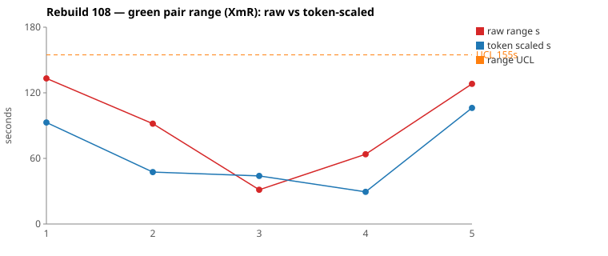
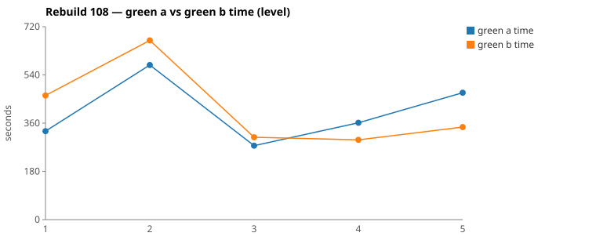

* TOC
{:toc}

---

# Context

This is a batch-level companion to [pbc-83][5], [pbc-84][4], [pbc-85][13], [pbc-86][15], [pbc-87][18], [pbc-88][19], [pbc-90][22], [pbc-92][26], [pbc-93][27], [pbc-94][29], [pbc-95][30], [pbc-96][32], [pbc-97][33], [pbc-98][34], [pbc-99][35], [pbc-100][36], [pbc-101][37], [pbc-102][39], [pbc-103][40], and [pbc-104][41], using the same in-run pair methodology: since [issue #434][7] every Darmok scenario runs its green phase **twice** — worktree `_a` and `_b`, both branched from the *same red commit*, minutes apart — so the pair-range `|green_a − green_b|` from one metrics row nets out model-of-the-day, red commit, and server window, leaving **work** versus **per-token generation rate**. The charted quantity is the **Selected range** `min(raw, token-scaled)` fixed in [pbc-94][29].

**Rebuild108 is the first run in the series where the reviewed pairs' verdict and the run's actual defect point in different directions — and the defect turned out to be in the test object, not the Test-Case text.** The two widest selected pairs are **both common cause** by the [pbc-83][5] tampering gate: no functional diff anywhere in the run, symmetric UML consultation, both pairs inside the control limits. And yet Rebuild108 is measurably worse than its immediate predecessor Rebuild107 — the same five scenarios, six hours earlier, ran with a **selected-range mean of 11 s against Rebuild108's 61 s**. The run had no *statistical* signal and a very real *regression*.

Chasing that gap is what this case study is about, and it ends somewhere none of the prior reports has landed. The 128 s that made Rebuild108's widest pair wide traces to `_a` deleting a loop from `RowIssueResolver.correctCellListWorkspace` — and the scenario it was working on **passed anyway**. It only failed because the full-suite verify caught an unrelated scenario three features away. Following that thread down through `ApplyQuickfixActionImpl` and `IssueProposalApplier` shows why: the apply path silently discards any proposal it does not know how to apply, so the scenario under test is *structurally incapable* of observing half the method it exercises.

That gives the run three lessons, only the first of which is about the two reviewed pairs:

- **Both reviewed pairs are common cause.** No functional diff, no stall, symmetric UML reads, both inside a 155 s UCL. A scenario-level fix aimed at either would be tampering.
- **The regression is real and is in the data, not the harness.** The [107 → 108][sheet] change was deliberate: more setup steps, expectations updated to match. Total green time rose 15 %; the selected-range mean rose 5.6×. Those are different signals and only the second one is a spec problem.
- **The defect the run exposed is a blind spot in the test object, not an ambiguity in the prose.** Prior reports have always landed on "add a disambiguating Test-Data row." This one lands on "the `Then` cannot see the behaviour, because the applier drops it." That is a different fix site and a stronger one.

| Scenario | Commit | Green `_a` | Green `_b` | Raw range | Token-scaled range | Selected range | Verdict |
|---|---|---|---|---|---|---|---|
| This object step definition parameter set doesn't exist generation | `d87095d0` | 7:53 | **5:45** | 128,217 ms | 106 s | **106 s** (scaled) | **common cause** — no functional diff; `_a` rewrote `correctCellListWorkspace` around the clone and dropped the pre-existing Replace loop, passed its own scenario, then broke a feature-6 sibling in full verify and repaired. Self-corrected inside the phase. |
| Test suite name should start with a capital letter generation | `ec29a8e5` | **5:30** | 7:43 | 133,135 ms | 93 s | **93 s** (scaled) | **common cause** — no functional diff; same files edited. `_a` entered from the shortlist's method column in one grep; `_b` entered from the Gherkin phrase and spent ~2 min resolving it through a file the shortlist omits. Equally valid discovery styles. |

(Bold = the winning half brought back and refactored.) Both rows are on the `scaled` branch of the `min` — in each case a ~130 s clock gap riding on a NET work gap that scales down to the ~90–105 s the work actually accounts for.

Over the five deduped run-order rows the Selected column is `[93, 47, 31, 29, 106]` s. **Nothing is excluded.** The limits are `range_mean` **61 s**, `range_MR_bar` **35 s**, `range_UCL` **155 s**. Pair 1's 106 s is the run's maximum and **does not breach**. On the timing axis, taken in isolation, Rebuild108 is in control — which is exactly the problem with taking it in isolation.

*(Data note: picks came from the current pair-range sheet (gid `1319156849`), whose five `selected s` values agree exactly with `.claude/scripts/rgr-review-charts.py 108` reading the local `metrics.csv`. **The sheet's scenario labels for two rows are transposed relative to `metrics.csv`:** the sheet attributes 361,474/297,635 to `… parameter set …` and 473,647/345,430 to `… text parameter …`, while `metrics.csv` has them the other way round — `5cf26b05` is `… text parameter …` and `d87095d0` is `… parameter set …`. The run order of those two scenarios swapped between Rebuild107 and Rebuild108, which is the likely cause. The local CSV is preferred throughout this report, so the widest pair here is the **parameter set** scenario. Two scenarios (`Test case name …`, `Cell name …`) are early-abort rows with green 0/0 and are correctly outside both sources.)*

---

# Charts

Scenarios are numbered in run order; the tables below say which index each is. The Moving-Range chart plots **raw** (red) and **token-scaled** (blue) together so `Selected` — their lower envelope — is visible, with the UCL (off Selected, no exclusions this run) as the dashed orange line. The Green chart is the absolute level.





---

# The token-scaled pair-range (recap)

Wall-clock fuses **real work** (≈ green output tokens) with the **per-token generation rate** (server load, queue, context-prefill jitter — uncontrollable). The full token-scaled derivation is in [pbc-83][5]; [pbc-90][22] added the NET refinement (deduct Edit/Write/TodoWrite bookkeeping) and [pbc-94][29] fixed the selection rule:

- `raw` = `|a − b|`, the wall-clock gap.
- `net_x` = `raw_tokens_x − edit_x − write_x − todo_x`, stripping verbose TodoWrite re-emissions and whole-method Edit/Write payloads.
- `token-scaled` = `|net_a − net_b| × fast_time / fast_raw`, the gap implied by **work** tokens at the faster half's rate.
- **`Selected = min(raw, token-scaled)`.** Scaling only removes variation (rate, bookkeeping); a token-scaled value larger than the clock gap is a phantom, so we keep the clock.

Rebuild108 is the run where the *level* of the limits becomes the story. A 155 s UCL is not a property of the process; it is what you get when five rows include two ~100 s ranges. Rebuild107's identical five scenarios produced a 31 s UCL. Limits recomputed per run will always absorb a fresh regression into "in control" — which is why the 107 comparison below, not the 108 chart, is what identified the problem.

---

# Pair 1 — `d87095d0` (parameter set doesn't exist generation): the scenario that could not see the loop

The run's **widest Selected** range (106 s, run index 5; raw 128 s). The mojo logged **`Green: No functional diff between pair`**, winner `_b` (the faster half).

| | `_a` 345a1737 | `_b` 801474af |
|---|---|---|
| Green wall-clock | 7:53 | **5:45** |
| Green output tokens | 14,531 | 9,807 |
| **NET tokens** | 6,777 | 3,762 |
| Assistant turns | 74 | 57 |
| Read / Grep | 17 / 8 | 14 / 2 |
| Read tool-result bytes (input) | 135,101 | 112,557 |
| Grep tool-result bytes (input) | 29,106 | 32 |
| Writes / Edits | 0 / 5 | 0 / 4 |
| `mvn verify` cycles | **3** | 2 |

Output tokens differ **32.5 %**, NET **44.5 %** — both far outside the 15 % threshold. Raw time-range is **37.1 %** of the faster half. That is CELL 3: a real work difference, and the divergence walk has to decide. No stall — every per-minute bucket in both halves is non-zero (`_a` 591/1964/952/2131/3375/970/2083/1433/1032; `_b` 588/1916/484/1700/2622/1715/782), and `_b`'s low 02:08 minute lines up with the mojo's `Green: B - Writing jacoco-shortlist.md` at 22:08:35, i.e. the `green-compile` → `green-verify` handoff.

The red commit already contained a working `correctCellListWorkspace` that emitted a `Generate <cells>` proposal **with an empty value** plus a full loop over each `StepParameters` emitting a `Replace` proposal. The scenario's job was only to make Generate's value the cloned step object. The two halves took that instruction differently:

```
identical through ~call 12 (ToolSearch→TodoWrite seed, four uml reads,
      grep "COMPILATION ERROR" / "Guice configuration errors", jacoco-shortlist)
_b 801474af: edits INSIDE the existing method — clone→generate, then keeps
   for (IStepDefinition sd : stepObject.getStepDefinitionList()) → replace proposals
   4 Edits, 2 mvn, verify passes first time.  NET 3762 — leaner than either 107 half.
_a 345a1737: rewrites the method AROUND the clone and DROPS the replace loop
   02:10:44  Bash  mvn … verify -Dtest=RGRTest
   02:11:14  Bash  mvn … verify                       → BUILD FAILURE
   02:12:02  Bash  grep -n "Replace" ".../6 - Quickfixes for Workspace Issues.feature"
                   →  74: Scenario: Step Definition doesn't exist quickfix - Replace
                   → 166: Scenario: Step Parameters - Parameter combination doesn't exist quickfix - Replace
   reads feature 6 (a file _b never opened), grafts the replace loop back in — but
   inside the CLONED object's loop — then greps getStepDefinitionName /
   stepDefinitionName / initTestStep to fix the lookup
   5 Edits, 3 mvn.                            NET 6777 — +70 % over the 107 maximum.
```

The entire 128 s is one failed full verify plus the rediscovery arc behind it. **UML consultation was symmetric**: both read `uml-overview.md`, `uml-package.md`, `uml-interaction-main.md`, and `uml-interaction-test.md`; **neither opened a per-class `uml-class-*.md`**.

**Verdict: common cause.** 106 s Selected against a 155 s UCL, no functional diff, and `_a` self-corrected inside its own green phase. The halves' committed code was judged behaviourally equivalent. By the gate, no scenario-level fix follows from *this pair*.

But the reason `_a` felt free to delete the loop is not noise, and it is the most important finding in the run. Feature 9's own `Given` told it the popup holds exactly one proposal:

```gherkin
And The xtext plugin list quickfixes popup is set as follows
      | Proposal Description | Proposal Id |
      | empty                | Generate N1 |
```

— for a fixture that feature 6 asserts produces **two**. The class file was descriptive; the Test-Case was normative; `_a` trusted the Test-Case and deleted behaviour the Test-Case did not mention. See [The Fix](#the-fix-or-why-no-fix).

---

# Pair 2 — `ec29a8e5` (Test suite name should start with a capital letter generation): two doors, one exit

The run's **second-widest Selected** range (93 s, run index 1; raw 133 s). The mojo logged **`Green: No functional diff between pair`**, winner `_a`.

| | `_a` cab705df | `_b` 42fd1a4f |
|---|---|---|
| Green wall-clock | **5:30** | 7:43 |
| Green output tokens | 9,315 | 12,988 |
| **NET tokens** | 4,238 | 6,857 |
| Assistant turns | 66 | 86 |
| Read / Grep / Glob | 16 / 8 / 1 | 20 / 14 / 0 |
| Read tool-result bytes (input) | 109,222 | 103,466 |
| Grep tool-result bytes (input) | 10,868 | 25,875 |
| Writes / Edits | 1 / 4 | 1 / 6 |
| `mvn verify` cycles | 3 | 3 |

Output tokens differ **28.3 %**, NET **38.2 %**; raw time-range is **40.3 %** of the faster half. CELL 3 again. No stall in either half; the per-minute buckets run 1611→176 (`_a`) and 1624→454 (`_b`) with no interior zero.

Both halves edited the same three files and committed equivalent code. The gap is entirely in *how each found the entry point*:

```
identical through 01:22:08 (TodoWrite seed ×4, four uml reads,
      grep "COMPILATION ERROR" / "Guice configuration errors")
_a cab705df: 01:23:49  Grep "processInputOutputsTable"   ← shortlist line 36, one hop
             first Edit 01:24:05                          (~2:57 into green)
_b 42fd1a4f: 01:23:51  Grep "InvocationTargetException|Caused by:|NoSuchMethod|method.*not found"
             01:24:14  Grep "ApplyQuickfix"
             01:24:21  Grep "class ApplyQuickfix"
             01:25:07  Grep "list quickfixes popup is set as follows"   ← the literal Gherkin phrase
             01:25:11  Grep "list quickfixes popup"       ← broadened after the exact phrase missed
             + Read src-gen/test/java/org/farhan/stepdefs/xtext/XtextApplyQuickfixActionSteps.java
             first Edit 01:25:44                          (1:39 later than _a)
```

`_a` entered the problem from the **method** column of `jacoco-shortlist.md` and jumped straight to `TestObject.processInputOutputsTable`. `_b` entered from the **phrase** and had to resolve it to a method — which requires the generated stepdef file that [GreenPhase.java:273][gp] drops from the shortlist per [#595][595]. The shortlist has both ends of the mapping and not the middle:

| Shortlist provides | Where |
|---|---|
| the phrases | `# Tagged feature files` → `8 - Code Generation for Only Issues.feature \| Test suite name should start with a capital letter generation` |
| the impl methods | line 36 `TestObject.java \| … processInputOutputsTable …`; line 38 `EMFTestObject.java \| … navigateToDocument …`; line 44 `ListQuickfixesPopupImpl.java \| … getProposalId, getProposalDescription, getProposalValue` |
| **the phrase → method binding** | **absent** — the `*Steps` stepdef lives under `src-gen/` and is excluded |

`_b`'s later `navigateToDocument` grep (01:26:52) is post-edit signature checking, not part of the binding hunt.

**Verdict: common cause.** Same files edited, same `mvn` cycle count, no functional diff, symmetric UML reads (same four generic files, no per-class file in either half). Two equally valid entry points into the same shortlist; only one of them has an outgoing edge.

**And the shortlist is deliberately not being changed.** Across the 25-row cross-run tab (gid `1562788699`) the mean Selected range is 6.5 s against a 23 s UCL, with 22 of 25 rows in control. Widening the shortlist to fix a two-scenario discovery asymmetry would be a *system* change made in response to two points — the textbook definition of [Wheeler][3]-tampering. The asymmetry is recorded here as a known common-cause mechanism, not actioned.

---

# The 107 → 108 comparison: what the added data actually cost

The two reviewed pairs both came back common cause, so on its own Rebuild108 would close as "nothing to do." What makes that reading untenable is Rebuild107 (sheet gid `1317585306`): the **same five scenarios**, run about six hours earlier, before the setup steps were added and the expectations updated to match.

| Scenario | 107 `a`+`b` | 108 `a`+`b` | Δ | 107 Selected | 108 Selected |
|---|---|---|---|---|---|
| Test suite name should start with a capital letter | 730 s | 794 s | +9 % | 3 s | **93 s** |
| This object doesn't exist | 900 s | 1,246 s | +38 % | 17 s | 47 s |
| This object step definition doesn't exist | 575 s | 583 s | +1 % | 8 s | 31 s |
| This object step definition text parameter doesn't exist | 567 s | 659 s | +16 % | 15 s | 29 s |
| This object step definition parameter set doesn't exist | 792 s | 819 s | +3 % | 12 s | **106 s** |
| **total / mean Selected** | **3,563 s** | **4,100 s** | **+15 %** | **11 s** | **61 s** |

Rebuild107's limits over `[3, 17, 8, 12, 15]` are mean **11 s**, MRbar **7 s**, UCL **31 s**. Rebuild108's are mean **61 s**, UCL **155 s**. The absolute level rose 15 %; **the divergence rose 5.6×.** Those are the two signals the [tester-vs-developer][ref] split separates, and they say different things here:

- **+15 % absolute** is the added setup doing more work. `This object doesn't exist` is the clean example: both halves got ~30 % slower *symmetrically* (480/420 → 577/669 s) with NET tokens near-matched in both runs. More Givens, more work, no divergence. That is a developer-axis change and it is expected.
- **5.6× divergence** is the added data admitting more than one route. In Rebuild107 the two halves of the `Test suite name` pair read **84,705 vs 84,759 bytes** — a 54-byte difference across a whole green phase, the signature of two halves doing identical exploration. In Rebuild108 the same pair read 109 KB vs 103 KB and split their Grep volume **10.9 KB vs 25.9 KB**. And on the `parameter set` pair, Read bytes actually went *down* (161/147 KB → 135/113 KB) while NET tokens went 3,993/4,993 → 6,777/3,762 — i.e. `_b` got both faster and leaner than either 107 half, while `_a` got much slower and much heavier. The regression is **one-sided**, which volume alone cannot explain.

Placed against the cross-run tab, the picture sharpens further: only **two** of its 25 rows breach the 23 s UCL — `Step Parameters - 4 - Parameter combination doesn't exist` (29 s) and `Step Parameters - Parameter combination doesn't exist quickfix - Replace` (36 s). Add Rebuild108's 106 s parameter-set pair and that is **three excursions, all in the same proposal-construction family**. This is the family flagged five times in [pbc-101][37], twice in [pbc-102][39], three times in [pbc-103][40], and fixed-and-verified once in [pbc-104][41]. It is not noise and it is not the harness.

---

# The applier: why the scenario cannot observe its own code

Following Pair 1's thread produced the run's real finding, and it is not in any feature file's prose.

Feature 9's `When` names only where the cursor goes:

```gherkin
When The xtext plugin apply quickfix action is performed as follows
     | Node Path                                              | Test Suite Full Name         |
     | testStepContainerList/1/testStepList/1/table/rowList/1 | specs/ProcessIssues.asciidoc |
```

There is no proposal id, and none is read anywhere in the apply path. [`ApplyQuickfixActionImpl.setPerformedAsFollows`][aqa] consumes exactly `Node Path`, `Test Suite Full Name`, `validate annotation.Content`, `cursor`, and `workspace`. It then hands the resolver's **entire** list to [`IssueProposalApplier.apply`][ipa], which loops it and dispatches on shape:

```java
for (SheepDogIssueProposal p : proposals) {
    if (value instanceof IStepObject)               → add/replace doc in workspace   // Generate
    else if (cursor instanceof ICell)               → rename cell
    else if (cursor instanceof ITestSuite)          → rename
    else if (cursor instanceof ITestStepContainer)  → rename
    else  logger.debug("apply unhandled proposal cursor={} valueType={}", …);   // dropped
}
```

There is **no `IRow` branch**. So for the row/cell-list case: the Generate proposal's value is an `IStepObject` and hits the first branch; every Replace proposal is a `String` on a `RowImpl` cursor, matches nothing, and falls into the `else`. The run's own runtime log, during `_a`'s verify, states it outright:

```
22:15:12.179  apply proposals.size=2 cursor=RowImpl
22:15:12.179  apply unhandled proposal cursor=RowImpl valueType=String   ← Replace, silently dropped
22:15:12.179  apply add IStepObject fullName=stepdefs/daily batchjob/Input file.asciidoc replacedExisting=true
```

Three consequences:

1. **No proposal is "picked."** All are applied; selection is an emergent side-effect of type dispatch. Nothing in the Test-Case chooses, and nothing in the code reads a choice.
2. **The Generate scenario is structurally blind to the Replace loop.** The Replace proposal is a no-op for an `IRow` cursor, so the scenario's `Then` cannot distinguish "loop present" from "loop deleted." That is precisely why `_a` could remove it and pass — and why only feature 6, which asserts the *popup list* rather than the applied effect, caught the deletion.
3. **The popup `Given` in feature 9 is inert.** [`ListQuickfixesPopupImpl.setSetAsFollows`][lqp] is an empty method, and the `setProposalId` / `setProposalDescription` / `setProposalValue` setters build a list under the `list quickfixes popup` property that the apply path never reads. The one-row popup `Given` that `_a` trusted documents an intent no code consumes.

This reframes the whole family. Prior reports diagnosed *ambiguity in the prose* — two conforming readings of a Test-Case. Here the prose is not ambiguous so much as **unfalsifiable**: the assertion surface cannot reach the behaviour, and the applier converts an unhandled proposal into a debug line instead of a failure.

---

# Batch synthesis

Read strictly through the [pbc-83][5] gate, Rebuild108 is a clean run: two common-cause pairs, no functional diff, no stall, nothing outside 155 s. Read against Rebuild107, it is a 5.6× divergence regression introduced by a deliberate data change. Both readings are correct, and the second one is only available because the same five scenarios had been measured six hours earlier on the same instrument.

That is the methodological lesson of this run: **per-run limits absorb a fresh regression.** Recomputing `range_mean` and `range_UCL` from the five rows of the run being reviewed guarantees that a run whose ranges all got worse together still reports "in control" — the limits moved with the data. Rebuild107's 31 s UCL would have flagged both of Rebuild108's top pairs immediately. The cross-run tab (gid `1562788699`, 25 rows, mean 6.5 s, UCL 23 s) is the right baseline, and against it the parameter-set family owns all three excursions on record.

The other lesson is about where the fix sits. Two of the three mechanisms this run surfaced are **not** Test-Case-text problems:

- the shortlist's missing phrase → method edge (Pair 2) — a *discovery* asymmetry, deliberately not actioned, because 22 of 25 rows are in control and changing the shortlist to chase two would be tampering;
- the applier's silent drop of unhandled proposals (Pair 1) — a *test object* defect, which no Test-Data row can compensate for.

Only the third — the incomplete popup lists — is the classic spec fix, and on its own it would have repaired the listing assertions while leaving the apply-side blindness intact.

---

# The Fix, or Why No Fix

**Both reviewed pairs are common cause — no fix follows from either pair in isolation.** `_a` self-corrected inside its own green phase in Pair 1; Pair 2's halves committed equivalent code by two valid routes. Neither range breaches the run's UCL. Acting on either *as a pair* would be [Wheeler][3]-tampering.

**But the parameter-set family is outside the cross-run limits on three separate measurements, so acting on that family is not tampering — it is responding to a special cause.** The user's stated plan, arising from this review:

1. **Add the complete list of proposals to features 6 and 9.** Every scenario over a fixture that produces multiple proposals states all of them, on both the `Given` popup and the `Then` popup — so feature 9's popup `Given` stops asserting a one-row list for a two-proposal fixture, and feature 6's `Then` rows stop describing a slice. Edited at source in the `pit.<model>.orig.graphml`, not the generated `.feature`.
2. **Specify which proposal is picked, in every `When` step of features 8 and 9.** The apply-quickfix `When` gains the chosen proposal's identity, so the scenario states what the user selected instead of leaving it to the applier's type dispatch.

Item 2 is the one that closes the blind spot, and it is worth being explicit that it is **not a spec-only change**: there is currently no input to bind the choice to. Making it real needs, alongside the graphml edit —

- `ApplyQuickfixActionImpl` to read the chosen proposal and filter the resolver's list to it before calling `apply`, matching a real LSP client where the user accepts one code action;
- an `IRow` branch in `IssueProposalApplier` so a selected Replace actually writes the row content — without it, Replace remains unassertable through the apply path at all;
- the applier's `else` to **fail** rather than debug-log, so a dropped proposal can never pass silently again.

That last item is the highest-leverage line in this report. It converts `_a`'s deletion from "passes its own scenario, breaks a sibling three features away, costs 128 s to rediscover" into an immediate local failure. It is the difference between a Test-Case that documents behaviour and one that enforces it.

Because these touch main and test-impl code, they are Darmok dogfood work driven by the graphml change, not a spec-only edit — see [Darmok changes are dogfood][dogfood].

**No harness or model fix follows.** No stall, no timeout, no infrastructure disturbance this run. And explicitly **no shortlist change**, per the reasoning in Pair 2.

---

# Functional Diffs Found

A `Green: Functional diff between pair` warn fires when the two green halves committed **behaviourally divergent** code that *both* pass the current test — so each warn names a **differentiating input the scenario does not pin**, the raw material for creating or tightening a Test-Case. This list is **run-wide** (every scenario, not just the reviewed top-2).

`.claude/scripts/rgr-review-functional-diffs.sh 108` returned **0** warns:

> **None this run — no pair committed behaviourally divergent code.**

That result deserves a note rather than a shrug, because this run shows how a clean functional-diff scan can coexist with a real defect. In Pair 1 the two halves committed *materially different* implementations — `_b` preserved the Replace loop, `_a` deleted it and grafted a differently-scoped version back after a failed verify — and the byte-compare correctly judged the **final** states equivalent, because `_a` repaired before committing. The detector compares what was committed, not what was attempted. A half that diverges and then self-corrects inside the phase is invisible to it, and shows up only as pair-range.

The sharper point is the one from the applier section: even had `_a` committed the loop-less version, feature 9 would still have passed it. A functional diff requires both halves to *pass the same assertions* while encoding different rules — but here the assertion surface cannot reach the rule at all. **Neither detector can see a behaviour the test object silently discards.** That is a gap in the instrument, and it is the argument for making the applier fail on unhandled proposals: it would put this class of divergence back within reach of both detectors.

---

# Mapping to the Research

| Predicted ([pbc-research][2]) | Observed across Rebuild108 |
|---|---|
| Wide pair-range fires the signal | fired on `… parameter set …` (128 s raw) and `Test suite name …` (133 s raw) — the run's two widest Selected |
| A breach of the limit marks a special cause | **no breach against this run's own 155 s UCL** — but both would breach Rebuild107's 31 s UCL over the identical five scenarios. Per-run limits absorbed the regression |
| The special cause is in the input, not the system | **partly contradicted.** The prose was not ambiguous; the assertion surface was unreachable. The fix site is the test object (applier + `When` input), not a Test-Data row alone |
| Both halves pass the same test | yes — all four reviewed halves passed verify. Pair 1's `_a` passed *its own scenario* with the Replace loop deleted, and failed only on a sibling |
| Two work-trees differ | Pair 1: a deleted-then-regrafted loop, judged equivalent at commit. Pair 2: equivalent code via two entry points into the same shortlist |
| The functional-diff scan catches behavioural divergence the range misses | **not this run** — 0 warns, while the run's real defect was a behaviour *no* assertion could observe. The two detectors are independent of each other and both blind to a silently-dropped proposal |

---

# Findings by Variable

*Each subsection records this run's findings about one [Wheeler variable][3].*

## green time pair range

Charted on `Selected = min(raw, token-scaled)` per [pbc-94][29]. Selected over the five deduped rows was `[93, 47, 31, 29, 106]`; with no exclusions the limits are mean **61 s**, MRbar **35 s**, **UCL 155 s**. The maximum (Pair 1, 106 s) sits inside. The run's finding: **a within-limits result is not evidence of control when the limits were computed from the run under review.** The same five scenarios produced mean 11 s / UCL 31 s in Rebuild107. Both of Rebuild108's top pairs breach the *predecessor's* limits by 3×. Per-run recomputation is the weakest part of the current instrument.

## green time pair range moving range

The MR chain over run order is `[46, 16, 2, 77]` → MRbar **35 s**. The two large links bracket the run rather than straddling one point: index 1 starts high (93 s) and index 5 ends high (106 s), with `[47, 31, 29]` in between. That is not the up-then-down signature of a single wider-than-neighbours point (Rebuild104's shape); it is two separate high points at the ends. Both are the parameter-set / capital-letter scenarios, i.e. the two whose data changed most.

## green time

Claude-only per [#568][23]. Absolute level rose **+15 %** over Rebuild107 across the same five scenarios (3,563 s → 4,100 s). The largest single move is `This object doesn't exist` at **+38 %** (900 → 1,246 s) — and it is *symmetric* (both halves ~30 % slower, NET tokens near-matched), so it reads as the added setup genuinely being more work, not divergence. This is the developer-axis reading from the [tester-vs-developer reference][ref]: a level shift without a corresponding pair-range shift is work, not ambiguity.

## scale & green tokens

Both reviewed pairs are far outside threshold on raw (32.5 %, 28.3 %) *and* NET (44.5 %, 38.2 %) — CELL 3 in both cases, the first time the top-2 have both landed there in this series. The instructive number is cross-run: Rebuild107's `Test suite name` halves read **84,705 vs 84,759** tool-result bytes — 54 bytes apart. Rebuild108's read 109 KB vs 103 KB with Grep volume 10.9 KB vs 25.9 KB. Input-side bytes caught the exploration divergence that output tokens only summarise, confirming the [#570][25]-era addition of the Tool-result bytes block.

## functional diff between pair

**Zero warns run-wide**, and the run demonstrates two distinct reasons a clean scan is not proof of a pinned spec. First, the detector compares *committed* states, so Pair 1's `_a` — which deleted the Replace loop, failed verify, and repaired — is invisible to it. Second, and more seriously, the applier silently discards unhandled proposals, so a loop-less implementation would have passed feature 9 outright; there is behaviour here that **neither** detector can reach. Making `IssueProposalApplier` fail on the `else` branch would restore it to both.

## test-object observability (new variable this run)

Rebuild108 introduces a variable the series has not needed: whether a scenario's assertion surface can *reach* the code it exercises. Feature 9's `Then` asserts the applied file state; the Replace proposals are `String` values on an `IRow` cursor, which the applier drops with a debug line; therefore the `Then` is insensitive to the entire Replace loop. The finding: **an unfalsifiable assertion is worse than an ambiguous one** — ambiguity produces a functional diff you can see, whereas unreachability produces a silent pass and surfaces only as pair-range, three features away, at 128 s a time.

## spec discovery (phrase → impl binding)

Recorded, not actioned. `jacoco-shortlist.md` carries the Gherkin phrases (`# Tagged feature files`) and the impl methods (coverage table) but not the binding between them, because [GreenPhase.java:273][gp] excludes `src-gen/` per [#595][595] — whose rationale ("generated stepdefs … are almost never the code path being changed") is true for *what to edit* and false for *what handles this phrase*. Pair 2's 93 s is one half entering from the phrase side and paying for the missing edge. **Deliberately left alone:** 22 of the 25 cross-run rows are in control, and widening the shortlist for two would be tampering.

## silent stall / timeout

**None this run** — every per-minute bucket in all four reviewed halves is non-zero. The low minutes (`_b` of Pair 1 at 02:08, 484 tokens; `_a` of Pair 2 at 01:27, 176 tokens) align with the mojo's `Writing jacoco-shortlist.md` lines and the end of the phase respectively. Cross-referencing the token bucket against the tool-call timeline correctly reclassified both.

## green-window attribution

All four reviewed halves' surveys were clipped to each half's last green `end_turn` per the [#570][25] rule. Both reviewed commits' refactor phases logged `Refactor: No changes, skipping verify` — the winners' brought-back code needed no further edits.

---

# Open Questions From This Case

- **Should the pair-range limits be computed across runs rather than within one?** Rebuild108 is "in control" against its own five rows and 3× outside Rebuild107's. Per-run limits mathematically cannot detect a regression that moves every row together, which is exactly what a data change does. The cross-run tab already exists (gid `1562788699`, mean 6.5 s / UCL 23 s) and would have flagged both top pairs. What is the right baseline window — trailing N runs, or a fixed reference set?
- **Should an unhandled proposal be a test failure?** Making `IssueProposalApplier`'s `else` branch fail rather than debug-log is a three-line change that would have turned Pair 1's 128 s rediscovery into an immediate local failure, and would put silently-discarded behaviour back within reach of both detectors. The cost is that any scenario currently passing *because* a proposal was dropped will start failing — which is information, but it is also a batch of red.
- **Is "the test object can observe this" a spec-authoring precondition?** [pbc-104][41] asked whether the popup should be able to assert "and nothing else." This run asks the prior question: before adding a Test-Data row to pin a rule, is there a check that the assertion surface can *see* the rule? Three excursions in this family across the record suggest the answer has been no.
- **Does the applier's apply-all-proposals design belong in the spec at all?** A real LSP client applies the one code action the user accepted. The fake applies every proposal and lets type dispatch decide. Specifying the picked proposal in features 8 and 9 aligns the test with the real client — but it also means every existing apply-quickfix scenario is currently asserting something the production path would never do.

---

[2]: wheeler-understanding-variation
[3]: wheeler-understanding-variation
[4]: 84
[5]: 83
[7]: https://github.com/farhan5248/sheep-dog-main/issues/434
[13]: 85
[15]: 86
[18]: 87
[19]: 88
[22]: 90
[23]: https://github.com/farhan5248/sheep-dog-main/issues/568
[25]: https://github.com/farhan5248/sheep-dog-main/issues/570
[26]: 92
[27]: 93
[29]: 94
[30]: 95
[32]: 96
[33]: 97
[34]: 98
[35]: 99
[36]: 100
[37]: 101
[39]: 102
[40]: 103
[41]: 104
[595]: https://github.com/farhan5248/sheep-dog-main/issues/595
[gp]: https://github.com/farhan5248/sheep-dog-main/blob/main/sheep-dog-cli/darmok-maven-plugin/src/main/java/org/farhan/mbt/maven/GreenPhase.java
[aqa]: https://github.com/farhan5248/sheep-dog-main/blob/main/sheep-dog-core/sheep-dog-grammar/src/test/java/org/farhan/impl/ApplyQuickfixActionImpl.java
[ipa]: https://github.com/farhan5248/sheep-dog-main/blob/main/sheep-dog-core/sheep-dog-grammar/src/test/java/org/farhan/fake/IssueProposalApplier.java
[lqp]: https://github.com/farhan5248/sheep-dog-main/blob/main/sheep-dog-core/sheep-dog-grammar/src/test/java/org/farhan/impl/ListQuickfixesPopupImpl.java
[sheet]: https://docs.google.com/spreadsheets/d/1-TQxiPlFt1TJuXAnJbVmfJlK1rSClU4SwPWYXbLBixI/edit?gid=1317585306
[ref]: wheeler-understanding-variation
[dogfood]: darmok-harness-for-claude-code
