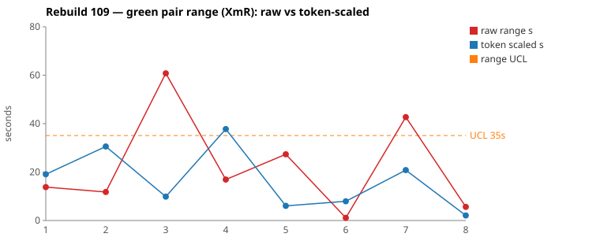
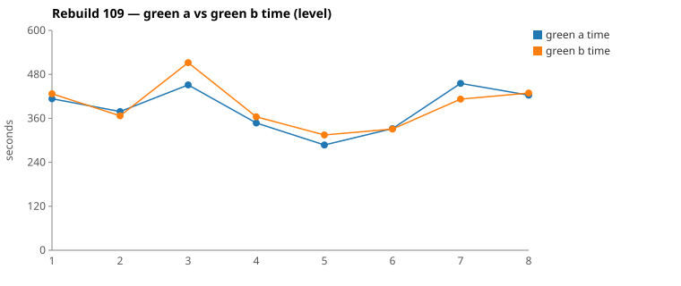

* TOC
{:toc}

---

# Context

This is a batch-level companion to [pbc-83][5], [pbc-84][4], [pbc-85][13], [pbc-86][15], [pbc-87][18], [pbc-88][19], [pbc-90][22], [pbc-92][26], [pbc-93][27], [pbc-94][29], [pbc-95][30], [pbc-96][32], [pbc-97][33], [pbc-98][34], [pbc-99][35], [pbc-100][36], [pbc-101][37], [pbc-102][39], [pbc-103][40], [pbc-104][41], and [pbc-108][42], using the same in-run pair methodology: since [issue #434][7] every Darmok scenario runs its green phase **twice** — worktree `_a` and `_b`, both branched from the *same red commit*, minutes apart — so the pair-range `|green_a − green_b|` from one metrics row nets out model-of-the-day, red commit, and server window, leaving **work** versus **per-token generation rate**. The charted quantity is the **Selected range** `min(raw, token-scaled)` fixed in [pbc-94][29].

**Rebuild109 is the run that closes the loop opened by [pbc-108][42].** That report ended with a falsifiable prediction rather than a conclusion: Rebuild108's widest pair — `This object step definition parameter set doesn't exist generation` — had blown out from 12 s (Rebuild107) to **106 s**, and the diagnosis was that the Test-Case could not observe half the code it exercised. The predicted result of fixing the *input* was that the scenario would return **inside ~23 s**, measured against the cross-run baseline rather than against the new run's own recomputed limits. It came back at **21 s** and **1 s** across the two scenarios it was split into, with the whole batch back at Rebuild107's level and **zero functional diffs**.

That makes this the first run in the series whose purpose was verification rather than discovery, and the two widest pairs are **both common cause** — the correct outcome for a batch whose inputs have just been repaired.

| Scenario | Commit | Green `_a` | Green `_b` | Raw range | Token-scaled range | Selected range | Verdict |
|---|---|---|---|---|---|---|---|
| This object step definition parameter set doesn't exist generation **create** | `1ac105f5` | 7:35 | **6:52** | 42,708 ms | 21 s | **21 s** (scaled) | **common cause** — no functional diff; identical 5-edit set across the same two files, 4–5 `mvn` cycles, no stall. `_a` grep-heavy (13 vs 8), `_b` read-heavy (139 KB vs 115 KB) — equally valid discovery styles at different rates. |
| This object step definition doesn't exist generation **replace** | `8c1a08c2` | **5:47** | 6:04 | 16,924 ms | 38 s | **17 s** (raw) | **common cause** — no functional diff; 3 edits each to the same file, read-bytes within 1 %. `_b` opened with two extra lookups the other skipped. The clock barely moved, so the 38 s token-scaled value is a phantom the `min` discards. |

(Bold = the winning half brought back and refactored.) The two rows sit on opposite branches of the `min`: Pair 1 is `scaled` (a 43 s clock riding on a NET work gap that scales to 21 s), Pair 2 is `raw` (a 17 s clock the token axis would have inflated to 38 s).

Over the eight deduped run-order rows the Selected column is `[14, 12, 10, 17, 6, 1, 21, 2]` s. **Nothing is excluded.** The limits are `range_mean` **10 s**, `range_MR_bar` **9 s**, `range_UCL` **35 s**. Pair 1's 21 s Selected is the run's maximum and **does not breach**.

*(Data note: picks came from the current pair-range sheet (gid `677692946`), whose eight rows agree with `.claude/scripts/rgr-review-charts.py 109` reading the local `metrics.csv` on seven of eight. The exception is `Test suite name should start with a capital letter generation`: the sheet carries the run's **first** attempt (`2fc715e8`, 481 s/496 s, raw 15 s) while the chart script's dedup rule — last non-zero pair per scenario — takes the **last** (`073c19e0`, 413 s/427 s, raw 14 s). The difference is 1 s and changes neither the top-2 pick nor the verdicts; the sheet's own `range mean` 11.6 / `MR bar` 8 / `UCL` 32.7 differ correspondingly from the script's 10 / 9 / 35, and the script's are used here.)*

---

# What changed between Rebuild108 and Rebuild109

Rebuild109 is not a repeat of Rebuild108 — the inputs were deliberately rebuilt in between, following [pbc-108][42]'s diagnosis. At a high level:

1. **Every quickfix scenario now states the complete proposal list.** Rebuild108's feature 9 told a half that the popup held exactly one proposal for a fixture that feature 6 asserted produced two. A half that trusted the Test-Case deleted the Replace loop and still passed. Both features now enumerate all proposals a fixture produces, on the `Given` popup and the `Then` popup alike.
2. **The `When` step names the proposal the user picked.** A `Proposal Id` column was added to every apply-quickfix `When` in features 8 and 9. Previously nothing chose: the applier looped the resolver's whole list and "selection" was an accident of type dispatch.
3. **The fake was rewritten to model the LSP round trip.** `IssueProposalApplier` now *selects* the named proposal, then applies it as one of exactly two operations mirroring the server's two `WorkspaceEdit` shapes — **textCreate** (an `IStepObject` value → generate the target stepdefs file) or **textEdit** (any other value → replace the selected element's text). An unmatched id, a missing id, or an element with no textEdit line is now a **failure** rather than a silently discarded proposal. Before the change, 271 proposals had been dropped silently across the accumulated log against 1126 applied — the entire Replace family.
4. **Scenarios were split along the create/replace seam.** `parameter set doesn't exist` and `step definition doesn't exist` each became a `create` and a `replace` scenario, and the text case moved into its own feature file (`9-1`). Rebuild109 therefore has eight pairs where Rebuild108 had five.
5. **A same-simple-name collision was removed from the fixtures.** The generated `nightlybatchjob.InputFileAsciidocFile` shared a simple name with `dailybatchjob.InputFileAsciidocFile`, which cost both timed-out halves of `This object doesn't exist` several cycles of Guice/import hunting. It was renamed `OutputFileAsciidocFile`.

Every one of those is an **input** change — Test-Case text, fixture data, or the test object that observes them. **No Darmok Java code and no Darmok prompt was touched.** That distinction is the whole of this run's result; see [What this run proves](#what-this-run-proves).

---

# Charts

Scenarios are numbered in run order; the tables below say which index each is. The Moving-Range chart plots **raw** (red) and **token-scaled** (blue) together so `Selected` — their lower envelope — is visible, with the UCL (off Selected, no exclusions this run) as the dashed orange line. The Green chart is the absolute level.





---

# The token-scaled pair-range (recap)

Wall-clock fuses **real work** (≈ green output tokens) with the **per-token generation rate** (server load, queue, context-prefill jitter — uncontrollable). The full token-scaled derivation is in [pbc-83][5]; [pbc-90][22] added the NET refinement (deduct Edit/Write/TodoWrite bookkeeping) and [pbc-94][29] fixed the selection rule:

- `raw` = `|a − b|`, the wall-clock gap.
- `net_x` = `raw_tokens_x − edit_x − write_x − todo_x`, stripping verbose TodoWrite re-emissions and whole-method Edit/Write payloads.
- `token-scaled` = `|net_a − net_b| × fast_time / fast_raw`, the gap implied by **work** tokens at the faster half's rate.
- **`Selected = min(raw, token-scaled)`.** Scaling only removes variation (rate, bookkeeping); a token-scaled value larger than the clock gap is a phantom, so we keep the clock.

Rebuild109 leans on the `min` in both directions within its top-2, and the second row is the cleaner demonstration: Pair 2's halves committed equivalent code and read within 1 % of the same bytes, so any range above the clock's 17 s is definitionally phantom — and the token axis proposed 38 s.

---

# Pair 1 — `1ac105f5` (parameter set doesn't exist generation *create*): same work, different rate

The run's **widest Selected** range (21 s, run index 7; raw 43 s). The mojo logged **`Green: No functional diff between pair`**, winner `_b` (the faster half).

| | `_a` c364d04a | `_b` 3fbfc58b |
|---|---|---|
| Green wall-clock | 7:35 | **6:52** |
| Green output tokens | 12,323 | 11,970 |
| **NET tokens** | 5,625 | 5,021 |
| Assistant turns | 70 | 76 |
| Read / Grep | 12 / 13 | 15 / 8 |
| Read tool-result bytes (input) | 114,673 | 139,044 |
| Writes / Edits | 0 / 5 | 0 / 5 |
| `mvn verify` cycles | 5 | 4 |

Output tokens differ **2.9 %** and NET **10.7 %** — both inside the 15 % threshold, so the halves did equivalent work. The raw range is 10.3 % of the faster half, i.e. the time axis differs while the token axis does not: CELL 2, the cell scaling exists for. No stall — every per-minute bucket is non-zero in both halves (`_a` 139/2250/1735/674/1658/1128/3321/774/644; `_b` 2209/1914/1644/1008/1957/2667/570/1), and `_b`'s trailing 1-token minute is the tail of its final turn, not a pause.

The divergence walk is short, and the halves converge on the same edit set:

```
identical through ~call 10 (ToolSearch→TodoWrite seed, four uml reads,
      grep "COMPILATION ERROR" / "Guice configuration errors", jacoco-shortlist,
      two Edit→mvn cycles on InputFileAsciidocFileImpl)
_a c364d04a (12 Read / 13 Grep, 5 Edit, 5 mvn): probes the builder API by name —
   grep "public static.*createStepParameters"
   grep "public static.*(createTable|createRow|createCell)\b"
   then 2 Edits to RowIssueResolver
_b 3fbfc58b (15 Read /  8 Grep, 5 Edit, 4 mvn): reads the builder instead —
   src/main/java/org/farhan/dsl/grammar/SheepDogBuilder.java (never opened by _a)
   plus the generated InputFileAsciidocFile interface; same 2 Edits to RowIssueResolver
```

Same destination by two routes: `_a` greps for the factory signatures, `_b` opens the file. That is the read-heavy-vs-grep-heavy split this series has classified as common cause since [pbc-83][5], and it shows up cleanly in the input-side bytes (139 KB vs 115 KB) while the output-token totals stay 3 % apart. **UML consultation was symmetric**: both read `uml-overview.md`, `uml-package.md`, `uml-interaction-main.md`, and `uml-interaction-test.md`; **neither opened a per-class `uml-class-*.md`**.

**Verdict: common cause.** 21 s Selected against a 35 s UCL, no functional diff, identical edit sets, one extra `mvn` cycle on the slower half. **No scenario-level fix; proposing one would be tampering.**

---

# Pair 2 — `8c1a08c2` (step definition doesn't exist generation *replace*): the clock says nothing happened

The run's **second-widest Selected** range (17 s, run index 4; raw 17 s — the `raw` branch, because token-scaled proposed 38 s). The mojo logged **`Green: No functional diff between pair`**, winner `_a`.

| | `_a` a9bebc12 | `_b` 1b8cfe95 |
|---|---|---|
| Green wall-clock | **5:47** | 6:04 |
| Green output tokens | 7,148 | 8,594 |
| **NET tokens** | 3,646 | 4,423 |
| Assistant turns | 67 | 65 |
| Read / Grep / Glob | 12 / 10 / 1 | 12 / 12 / 0 |
| Read tool-result bytes (input) | 127,821 | 128,684 |
| Writes / Edits | 0 / 3 | 0 / 3 |
| `mvn verify` cycles | 4 | 4 |

Raw tokens differ **16.8 %** and NET **17.6 %** — just outside threshold — while the raw time-range is **4.9 %** of the faster half. That is CELL 4, the false-alarm cell: the clock says there was no variation, so scaling manufactures a phantom (38 s on a 17 s pair). Read-result bytes are within **0.7 %** (127.8 KB vs 128.7 KB), the signature of two halves doing the same exploration. No stall in either half.

The walk finds one small asymmetry at the very start:

```
identical through ~call 2 (ToolSearch→TodoWrite seed, four uml reads,
      grep "COMPILATION ERROR" / "Guice configuration errors")
_a a9bebc12 (12 Read / 10 Grep / 1 Glob, 3 Edit, 4 mvn): straight to the Edit,
   later one targeted  grep "assertTestStepFullName"
_b 1b8cfe95 (12 Read / 12 Grep, 3 Edit, 4 mvn): two extra lookups first —
   grep "getTestStepContainerList1TestStepListNodeTestStepFullName"   (x2)
   Bash grep -oP '(?:public (?:String|void) )\K\w+'  <interface>       (method-name dump)
   later  grep "assertTestStep"
```

`_b` spent its extra ~800 NET tokens confirming the generated interface's method names before editing; `_a` went straight in and checked one assertion helper afterwards. Same three edits to the same file, same four `mvn` cycles, equivalent code committed. **UML consultation symmetric** — same four generic files, no per-class file in either half.

**Verdict: common cause.** This is the shape [pbc-94][29]'s `min` rule was written for: a 17 s clock gap with a 17.6 % NET token gap, where charting the token-scaled value would have put a phantom 38 s point near the limit for two halves that did the same work. **No fix.**

---

# Run-level events the top-2 pick does not cover

Two classes of event happened in Rebuild109 outside the range ranking, and both are informative because of *which* axis they landed on.

**Two timeouts, both on `This object doesn't exist generation`** (`2156efae` at 03:49, `711cae8f` at 09:06). In each, `_a` completed and `_b` was killed by `Green: B - Claude timed out after 500s, aborting`. Neither was a stall: both `_b` halves were generating at 3.7–4.8k tokens/min in their final minutes, and both were mid-work (one debugging the new fake's id matching, one mid-edit). The scenario had simply outgrown the per-invocation cap — it creates a whole new step-object file *and* must construct an exact proposal id, and `_a`'s winning invocations cleared 500 s by only 18 s and 28 s. The **absolute time** was the signal, not the pair range. After the fixture rename (`OutputFileAsciidocFile`) removed the Guice/import hunt, the scenario completed at 451 s/512 s with a 10 s Selected range.

**Two allowlist violations, both on the text scenario** (`411b6ab1` at 14:38, `53cb3b32` at 18:55). Both times `_a` edited `sheep-dog-grammar/src/test/java/org/farhan/fake/IssueProposalApplier.java`, was caught by the allowlist check, and reverted on resume. The cause was traced to the rewritten fake's own error message. In the red state `TextIssueResolver` returns a proposal whose value is an empty **String**, which routes to `textEdit`, whose cursor is an `IText` — an element the rewritten chain had no line for. The throw then read:

> *"…The real client always has an edit to apply, so this element type needs a line here."*

which is a direct instruction to edit the applier. Both `_a` halves followed it (`grep "interface IText"` → `grep "IText"` → Edit); `_b` ignored it, reasoned from the scenario's goal, implemented the resolver to return an `IStepObject`, and never reached `textEdit` at all. All four halves ended with the *identical* `TextIssueResolver`, so `_a`'s applier edits were dead work — ~4 minutes plus a ~1 minute resume, twice. This is a **design** signal, not a test signal: the diagnostic pointed at the wrong file.

---

# Batch synthesis

Read on its own, Rebuild109 is unremarkable: two common-cause pairs, nothing near the limit, no functional diffs. Read against [pbc-108][42], it is the measurement that report deliberately set up.

[pbc-108][42]'s central methodological complaint was that **per-run limits absorb a regression** — Rebuild108 computed a 155 s UCL from its own five rows and duly reported itself "in control" while every row had degraded. The remedy was to fix the baseline in advance and state the expected result before running. Against the cross-run tab (25 rows, mean 6.5 s, UCL 23 s) the prediction was that the repaired parameter-set scenario would land inside ~23 s. It landed at 21 s and 1 s.

The rest of the batch moved with it:

| Scenario | 107 Selected | 108 Selected | 109 Selected |
|---|---|---|---|
| Test suite name should start with a capital letter | 3 s | **93 s** | 14 s |
| Cell name should start with a capital letter | *(early abort)* | *(early abort)* | 12 s |
| This object doesn't exist | 17 s | 47 s | 10 s |
| This object step definition doesn't exist | 8 s | 31 s | 17 s replace / 6 s create |
| This object step definition parameter set doesn't exist | 12 s | **106 s** | 21 s create / 1 s replace |
| This object step definition text parameter doesn't exist | 15 s | 29 s | 2 s |
| **mean Selected** | **11 s** | **61 s** | **10 s** |

Rebuild108's 5.6× divergence excursion is gone, and the run sits at Rebuild107's level with three more scenarios in it. Both detectors are quiet: zero functional diffs run-wide, and no Selected range within 14 s of the UCL.

The two run-level events sharpen rather than complicate that picture, because they landed on the *other* axis. The timeouts were absolute-time excursions on a scenario that had genuinely grown; the allowlist violations were a diagnostic pointing developers at the wrong file. Neither is a pair-range signal, and neither would have been caught by the tester-facing chart — which is exactly the division the next section sets out.

---

# What this run proves

Rebuild109's result is best stated as three claims, in the order the evidence supports them.

**1. It is not the system.** Darmok's Java code and its prompts were not modified between Rebuild108 and Rebuild109. The model, the harness, the green/red/refactor loop, the allowlist, and the pair mechanism were all held constant, and the batch moved from a 61 s mean Selected range to 10 s. Whatever caused Rebuild108's excursion, it was not in the system — and the goal is to keep the system constant across every project that adopts it. A run whose inputs are sound is in statistical control on a harness nobody touched.

**2. It is the input — and there are two kinds of input, with two different humans in the loop.** Every change listed in [What changed](#what-changed-between-rebuild108-and-rebuild109) was to the Test-Case text, the fixture data, or the test object that observes them. The two signals this series tracks are not two views of one problem; they route to different people:

- **Tests — the tester is in the loop when the pair range is wide.** A wide pair range means two runs of the *identical* Test-Case diverged, which can only happen if the case admitted more than one conforming answer. The fix is to split or disambiguate the scenario. Rebuild108's 106 s parameter-set pair was this: the scenario bundled create and replace, and its `Then` could not observe the Replace loop at all. Splitting it and stating the full proposal list brought it to 21 s / 1 s. This is the **Moving Range** chart's job.
- **Design — the developer is in the loop when the absolute time is long or an allowlist violation fires.** Neither of those is an ambiguity signal. A long absolute time means the task itself grew past what one invocation can carry — Rebuild109's two timeouts were on the scenario that must create a whole new step-object file *and* derive an exact proposal id, with the winning half clearing the 500 s cap by 18 s. An allowlist violation means a half tried to change something it is not allowed to change, which points at the design: in this run, a fake whose error message named the wrong file to fix. This is the **Green** chart's job, plus the allowlist log.

**3. The distinction is measurable, not editorial.** The two axes moved independently in this very run. The pair range collapsed 6× while the absolute level stayed high enough on one scenario to blow the 500 s cap twice; and the allowlist fired on a scenario whose Selected range was 2 s — the second-narrowest in the batch. A process that read only the pair range would have declared Rebuild109 finished and missed both. That is the argument for keeping both charts and the allowlist log as separate instruments feeding separate roles, rather than collapsing them into one "health" number.

The cross-functionality picture is in the [combined pair-range sheet][sheet], which now carries the latest run for all three functionalities — **Validation**, **Quickfix**, and **Code Generation**. That tab is the right baseline for the next prediction, for the same reason [pbc-108][42] gave: limits computed from the run under review cannot detect a regression that moves every row together.

---

# The Fix, or Why No Fix

**Both reviewed pairs are common cause — no scenario-level fix.** Pair 1's halves committed identical edit sets by two discovery routes; Pair 2's halves read within 0.7 % of the same bytes and made the same three edits. Neither range breaches the 35 s UCL, and there are no functional diffs anywhere in the run. Acting on either would be [Wheeler][3]-tampering.

**The fixes this run was built to test have already been applied and are now verified**, so they need no forward action. For the record, what worked:

- **State the complete proposal list** in both the `Given` and `Then` popup tables, so a scenario can never imply a fixture produces fewer proposals than it does.
- **Name the selected proposal** in the apply-quickfix `When`, so the Test-Case says which code action the user accepted instead of leaving it to type dispatch.
- **Split along the create/replace seam**, so one scenario pins one rule.
- **Make the test object fail rather than discard.** The single highest-leverage change: `IssueProposalApplier` now throws on a missing id, an unmatched id, or an element with no textEdit line, where it previously logged a debug line and moved on — 271 silent drops across the accumulated log.
- **Remove same-simple-name collisions from fixtures.** Renaming `nightlybatchjob.InputFileAsciidocFile` to `OutputFileAsciidocFile` deleted an entire class of Guice/import hunting that both timed-out halves paid for.

**Two follow-ups are indicated, neither at the Test-Case level:**

1. **Reword the applier's textEdit throw.** The message tells the reader to add a branch to the fake, which is outside the allowlist. In the far more common red state — an unimplemented resolver returning a placeholder value — the correct target is the resolver. Cost of the current wording this run: two allowlist violations and roughly ten minutes of dead work.
2. **Re-size or re-scope the 500 s per-invocation cap for `This object doesn't exist`.** The winning halves cleared it by 18 s and 28 s on a slow-server day and the losing halves did not. This is the developer axis, and the honest options are to split the scenario or to accept that the cap is now mis-sized for the largest legitimate scenario.

**No harness, prompt, or model fix follows** — that is the point of the run.

---

# Functional Diffs Found

A `Green: Functional diff between pair` warn fires when the two green halves committed **behaviourally divergent** code that *both* pass the current test — so each warn names a **differentiating input the scenario does not pin**, the raw material for creating or tightening a Test-Case. This list is **run-wide** (every scenario, not just the reviewed top-2).

`.claude/scripts/rgr-review-functional-diffs.sh 109` returned **0** warns:

> **None this run — no pair committed behaviourally divergent code.**

That is the expected reading given what changed. The proposal-construction family had produced eleven warns across [pbc-101][37], [pbc-102][39], [pbc-103][40], and [pbc-104][41], every one of them about how a missing-X quickfix builds its proposal list. Rebuild109 is the first batch run after that family's scenarios were given complete proposal lists and an explicit selected proposal, and the warn count went to zero.

One caution carried forward from [pbc-108][42]: a clean scan is not proof on its own. The detector compares *committed* states, so a half that diverges and repairs before committing is invisible to it — and no detector can see a behaviour the test object silently discards. The second of those blind spots is the one this run closed, by making the applier throw instead of drop.

---

# Mapping to the Research

| Predicted ([pbc-research][2]) | Observed across Rebuild109 |
|---|---|
| Wide pair-range fires the signal | fired on `… parameter set … create` (43 s raw) and `… step definition … replace` (17 s raw) — the run's two widest Selected |
| A breach of the limit marks a special cause | **no breach** — max Selected 21 s against a 35 s UCL, and correctly so: both reviewed pairs proved common cause on inspection |
| The special cause is in the input, not the system | **confirmed by construction.** Only inputs changed between 108 and 109; mean Selected went 61 s → 10 s with the harness untouched |
| Both halves pass the same test | yes — all four reviewed halves passed verify, with equivalent code and no functional diff |
| Two work-trees differ | Pair 1: same edits, two discovery routes (grep-the-API vs read-the-file). Pair 2: same edits, one half front-loading two interface lookups |
| The functional-diff scan catches what the range misses | **nothing to catch this run** — 0 warns, the first zero since the family was repaired |

---

# Findings by Variable

*Each subsection records this run's findings about one [Wheeler variable][3].*

## green time pair range

Charted on `Selected = min(raw, token-scaled)` per [pbc-94][29]. Selected over the eight deduped rows was `[14, 12, 10, 17, 6, 1, 21, 2]`; with no exclusions the limits are mean **10 s**, MRbar **9 s**, **UCL 35 s**. The maximum (Pair 1, 21 s) sits well inside. The run's finding: **the input repair is verified against a pre-stated baseline.** Rebuild108's 106 s parameter-set pair returned at 21 s / 1 s, inside the ~23 s predicted from the cross-run tab — the first time this series has stated an expected value before a run and had it confirmed.

## green time pair range moving range

The MR chain over run order is `[2, 2, 7, 11, 5, 20, 19]` → MRbar **9 s**. The two large links (20 s, 19 s) straddle run index 7, Pair 1 — the up-then-down signature of a single wider-than-neighbours point in an in-control process, not a shift. No MR excursion.

## green time

Claude-only per [#568][23]. The absolute level is where this run's only real trouble lives. `This object doesn't exist generation` timed out twice at the 500 s per-invocation cap before the fixture rename, and its winning halves cleared the cap by 18 s and 28 s. That is a **developer-axis** excursion — the task grew — and it is invisible to the pair-range chart, which recorded the same scenario at a comfortable 10 s once it completed.

## scale & green tokens

The two reviewed pairs sit on opposite sides of the threshold and demonstrate the `min` in both directions. Pair 1: raw 2.9 % / NET 10.7 % (inside) with a 43 s clock → scaled to 21 s, the CELL 2 rate case. Pair 2: raw 16.8 % / NET 17.6 % (outside) with a 17 s clock → raw kept, the CELL 4 phantom case. Read-result bytes were the deciding evidence in both: 139 KB vs 115 KB in Pair 1 (a real style difference), 128.7 KB vs 127.8 KB in Pair 2 (the same exploration).

## functional diff between pair

**Zero warns run-wide** — the first zero since the proposal-construction family was identified, and the direct consequence of the input changes. Eleven warns across four prior runs all concerned how a quickfix builds its proposal list; stating the complete list and naming the selected proposal removed the interpretation space those warns lived in.

## allowlist violation (new variable this run)

Rebuild109 introduces a variable worth tracking separately: a half attempting to edit a file outside the allowlist. Two fired, both on the text scenario, both `_a`, both on the same file — and the scenario's Selected range was **2 s**, the second-narrowest in the batch. So this signal is **orthogonal to the pair range** and would have been missed entirely by a range-only review. The cause was a diagnostic message naming the wrong file to fix, which makes it a design signal routed to the developer, not an ambiguity routed to the tester.

## silent stall / timeout

**Two timeouts, zero stalls.** Both killed halves were generating at 3.7–4.8k tokens/min when the 500 s cap fired, so the per-minute bucket correctly classified them as productive-but-long rather than hung. In the four reviewed halves every bucket is non-zero; `_b` of Pair 1 ends on a 1-token minute that is the tail of its last turn, not a pause.

## green-window attribution

All four reviewed halves' surveys were clipped to each half's last green `end_turn` per the [#570][25] rule. Both winners (`3fbfc58b`, `a9bebc12`) show reads of `target/site/uml/*.main-report.md` in their unclipped path sets — the refactor phase working in the main checkout as designed, not a worktree escape. Confirming the winner's identity against the mojo's `winner=` line is what distinguishes the two.

---

# Open Questions From This Case

- **Should the cross-run tab become the standing baseline for every review?** This run's prediction only worked because the limits were fixed in advance from the [combined sheet][sheet] rather than recomputed from the run under review. Now that the tab carries Validation, Quickfix, and Code Generation together, should per-run limits be dropped from the report entirely in favour of a trailing-window UCL?
- **How should the developer axis be charted?** The pair-range chart has a UCL and a tampering gate; the absolute-time axis has neither, and this run's only genuine trouble (two timeouts) lived there. A `Green`-chart limit would have flagged `This object doesn't exist` before it hit the cap rather than after.
- **Should allowlist violations be a first-class metric?** Two fired this run on a scenario with a 2 s range. They are currently visible only by reading the mojo log, yet they are the cleanest available signal that a half was pointed at the wrong file — which is a design defect, not a spec ambiguity.
- **Does a diagnostic message deserve the same scrutiny as a spec?** The applier's throw text caused two allowlist violations and about ten minutes of dead work by instructing halves to edit a file outside the allowlist. Error messages in the test object are read by the model exactly as normative — arguably they are part of the input, and belong under the same review as the Test-Case text.

---

[2]: https://farhan5248.github.io/specificationbyprompt/architecture-and-capabilities/pbc-research
[3]: wheeler-understanding-variation
[4]: 84
[5]: 83
[7]: https://github.com/farhan5248/sheep-dog-main/issues/434
[13]: 85
[15]: 86
[18]: 87
[19]: 88
[22]: 90
[23]: https://github.com/farhan5248/sheep-dog-main/issues/568
[25]: https://github.com/farhan5248/sheep-dog-main/issues/570
[26]: 92
[27]: 93
[29]: 94
[30]: 95
[32]: 96
[33]: 97
[34]: 98
[35]: 99
[36]: 100
[37]: 101
[39]: 102
[40]: 103
[41]: 104
[42]: 108
[sheet]: https://docs.google.com/spreadsheets/d/1-TQxiPlFt1TJuXAnJbVmfJlK1rSClU4SwPWYXbLBixI/edit?gid=1562788699#gid=1562788699
