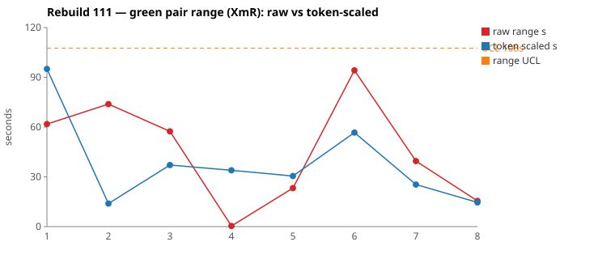
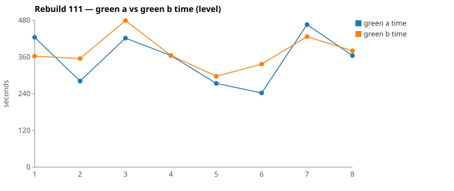

* TOC
{:toc}

---

# Context

This is a batch-level companion to [pbc-83][5] through [pbc-104][41], [pbc-108][42], and [pbc-109][43], using the same in-run pair methodology: since [issue #434][7] every Darmok scenario runs its green phase **twice** — worktree `_a` and `_b`, both branched from the *same red commit*, minutes apart — so the pair-range `|green_a − green_b|` from one metrics row nets out model-of-the-day, red commit, and server window, leaving **work** versus **per-token generation rate**. The charted quantity is the **Selected range** `min(raw, token-scaled)` fixed in [pbc-94][29].

**Rebuild111 re-ran Rebuild109's exact inputs and the pair-range widened anyway.** Between the two runs no pom, no feature file, and no Test-Case changed — `git diff Rebuild109 Rebuild111` over those paths is empty; the only differences are green-phase *output* (the code the halves wrote) and one script parameter (`maxClaudeSeconds` 500 → 720, restoring the committed value after Rebuild109's two kills). Yet mean Selected went **10 s → 29 s** on the same eight scenarios. [pbc-109][43] validated its input repair against a pre-stated baseline; Rebuild111 is the run that tests whether that gain was stable, and the answer is more precise than yes or no: **the level held, the profile held, the rates held — the convergence didn't.**

The two widest selected pairs are **both common cause** by the per-pair gate, and this run also logged **one functional diff** — off-pick again, on a scenario the range ranking put fifth of eight.

| Scenario | Commit | Green `_a` | Green `_b` | Raw range | Token-scaled range | Selected range | Verdict |
|---|---|---|---|---|---|---|---|
| Test suite name should start with a capital letter generation | `7f8f9a5d` | 7:04 | **6:02** | 61,808 ms | 95 s | **62 s** (raw) | **common cause** — no functional diff; same three files written, same 2 `mvn` cycles. `_a` read 18 files / 133 KB vs `_b`'s 13 / 95 KB, and spent its single largest turn (2,137 tokens) on `Grep "list quickfixes popup is set as follows"` — the phrase→impl binding hunt. |
| This object step definition parameter set doesn't exist generation replace | `e2bf2636` | **4:02** | 5:36 | 94,205 ms | 57 s | **57 s** (scaled) | **common cause** — no functional diff; both edited only `ProcessIssuesAsciidocFileImpl`. `_b` read features 8 *and* 9 (`_a` read neither), needed a third edit after its first verify, 2 extra `mvn`. |

(Bold = the winning half brought back and refactored.) Over the eight deduped run-order rows the Selected column is `[62, 14, 37, 0, 23, 57, 25, 15]` s. **Nothing is excluded.** The limits are `range_mean` **29 s**, `range_MR_bar` **30 s**, `range_UCL` **108 s**. Neither pair breaches — but six of the eight rows would breach **Rebuild109's** UCL of 35 s, which is the [pbc-108][42] per-run-limits problem appearing in its mildest form: a run can only be judged against a baseline it didn't compute for itself.

*(Data note: picks came from the current pair-range sheet (gid `254223453`), whose eight rows and Selected values agree with `.claude/scripts/rgr-review-charts.py 111` reading the local `metrics.csv`; the sheet's own limits (mean 31.2 / MRbar 33 / UCL 117.9) differ slightly from the script's (29 / 30 / 108) and the script's are used here. Several scenarios were re-run within the batch — the dedup rule takes the last non-zero pair per scenario, so e.g. `Test suite name` charts `7f8f9a5d` (62 s), not the earlier `113dc327` attempt (263 s raw).)*

---

# Charts

Scenarios are numbered in run order; the tables below say which index each is. The Moving-Range chart plots **raw** (red) and **token-scaled** (blue) together so `Selected` — their lower envelope — is visible, with the UCL (off Selected, no exclusions this run) as the dashed orange line. The Green chart is the absolute level.





---

# The token-scaled pair-range (recap)

Wall-clock fuses **real work** (≈ green output tokens) with the **per-token generation rate** (server load, queue, context-prefill jitter — uncontrollable). The full token-scaled derivation is in [pbc-83][5]; [pbc-90][22] added the NET refinement (deduct Edit/Write/TodoWrite bookkeeping) and [pbc-94][29] fixed the selection rule:

- `raw` = `|a − b|`, the wall-clock gap.
- `net_x` = `raw_tokens_x − edit_x − write_x − todo_x`, stripping verbose TodoWrite re-emissions and whole-method Edit/Write payloads.
- `token-scaled` = `|net_a − net_b| × fast_time / fast_raw`, the gap implied by **work** tokens at the faster half's rate.
- **`Selected = min(raw, token-scaled)`.** Scaling only removes variation (rate, bookkeeping); a token-scaled value larger than the clock gap is a phantom, so we keep the clock.

Pair 1 is the `raw` branch this run (95 s token-scaled on a 62 s clock — phantom discarded); Pair 2 is `scaled` (94 s clock riding a NET gap that scales to 57 s).

---

# Pair 1 — `7f8f9a5d` (Test suite name … generation): the 2,137-token phrase hunt

The run's **widest Selected** range (62 s, run index 1; raw 62 s). The mojo logged **`Green: No functional diff between pair`**, winner `_b`.

| | `_a` 0ff1826e | `_b` 52a8044a |
|---|---|---|
| Green wall-clock | 7:04 | **6:02** |
| Green output tokens | 12,163 | 9,895 |
| **NET tokens** | 6,190 | 3,597 |
| Read / Grep | 18 / 10 | 13 / 9 |
| Read tool-result bytes (input) | 132,728 | 95,327 |
| Writes / Edits | 1 / 5 | 1 / 4 |
| `mvn verify` cycles | 2 | 2 |

Raw tokens differ **18.6 %**, NET **41.9 %** — CELL 3, real work difference; no stall in either half (every per-minute bucket non-zero, the dips align with `mvn` calls). The walk:

```
identical through 12:26:2x (TodoWrite seed, four uml reads,
      grep "COMPILATION ERROR" / "Guice configuration errors")
_a 12:27:29  Grep "FAILURE|Failed|assert|error"            ← greps the log
_b 12:27:44  Bash tail -100 .../log.txt                    ← tails it instead
both 12:28:2x Grep "list quickfixes popup is set as follows"
_a 12:28:27  ← that grep is _a's single largest turn of the whole phase: 2,137 output tokens
             (max single turn; _b's Grep max is 249)
_a 12:29:02-26  Grep ApplyQuickfixActionImpl / ApplyQuickfix / "apply quickfix" / ApplyQuickfixAction
_b 12:28:39-01  the same hunt in four slightly different greps
both          Write ApplyQuickfixActionImpl + 3× Edit CucumberTestConfig + 2× mvn
_a  additionally reads TestSuiteIssueDetector.java, TestSuiteIssueTypes.java, ValidateActionImpl.java
```

Both halves ran the same hunt — *which class and method back this Gherkin phrase* — and `_a` paid more for it: three sibling source files and one 2.1k-token deliberation `_b` didn't need. **UML consultation symmetric**: both read the four prescribed files (`uml-overview`, `uml-package`, `uml-interaction-main`, `uml-interaction-test`); **neither opened `uml-communication.md` or any `uml-class-*.md`** — see [The routing gap](#the-routing-gap-uml-communicationmd).

**Verdict: common cause.** Same files written, same `mvn` cycles, `No functional diff`, both verifies passed first attempt. Also worth recording: both halves *read* `IssueProposalApplier.java` and neither edited it — no repeat of Rebuild109's allowlist violations, on the run where the applier's throw messages were reworded to point at the resolver.

---

# Pair 2 — `e2bf2636` (parameter set … replace): the canonical path and the detour

The run's **second-widest Selected** range (57 s, run index 6; raw 94 s). The mojo logged **`Green: No functional diff between pair`**, winner `_a`.

| | `_a` fa847cad | `_b` f2ea941b |
|---|---|---|
| Green wall-clock | **4:02** | 5:36 |
| Green output tokens | 6,589 | 8,306 |
| **NET tokens** | 2,894 | 4,434 |
| Read / Grep | 8 / 9 | 11 / 8 |
| Writes / Edits | 0 / 2 | 0 / 3 |
| `mvn verify` cycles | 3 | 4 |

Raw tokens differ **20.7 %**, NET **34.7 %** — CELL 3 again. No stall. The walk:

```
identical through 21:07:4x (seed, uml reads, two compile-fix Edit→mvn cycles
      on ProcessIssuesAsciidocFileImpl)
_a 21:08:48  Grep "Tests run:…|FAILED|AssertionError|assert" → final mvn 21:09:02 → done (4:02)
_b 21:09:16  the same grep — but its verify still shows UnsupportedOperationException
   21:09:20  Read feature 9  (and earlier feature 8 — _a read neither)
   21:09:45  third Edit
   21:09:59 + 21:10:30  two more mvn cycles → done (5:36)
```

**Verdict: common cause** — equivalent code, `No functional diff`, and the gap is one half needing a third pass to find which impl method still held a stub.

What elevates this pair is its **cross-run history**, which is the run's real finding — see the next section.

---

# The cross-run comparison: profile, level, and rate all held

Because Rebuild109, 110, and 111 ran the identical inputs, the three runs are repeated measurements of the same process. Three invariants and one variable:

**The profile held.** Normalizing each scenario's pair-sum by its run's mean, the valley-peak shape is stable to ±0.05 for most rows across all three runs — `Cell name` sits at 0.87–0.96, `This object doesn't exist` at 1.14–1.23, the sdef/pset-replace group at 0.71–1.04, `pset create` at 1.03–1.22. **Scenario difficulty is an intrinsic, reproducible property of the scenario** — direct evidence for the it-is-the-input claim, measured rather than asserted.

**The level held.** Run means (pair-sum): 845 s → 692 s → 733 s. Rebuild111 is *faster* than Rebuild109 in absolute terms. There is no developer-axis excursion this run.

**The rates held.** Per-half generation rates: 17.6–29 tok/s (109), 22–34.5 (110), 20.2–30 (111) — overlapping bands, with 110 the fastest. Infrastructure does not separate the runs.

**The convergence didn't.** Mean Selected: 10 s → ~30 s → 29 s. And the per-scenario detail explains why without any new mechanism. `parameter set … replace` across the three runs — raw ranges **1 s → 62 s → 94 s** on near-identical pair-sums (663/544/579 s):

- **109** (`f9568dba`, 1 s): the two halves' timelines are *step-for-step identical, nearly to the second* — same greps at 18:21:29/30, same three edits, same shortlist read. Both drew the canonical path.
- **110** (`6b113475`, 62 s): `_b` runs the canonical script; `_a` detours at 04:07:25 — `Grep "CellList2"` → `Grep "TestStepList1TableRowList1CellList2"`, then reads feature 9 — hunting which generated method backs the cellList/2 row.
- **111** (`e2bf2636`, 94 s): `_a` runs the fastest canonical pass of all six halves (4:02); `_b` detours — features 8 and 9, a third edit, two extra `mvn`.

Six halves, one scenario: every half either takes a **canonical path** (~240–330 s) or a **detour** into feature-file / method-inventory rediscovery (+60–95 s), and which one a half draws is a per-half coin flip. Rebuild109's 1 s was two canonical draws; 110 and 111 each drew one detour, on opposite halves. All six committed equivalent code. The same structure shows on `Cell name` (ranges 12/59/74) and its absence on `sdef replace` (0/3/0 — a scenario with no detour available).

So [pbc-109][43]'s 10 s mean was real but partly fortunate at the level of draws: the input repair genuinely removed ambiguity (the functional-diff family stayed quiet, the level stayed down), but the run also happened to draw canonical paths nearly everywhere. The pair-range's common-cause band, measured across three runs, is wider than any one run shows — and the detour is not noise with no address. Its content is the same every time.

---

# The routing gap: uml-communication.md

Every detour and the Pair 1 phrase-hunt reduce to one question: **which class and method back this Gherkin step?** Investigating why no half ever consults the per-class UML contracts answered it:

1. The green prompts prescribe a closed reading list — `uml-overview.md`, `uml-package.md`, `uml-interaction-main.md`, `uml-interaction-test.md`. Every reviewed half in three runs read exactly those four and stopped.
2. The sixteen `uml-class-*.md` contracts are referenced by nothing in that list. `uml-package.md` doesn't name them.
3. Their filenames are templated (`uml-class-TypeIssueDetector.md` for `TestSuiteIssueDetector`), so even a half that went looking by class name would miss.
4. **`site/uml/uml-communication.md` already answers the exact question the halves keep paying for** — it maps each action step's regex (`^The … apply quickfix action is performed as follows$`) to the full class table, *with hyperlinks to every `uml-class-*.md`*, plus the numbered call sequence down to the property writes. It is in the same directory as the four prescribed files, and nothing routes to it.

`_a`'s 2,137-token grep deliberation in Pair 1, the four-grep `ApplyQuickfix*` hunts in both halves, and both detour halves' feature-file reads are all manual reconstructions of that file's first table.

**The planned fix is to add `uml-communication.md` to the green prompts' reading list.** This is, deliberately, a *system* change — the first since this series began arguing the system stays constant — and the justification is recorded here so the record stays coherent with [pbc-109][43]: it is a **one-time routing correction**, not performance tuning. A spec file that exists, is authoritative, and is unreachable from the prescribed reading list is a defect in the map, not a parameter to tune. The prediction it must satisfy is the same shape as [pbc-108][42]'s: the detour mode should shrink or vanish — `parameter set … replace` and `Cell name` back inside the cross-run band — measured on the next batch against the [combined sheet][sheet], not against the new run's own limits.

---

# Batch synthesis

Rebuild111's two reviewed pairs are individually unremarkable — common cause, no breach, equivalent code. What the run contributes is the **three-run measurement** its held-constant inputs made possible:

1. **The stable part of the process is broader than expected**: profile, level, and rate all reproduce across three independent rebuilds. The system is in control and the scenarios have measurable, intrinsic difficulty.
2. **The variable part has a single address**: the pair-range widens exactly where a half can draw a rediscovery detour, the detour's content is always the phrase→method binding, and the file that answers it already exists and is unrouted.
3. **The two detectors again disagreed usefully**: the run's one functional diff sits on a 23 s mid-pack scenario the range pick ignored, while both wide pairs were behaviourally clean.

---

# The Fix, or Why No Fix

**Both reviewed pairs: common cause — no scenario-level fix.** Acting on either would be [Wheeler][3]-tampering.

**The functional diff is assignable and names two pins** (see the next section): proposal-list **order**, and the **no-match case** for the generate proposal. The second is pinnable today with a Test-Data row (a fixture where no existing step object matches, asserting the popup's content). The first runs into the known observability gap: the popup impl resolves proposals by id, so list *order* is invisible to the current assertion surface — the count/order column question open since [pbc-104][41].

**The routing correction** (previous section) is the run's principal action item: reference `uml-communication.md` from the green prompts' reading list, after verifying that file is accurate — it predates the [pbc-109][43] applier rewrite, so its Apply Quickfix sequence must be checked against the selected-proposal/textCreate/textEdit contract before being promoted into every half's context.

**No model fix, no cap change** — `maxClaudeSeconds` was restored to its committed 720 before this run and no invocation approached it.

---

# Functional Diffs Found

A `Green: Functional diff between pair` warn fires when the two green halves committed **behaviourally divergent** code that *both* pass the current test — so each warn names a **differentiating input the scenario does not pin**. This list is **run-wide**.

`.claude/scripts/rgr-review-functional-diffs.sh 111` returned **1** warn:

| # | Scenario (selected range, run index) | Commit | Differentiating input the Test-Case must pin |
|---|---|---|---|
| 1 | This object step definition doesn't exist generation **create** (23 s, idx 5) — *not a reviewed top-2* | `a07d39f5` | (a) The **order** of the proposal list when both replace and generate proposals exist; (b) a fixture where **no existing step object matches** — one rule returns an empty list, the other still offers a generate proposal. |

Verbatim warn text:

> Proposal list ordering is reversed (replace-then-generate vs generate-then-replace) and candidate B adds a generate proposal even when no existing step object matches, while candidate A returns empty

Both unpinned inputs are direct descendants of the [pbc-109][43] create/replace split: the split pinned *which* proposal applies, but never the list's order nor its empty case. This is the first functional diff since that repair, and it is on the repaired family — the ambiguity space shrank but did not close.

---

# Mapping to the Research

| Predicted ([pbc-research][2]) | Observed across Rebuild111 |
|---|---|
| Wide pair-range fires the signal | fired on `Test suite name` (62 s) and `pset … replace` (94 s raw) |
| A breach of the limit marks a special cause | no breach against this run's 108 s UCL; six of eight rows breach Rebuild109's 35 s — per-run limits again absorb a shift ([pbc-108][42]) |
| The special cause is in the input, not the system | **refined**: inputs identical to 109, yet ranges widened — the variable is a *discovery draw* whose content (phrase→method binding) is an input-side routing defect, now identified |
| Both halves pass the same test | yes, all four reviewed halves; the one divergent pair (`a07d39f5`) also passed both verifies — which is what makes it a functional diff |
| Two work-trees differ | reviewed pairs: equivalent code via canonical-vs-detour paths. `a07d39f5`: genuinely different rules (order + empty case) |
| The functional-diff scan catches what the range misses | **confirmed again** — the warn sits at 23 s, fifth of eight; both 50 s+ pairs were clean |

---

# Findings by Variable

*Each subsection records this run's findings about one [Wheeler variable][3].*

## green time pair range

Selected `[62, 14, 37, 0, 23, 57, 25, 15]`; mean **29 s**, MRbar **30 s**, UCL **108 s**, no exclusions, no breach. The finding: with inputs held constant across three runs, the pair-range's common-cause band is **wider than Rebuild109 showed** — its 10 s mean included favourable detour draws. Cross-run per-scenario ranges (`pset replace` 1/62/94, `Cell name` 12/59/74, `sdef replace` 0/3/0) are the honest distribution.

## green time pair range moving range

MR chain `[48, 23, 37, 23, 34, 32, 10]` → MRbar 30 s. No single dominant link — the elevation is spread across the run, consistent with a per-half draw mechanism rather than one disturbed scenario.

## green time

Claude-only per [#568][23]. Run means 845 → 692 → 733 s pair-sum: **no absolute-level excursion**; 111 is faster than 109. The normalized profile (valley-peak, ±0.05) reproduces across all three runs — scenario difficulty is intrinsic.

## scale & green tokens

Both reviewed pairs CELL 3 with NET gaps of 41.9 % / 34.7 % — and in both, the extra NET is fully accounted for by the detour content (three sibling files + a 2.1k-token grep turn; feature reads + a third edit). Per-half rates 20.2–30 tok/s sit inside the prior runs' band; no rate story.

## functional diff between pair

**One warn, off-pick** (23 s, idx 5) — the fourth consecutive demonstration that the behavioural scan and the range ranking are independent. First diff since the [pbc-109][43] repair, and on the repaired family: order and empty-case remain unpinned.

## allowlist violation

**None this run** — on the first batch after the applier's throw messages were reworded to say "fix the resolver, not this class." Both Pair 1 halves read the applier and neither edited it. One run is not proof, but the variable introduced in [pbc-109][43] is quiet.

## silent stall / timeout

**None.** No invocation approached the restored 720 s cap; every per-minute bucket in the four reviewed halves is non-zero or aligned with an `mvn` call.

## green-window attribution

All surveys clipped to each half's last green `end_turn` per the [#570][25] rule; winners' `main-report.md` reads are refactor turns in the main checkout, as designed.

---

# Open Questions From This Case

- **Is the detour draw eliminable, or only shrinkable?** The routing correction gives every half the phrase→class map up front. If the next batch still shows the two-mode structure on `pset replace` / `Cell name`, the residual detour is something else — and the canonical/detour split becomes a permanent feature of the common-cause band, arguing for limits computed across runs only.
- **How should list order become assertable?** The popup impl resolves by id, so the `a07d39f5` order divergence cannot be pinned by any Test-Data row today. The count/order column has now been indicated three times ([pbc-104][41], [pbc-108][42], here).
- **What does a "system change" record look like?** This series has held the harness constant through eleven case studies, and the routing correction is the first deliberate exception. The justification standard used here — a defect in the map, a pre-stated prediction, measurement against the [combined sheet][sheet] — is proposed as the template for any future one.

---

[2]: https://farhan5248.github.io/specificationbyprompt/architecture-and-capabilities/pbc-research
[3]: wheeler-understanding-variation
[5]: 83
[7]: https://github.com/farhan5248/sheep-dog-main/issues/434
[22]: 90
[23]: https://github.com/farhan5248/sheep-dog-main/issues/568
[25]: https://github.com/farhan5248/sheep-dog-main/issues/570
[29]: 94
[41]: 104
[42]: 108
[43]: 109
[sheet]: https://docs.google.com/spreadsheets/d/1-TQxiPlFt1TJuXAnJbVmfJlK1rSClU4SwPWYXbLBixI/edit?gid=1562788699#gid=1562788699
