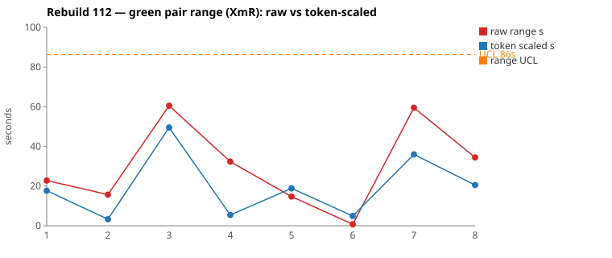
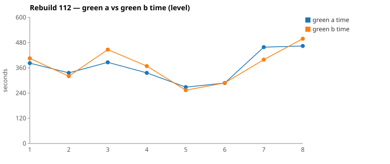

* TOC
{:toc}

---

# Context

This is a batch-level companion to [pbc-83][5] through [pbc-104][41], [pbc-108][42], [pbc-109][43], and [pbc-111][44], using the same in-run pair methodology: since [issue #434][7] every Darmok scenario runs its green phase **twice** — worktree `_a` and `_b`, both branched from the *same red commit*, minutes apart — so the pair-range `|green_a − green_b|` from one metrics row nets out model-of-the-day, red commit, and server window, leaving **work** versus **per-token generation rate**. The charted quantity is the **Selected range** `min(raw, token-scaled)` fixed in [pbc-94][29].

**Rebuild112 is the first run after the routing correction filed as [#614][614], and the correction was adopted completely.** [pbc-111][44] traced every widened pair across three runs to the same rediscovery: a half hunting for *which class and method back this step phrase*, a question `site/uml/uml-communication.md` already answers and which nothing routed to. The green prompts now name that file. Across Rebuild112's eight pairs, **16 of 16 halves read it** — against **0 of 22** across Rebuild109/110/111. The run mean Selected fell from 29 s to **19 s**, and the two widest pairs are **both common cause**.

| Scenario | Commit | Green `_a` | Green `_b` | Raw range | Token-scaled range | Selected range | Verdict |
|---|---|---|---|---|---|---|---|
| Step Object - Generate | `e989fff0` | **6:26** | 7:26 | 60,522 ms | 50 s | **50 s** (scaled) | **common cause** — no functional diff; same files edited, both verifies passed first attempt. `_b` confirmed more at each step (16 Grep vs 12, one extra `mvn`) — diffuse, no burst. |
| Step Parameters - Combination Generate | `43874a52` | 7:38 | **6:39** | 59,499 ms | 36 s | **36 s** (scaled) | **common cause** — no functional diff; raw output tokens **0.1 %** apart. `_b` grepped `CellList1` early and reached `RowIssueResolver` about a minute sooner. |

(Bold = the winning half brought back and refactored.) Over the eight deduped run-order rows the Selected column is `[18, 3, 50, 5, 15, 1, 36, 21]` s. **Nothing is excluded.** The limits are `range_mean` **19 s**, `range_MR_bar` **25 s**, `range_UCL` **86 s**. Neither pair breaches; the widest sits at 58 % of the limit.

*(Data note: picks came from the current pair-range sheet (gid `225882581`), whose eight rows and Selected values agree exactly with `.claude/scripts/rgr-review-charts.py 112` reading the local `metrics.csv` — the sheet's own limits (mean 18.2 / MRbar 27 / UCL 90.5) differ marginally from the script's (19 / 25 / 86) and the script's are used here. Six of the eight rows chart `scaled`, the highest proportion in the series.)*

---

# What changed since Rebuild111

Two things moved between the runs, and only the first was aimed at the pair-range:

1. **The green prompts now route to `uml-communication.md`** ([#614][614], cli `a5d3086`). Both `green-compile.md` and `green-verify.md` gained an Inputs bullet and a reading-list step naming the file and telling the half to consult it *instead of* grepping a step phrase or guessing a class name. `uml-communication.md` itself was corrected first (core `9b057d400`) — a full audit found every one of its seven sections carried at least one stale reference, including an Apply Quickfix section still describing the pre-[pbc-109][43] applier.
2. **The scenarios were renamed and the feature files restructured.** All ten feature files were renamed and edited (213 insertions, 279 deletions): `9 - Code Generation for Workspace Issues` became `3.2 - ApplyQuickfixAction for Workspace Issues`, and scenario names moved from sentence form (`This object doesn't exist generation`) to a `Subject - Action` form (`Step Object - Generate`). The mapping is 1:1 across all eight scenarios.

The second change is confounding in principle, and the report flags it rather than hiding it. In practice it is discounted on prior evidence: **file names and prose have not historically moved the pair-range in this series**. What has moved it, repeatedly, is what a half can and cannot *find* — [pbc-108][42]'s missing phrase→method edge, [pbc-111][44]'s canonical-vs-detour draw, and now this. The renames changed labels; the routing change altered what every half read. Attribution to the routing change is a judgement, stated as one.

---

# Charts

Scenarios are numbered in run order; the tables below say which index each is. The Moving-Range chart plots **raw** (red) and **token-scaled** (blue) together so `Selected` — their lower envelope — is visible, with the UCL (off Selected, no exclusions this run) as the dashed orange line. The Green chart is the absolute level.





---

# The token-scaled pair-range (recap)

Wall-clock fuses **real work** (≈ green output tokens) with the **per-token generation rate** (server load, queue, context-prefill jitter — uncontrollable). The full token-scaled derivation is in [pbc-83][5]; [pbc-90][22] added the NET refinement (deduct Edit/Write/TodoWrite bookkeeping) and [pbc-94][29] fixed the selection rule:

- `raw` = `|a − b|`, the wall-clock gap.
- `net_x` = `raw_tokens_x − edit_x − write_x − todo_x`, stripping verbose TodoWrite re-emissions and whole-method Edit/Write payloads.
- `token-scaled` = `|net_a − net_b| × fast_time / fast_raw`, the gap implied by **work** tokens at the faster half's rate.
- **`Selected = min(raw, token-scaled)`.** Scaling only removes variation (rate, bookkeeping); a token-scaled value larger than the clock gap is a phantom, so we keep the clock.

Six of eight rows chart `scaled` this run — the token axis consistently *below* the clock, meaning most of each clock gap was rate and bookkeeping rather than work. That is the shape of a batch where the halves are doing the same thing at slightly different speeds.

---

# Pair 1 — `e989fff0` (Step Object - Generate): the same destination, more confirmation

The run's **widest Selected** range (50 s, run index 3; raw 61 s). The mojo logged **`Green: No functional diff between pair`**, winner `_a`.

| | `_a` 773e9678 | `_b` 1ad324e2 |
|---|---|---|
| Green wall-clock | **6:26** | 7:26 |
| Green output tokens | 11,265 | 12,866 |
| **NET tokens** | 5,143 | 6,587 |
| Assistant turns | 80 | 81 |
| Read / Grep | 17 / 12 | 16 / 16 |
| Writes / Edits | 2 / 4 | 1 / 6 |
| `mvn verify` cycles | 4 | 4 |

Raw tokens differ **12.4 %** (inside threshold), NET **21.9 %** (outside) — CELL 3. No stall: every per-minute bucket is non-zero in both halves, and the quiet stretches precede `mvn` calls.

```
both  00:12:2x  Grep "COMPILATION ERROR" ; "Guice configuration errors" ; "No implementation for"
                 → Grep "OutputFileAsciidocFile" → Grep "CucumberTestConfig"
_a    00:12:59  Write OutputFileAsciidocFileImpl + 2× Edit CucumberTestConfig → mvn 00:13:20
_b    00:12:48  a second Grep "OutputFileAsciidocFile"     ← extra confirm
      00:13:03  Bash ls .../RGR_b/...                      ← extra confirm
      00:13:18  Write + 3× Edit CucumberTestConfig → mvn 00:13:46
both            second pass: fix the impl, 2× Edit TestStepIssueResolver, mvn
_a    00:16:33  Grep "public static IStepObject createStepObject"   ← one targeted probe
_b    00:16:30  Grep "apply |textCreate|correctStepObject"          ← three probes
      00:16:49  Grep "createStepObject"
      00:16:59  Grep "createStepDefinition"
```

`_b`'s NET surplus is diffuse rather than a burst — its largest Grep turn is 365 tokens against `_a`'s 265. **UML consultation symmetric and complete**: both halves read all five spec files including `uml-communication.md`. Neither opened a per-class `uml-class-*.md`, which is expected here — the work was Guice wiring and a resolver tweak, not building a class to contract.

One detail worth recording: `_b`'s probe at 00:16:30 greps for `textCreate` — vocabulary that exists **only** in the Apply Quickfix section rewritten under [#614][614]. The file was not merely opened; its contents were used.

**Verdict: common cause.** No scenario-level fix; acting on it would be [Wheeler][3]-tampering.

---

# Pair 2 — `43874a52` (Step Parameters - Combination Generate): identical work, different speed

The run's **second-widest Selected** range (36 s, run index 7; raw 59 s). The mojo logged **`Green: No functional diff between pair`**, winner `_b`.

| | `_a` 2eb9aa38 | `_b` 597fbcfb |
|---|---|---|
| Green wall-clock | 7:38 | **6:39** |
| Green output tokens | 13,176 | 13,164 |
| **NET tokens** | 6,283 | 5,096 |
| Assistant turns | 80 | 74 |
| Read / Grep | 18 / 13 | 14 / 12 |
| Edits | 6 | 5 |
| `mvn verify` cycles | 5 | 4 |

Raw output tokens differ by **0.1 %** — twelve tokens out of thirteen thousand, the closest pair in the series. NET differs 18.9 %. That is CELL 2: same work, different speed, the cell scaling exists for.

```
both  00:53:3x  Grep "COMPILATION ERROR" ; "Guice configuration errors"
                 → Edit InputFileAsciidocFileImpl → mvn → grep again
_b    00:54:44  Grep "CellList1"                    ← locates the generated method directly
      00:54:52  Edit → mvn 00:54:57                 (one compile cycle ahead of _a)
_a    00:55:04  Edit → mvn 00:55:10
both            read the failure, then edit RowIssueResolver
_b    00:57:24 + 00:57:42  2× Edit RowIssueResolver → 00:58:02 Edit impl → mvn 00:58:12
_a    00:58:24  Grep "public static .* createStepParameters|createTable|…"  ← probes the builder API
      00:58:40  Edit RowIssueResolver                                       (~1 min behind)
```

Both edited the same files (`InputFileAsciidocFileImpl`, `RowIssueResolver`) and committed equivalent code; `_b` simply got to `RowIssueResolver` about a minute sooner, having found the generated method by a direct `CellList1` grep where `_a` probed the builder API by signature. **UML consultation symmetric** — both read all five files including `uml-communication.md`.

**Verdict: common cause.** Twelve tokens of work difference across a 59 s clock gap is the definition of a rate cause. **No fix.**

---

# The routing correction: adoption and effect

**Adoption is total.** Checking every half of every pair for a read of `uml-communication.md`:

| run | halves reading `uml-communication.md` |
|---|---|
| Rebuild109 | 0 / 6 reviewed |
| Rebuild110 | 0 / 4 reviewed |
| Rebuild111 | 0 / 12 reviewed |
| **Rebuild112** | **16 / 16 — all eight pairs, both halves** |

That is what a prompt-level routing change should look like: not a nudge, a redirection. The halves read the four prescribed files before because they were prescribed, and read the fifth now for the same reason.

**Effect on the pair-range**, against the same eight scenarios (mapped 1:1 through the rename):

| Scenario (112 name) | 109 | 110 | 111 | 112 |
|---|---|---|---|---|
| Test Suite Name - Capitalize | 14 s | — | 62 s | 18 s |
| Test Step Table Cell - Capitalize | 12 s | — | 14 s | 3 s |
| Step Object - Generate | 10 s | — | 37 s | 50 s |
| Step Definition - Replace | 17 s | — | 0 s | 5 s |
| Step Definition - Generate | 6 s | — | 23 s | 15 s |
| Step Parameters - Combination Replace | 1 s | — | 57 s | 1 s |
| Step Parameters - Combination Generate | 21 s | — | 25 s | 36 s |
| Test Step Text - Generate Content | 2 s | — | 15 s | 21 s |
| **mean Selected** | **10 s** | **~30 s** | **29 s** | **19 s** |

The two scenarios [pbc-111][44] named as detour cases both collapsed: `Step Parameters - Combination Replace` 57 s → **1 s**, and `Test Suite Name - Capitalize` 62 s → **18 s**. That is the specific prediction #614 made, and it held on both.

The honest qualifications:

- **The run mean is 19 s, not 10 s.** Better than 111, not back to 109. One run does not establish a new level.
- **Two scenarios went the other way** (`Step Object - Generate` 37 → 50 s, `Step Parameters - Combination Generate` 25 → 36 s) — and they are this run's top-2. Both are common cause on inspection, but they are why the mean did not fall further.
- **The rename is a confound**, discounted on the prior-evidence argument above rather than eliminated.
- **The two-mode structure did not obviously persist.** No half in either reviewed pair lost a concentrated 60–95 s to a single rediscovery arc; both gaps were diffuse (extra confirmation, a slightly later route to the same file). That is a different shape from Rebuild110/111 and is the qualitative half of the result.

---

# Batch synthesis

Rebuild112 says three things together. The routing correction was **adopted universally and used**, not merely present. The **detour mode the correction targeted is absent from both reviewed pairs** — the remaining gaps are confirmation volume and route timing, not rediscovery. And the batch is **quiet on every axis**: no breach, no stall, no timeout, no allowlist violation, both verifies passing first attempt in all four reviewed halves.

The one functional diff is, on inspection, not a Test-Case defect at all — see below. That makes this the first run in the series with **no actionable input finding**, which is what a batch looks like when the inputs are in control and the map is correct.

---

# The Fix, or Why No Fix

**Both reviewed pairs are common cause — no scenario-level fix.** Pair 2's halves differ by twelve output tokens; Pair 1's differ by extra confirmation. Neither breaches the 86 s UCL. Acting on either would be [Wheeler][3]-tampering.

**The run's one functional diff needs no Test-Case either**, and the reasons are worth recording precisely because a mechanical reading would have produced two spurious fixes:

1. **The empty-value arm is unreachable.** [TestStepIssueDetector.java:70-83](https://github.com/farhan5248/sheep-dog-core/blob/main/sheep-dog-grammar/src/main/java/org/farhan/dsl/issues/TestStepIssueDetector.java) only assigns `TEST_STEP_STEP_DEFINITION_NAME_WORKSPACE` **inside** the loop that finds a matching `IStepObject`. With no matching step object the loop body never runs and the result stays empty, so the annotation carries the *step-object* message instead, which `ApplyQuickfixActionImpl` routes to `correctStepObjectNameWorkspace` — a different resolver, already covered by `Step Object - Generate`. The "no matching IStepObject" arm of `correctStepDefinitionNameWorkspace` is therefore **dead code**: the two halves wrote different dead code, and no input can reach it. A new Test-Case for "neither step object nor step definition exists" would not pin it. The reachable version of that state is already covered by `1.3 - ValidateAction for Workspace Issues`.
2. **Proposal order is not a behaviour we care about.** The second arm of the warn — generate-first vs replace-first — is reachable, but the ordering of the proposal list carries no requirement. It is not worth a Test-Object change (the popup resolves proposals by id, so order is invisible to the assertion surface today) nor a Test-Data row.

This also **corrects [pbc-111][44]**, which wrote the equivalent warn up as two unpinned inputs a Test-Case should pin. One arm is unreachable and the other is unimportant; neither was a spec gap.

The only latent code-level tidy is deleting or hardening the unreachable arm so two halves cannot differ there — main code, and not urgent, since nothing observable depends on it.

**No harness, prompt, or model fix follows.** The prompt change that motivated this run is already in ([#614][614]); nothing this run suggests another.

---

# Functional Diffs Found

A `Green: Functional diff between pair` warn fires when the two green halves committed **behaviourally divergent** code that *both* pass the current test — so each warn normally names a **differentiating input the scenario does not pin**. This list is **run-wide**.

`.claude/scripts/rgr-review-functional-diffs.sh 112` returned **1** warn:

| # | Scenario (selected range, run index) | Commit | Differentiating input — and why it needs no Test-Case |
|---|---|---|---|
| 1 | Step Definition - Generate (15 s, idx 5) — *not a reviewed top-2* | `c18654ef` | **(a)** the no-matching-`IStepObject` case: **unreachable** — the detector cannot raise this issue type without a matching step object, so the branch is dead code. **(b)** proposal order when a match exists: reachable but **unimportant** — ordering carries no requirement. |

Verbatim warn text:

> When no matching IStepObject exists, A returns a generate-proposal with empty value while B returns no proposals; additionally, when a match exists, proposal order differs (A: generate-first, B: replace-first)

This is the same warn Rebuild111 logged on the pre-rename equivalent scenario, and the diagnosis above supersedes the earlier write-up. It is also a useful negative result for the detector itself: **a functional diff is evidence of divergence, not proof of an ambiguity worth pinning.** Reachability and materiality both have to be checked before a warn becomes a Test-Case.

---

# Mapping to the Research

| Predicted ([pbc-research][2]) | Observed across Rebuild112 |
|---|---|
| Wide pair-range fires the signal | fired on `Step Object - Generate` (61 s raw) and `Step Parameters - Combination Generate` (59 s raw) |
| A breach of the limit marks a special cause | no breach — max Selected 50 s against an 86 s UCL, and both reviewed pairs proved common cause |
| The special cause is in the input, not the system | **refined again**: [pbc-111][44] localised the cause to a *routing* defect in the spec tree; correcting it moved the batch mean 29 → 19 s with the two named detour scenarios collapsing to 1 s and 18 s |
| Both halves pass the same test | yes — all four reviewed halves passed verify on the first attempt |
| Two work-trees differ | Pair 1: extra confirmation. Pair 2: **twelve output tokens** apart on 13k — the closest pair recorded |
| The functional-diff scan catches what the range misses | fired off-pick again (15 s, idx 5) — but this time the finding was **unreachable code plus an immaterial ordering**, the first warn in the series that survives to no action |

---

# Findings by Variable

*Each subsection records this run's findings about one [Wheeler variable][3].*

## green time pair range

Selected `[18, 3, 50, 5, 15, 1, 36, 21]`; mean **19 s**, MRbar **25 s**, **UCL 86 s**, no exclusions, no breach. The finding: **the routing correction reduced the batch mean from 29 s to 19 s and collapsed both scenarios [pbc-111][44] named as detour cases** (57 → 1 s, 62 → 18 s). Not back to Rebuild109's 10 s, and two scenarios rose — one run establishes a direction, not a level.

## green time pair range moving range

MR chain `[15, 47, 45, 10, 14, 35, 15]` → MRbar 25 s. The two largest links bracket run index 3 (Pair 1), the up-then-down signature of a single wider point rather than a shift.

## green time

Claude-only per [#568][23]. No absolute-level excursion; no invocation approached the 720 s cap restored before Rebuild111. All four reviewed halves ran 4–5 `mvn verify` cycles with both verifies passing first attempt.

## scale & green tokens

Six of eight rows chart `scaled` — the highest proportion recorded — meaning the token axis sat below the clock nearly everywhere, i.e. most of each gap was rate and bookkeeping rather than work. Pair 2 is the extreme case: **0.1 % raw-token difference across a 59 s clock gap**.

## functional diff between pair

**One warn, off-pick, and — for the first time — correctly resolved to no action.** One arm unreachable (the detector cannot produce the state), the other immaterial (proposal order is unspecified by design). The new variable this contributes is a *gate on the detector*: check reachability and materiality before converting a warn into a Test-Case.

## spec routing (new variable this run)

Introduced by [#614][614] and measured here for the first time: **whether every half reads the file that answers the phrase→class question**. Rebuild109/110/111: 0 of 22 reviewed halves. Rebuild112: **16 of 16**. Pair 1's `_b` grepped for `textCreate` — vocabulary that exists only in the section rewritten under #614 — confirming the file was used, not merely opened.

## allowlist violation

**None this run** — the second consecutive quiet batch since the applier's throw messages were reworded to name the resolver rather than the fake.

## silent stall / timeout

**None.** Every per-minute bucket in the four reviewed halves is non-zero; the quiet stretches align with `mvn` calls.

## green-window attribution

All four surveys clipped to each half's last green `end_turn` per the [#570][25] rule. Both commits' refactor phases logged `Refactor: No changes, skipping verify`.

---

# Open Questions From This Case

- **Does 19 s hold, or was some of it the rename?** The clean test is the next batch with specs held constant. If the mean stays near 19 s with no further input edits, the routing correction owns the improvement; if it drifts back toward 29 s, the rename was carrying more than this report credits it with.
- **Why did the two top-2 scenarios rise?** `Step Object - Generate` and `Step Parameters - Combination Generate` are the run's largest tasks and both moved *up* while the batch mean fell. If the routing fix removes rediscovery, what remains at 50 s and 36 s is confirmation volume — which may be irreducible, or may point at a second discovery gap the class-level contracts would close.
- **Should the functional-diff scan gate on reachability?** This run's warn cost a real investigation to dismiss. A warn on a branch no input can reach is a true observation about the code and a false alarm about the spec. Could the mojo — or the review — distinguish them automatically?
- **Do the per-class `uml-class-*.md` contracts need routing too?** No half has opened one in any reviewed pair across four runs. `uml-communication.md` now links to them, so the path exists; whether halves follow it is the next thing to measure.

---

[2]: https://farhan5248.github.io/specificationbyprompt/architecture-and-capabilities/pbc-research
[3]: wheeler-understanding-variation
[5]: 83
[7]: https://github.com/farhan5248/sheep-dog-main/issues/434
[22]: 90
[23]: https://github.com/farhan5248/sheep-dog-main/issues/568
[25]: https://github.com/farhan5248/sheep-dog-main/issues/570
[29]: 94
[41]: 104
[42]: 108
[43]: 109
[44]: 111
[614]: https://github.com/farhan5248/sheep-dog-main/issues/614
[sheet]: https://docs.google.com/spreadsheets/d/1-TQxiPlFt1TJuXAnJbVmfJlK1rSClU4SwPWYXbLBixI/edit?gid=1562788699#gid=1562788699
