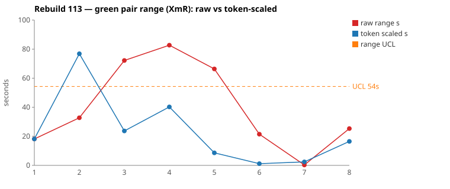
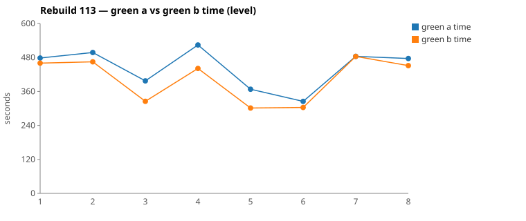

* TOC
{:toc}

---

# Context

This is a batch-level companion to [pbc-83][5] through [pbc-104][41], [pbc-108][42], [pbc-109][43], [pbc-111][44], and [pbc-112][45], using the same in-run pair methodology: since [issue #434][7] every Darmok scenario runs its green phase **twice** — worktree `_a` and `_b`, both branched from the *same red commit*, minutes apart — so the pair-range `|green_a − green_b|` from one metrics row nets out model-of-the-day, red commit, and server window, leaving **work** versus **per-token generation rate**. The charted quantity is the **Selected range** `min(raw, token-scaled)` fixed in [pbc-94][29].

**Rebuild113 is the quietest batch in the series.** The mean Selected range fell again — **29 s (111) → 19 s (112) → 10.4 s (113)** — putting it back at Rebuild109's level, and this time with the routing correction from [#614][614] already in place rather than newly landed. Both widest pairs are **common cause**. The run's three functional-diff warns are all the *same* unreachable-state pattern [pbc-112][45] first diagnosed, which makes this the second consecutive run with **no actionable input finding**.

| Scenario | Commit | Green `_a` | Green `_b` | Raw range | Token-scaled range | Selected range | Verdict |
|---|---|---|---|---|---|---|---|
| Test Step Table Cell - Capitalize | `c1a1461a` | 6:37 | **5:25** | 72,207 ms | 24 s | **24 s** (scaled) | **common cause** — no functional diff; identical file, identical 4 `mvn` cycles. `_a` spawned a subagent where `_b` edited directly, and never recovered the 30 s. |
| Step Object - Correct | `b4c47f6f` | **6:35** | 6:53 | 18,243 ms | 42 s | **18 s** (raw) | **common cause** — no functional diff; step-for-step identical timelines, `_b` trailing 10–20 s throughout with one extra resolver Edit. The token-scaled value exceeds the clock gap, so `min` discards it. |

(Bold = the winning half brought back and refactored.) Over the eight run-order rows the Selected column is `[8, 24, 18, 7, 9, 1, 0, 16]` s. **Nothing is excluded.** The limits are `range_mean` **10.3 s**, `range_MR_bar` **9 s**, `range_UCL` **33.1 s**. Neither pair breaches; the widest sits at 73 % of the limit, and six of the eight rows are under 20 s.

*(Data note: picks came from the current pair-range sheet (gid `716817387`). This run's `metrics.csv` cannot be used unaided — several scenarios were re-run, and under the labelling defect filed as [#616][616] a metrics row's `commit` column carries whatever HEAD was rather than the row's own commit, so four consecutive rows can share one hash and a row's `scenario` can name a different scenario than the one measured. The sheet's per-row `A ms`/`B ms` were matched back to `metrics.csv` by value to recover each commit. `.claude/scripts/rgr-review-charts.py 113` reads `metrics.csv` directly and its dedup prefers the **last** row per scenario, so for two scenarios it charts the re-run rather than the sheet's row — `Test Suite Name - Capitalize` 33 s against the sheet's 8 s, and `Step Object - Create/Generate` 40 s against 7 s. The tables in this report use the sheet throughout; the SVGs carry the script's values.)*

---

# Charts

Scenarios are numbered in run order; the tables below say which index each is. The Moving-Range chart plots **raw** (red) and **token-scaled** (blue) together so `Selected` — their lower envelope — is visible, with the UCL (off Selected, no exclusions this run) as the dashed orange line. The Green chart is the absolute level.





---

# The token-scaled pair-range (recap)

Wall-clock fuses **real work** (≈ green output tokens) with the **per-token generation rate** (server load, queue, context-prefill jitter — uncontrollable). The full token-scaled derivation is in [pbc-83][5]; [pbc-90][22] added the NET refinement (deduct Edit/Write/TodoWrite bookkeeping) and [pbc-94][29] fixed the selection rule:

- `raw` = `|a − b|`, the wall-clock gap.
- `net_x` = `raw_tokens_x − edit_x − write_x − todo_x`, stripping verbose TodoWrite re-emissions and whole-method Edit/Write payloads.
- `token-scaled` = `|net_a − net_b| × fast_time / fast_raw`, the gap implied by **work** tokens at the faster half's rate.
- **`Selected = min(raw, token-scaled)`.** Scaling only removes variation (rate, bookkeeping); a token-scaled value larger than the clock gap is a phantom, so we keep the clock.

Pair 2 is this run's clean illustration of the phantom case: an 18 s clock gap against a 42 s token-scaled value. The clocks barely moved, so the larger token figure is arithmetic, not variation — `min` keeps 18 s and the row charts `raw`.

---

# Pair 1 — `c1a1461a` (Test Step Table Cell - Capitalize): a subagent detour

The run's **widest Selected** range (24 s, run index 2; raw 72 s). The mojo logged **`Green: No functional diff between pair`**, winner `_b`.

| | `_a` e0f5368a | `_b` dc29e174 |
|---|---|---|
| Green wall-clock | 6:37 | **5:25** |
| Green output tokens | 8,471 | 9,387 |
| **NET tokens** | 4,215 | 3,531 |
| Read / Grep | 11 / 10 | 11 / 10 |
| TodoWrite / Edit | 11 / 3 | 12 / 3 |
| `mvn verify` cycles | 4 | 4 |
| Subagents spawned | **1** | 0 |

Raw tokens differ **9.8 %** (inside threshold), NET **16.2 %** (outside) — CELL 3. No stall: every per-minute bucket is non-zero in both halves (`_a` 1470→441, `_b` 1404→564), and the quiet stretches align with `mvn`.

```
both  1:04-1:12  Grep "COMPILATION ERROR" ; "Guice configuration errors"
                  → Edit ProcessIssuesAsciidocFileImpl → mvn
both  2:02-2:21  Grep the same two patterns → Grep "CellList1Node"
_b    2:21       Edit ProcessIssuesAsciidocFileImpl  → mvn 2:25     ← acts on the grep
_a    2:30       Agent "Find missing interface methods"             ← delegates instead
      2:55       Edit ProcessIssuesAsciidocFileImpl  → mvn 3:00     (~35 s behind)
both             third pass: grep the failure, one more Edit, mvn, confirm BUILD SUCCESS
_b    4:14 Edit → 4:26 mvn → 4:52 Grep "BUILD SUCCESS|BUILD FAILURE" → 5:03 mvn
_a    4:54 Edit → 5:09 mvn → 5:45 Grep "BUILD SUCCESS|Tests run:"   → 5:59 mvn
```

Both halves edited **exactly the same single file**, ran **exactly four** `mvn` cycles, and committed equivalent code. The entire divergence is one decision at 2:21: `_b` used the `CellList1Node` grep result directly, `_a` spawned a subagent to answer the same question. `_a` never closed the gap — every subsequent milestone lands 30–35 s later than `_b`'s.

**UML consultation symmetric and complete**: both read all five spec files including `uml-communication.md`, so the [#614][614] routing continues to hold a run after it landed. Neither opened a per-class `uml-class-*.md` — still true of every reviewed pair in the series.

**Verdict: common cause.** A subagent call is an equally valid discovery style, not a test-case defect; the scenario pinned both halves to the same file, the same edit, and the same outcome. No scenario-level fix.

---

# Pair 2 — `b4c47f6f` (Step Object - Correct): the same route, 15 seconds apart

The run's **second-widest Selected** range (18 s, run index 3; raw 18 s — this row charts `raw`). The mojo logged **`Green: No functional diff between pair`**, winner `_a`.

| | `_a` d21979e0 | `_b` f874d4d7 |
|---|---|---|
| Green wall-clock | **6:35** | 6:53 |
| Green output tokens | 11,907 | 10,522 |
| **NET tokens** | 6,828 | 5,559 |
| Read / Grep | 16 / 15 | 15 / 14 |
| Edits / Globs | 4 / 1 | 5 / 1 |
| `mvn verify` cycles | 5 | 5 |

Raw tokens differ **11.6 %**, NET **18.6 %**, but the clock gap is **4.6 %** of the faster half — CELL 4, the false-alarm cell. The token-scaled value (42 s) is larger than the clock gap (18 s), so it is a phantom and `Selected` keeps the clock. No stall in either half.

```
_a 1:00  Grep "COMPILATION ERROR" ; "Guice configuration errors"     _b 1:14  (same two)
_a 1:28  Edit ProcessIssuesAsciidocFileImpl → mvn 1:32               _b 1:42  Edit → mvn 1:47
_a 1:56  Grep "ProcessIssuesAsciidocFile\.java"                      _b 2:12  (same)
_a 2:00  Glob "**/src-gen/**/ProcessIssuesAsciidocFile.java"         _b 2:16  Glob "**/ProcessIssuesAsciidocFile.java"
_a 2:15  Edit → mvn 2:19                                             _b 2:35  Edit → mvn 2:40
_a 3:43  Grep "assertTestStepFullName"                               _b 4:13  Grep "assertTestStep"
_a 3:50  Edit → mvn 4:00                                             _b 4:21  Edit → mvn 4:32
_a 5:17  Grep "SheepDogStepObjectRef"                                _b 5:31  Grep "class SheepDogStepObjectRef"
_a 5:25  Edit TestStepIssueResolver → mvn 5:29                       _b 5:41 + 5:46  2× Edit → mvn 5:52
```

This is the closest structural match in the series: nine paired steps, same order, same files, same five `mvn` cycles, the two Globs and the two `SheepDogStepObjectRef` greps differing only in how tightly they were worded. `_b` starts 14 s behind on the very first grep and stays 10–20 s behind for the rest of the run, plus one extra resolver Edit at 5:46 where `_a` needed one. There is no decision point to name.

**UML consultation symmetric** — both read all five files including `uml-communication.md`.

**Verdict: common cause.** An 18 s gap on a 6.5-minute task, with matching tool actions throughout, is rate jitter. **No fix.**

---

# Batch synthesis

Rebuild113 says the same thing twice over. Both widest pairs edited the *same files* as their partner, ran the *same number* of `mvn` cycles, and produced *equivalent code*; the gaps are one delegation decision (Pair 1) and a uniform 10–20 s lag (Pair 2). Neither is a property of the scenario.

The batch-level numbers agree: mean Selected **10.4 s** against 19 s in Rebuild112 and 29 s in Rebuild111, with the widest row at 73 % of a 33 s limit and three rows at 1 s or less. This is the second consecutive run whose functional-diff warns resolve to no action, and the first run in the series where the *reviewed* pairs contained no discovery asymmetry at all — not even the confirmation-volume difference Rebuild112's pairs showed.

---

# The run owner's read

Recorded verbatim from the run owner, because it frames what the numbers are being used for:

> I think this is a good enough run. If you look at [the sheet][sheet], the complexity of the code is going up with each test case, and so is the time to implement it. The good thing is that the pair range stays reasonably low.
>
> I assume there will be changes to darmok (the harness/system) but it'll be rare.

The data supports both halves of that. **Level is rising**: mean green time across the run's eight pairs climbs from ~334 s for the first scenario to ~484 s and ~464 s for the last two, and the two largest tasks are the two most recently added Test-Cases. **Dispersion is not**: the Selected range over the same eight rows is `[8, 24, 18, 7, 9, 1, 0, 16]` — no trend, mean 10.4 s, nothing near the limit. That is exactly the separation the two charts are built to show: the **Green** chart (developer signal) is drifting up as the feature grows, while the **Moving Range** chart (tester signal) stays flat and inside its limits.

A rising absolute level with a stable pair-range is the healthy shape. It says the work is getting bigger — more code, more coupling, more to hold in one scenario — but the *specification* is still pinning both halves to one answer. The moment to worry is not when green time rises; it is when the range rises with it.

On the second point, this run is consistent with harness changes being rare: the last one was [#614][614] before Rebuild112, and nothing in Rebuild113 argues for another. Both reviewed verdicts are common cause, and all three functional diffs are code-level artefacts rather than harness or spec defects.

---

# The Fix, or Why No Fix

**Both reviewed pairs are common cause — no scenario-level fix.** Pair 1's halves edited one identical file in four identical `mvn` cycles; Pair 2's tracked each other step for step. Neither breaches the 33 s UCL. Acting on either would be [Wheeler][3]-tampering.

**None of the three functional diffs needs a Test-Case either**, and all three are the *same* pattern [pbc-112][45] identified — divergence inside a branch no input can reach:

1. **Warns 1 and 2 are literally the same arm.** Both fire on "no matching `IStepObject`" inside `correctStepDefinitionNameWorkspace` / the combination-parameters path. [pbc-112][45] established that `TestStepIssueDetector` only assigns `TEST_STEP_STEP_DEFINITION_NAME_WORKSPACE` **inside** the loop that finds a matching step object, so with no match the annotation carries the *step-object* message instead and a different resolver runs. The arm is dead code; two halves wrote different dead code.
2. **Warn 3 is the same shape in the text path.** `TextIssueDetector.validateNameWorkspace` only produces a message inside `if (theStepDefinition != null)`, and the quickfix service only calls `TextIssueResolver.correctNameWorkspace` on a `TEXT_NAME_WORKSPACE` diagnostic. So "step object exists but has no matching step definition" cannot reach the resolver — the detector and the resolver are mirrored on the same guard. A creates a proposal there, B returns empty, and neither is observable.
3. **The re-run confirms it.** `Test Step Text - Create Content` was run twice from the identical red parent `6ee8eca8`. The first attempt (`e95d2f31`) logged the warn; the re-run (`ba1d3896`, the row the sheet carries) logged `No functional diff` and a tighter pair (7:56/7:31 against 9:24/7:25). Whether a half writes the defensive branch at all is a coin flip on code nothing specifies.

The only latent tidy is the same one Rebuild112 named: delete or harden the unreachable arms so two halves cannot differ there. Main code, not urgent.

**No harness, prompt, or model fix follows.** The one process defect this run surfaced is in the *measurement*, not the system under test: [#616][616], filed from this review, covers the metrics/commit labelling defect described in the Context data note.

---

# Functional Diffs Found

A `Green: Functional diff between pair` warn fires when the two green halves committed **behaviourally divergent** code that *both* pass the current test — so each warn normally names a **differentiating input the scenario does not pin**. This list is **run-wide**.

`.claude/scripts/rgr-review-functional-diffs.sh 113` returned **3** warns. **None is on a reviewed top-2 pair**, which is the usual case and the reason the scan is run-wide.

| # | Scenario (selected range, run index) | Commit | Differentiating input — and why it needs no Test-Case |
|---|---|---|---|
| 1 | Step Definition - Create (9 s, idx 5) — *not a reviewed top-2* | `dcb66475` | A test step whose step object does not exist. **Unreachable** — the detector cannot raise the step-definition issue without a matching `IStepObject`, so the branch is dead. |
| 2 | Step Parameters - Combination Create (0 s, idx 7) — *not a reviewed top-2* | `6ee8eca8` | Same input, same arm as #1, reached through the combination-parameters path. **Unreachable** for the same reason. |
| 3 | Test Step Text - Create Content (16 s, idx 8) — *not a reviewed top-2* | `e95d2f31` | A text step whose step object exists but has no step definition matching the step's name. **Unreachable** — `TextIssueDetector` guards on `theStepDefinition != null`, so `TEXT_NAME_WORKSPACE` never fires in that state. |

Verbatim warn text:

> **1.** When no IStepObject matches the step's fullName, A returns no generate proposal while B always returns a generate proposal with empty-string value

> **2.** When no matching IStepObject exists, Candidate A adds a "Generate" proposal with empty-string value while Candidate B adds no proposal; differentiating input is a test step referencing a non-existent step object.

> **3.** When the matched step object exists but lacks a step definition matching the test step's name, A creates a proposal with a new SD while B returns an empty list

Three warns, one root cause: the detector guards a state, the resolver guards it again, and the halves disagree about what to do in the impossible middle. **A functional diff is evidence of divergence, not proof of an ambiguity worth pinning** — the reachability gate [pbc-112][45] proposed has now paid for itself three times in one run.

---

# Mapping to the Research

| Predicted ([pbc-research][2]) | Observed across Rebuild113 |
|---|---|
| Wide pair-range fires the signal | fired on `Test Step Table Cell - Capitalize` (72 s raw) and `Step Definition - Create` (66 s raw) |
| A breach of the limit marks a special cause | no breach — max Selected 24 s against a 33 s UCL, and both reviewed pairs proved common cause |
| The special cause is in the input, not the system | **no special cause to site this run**; the batch mean fell 19 → 10.4 s with the [#614][614] routing already in place, i.e. the correction held rather than decayed |
| Both halves pass the same test | yes — all four reviewed halves passed verify on the first attempt |
| Two work-trees differ | Pair 1: one half delegated to a subagent. Pair 2: a uniform 10–20 s lag with **nine paired steps in the same order** |
| The functional-diff scan catches what the range misses | fired off-pick three times — and all three resolved to unreachable branches, the pattern first named in [pbc-112][45] |

---

# Findings by Variable

*Each subsection records this run's findings about one [Wheeler variable][3].*

## green time pair range

Selected `[8, 24, 18, 7, 9, 1, 0, 16]`; mean **10.4 s**, MRbar **9 s**, **UCL 33.1 s**, no exclusions, no breach. The finding: **the batch mean fell for the second consecutive run, 29 → 19 → 10.4 s**, matching Rebuild109's level with the routing correction now a run old. Three rows are at 1 s or below.

## green time pair range moving range

MR chain `[16, 6, 11, 2, 8, 1, 16]` → MRbar 9 s. The two 16 s links sit at the ends rather than around one point — no shift signature, just a batch with small, evenly-distributed variation.

## green time

Claude-only per [#568][23]. **The absolute level is rising with feature complexity** — per-scenario green means run ~334 s, 361 s, 405 s, 436 s, 335 s, 314 s, 484 s, 464 s, with the two largest on the two most recently added Test-Cases. No excursion, no invocation near the 720 s cap, all four reviewed halves at 4–5 `mvn` cycles with verify passing first attempt. This is the developer signal moving while the tester signal stays flat, and it is the expected shape.

## scale & green tokens

Five of eight rows chart `scaled`. Pair 2 is the run's phantom case: token-scaled 42 s against an 18 s clock gap, discarded by `min` exactly as [pbc-94][29] intends.

## functional diff between pair

**Three warns, all off-pick, all unreachable, all no action.** Two are the identical `no matching IStepObject` arm; the third is its text-path analogue. The reachability gate is no longer a one-off refinement — it is the standing rule for reading this detector.

## re-run behaviour (new variable this run)

`Test Step Text - Create Content` ran twice from the same red parent. Attempt one logged a functional diff and a 1:59 raw range; the re-run logged none and a 0:25 range. **Whether a defensive, unreachable branch gets written at all varies run to run** — which is another way of saying the warn on such a branch is common-cause noise, not a spec signal.

## metrics attribution (new variable this run)

Filed as [#616][616]. A metrics row's `commit` carries HEAD rather than the row's own commit (four consecutive rows shared one hash twice this run), the `scenario` label can name a different scenario than the one measured, and one row wrote a full green pair with all eight token columns zero. Recovering this run's commits required matching the sheet's `A ms`/`B ms` back into `metrics.csv` by value.

## allowlist violation

**None this run** — the third consecutive quiet batch.

## silent stall / timeout

**None.** Every per-minute bucket in the four reviewed halves is non-zero; the quiet stretches align with `mvn` calls.

## green-window attribution

All four surveys clipped to each half's green duration from the metrics row per the [#570][25] rule.

---

# Open Questions From This Case

- **Is 10.4 s the new level, or the bottom of a cycle?** Two consecutive falls (29 → 19 → 10.4 s) with the spec tree stable is the strongest evidence yet that the routing correction owns the improvement. A third run at or near 10 s would settle it.
- **Does the rising green level eventually drag the range with it?** The run owner's observation is that complexity and implementation time are both climbing while the range holds. Larger scenarios mean more places for two halves to diverge, so the interesting threshold is the scenario size at which that stops being true — if it exists.
- **Should the mojo gate the functional-diff detector on reachability?** Three warns this run, three dismissals, one root cause. The check is mechanical — does any input reach the branch — and it would have saved three investigations in this batch alone.
- **Should the unreachable arms simply be deleted?** They are dead code in main that exists only to be written differently by two halves. Removing them would silence this warn class at the source rather than at the review.
- **Do the per-class `uml-class-*.md` contracts need routing too?** Still no half has opened one, now across five runs.

---

[2]: https://farhan5248.github.io/specificationbyprompt/architecture-and-capabilities/pbc-research
[3]: wheeler-understanding-variation
[5]: 83
[7]: https://github.com/farhan5248/sheep-dog-main/issues/434
[22]: 90
[23]: https://github.com/farhan5248/sheep-dog-main/issues/568
[25]: https://github.com/farhan5248/sheep-dog-main/issues/570
[29]: 94
[41]: 104
[42]: 108
[43]: 109
[44]: 111
[45]: 112
[614]: https://github.com/farhan5248/sheep-dog-main/issues/614
[616]: https://github.com/farhan5248/sheep-dog-main/issues/616
[sheet]: https://docs.google.com/spreadsheets/d/1-TQxiPlFt1TJuXAnJbVmfJlK1rSClU4SwPWYXbLBixI/edit?gid=1562788699#gid=1562788699
