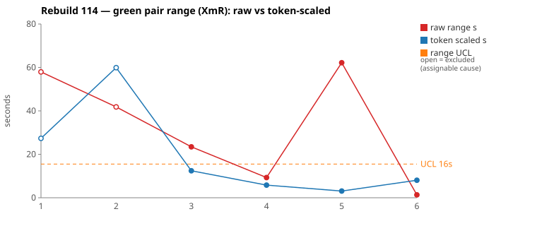
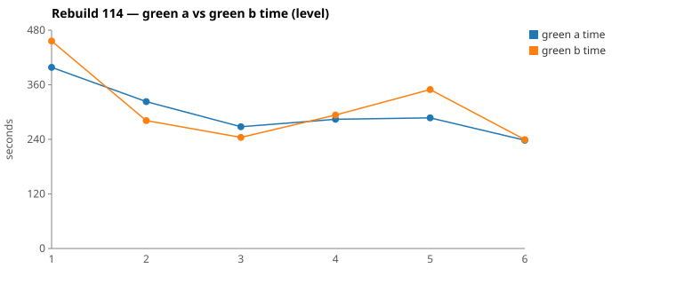

* TOC
{:toc}

---

# Context

This is a batch-level companion to [pbc-83][5] through [pbc-104][41], [pbc-108][42], [pbc-109][43], [pbc-111][44], [pbc-112][45], and [pbc-113][46], using the same in-run pair methodology: since [issue #434][7] every Darmok scenario runs its green phase **twice** — worktree `_a` and `_b`, both branched from the *same red commit*, minutes apart — so the pair-range `|green_a − green_b|` from one metrics row nets out model-of-the-day, red commit, and server window, leaving **work** versus **per-token generation rate**. The charted quantity is the **Selected range** `min(raw, token-scaled)` fixed in [pbc-94][29].

**Rebuild114 is the first run in the series where both widest pairs are assignable.** Every previous batch resolved to common cause on at least one pick, and [pbc-112][45] and [pbc-113][46] resolved to common cause on both. This run inverts that: the mojo logged **two** `Functional diff between pair` warns, and — unlike every prior run, where the warns landed off-pick on mid-range scenarios — **both warns are on the two widest-range rows**. Each names a concrete differentiating input the scenario does not pin, so each carries a real Test-Case fix.

| Scenario | Commit | Green `_a` | Green `_b` | Raw range | Token-scaled range | Selected range | Verdict |
|---|---|---|---|---|---|---|---|
| No component has existing (4.2) | `7bce92b7` | 5:22 | **4:41** | 41,819 ms | 60 s | **42 s** (raw) | **assignable** — functional diff: component extracted with `indexOf("/")` (A) vs `lastIndexOf('/')` (B). The scenario's stepdefs path has only one component level, so both rules pass it — and the winner kept the **wrong** one. |
| No component no existing (4.1) | `e100cfce` | **6:38** | 7:36 | 57,966 ms | 27 s | **27 s** (scaled) | **assignable** — functional diff: with a component-less step object, A creates a short proposal and B creates none. No scenario in 4.1 references a component-less object. |

(Bold = the winning half brought back and refactored.) Over the six run-order rows the Selected column is `[27, 42, 12, 6, 3, 1]` s. With **nothing excluded** the limits are `range_mean` **15.3 s**, `range_MR_bar` **11 s**, `range_UCL` **44.5 s** — and **neither pair breaches**. That is the finding: the range chart said this batch was in control while it carried two proven ambiguities.

Both rows are therefore flagged `--exclude` as **identified assignable causes** in the Wheeler sense. Removing them, the remaining four rows `[12, 6, 3, 1]` give `range_mean` **5.7 s**, `range_MR_bar` **3.7 s**, **UCL 15.5 s** — and both excluded points now sit visibly outside that band. The underlying common-cause process is roughly a third as wide as the un-excluded limits suggest.

*(Data note: picks came from the current pair-range sheet (gid `282163586`), and `metrics.csv` agrees with it to the millisecond on all six green rows. The labelling defect filed as [#616][616] from the [pbc-113][46] review **did not recur** — all six commits' `run-rgr <scenario>` subjects match their metrics row's `scenario` column. Thirteen of the run's nineteen rows carry a zero green pair: red found those scenarios already passing, so no green phase ran and they are not chartable.)*

---

# Charts

Scenarios are numbered in run order; the tables below say which index each is. The Moving-Range chart plots **raw** (red) and **token-scaled** (blue) together so `Selected` — their lower envelope — is visible, with the UCL (off Selected, both reviewed rows excluded) as the dashed orange line. The two excluded points are drawn as open circles. The Green chart is the absolute level.





---

# The token-scaled pair-range (recap)

Wall-clock fuses **real work** (≈ green output tokens) with the **per-token generation rate** (server load, queue, context-prefill jitter — uncontrollable). The full token-scaled derivation is in [pbc-83][5]; [pbc-90][22] added the NET refinement (deduct Edit/Write/TodoWrite bookkeeping) and [pbc-94][29] fixed the selection rule:

- `raw` = `|a − b|`, the wall-clock gap.
- `net_x` = `raw_tokens_x − edit_x − write_x − todo_x`, stripping verbose TodoWrite re-emissions and whole-method Edit/Write payloads.
- `token-scaled` = `|net_a − net_b| × fast_time / fast_raw`, the gap implied by **work** tokens at the faster half's rate.
- **`Selected = min(raw, token-scaled)`.** Scaling only removes variation (rate, bookkeeping); a token-scaled value larger than the clock gap is a phantom, so we keep the clock.

This run also shows the gate's **limit**. On Pair 2 the script's own reading was *"NET is 14.7 % (≤ threshold): raw gap is edit-verbosity not exploration → COMMON CAUSE, no scenario fix"* — and it was wrong. The two halves committed different rules. Token volume measures how much was generated, not what was decided; only the byte-level functional-diff compare can see the second thing. Where the two disagree, the behavioural signal wins.

---

# Pair 1 — `7bce92b7` (4.2 No component has existing): one slash, two readings

The run's **widest Selected** range (42 s, run index 2; raw 42 s — this row charts `raw`). The mojo logged:

> `Green: Functional diff between pair (warn): component extraction uses indexOf("/") (A) vs lastIndexOf('/') (B), producing different proposal values for multi-level stepdefs paths like stepdefs/daily batchjob/app/Input file.asciidoc`

Winner `_b`.

| | `_a` 315f8df2 | `_b` 5ea2a79d |
|---|---|---|
| Green wall-clock | 5:22 | **4:41** |
| Green output tokens | 10,294 | 8,693 |
| **NET tokens** | 4,717 | 2,865 |
| Read / Grep | 15 / **9** | 11 / **2** |
| TodoWrite / Edit | 11 / **1** | 11 / **3** |
| `mvn verify` cycles | 2 | 2 |
| Tool-result bytes (Read) | 141,758 | 124,239 |

Raw tokens differ **15.6 %**, NET **39.3 %** — both outside threshold, CELL 3. No stall: every per-minute bucket is non-zero in both halves (`_a` 1478→529, `_b` 1470→527), and the quiet stretches align with `mvn`.

```
both  23:48:29-23:48:36  Grep "COMPILATION ERROR" ; "Guice configuration errors"  → compile phase ends
      23:49:14 / 23:49:22  jacoco-shortlist written; verify phase opens

_a    23:50:10  Grep "interface IStepObject|getDescription|getLineList"
      23:50:11  Grep "interface IStepObject|getDescription|getLineList"   ← repeats, wider path
      23:50:16  Grep "interface IStepObject|getDescription"               ← narrows
      23:50:17  Read src-gen/main/java/org/farhan/dsl/grammar/IStepObject.java
      23:51:01  Grep "getName|getFullName|getDescription"
      23:51:25  Edit TestStepIssueResolver  (ONE edit)      → mvn 23:51:43

_b    23:49:46  Bash "tail -100 log.txt"                    ← reads the failure instead of grepping
      23:50:25 + 23:50:40 + 23:50:53  3× Edit TestStepIssueResolver
                                                            → mvn 23:51:11
```

The split is a discovery style: `_a` spent 51 s and four greps pinning down the `IStepObject` contract — it is the only half that opened `src-gen/main/java/org/farhan/dsl/grammar/IStepObject.java` — then wrote one considered edit; `_b` read the raw failure log and wrote three incremental edits. Same file, same two `mvn` cycles, both verify-passed first attempt.

But the extra exploration did not resolve the actual question, because nothing in the scenario or the specs answers it. The scenario's Given creates `stepdefs/daily batchjob/Input file.asciidoc` — **exactly one** path segment between `stepdefs/` and the file name. On a one-level path `indexOf` and `lastIndexOf` return the same slash, so the assertion

```
| Proposal Value                | Proposal Id | Proposal Description |
| The daily batchjob Input file | Input file  | Description          |
```

passes under both rules. The winner committed:

```java
String withoutPrefix = fullName.replaceFirst("^stepdefs/", "");
int lastSlash = withoutPrefix.lastIndexOf('/');
String component = lastSlash > 0 ? withoutPrefix.substring(0, lastSlash) : "";
proposal.setValue("The " + component + " " + objectName);
```

On `stepdefs/daily batchjob/app/Input file.asciidoc` that yields `The daily batchjob/app Input file`; the loser's `indexOf` yields `The daily batchjob Input file`, **silently dropping the `app` segment**. Two different observable answers, one passing test.

**UML consultation symmetric and complete**: both halves read all five spec files — `uml-overview`, `uml-package`, `uml-communication`, `uml-interaction-main`, `uml-interaction-test`. The [#614][614] routing continues to hold. Neither opened a per-class `uml-class-*.md` — still true of every reviewed pair in the series. The asymmetry here is on the *code* side (`IStepObject.java`), not the spec side.

**Verdict: assignable.** The scenario admits two component-extraction rules. Fix named below.

---

# Pair 2 — `e100cfce` (4.1 No component no existing): every referenced object has a component

The run's **second-widest Selected** range (27 s, run index 1; raw 58 s — this row charts `scaled`). The mojo logged:

> `Green: Functional diff between pair (warn): When stepObjectName has no component (grammar allows optional component), A creates a short proposal while B creates none`

Winner `_a`.

| | `_a` 110d29f2 | `_b` 8c8b795e |
|---|---|---|
| Green wall-clock | **6:38** | 7:36 |
| Green output tokens | 12,620 | 15,713 |
| **NET tokens** | 5,051 | 5,918 |
| Read / Grep | 15 / 12 | 17 / 14 |
| Edit / Write | **7** / 3 | **9** / 3 |
| `mvn` cycles (compile + verify) | 3 | 3 |

Raw tokens differ **19.7 %**, NET **14.7 %** — inside the 15 % threshold, which is why the script read this as edit-verbosity. The clock gap is 14.6 % of the faster half, so CELL 3. No stall in either half (`_a` 1361→603, `_b` 1497→452).

```
both  23:35:29-23:35:41  Grep "COMPILATION ERROR" ; "Guice configuration errors" ; "No implementation for"

_a    23:35:46  Grep "ListProposalsAction"          _b  23:35:49  Grep "import.*ListProposalsAction"
_a    23:35:59  Bash "ls target/..."                _b  23:36:04  Grep "CucumberTestConfig"
_a    23:36:14  Write + 3× Edit → mvn 23:36:43      _b  23:36:23  Write + 3× Edit → mvn 23:36:53

      verify phase
_a    23:38:17  Grep "ListProposalsPopup" ; "suggest"
_b    23:38:52  Grep "UnsupportedOperationException|FAILED|AssertionFailedError|Step failed"
_b    23:40:00  Grep "suggestCellListWorkspace"     ← chases a sibling method _a never looked at
_b    23:40:01  Grep "ListProposalsPopupImpl"
_a    23:39:13→23:39:58  1 Edit, 2 Write, 3 Edit    _b  23:39:34→23:40:58  1 Edit, 2 Write, 5 Edit
_a    mvn 23:40:11, 23:40:44 → done 23:41:23        _b  mvn 23:41:09, 23:41:43 → done 23:42:25
```

The two halves ran the same route with `_b` ~10–15 s behind from the first grep onward, plus two extra Edits and one extra probe (`suggestCellListWorkspace`, a sibling method `_a` never consulted) — `_b` also read `StepObjectRefFragments.java`, which `_a` did not. On the clock and token evidence alone this reads as ordinary nondeterminism.

The behavioural compare says otherwise. The winner committed:

```java
String object    = StepObjectRefFragments.getObject(previousStepObjectName);
String component = StepObjectRefFragments.getComponent(previousStepObjectName);
if (!object.isEmpty()) {
    ...  // short proposal "The <object>" — created unconditionally
    if (!component.isEmpty()) {
        ...  // long proposal "The <component> <object>" — gated
    }
}
```

The loser gated **both** proposals on a non-empty component. The scenario cannot tell them apart because its Given is

```
| Test Step Full Name                       |
| The daily batchjob Output file is present |
| empty                                     |
```

— the referenced step object always *has* a component (`daily batchjob`). Not one of the three scenarios in 4.1 references a component-less step object, even though the feature preamble states the grammar makes the component optional.

**UML consultation symmetric** — both read all five files including `uml-communication.md`.

**Verdict: assignable.** The scenario leaves the component-less branch unspecified. Fix named below.

---

# Batch synthesis

Rebuild114 is the run where the two detectors disagreed, and the behavioural one was right both times.

Read only through the range chart, this batch looks healthy: mean Selected 15.3 s, max 42 s against a 44.5 s limit, nothing outside. Read through the functional-diff scan, the two widest rows both encode rules the spec never chose. The pairs did not diverge *far enough* to breach — they diverged on the one decision the test could not see, and paid ~40 s and ~30 s for it.

That reframes the near-miss note from [pbc-113][46]. There, the argument was that a *narrow* range can hide an ambiguity because both halves may sample the same conforming rule by luck. Here the ambiguity was real, the halves *did* sample different rules, and the range still stayed inside the limits — because how long a coin-flip takes is not proportional to how much the flip matters. The range measures cost of divergence; the functional diff measures existence of divergence. Only the second one is what a specification is for.

Both ambiguities also share a shape worth naming: **each is a fixture that exercises only one value of a variable the grammar says is free.** 4.2's stepdefs path has exactly one component level when the path is a tree; 4.1's referenced objects always have a component when the component is optional. Neither is a "too big" scenario — they are correctly small — they are under-sampled on one axis.

Contrast with the last two runs: all five of [pbc-112][45]'s and [pbc-113][46]'s warns fired on *unreachable* branches, where no input could reach the divergence and the correct action was none. This run's two warns are the opposite — the differentiating input is not merely reachable, the system's own writer produces it.

And the batch carries a third signal the range chart cannot see at all: **two refactor allowlist violations, both re-deriving the same wrong fix** from a `uml-package.md` gap (see *Findings by Variable*). That one is neither a Test-Case defect nor jitter — it is a missing rule in the design spec, and it will recur on every scenario in this package until the rule is added.

---

# The Fix, or Why No Fix

**Both reviewed pairs are assignable, and each names one Test-Case.** Neither fix is a split — the scenarios are the right size — both are **disambiguations**: add one case that samples the free variable at a second value.

**Fix 1 — 4.2 Proposals for Workspace Step Objects: multi-level component.** Add a scenario whose Given creates a stepdefs file two levels deep, and assert the intended proposal:

```
Given ... stepdefs/daily batchjob/app/Input file.asciidoc file is created as follows
      | Step Definition Name |
      | is present           |
 Then The xtext plugin list proposals popup will be set as follows
      | Proposal Value                    | Proposal Id    | Proposal Description |
      | The daily batchjob app/Input file | app/Input file | Description          |
```

**The intended rule is `indexOf` — the loser's — and the winner committed the wrong one.** The writer side settles it: `StepObjectRefFragments` parses `The daily batchjob app/Input file` as component `daily batchjob` and object `app/Input file` (`OBJECT_NAME` is `( .+)`, which matches `/`), and `SheepDogUtility` builds the path as `"stepdefs/" + component + "/" + object + ext`. The component is therefore *always* the first segment, so the inverse is `indexOf`; `lastIndexOf` claims `daily batchjob/app` as the component, and the ref it emits does not round-trip — feeding `The daily batchjob/app Input file` back through the parser returns component `daily batchjob` with object `daily batchjob/app Input file`, overlapping garbage.

**Neither half is fully correct, which is why the new case is worth adding rather than just picking a winner.** `SheepDogBuilder` sets a step object's `name` to the last path segment minus extension (`Input file`), so both halves drop the `app/` segment from the value. Getting the asserted row above to pass requires taking the object from the path remainder rather than `getName()`. The case will fail against current main — which is the point.

**Fix 2 — 4.1 Proposals for File Step Objects: component-less referenced object.** Add a scenario whose previous step references a step object with no component:

```
Given ... testStepContainerList/1/testStepList node is created as follows
      | Test Step Full Name        |
      | The Output file is present |
      | empty                      |
 Then The xtext plugin list proposals popup will be set as follows
      | Proposal Value  | Proposal Id | Proposal Description                    |
      | The Output file | Output file | Referred in: The Output file is present |
```

One proposal, not two: the feature's stated rule is *"Both the short form and fully qualified form are proposed"*, and with no component those two forms are the same string, so the fully-qualified entry collapses into the short one. That matches the winner's committed `if (!component.isEmpty())` gate on the long proposal only. The alternative reading — an empty popup, per the preamble's *"There's no suggestions if there's no component"* — is about the step *under construction*, not the referenced object; if the author intends it to cover both, the assertion becomes `will be empty` and the winner's code is the one that needs changing.

Both fixes route to [`/rgr-review-specs`][47], which owns adding the Test-Case rows to the `pit.*.orig.graphml` and re-running the forward-engineer pipeline. No GitHub issue is filed for either — the change is a spec edit in the existing subtree, not tracked work.

**Fix 3 — `site/uml/uml-package.md`: admit the `SheepDog*Ref` value type.** This one is not a Test-Case; it is the run's two allowlist violations, and it is also a spec defect. `validate_main.py` fails with `Class 'SheepDogStepObjectRef' does not match any rule`, and refactor's only available response — move the class out of `src/main/java` — is both outside the allowlist and wrong, because main code constructs it. Add a rule to the `org.farhan.dsl.grammar` package section alongside `{Language}IssueProposal`:

```
### {Language}{Type}Ref
**Rule**: ONE class matches {Language}{Type}Ref pattern
**Regex**: `^{Language}{Type}Ref$`
 - `SheepDogStepObjectRef`
```

**No harness, prompt, or model fix follows** — and specifically **no allowlist change**: the allowlist blocked a main-breaking edit and behaved exactly as designed. One measurement-level observation: the token gate returned "common cause" on Pair 2 and would have closed the investigation if the functional-diff scan had not run. That is not a defect in the gate — it is the gate measuring the thing it measures — but it is the strongest argument yet that the run-wide functional-diff scan is not optional.

---

# Functional Diffs Found

A `Green: Functional diff between pair` warn fires when the two green halves committed **behaviourally divergent** code that *both* pass the current test — so each warn normally names a **differentiating input the scenario does not pin**. This list is **run-wide**.

`.claude/scripts/rgr-review-functional-diffs.sh 114` returned **2** warns. **Both are on reviewed top-2 pairs** — the first time in the series that has happened, and the reverse of [pbc-113][46], where all three warns were off-pick.

| # | Scenario (selected range, run index) | Commit | Differentiating input — what a Test-Case must pin |
|---|---|---|---|
| 1 | No component no existing, 4.1 Proposals for File Step Objects (27 s, idx 1) — *reviewed Pair 2* | `e100cfce` | A previous test step referencing a **component-less** step object, e.g. `The Output file is present` backed by `stepdefs/Output file.asciidoc`. Assert whether the popup offers one short proposal or is empty. |
| 2 | No component has existing, 4.2 Proposals for Workspace Step Objects (42 s, idx 2) — *reviewed Pair 1* | `7bce92b7` | A stepdefs file **two or more levels** below `stepdefs/`, e.g. `stepdefs/daily batchjob/app/Input file.asciidoc`. Assert `The daily batchjob app/Input file` — the component is the first segment, so `indexOf` is the intended rule and the winner's `lastIndexOf` is wrong. |

Verbatim warn text:

> **1.** When stepObjectName has no component (grammar allows optional component), A creates a short proposal while B creates none

> **2.** component extraction uses indexOf("/") (A) vs lastIndexOf('/') (B), producing different proposal values for multi-level stepdefs paths like stepdefs/daily batchjob/app/Input file.asciidoc

Two warns, one shape: **a fixture that samples a free grammar variable at exactly one value.**

**Both branches were checked for reachability and both are live** — the test [pbc-112][45] introduced, applied here. Running `StepObjectRefFragments` against the real grammar:

| Ref text | `getComponent` | `getObject` |
|---|---|---|
| `The Output file is present` | *(empty)* | `Output file` |
| `The daily batchjob app/Input file is present` | `daily batchjob` | `app/Input file` |

Warn 1's branch is reached because `STEP_OBJECT_REF` marks the component optional (`"^(The" + COMPONENT + "?" + OBJECT + ")"`) while `getObject` still returns non-empty, so `suggestStepObjectNameWorkspace`'s `if (!object.isEmpty())` gate opens with an empty component. Warn 2's is reached because `OBJECT_NAME` is `( .+)`, which matches `/`, and `SheepDogUtility` then builds `"stepdefs/" + component + "/" + object + ext` — the writer emits two-level paths on its own, with no hand-made directories required.

This is the reverse of the last two runs: there, every warn sat in a branch no input could reach and the correct action was none. Here both differentiating inputs are documents the system itself produces.

---

# Mapping to the Research

| Predicted ([pbc-research][2]) | Observed across Rebuild114 |
|---|---|
| Wide pair-range fires the signal | fired on `No component has existing` (42 s selected) and `No component no existing` (58 s raw) — and this time both picks were genuine |
| A breach of the limit marks a special cause | **no breach, yet two special causes** — max Selected 42 s against a 44.5 s UCL. The range chart alone would have cleared this batch |
| The special cause is in the input, not the system | **confirmed twice** — both fixes are Test-Case rows in the same subtree; no harness, prompt, or model change follows |
| Both halves pass the same test | yes — all four reviewed halves passed verify on the first attempt, while encoding two different rules per pair |
| Two work-trees differ | Pair 1: grep-and-study (`IStepObject.java`, 9 greps, 1 edit) vs read-the-log-and-iterate (2 greps, 3 edits). Pair 2: same route, `_b` ~10–15 s behind with two extra edits |
| The functional-diff scan catches what the range misses | **the headline result** — it caught what the range *and* the token gate both missed; on Pair 2 the script explicitly read "COMMON CAUSE" from NET tokens |

---

# Findings by Variable

*Each subsection records this run's findings about one [Wheeler variable][3].*

## green time pair range

Selected `[27, 42, 12, 6, 3, 1]`. Un-excluded: mean **15.3 s**, MRbar **11 s**, **UCL 44.5 s**, no breach. With the two identified assignable causes excluded: mean **5.7 s**, MRbar **3.7 s**, **UCL 15.5 s**, and both excluded points fall outside. The finding: **the un-excluded limits were inflated by the very points that had an assignable cause** — the common-cause process here is ~5.7 s wide, not 15.3 s. The batch mean rose against [pbc-113][46]'s 10.4 s, but entirely on the two ambiguous rows.

## green time pair range moving range

MR chain (un-excluded) `[15, 30, 6, 3, 2]` → MRbar 11 s. The two largest links are both adjacent to the excluded rows; the four common-cause rows chain `[6, 3, 2]`, a MRbar of 3.7 s. **The MR chart's dispersion this run is a property of two points, not of the batch.**

## green time

Claude-only per [#568][23]. Per-scenario green means run ~427 s, 302 s, 256 s, 289 s, 318 s, 239 s — mean **305 s**, below [pbc-113][46]'s ~392 s, but on a different and smaller Test-Case set (6 chartable scenarios against 8), so this is not evidence of the level falling. No excursion, no invocation near the 720 s cap, all four reviewed halves at 2–3 `mvn` cycles with verify passing first attempt.

## scale & green tokens

Four of six rows chart `scaled`. Pair 1 is the phantom case (token-scaled 60 s against a 42 s clock gap, discarded by `min`); Pair 2 is the opposite (58 s clock against a 27 s token-scaled, so scaling stripped 31 s of rate jitter). **New finding: the NET-token gate produced a false negative.** On Pair 2 NET was 14.7 %, inside the 15 % threshold, and the script's own text read `COMMON CAUSE, no scenario fix` — on a pair that had committed divergent rules. Token volume cannot see which rule was chosen.

## functional diff between pair

**Two warns, both on the reviewed top-2, both actionable.** This reverses the last two runs on two axes at once: the warns landed *on* the range picks rather than off them, and they name *reachable* differentiating inputs rather than unreachable defensive branches. The reachability gate proposed in [pbc-112][45] would correctly pass both through.

## detector agreement (new variable this run)

The pair-range chart and the functional-diff scan **disagreed on the whole batch**: the chart reported zero out-of-limit points, the scan reported two ambiguities. Neither detector is redundant, and this run establishes the failure direction — the range chart's false negatives are silent, so a clean XmR chart is not evidence that a batch's specifications are unambiguous.

## metrics attribution

[#616][616] **did not recur.** All six chartable rows' `commit` hashes resolve to a `run-rgr <scenario>` subject matching the row's own `scenario` column, and the sheet's `A ms`/`B ms` match `metrics.csv` exactly. One run is not a fix, but the recovery-by-value-matching that [pbc-113][46] needed was not required here.

## allowlist violation

**Two, both in refactor, both the same root cause** — the first violations in four runs, and they are a *spec* defect rather than a wandering model.

`validate_main.py` fails every refactor pass in this area with `Package src/main/java/org/farhan/dsl/grammar: Class 'SheepDogStepObjectRef' does not match any rule` — the package has 15 class rules in `uml-package.md` (including `{Language}IssueProposal` → `SheepDogIssueProposal`) and none admits `SheepDogStepObjectRef`. Refactor's fix in both cases was to **move the class out of main**: `Write src/test/java/org/farhan/fake/SheepDogStepObjectRef.java`, repoint `IssueProposalApplier`'s import to `org.farhan.fake`, then `rm` the main copy.

| Scenario | Commit | Time | Files left in place |
|---|---|---|---|
| Has component has existing step definition | `0a596b24` | 20:09:13 | `fake/IssueProposalApplier.java`, `fake/SheepDogStepObjectRef.java` |
| No existing step definition | `cf227eea` | 20:21:20 | `fake/IssueProposalApplier.java` |

The allowlist was right to block it: `TestStepIssueResolver` line 224 does `new SheepDogStepObjectRef(...)` from **main**, so the move would have broken main code. Both resumes reverted cleanly (`rm` the new file, `git checkout --` the rest) and both scenarios committed unchanged, at a cost of ~2.5 min of refactor per occurrence. **The lever is not the allowlist** — widening it to `src/test/java/org/farhan/fake/` would have let a main-breaking move through. It is `site/uml/uml-package.md`, which needs a rule admitting the `SheepDog*Ref` value type alongside `SheepDogIssueProposal`. Until it has one, every refactor pass that touches this package re-derives the same wrong fix and burns an allowlist attempt.

## silent stall / timeout

**None.** Every per-minute bucket in the four reviewed halves is non-zero; the quiet stretches align with `mvn` calls.

## green-window attribution

All four surveys clipped to each half's green duration from the metrics row per the [#570][25] rule.

---

# Open Questions From This Case

- **Should the functional-diff scan drive the picks, not the range?** Both of this run's actionable findings came from the scan, and the range chart contributed nothing except confirming the batch was in control. A review that picked the two *warned* scenarios instead of the two widest would have found the same two ambiguities and skipped the ranking step entirely.
- **How often does the range chart clear a batch that carries an ambiguity?** This run is one data point. If it is common, "in control" on the Moving Range chart means only that the *cost* of divergence is stable — not that the specification is pinning one answer.
- **Is "samples a free variable at one value" a checkable property?** Both fixes here are the same move: the grammar allows N values, the fixture uses one. That is mechanically detectable from the grammar plus the fixture — the component is optional, so is there a case with none; the path is a tree, so is there a case deeper than one level.
- **Should the NET-token gate stop reporting a verdict at all?** It called Pair 2 common cause and was overruled. Its job is to separate work from rate, and it does that well; the verdict line invites it to answer a question tokens cannot see.
- **Can the winner-selection use the functional diff it already computed?** Pair 1's mojo detected the two rules differed and then picked the winner purely on wall-clock — landing on `lastIndexOf`, the incorrect rule. The compare that produced the warn has both implementations in hand; picking the faster half is arbitrary precisely when the halves are known to disagree.
- **Should a repeated allowlist violation escalate rather than retry?** The same wrong fix was re-derived on two consecutive scenarios because the `uml-package.md` FAIL is still there. Retrying the identical resume message cannot converge on a defect the resumed session has no permission to fix.
- **Do the per-class `uml-class-*.md` contracts need routing too?** Still no half has opened one, now across six runs.

---

[2]: https://farhan5248.github.io/specificationbyprompt/architecture-and-capabilities/pbc-research
[3]: wheeler-understanding-variation
[5]: 83
[7]: https://github.com/farhan5248/sheep-dog-main/issues/434
[22]: 90
[23]: https://github.com/farhan5248/sheep-dog-main/issues/568
[25]: https://github.com/farhan5248/sheep-dog-main/issues/570
[29]: 94
[41]: 104
[42]: 108
[43]: 109
[44]: 111
[45]: 112
[46]: 113
[47]: https://github.com/farhan5248/sheep-dog-main/blob/main/.claude/skills/rgr-review-specs/SKILL.md
[614]: https://github.com/farhan5248/sheep-dog-main/issues/614
[616]: https://github.com/farhan5248/sheep-dog-main/issues/616
[sheet]: https://docs.google.com/spreadsheets/d/1-TQxiPlFt1TJuXAnJbVmfJlK1rSClU4SwPWYXbLBixI/edit?gid=282163586#gid=282163586
