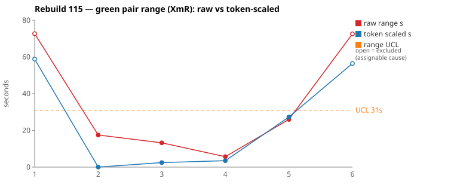
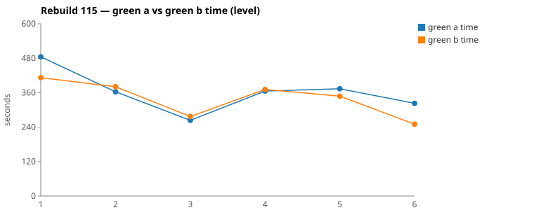

* TOC
{:toc}

---

# Context

This is a batch-level companion to [pbc-83][5] through [pbc-104][41], [pbc-108][42], [pbc-109][43], [pbc-111][44], [pbc-112][45], [pbc-113][46], and [pbc-114][47], using the same in-run pair methodology: since [issue #434][7] every Darmok scenario runs its green phase **twice** — worktree `_a` and `_b`, both branched from the *same red commit*, minutes apart — so the pair-range `|green_a − green_b|` from one metrics row nets out model-of-the-day, red commit, and server window, leaving **work** versus **per-token generation rate**. The charted quantity is the **Selected range** `min(raw, token-scaled)` fixed in [pbc-94][29].

**Rebuild115 produced the strongest ambiguity evidence in the series, and it is not from either in-run detector.** Both widest pairs are assignable, both carry a functional-diff warn — that much repeats [pbc-114][47]. What is new is that one of them, `4.1 / No component no existing`, is **the same scenario Rebuild114 flagged**, and its Rebuild114 fix was never applied. A Rebuild re-derives every implementation from red, so the scenario got a second independent attempt — and **the winner came back with the opposite rule**:

| Run | Winning half's gate | Behaviour when the previous step's object has no component |
|---|---|---|
| Rebuild114 (`e100cfce`) | `if (!object.isEmpty())`, long form gated on component | **one short proposal** |
| Rebuild115 (`6c7f6e61`) | `if (!component.isEmpty() && !object.isEmpty())` | **no proposal at all** |

Both passed the identical test. That is a **run-over-run winner flip** — a third detector, and a stricter one than either in-run signal, because it survives the possibility that a single pair got unlucky.

| Scenario | Commit | Green `_a` | Green `_b` | Raw range | Token-scaled range | Selected range | Verdict |
|---|---|---|---|---|---|---|---|
| No component no existing (4.1) | `6c7f6e61` | 8:04 | **6:52** | 72,706 ms | 59 s | **59 s** (scaled) | **assignable** — functional diff on two axes: empty-component gate (flipped since Rebuild114) and proposal-id construction. |
| Has existing step definition with Content parameter (4.4) | `e22093bd` | 5:22 | **4:10** | 72,608 ms | 57 s | **57 s** (scaled) | **assignable** — functional diff: exclude a step parameter by *name* (`"Content"`) vs by *has-description*. The fixture's Content param has no description, so both rules pass. |

(Bold = the winning half brought back and refactored.) Over the six run-order rows the Selected column is `[59, 0, 2, 4, 26, 57]` s. With **nothing excluded** the limits are `range_mean` **24.6 s**, `range_MR_bar` **23 s**, `range_UCL` **85.9 s** — and, for the second run running, **neither pair breaches**. Both rows are flagged `--exclude` as identified assignable causes; the remaining four `[0, 2, 4, 26]` give `range_mean` **8 s**, `range_MR_bar` **8.7 s**, **UCL 31 s**, with both excluded points well outside.

*(Data note: picks came from the current pair-range sheet (gid `386159174`), and `metrics.csv` agrees with it to the millisecond on all six green rows. The [#616][616] labelling defect did not recur — all six commits' `run-rgr <scenario>` subjects match their metrics row. Thirteen of the run's nineteen rows carry a zero green pair: red found those scenarios already passing. The working tree has since moved to Rebuild116, so the spec and code quoted below are read from the run-115 commits, not from `HEAD`.)*

---

# Charts

Scenarios are numbered in run order; the tables below say which index each is. The Moving-Range chart plots **raw** (red) and **token-scaled** (blue) together so `Selected` — their lower envelope — is visible, with the UCL (off Selected, both reviewed rows excluded) as the dashed orange line. The two excluded points are drawn as open circles. The Green chart is the absolute level.





---

# The token-scaled pair-range (recap)

Wall-clock fuses **real work** (≈ green output tokens) with the **per-token generation rate** (server load, queue, context-prefill jitter — uncontrollable). The full token-scaled derivation is in [pbc-83][5]; [pbc-90][22] added the NET refinement (deduct Edit/Write/TodoWrite bookkeeping) and [pbc-94][29] fixed the selection rule:

- `raw` = `|a − b|`, the wall-clock gap.
- `net_x` = `raw_tokens_x − edit_x − write_x − todo_x`, stripping verbose TodoWrite re-emissions and whole-method Edit/Write payloads.
- `token-scaled` = `|net_a − net_b| × fast_time / fast_raw`, the gap implied by **work** tokens at the faster half's rate.
- **`Selected = min(raw, token-scaled)`.** Scaling only removes variation (rate, bookkeeping); a token-scaled value larger than the clock gap is a phantom, so we keep the clock.

Both reviewed rows land in **CELL 3** — time differs, raw tokens differ, NET differs — the cell that hands the verdict to the divergence walk rather than settling it arithmetically. In both cases the walk found real extra work in the slower half, and in both cases the functional-diff warn made the verdict assignable regardless. This run's coincidence is worth noting: the two pairs' raw ranges are **73 s and 73 s**, within 100 ms of each other, on scenarios of completely different size.

---

# Pair 1 — `6c7f6e61` (4.1 No component no existing): the same ambiguity, the other answer

The run's **widest Selected** range (59 s, run index 1; raw 73 s). The mojo logged:

> `Green: Functional diff between pair (warn): suggestStepObjectNameWorkspace: A decomposes object into objectName+objectType for proposal IDs while B uses raw object string; also A allows empty-component inputs while B requires both component and object non-empty`

Winner `_b`.

| | `_a` 698424e2 | `_b` 5a03198c |
|---|---|---|
| Green wall-clock | 8:04 | **6:52** |
| Green output tokens | 15,758 | 12,640 |
| **NET tokens** | 5,748 | 3,944 |
| Read / Grep / **Glob** | 20 / 10 / **4** | 15 / 9 / **0** |
| Edit / Write | 9 / 4 | 7 / 3 |
| `mvn` cycles | 3 | 3 |
| Tool-result bytes (Read) | 149,701 | 130,465 |

Raw tokens differ **19.8 %**, NET **31.4 %** — CELL 3. No stall: every per-minute bucket is non-zero in both halves (`_a` 1114→1076, `_b` 1101→285), and the quiet stretches align with `mvn`.

```
both  04:58:32-04:58:36  Grep "COMPILATION ERROR" ; "Guice configuration errors"

_a    04:58:52  Glob "**/objects/xtext/ListProposalsAction.java"
      04:58:53  Glob "**/impl/*ListProposals*Impl.java"
      04:58:54  Glob "**/common/CucumberTestConfig.java"      ← locates by path
_b    04:58:46  Grep "No implementation for"
      04:58:50  Grep "ListProposalsAction"                    ← locates by content

both             Write + 3× Edit → mvn (_a 05:00:38, _b 04:59:44)

      verify phase
_a               Read src/main/java/org/farhan/dsl/grammar/StepObjectRefFragments.java   ← ONLY _a
_a               Read src/main/java/org/farhan/dsl/issues/RowIssueResolver.java  ×3      ← ONLY _a
_a    05:03:43  Grep "suggestCellListWorkspace"
_b               (never opens either file)
```

**The one file only `_a` opened is the file that produced the divergent rule.** `StepObjectRefFragments` is the fragment decomposer — it exposes `getObjectName()` and `getObjectVertexType()` alongside `getObject()`. Having read it, `_a` built proposal ids by decomposing and re-joining name + type; `_b`, which never opened it, used the raw `getObject()` substring. That is exactly the first axis of the warn, and it traces to a single Read.

The second axis is the consequential one. The scenario's Given is

```
| Test Step Full Name                       |
| The daily batchjob Output file is present |
| empty                                     |
```

— the referenced step object always *has* a component (`daily batchjob`), so the empty-component branch is never exercised. `_b` committed `if (!component.isEmpty() && !object.isEmpty())`; Rebuild114's winner on this same scenario committed `if (!object.isEmpty())` with the long form gated separately. **Opposite rules, one test, two runs.**

The branch is live, not defensive: the grammar marks the component optional (`"^(The" + COMPONENT + "?" + OBJECT + ")"`), and `The Output file is present` parses to component `[]`, object `Output file` — verified in [pbc-114][47] and unchanged.

**UML consultation symmetric and complete**: both halves read all five spec files including `uml-communication.md`, so the [#614][614] routing continues to hold. Neither opened a per-class `uml-class-*.md` — still true of every reviewed pair in the series. The asymmetry is on the *code* side, and this time it is the whole story.

**Verdict: assignable**, and now twice over.

---

# Pair 2 — `e22093bd` (4.4 Has existing step definition with Content parameter): two filters, one fixture

The run's **second-widest Selected** range (57 s, run index 6; raw 73 s). The mojo logged:

> `Green: Functional diff between pair (warn): Candidate A filters by has-table-or-description while Candidate B filters by name≠"Content"; a "Content" param with a description yields a proposal in A but not B`

Winner `_b`.

| | `_a` 4eb1aef2 | `_b` b3f61c7d |
|---|---|---|
| Green wall-clock | 5:22 | **4:10** |
| Green output tokens | 8,292 | 6,365 |
| **NET tokens** | 3,865 | 2,428 |
| Read / Grep | 12 / 7 | 8 / 6 |
| **Edit** | **2** | **1** |
| **`mvn` cycles** | **3** | **2** |
| Tool-result bytes (Read) | 154,168 | 108,838 |

Raw tokens differ **23.2 %**, NET **37.2 %**, clock gap **29.0 %** of the faster half — CELL 3. No stall in either half.

```
both  05:54:47 / 05:54:56  Grep "COMPILATION ERROR" ; "Guice configuration errors"

      verify phase — identical file set, different depth
_a    05:55:53  Grep "Tests run:.*Failures:|FAILED|BUILD FAILURE|AssertionError|expected:|Sc…"
      05:55:58 + 05:56:10 + 05:56:21   3× Read before touching anything
      05:56:39  Edit RowIssueResolver  → mvn 05:56:52
      05:57:20  Grep "Tests run:.*Failures:|COMPILATION ERROR|BUILD FAILURE"
      05:57:26  Grep "AssertionFailedError|FAILURE!"
      05:57:32 + 05:57:40  2× Read      ← first edit did not pass
      05:58:01  Edit RowIssueResolver  → mvn 05:58:06 → mvn 05:58:46   (THIRD cycle)

_b    05:56:05  Grep "COMPILATION ERROR|Tests run:.*Failures: [1-9]|Tests run:.*Errors: [1-9…"
      05:56:10  Grep "FAILED|MethodSource|AssertionFailedError|expected:|but was:"
      05:56:19 + 05:56:28  2× Read
      05:56:45  Edit RowIssueResolver  → mvn 05:56:56 → mvn 05:57:40   (done, 2 cycles)
```

The **file sets are identical** — five UML files, the 4.4 feature, `jacoco-shortlist.md`, and `RowIssueResolver.java`. The entire 73 s is `_a` reading 45 KB more, needing a second Edit, and paying for a third `mvn` cycle. On timing evidence alone that is an ordinary failed-first-attempt, which is common cause.

The behavioural compare says otherwise. The winner committed a **name** filter:

```java
for (IStepParameters sp : sd.getStepParametersList()) {
    if (sp.getName().contentEquals("Content")) {
        continue;
    }
    ...
```

`_a` committed a **has-description** filter instead. The fixture cannot separate them, because it supplies a `Content` parameter with **no** description:

```
And ... stepDefinitionList/1/stepParametersList node is created as follows
    | Step Parameters Name |
    | Content              |
Then The xtext plugin list proposals popup will be empty
```

Both rules exclude it — one because it is named `Content`, one because it has no description. The sibling scenario supplies the mirror-image case (`H1, H2, H3` *with* a description → proposed), so across the whole feature the two axes move together and never cross.

Worth noting against the usual reading of extra exploration: **`_a` read 45 KB more, spent an extra edit-verify round, and landed further from the stated intent.** The scenario's own narrative says *"Content parameters shouldn't be proposed as they are for text blocks, not table rows"* — which is `_b`'s name filter, committed in one edit.

**UML consultation symmetric** — both read all five files.

**Verdict: assignable.**

---

# Batch synthesis

Rebuild115 says three things the range chart cannot.

**First, the same ambiguity re-split with the opposite outcome.** `4.1 / No component no existing` was named in [pbc-114][47] with a specific Test-Case to add. The case was not added, the run re-derived the implementation from red, and the winner came back with the inverted gate. An unpinned ambiguity is not a latent risk that might recur; here it recurred on the very next run and resolved the other way.

**Second, both detectors again cleared a batch that had two proven ambiguities.** Max Selected 59 s against an 85.9 s un-excluded UCL. Two runs in a row, every actionable finding has come from the functional-diff scan and none from the range chart's limits.

**Third, more exploration did not mean a better answer — it meant a different one.** In Pair 1 the slower half's extra Read of `StepObjectRefFragments` is *what created* the divergent id rule; in Pair 2 the slower half read 45 KB more, spent an extra `mvn` cycle, and committed the filter that contradicts the scenario's own narrative. Both times the faster half was the one the spec author would have picked. That inverts the intuition behind reading the pair-range as a work proxy: the wider half is not the one that tried harder to get it right, it is the one that found more places for an unpinned spec to branch.

The two ambiguities share the shape [pbc-114][47] named — **a fixture that samples a free variable at exactly one value** — with a new variant. Pair 1 is the familiar one-value case (every referenced object has a component). Pair 2 is **two axes that never cross**: the feature supplies (Content, no description) and (non-Content, with description), so name and has-description are perfectly correlated across the fixture set and no scenario can tell which one the code should key on.

---

# The Fix, or Why No Fix

**Both reviewed pairs are assignable.** Neither is a split — the scenarios are the right size — both are **disambiguations**.

**Fix 1 — 4.1 Proposals for File Step Objects: component-less referenced object.** This is [pbc-114][47]'s Fix 2, unchanged and now overdue. Add a scenario whose previous step references a step object with no component:

```
Given ... testStepContainerList/1/testStepList node is created as follows
      | Test Step Full Name        |
      | The Output file is present |
      | empty                      |
 Then The xtext plugin list proposals popup will be set as follows
      | Proposal Value  | Proposal Id | Proposal Description                    |
      | The Output file | Output file | Referred in: The Output file is present |
```

One proposal, not two: the feature's stated rule is *"Both the short form and fully qualified form are proposed"*, and with no component those two forms are the same string. This pins Rebuild114's winner and fails Rebuild115's. If the intended answer is instead an empty popup, the assertion becomes `will be empty` — but it must be written down, because the two runs have now demonstrated that the model will not guess the same way twice.

The warn's **second axis** — proposal ids built by decomposing `objectName + objectType` versus using the raw `getObject()` substring — is not pinned by this case. The two agree whenever the object is a single space-separated name plus a type keyword, which is every fixture in the feature. A case whose object separator is not a single space would split them. This is lower priority than the component gate, which has now split twice.

**Fix 2 — 4.4 Proposals for Workspace Step Parameters: cross the two axes.** One scenario per uncrossed cell:

```
Scenario: Has existing step definition with Content parameter that has a description
  ... stepParametersList node created with | Step Parameters Name | Content |
  ... stepParametersList/1/description/lineList created with | Line Content | Text block content |
  Then The xtext plugin list proposals popup will be empty
```

This is the exact input the warn names, and asserting `empty` pins the **name** filter — consistent with the scenario narrative (*"Content parameters ... are for text blocks, not table rows"*) and with the winner's committed code. The mirror cell is worth adding too — a non-`Content` parameter with **no** description, asserted as proposed with an empty description — which kills the has-description rule from the other side.

Both fixes route to [`/rgr-review-specs`][48], which owns adding the Test-Case rows to the `pit.*.orig.graphml` and re-running the forward-engineer pipeline. No GitHub issue is filed — the change is a spec edit in the existing subtree.

**No harness, prompt, or model fix follows.** One measurement-level note: `uml-package.md` still has no `{Language}{Type}` rule ([pbc-114][47] Fix 3), so `validate_main.py` still fails on `SheepDogStepObjectRef` — yet **no allowlist violation fired this run**. Whether refactor reaches for the illegal move is itself a coin flip, which means the violation count is a lagging and unreliable indicator of that defect.

---

# Functional Diffs Found

A `Green: Functional diff between pair` warn fires when the two green halves committed **behaviourally divergent** code that *both* pass the current test — so each warn normally names a **differentiating input the scenario does not pin**. This list is **run-wide**.

`.claude/scripts/rgr-review-functional-diffs.sh 115` returned **2** warns. **Both are on reviewed top-2 pairs** — the same coincidence as [pbc-114][47], and still the reverse of [pbc-113][46], where all three warns were off-pick.

| # | Scenario (selected range, run index) | Commit | Differentiating input — what a Test-Case must pin |
|---|---|---|---|
| 1 | No component no existing, 4.1 Proposals for File Step Objects (59 s, idx 1) — *reviewed Pair 1* | `6c7f6e61` | **(a)** A previous test step referencing a **component-less** step object (`The Output file is present`). Assert one short proposal, or empty. **(b)** An object ref whose raw `getObject()` substring differs from `objectName + objectType` re-joined. |
| 2 | Has existing step definition with Content parameter, 4.4 Proposals for Workspace Step Parameters (57 s, idx 6) — *reviewed Pair 2* | `e22093bd` | A step parameter named **`Content` that has a description**. Assert the popup is still empty — pinning the name filter over the has-description filter. |

Verbatim warn text:

> **1.** suggestStepObjectNameWorkspace: A decomposes object into objectName+objectType for proposal IDs while B uses raw object string; also A allows empty-component inputs while B requires both component and object non-empty

> **2.** Candidate A filters by has-table-or-description while Candidate B filters by name≠"Content"; a "Content" param with a description yields a proposal in A but not B

**Both branches are reachable.** #1's component gate was verified live in [pbc-114][47] (`The Output file is present` → component `[]`, object `Output file`) and nothing has changed. #2's is trivially reachable — a `Content` parameter with a description is an ordinary stepdefs document, and the sibling scenario already writes descriptions on parameters.

**#1 is a repeat.** It is the same scenario and the same first axis [pbc-114][47] reported, un-fixed, and it re-split with the winner inverted. A functional diff that recurs across runs with a *different* winner is the strongest form of this signal — it removes any reading in which one pair simply drew badly.

---

# Mapping to the Research

| Predicted ([pbc-research][2]) | Observed across Rebuild115 |
|---|---|
| Wide pair-range fires the signal | fired on both — and both raw ranges were 73 s, within 100 ms of each other |
| A breach of the limit marks a special cause | **no breach, two special causes** — max Selected 59 s against an 85.9 s UCL. Second consecutive run where the range chart clears a batch that has proven ambiguities |
| The special cause is in the input, not the system | **confirmed twice**; both fixes are Test-Case rows, and one of them was already prescribed a run earlier |
| Both halves pass the same test | yes — all four reviewed halves passed verify, while encoding two different rules per pair |
| Two work-trees differ | Pair 1: Glob-first vs Grep-first location, and one half alone opening `StepObjectRefFragments`. Pair 2: identical file set, one extra Edit and a third `mvn` cycle |
| The functional-diff scan catches what the range misses | again the only source of findings — and this run added a **cross-run** variant the in-run compare cannot produce |

---

# Findings by Variable

*Each subsection records this run's findings about one [Wheeler variable][3].*

## green time pair range

Selected `[59, 0, 2, 4, 26, 57]`. Un-excluded: mean **24.6 s**, MRbar **23 s**, **UCL 85.9 s**, no breach. With the two identified assignable causes excluded: mean **8 s**, MRbar **8.7 s**, **UCL 31 s**, both excluded points well outside. The finding repeats [pbc-114][47]'s: **the un-excluded limits are inflated by exactly the points that have an assignable cause**, and the common-cause process underneath is roughly a quarter as wide. Batch mean rose 15.3 → 24.6 s un-excluded, but 5.7 → 8 s excluded — a much smaller move.

## green time pair range moving range

MR chain (un-excluded) `[59, 2, 2, 22, 31]` → MRbar 23 s. Three of the five links touch an excluded row. The four common-cause rows chain `[2, 2, 22]` for an MRbar of 8.7 s — and the 22 s link is the step up to `Has existing step definition with parameters` (26 s), the widest non-assignable row and the one to watch next run.

## green time

Claude-only per [#568][23]. Per-scenario green means run ~449 s, 372 s, 270 s, 368 s, 361 s, 287 s — mean **351 s**, up from Rebuild114's 305 s on the same six-scenario set. No excursion, no invocation near the 720 s cap. Reviewed halves ran 2–3 `mvn` cycles with verify passing on the first attempt in three of four; Pair 2's `_a` needed a second edit.

## scale & green tokens

Five of six rows chart `scaled`. Both reviewed rows are CELL 3 with NET well outside the band, so scaling did not resolve either — the divergence walk and the functional diff did. `No component has existing` charts a Selected of **0 s** on a 17 s raw gap: NET tokens were 4,525 vs 4,526, so the work was as close to identical as the measure can register.

## functional diff between pair

**Two warns, both on the reviewed top-2, both actionable, both reachable.** One is a **repeat from the previous run with the winner inverted** — see the new variable below.

## cross-run winner flip (new variable this run)

`4.1 / No component no existing` was implemented from red in both Rebuild114 and Rebuild115. Rebuild114's winner created a short proposal for a component-less object; Rebuild115's winner created none. **The same scenario, re-derived a day apart, produced opposite behaviour, and both passed.** This is a detector the in-run pair cannot provide: it compares across red commits and model-of-the-day, so it is noisier, but a *flip* is unambiguous — no amount of jitter turns one rule into its negation. Worth tracking deliberately for any scenario a functional diff has already flagged.

## the wider half is not the more correct half (new variable this run)

Both pairs: the slower half committed the rule further from the spec's stated intent. Pair 1's `_a` read `StepObjectRefFragments` and built ids by decomposition — extra reading is what *created* the divergence. Pair 2's `_a` read 45 KB more, spent an extra `mvn` cycle, and chose the has-description filter over the name filter the narrative describes. Extra exploration on an unpinned spec finds more branches, not the right one.

## allowlist violation

**None this run**, despite the `uml-package.md` defect from [pbc-114][47] being unfixed and `validate_main.py` still failing on `SheepDogStepObjectRef`. Whether refactor attempts the out-of-allowlist move is nondeterministic, so a zero count here is not evidence the spec gap is closed.

## metrics attribution

[#616][616] **did not recur** for the second consecutive run — all six chartable rows' commits resolve to a `run-rgr <scenario>` subject matching the row's `scenario` column.

## silent stall / timeout

**None.** Every per-minute bucket in the four reviewed halves is non-zero; the quiet stretches align with `mvn` calls.

## green-window attribution

All four surveys clipped to each half's green duration from the metrics row per the [#570][25] rule.

---

# Open Questions From This Case

- **How long does an un-actioned functional diff stay un-actioned?** Rebuild114 named the 4.1 fix; Rebuild115 re-derived the scenario and inverted the answer. The scan is only worth running if its output reaches [`/rgr-review-specs`][48] before the next Rebuild — otherwise it re-reports the same finding at full cost.
- **Should a repeat warn on the same scenario escalate?** A second warn on a scenario already flagged carries far more information than a first, and could be reported separately from the run-wide list.
- **Is the pair-range chart still earning its place?** Two consecutive runs, zero findings from the limits, four findings from the functional-diff scan. It still separates tester from developer signal on the *level*, but as an ambiguity detector it has now been clean while ambiguities were present four times running.
- **Should winner selection ever prefer the faster half when a functional diff is present?** Both this run's winners happen to be the faster half, and in Pair 2 the faster half was also the correct one — but that is luck, not a rule. The mojo has both implementations and the warn text in hand at selection time.
- **Do the per-class `uml-class-*.md` contracts need routing too?** Still no half has opened one, now across seven runs.

---

[2]: https://farhan5248.github.io/specificationbyprompt/architecture-and-capabilities/pbc-research
[3]: wheeler-understanding-variation
[5]: 83
[7]: https://github.com/farhan5248/sheep-dog-main/issues/434
[22]: 90
[23]: https://github.com/farhan5248/sheep-dog-main/issues/568
[25]: https://github.com/farhan5248/sheep-dog-main/issues/570
[29]: 94
[41]: 104
[42]: 108
[43]: 109
[44]: 111
[45]: 112
[46]: 113
[47]: 114
[48]: https://github.com/farhan5248/sheep-dog-main/blob/main/.claude/skills/rgr-review-specs/SKILL.md
[614]: https://github.com/farhan5248/sheep-dog-main/issues/614
[616]: https://github.com/farhan5248/sheep-dog-main/issues/616
[sheet]: https://docs.google.com/spreadsheets/d/1-TQxiPlFt1TJuXAnJbVmfJlK1rSClU4SwPWYXbLBixI/edit?gid=386159174#gid=386159174
