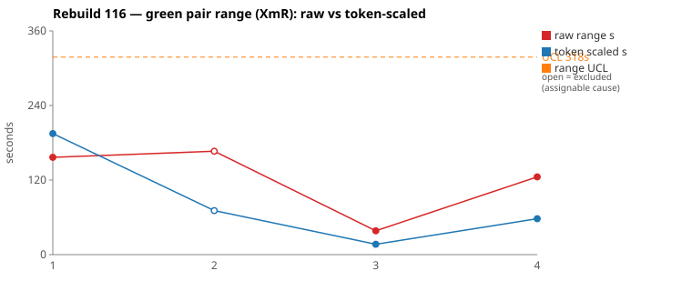
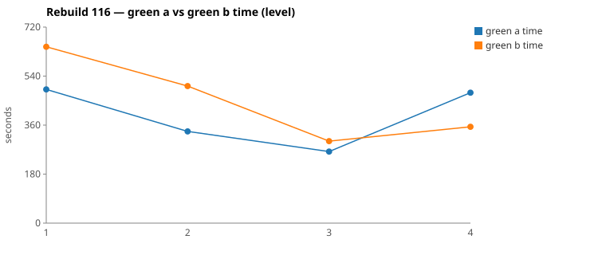

* TOC
{:toc}

---

# Context

This is a batch-level companion to [pbc-83][5] through [pbc-104][41], [pbc-108][42], [pbc-109][43], [pbc-111][44], [pbc-112][45], [pbc-113][46], [pbc-114][47], and [pbc-115][49], using the same in-run pair methodology: since [issue #434][7] every Darmok scenario runs its green phase **twice** — worktree `_a` and `_b`, both branched from the *same red commit*, minutes apart — so the pair-range `|green_a − green_b|` from one metrics row nets out model-of-the-day, red commit, and server window, leaving **work** versus **per-token generation rate**. The charted quantity is the **Selected range** `min(raw, token-scaled)` fixed in [pbc-94][29].

**Between Rebuild115 and Rebuild116 the specifications were restructured**, and that is what this run is about. The long-standing `TODO Collapse all these tests into fewer ones using Test Data` was acted on: plain `Scenario`s were merged into `Scenario Outline`s with `Examples` blocks carrying Test-Data placeholders. Six chartable scenarios became four. Both Wheeler signals moved at once:

| | Rebuild114 | Rebuild115 | Rebuild116 |
|---|---|---|---|
| Chartable scenarios | 6 | 6 | **4** |
| Mean green time (developer signal) | 305 s | 351 s | **422 s** |
| Mean Selected pair-range (tester signal) | 15.3 s | 24.6 s | **75.8 s** |

[pbc-113][46] framed the healthy shape as *"a rising absolute level with a stable pair-range"* — the work getting bigger while the spec still pins both halves to one answer. **Rebuild116 is the unhealthy shape**: the level rose *and* the range rose with it, by 3× in one run. Collapsing scenarios did not just make each case longer; it made each case admit more.

The two widest pairs **split** — one assignable, one common cause, the first split since [pbc-113][46].

| Scenario | Commit | Green `_a` | Green `_b` | Raw range | Token-scaled range | Selected range | Verdict |
|---|---|---|---|---|---|---|---|
| No component no existing has background (4.1) | `aaf5ab9e` | **8:11** | 10:47 | 156,591 ms | 195 s | **157 s** (raw) | **common cause** — `Green: No functional diff`; identical committed behaviour. `_b` spent 5,844 tokens across 21 Greps working out the background-container traversal that `_a` got in 9. |
| Has component has existing (4.2) | `47f38e0f` | **5:36** | 8:23 | 166,434 ms | 71 s | **71 s** (scaled) | **assignable** — functional diff: the loser fed a *path* to a regex that only matches a *step reference*, so its component filter never fires and it returns every workspace step object unfiltered. |

(Bold = the winning half brought back and refactored.) Over the four run-order rows the Selected column is `[157, 71, 17, 58]` s. With **nothing excluded** the limits are `range_mean` **75.8 s**, `range_MR_bar` **60.4 s**, `range_UCL` **236 s** — and, for the third run running, **neither pair breaches**. Excluding the one identified assignable cause leaves `[157, 17, 58]`: mean **77 s**, MRbar **90.5 s**, **UCL 318 s**. With four rows and one removed the limits are too wide to be worth much; that is a property of the batch size, not of the process.

*(Data note — the sheet is wrong this run. Its `A todo`/`B todo` columns for gid `1852313429` are **stale copies of Rebuild115's values**, so its `A net`/`B net`, `token scaled s` and `selected s` are all derived from the wrong deduction. Per the skill's rule the local `metrics.csv` wins, and every number in this report is recomputed from it. The ranking — and therefore the top-2 pick — is unaffected:*

| Scenario | sheet selected | CSV selected |
|---|---|---|
| No component no existing has background | 157 | **157** |
| Has component has existing | 96 | **71** |
| No component has existing step definition | 13 | **17** |
| Has existing step definition with parameters | 61 | **58** |

*`.claude/scripts/rgr-review-charts.py` reads `metrics.csv` directly, so the SVGs carry the corrected column. The sheet's `range_UCL` of 251 s should read 236 s. Separately: the [#616][616] labelling defect did not recur for the third consecutive run, the run completed cleanly (`RGR Automation Complete!`, 13 scenarios processed), and nine of the thirteen rows carry a zero green pair because red found them already passing.)*

---

# Charts

Scenarios are numbered in run order; the tables below say which index each is. The Moving-Range chart plots **raw** (red) and **token-scaled** (blue) together so `Selected` — their lower envelope — is visible, with the UCL (off Selected, the one assignable row excluded) as the dashed orange line. The Green chart is the absolute level.





---

# The token-scaled pair-range (recap)

Wall-clock fuses **real work** (≈ green output tokens) with the **per-token generation rate** (server load, queue, context-prefill jitter — uncontrollable). The full token-scaled derivation is in [pbc-83][5]; [pbc-90][22] added the NET refinement (deduct Edit/Write/TodoWrite bookkeeping) and [pbc-94][29] fixed the selection rule:

- `raw` = `|a − b|`, the wall-clock gap.
- `net_x` = `raw_tokens_x − edit_x − write_x − todo_x`, stripping verbose TodoWrite re-emissions and whole-method Edit/Write payloads.
- `token-scaled` = `|net_a − net_b| × fast_time / fast_raw`, the gap implied by **work** tokens at the faster half's rate.
- **`Selected = min(raw, token-scaled)`.** Scaling only removes variation (rate, bookkeeping); a token-scaled value larger than the clock gap is a phantom, so we keep the clock.

Pair 1 is the clearest phantom case the series has produced: a 157 s clock gap against a **195 s** token-scaled value. The slower half generated so much more that scaling it to the faster half's rate implies a gap *wider than the clock actually showed* — so `min` keeps the clock and the row charts `raw`. Pair 2 is the opposite: a 166 s clock gap collapsing to 71 s once the Edit payloads are deducted and the rates equalised, so 95 s of that gap was rate and bookkeeping.

Both rows are **CELL 3**. All four reviewed rows this run are CELL 3, which is itself a signal: no pair in Rebuild116 was time-similar *or* token-similar.

---

# Pair 1 — `aaf5ab9e` (4.1 No component no existing has background): the long way round

The run's **widest Selected** range (157 s, run index 1; raw 157 s — this row charts `raw`). The mojo logged **`Green: No functional diff between pair`**, winner `_a`.

| | `_a` 1781c6a1 | `_b` 7996a5d4 |
|---|---|---|
| Green wall-clock | **8:11** | 10:47 |
| Green output tokens | 15,182 | 21,486 |
| **NET tokens** | 4,873 | **10,896** |
| Read | 19 | 18 |
| **Grep (count / tokens)** | **9 / 894** | **21 / 5,844** |
| Edit / Write | 11 / 3 | 8 / 4 |
| `mvn` cycles | 3 | 4 |
| Tool-result bytes (Read) | 144,687 | 144,778 |

Raw tokens differ **29.3 %**, NET **55.3 %** — the widest NET gap in the series. No stall: every per-minute bucket is non-zero in both halves (`_a` 2178→539, `_b` 2177→531), and the quiet stretches align with `mvn`.

The Read volumes are within 100 bytes of each other. The entire divergence is in Grep: `_b` issued more than twice as many, generating **6.5× the tokens**, with one 1,611-token turn.

```
both  20:14:12  Grep "COMPILATION ERROR" ; "Guice configuration errors"
both  20:14:2x  Grep "No implementation for" ; "ListProposalsAction"
both             Write + 3× Edit → mvn (_a 20:15:21, _b 20:15:32)

      verify phase — _a converges, _b hunts the background traversal
_a    20:17:07  Grep "suggestStepObjectNameWorkspace|suggestStepDefinitionNameWorkspace|su…"
_a    20:18:30 → 20:20:05   7 Edits + 2 Writes, then mvn 20:20:17, mvn 20:20:58   → done 20:21:36

_b    20:18:28  Grep "interface ITestSuite"
      20:18:29  Grep "interface ITestStepContainer"
      20:20:49  Grep "COMPILATION ERROR|Guice configuration errors"
      20:21:12  Grep "testStepContainerList/2/testStepList"      ← the background container
      20:22:29  Grep "getObjectName|getObject"
      20:22:37  Grep "initTestStep"
      20:22:44  Grep "addTestStepWithFullName"
      20:23:07  mvn  →  20:23:40  mvn (FOURTH cycle)             → done 20:24:17
```

`_b`'s probe sequence names exactly what it was stuck on. This is the only scenario in the feature whose fixture has **two** step containers — a `Background` test-setup container plus the test case's own — and the proposal walk has to reach back through the first to collect referenced objects. `_b` spent from 20:21:12 to 20:22:44 grepping `testStepContainerList/2/testStepList`, `initTestStep` and `addTestStepWithFullName` to work out how the two containers are linked; `_a` never needed to ask.

**Both halves committed behaviourally identical code.** The scenario pinned the answer; one half took a much longer route to it.

**UML consultation symmetric and complete**: both read all five spec files including `uml-communication.md`, so the [#614][614] routing continues to hold. Neither opened a per-class `uml-class-*.md` — still true of every reviewed pair in the series. On the code side `_a` uniquely read `RowIssueResolver.java` and `_b` uniquely read `fake/TestStepNameParser.java`, which is a balanced trade rather than an asymmetry.

**Verdict: common cause.** A longer discovery route to the same committed behaviour is not a test-case defect, and acting on it would be [Wheeler][3]-tampering. It is worth recording *where* the route was long, though: the background traversal is the one structural feature this scenario has and the sibling scenarios do not, and it is the run's largest scenario at 569 s mean green. That is the **level** talking, not ambiguity.

---

# Pair 2 — `47f38e0f` (4.2 Has component has existing): a filter that never fires

The run's **second-widest Selected** range (71 s, run index 2; raw 166 s — 95 s of it stripped as rate and payload). The mojo logged:

> `Green: Functional diff between pair (warn): Candidate A uses theTestStep.getStepObjectName() (step-reference format) while candidate B uses theTestStep.getFullName() (path format) for component extraction via StepObjectRefFragments.getComponent(); the regex matches A's format but never B's, so B always returns all workspace step objects unfiltered`

Winner `_a`.

| | `_a` 43ed0851 | `_b` d7532028 |
|---|---|---|
| Green wall-clock | **5:36** | 8:23 |
| Green output tokens | 10,181 | 14,418 |
| **NET tokens** | 5,774 | 7,914 |
| Read | 15 | **23** |
| Grep | 10 | 14 |
| Edit | 2 | 2 |
| `mvn` cycles | 2 | 3 |
| Tool-result bytes (Read) | 146,915 | 145,579 |

Raw tokens differ **29.4 %**, NET **27.0 %**, clock gap **49.4 %** of the faster half — CELL 3. No stall in either half.

```
both  20:30:43 / 20:30:44  Grep "COMPILATION ERROR" ; "Guice configuration errors"
both             verify phase opens; both read jacoco-shortlist and the 4.1/4.2 features

_a    20:32:26  Grep "interface IStepObject"
      20:32:38  Grep "interface ITestDocument"
      20:33:36  Grep "getStepObjectFullNameForTestStep\""        ← finds the WRITER
      20:33:39  Grep "getStepObjectFullNameForTestStep"
      20:33:50 + 20:34:03  2× Edit → mvn 20:34:16, mvn 20:34:59  → done 20:35:31

_b    20:32:52  Grep "interface IStepObject"
      20:33:18  Grep "getContent"
      20:35:20  Grep "public static IStepObject createStepObject"  ← finds the BUILDER
      20:35:28 → 20:36:20   5 Reads of SheepDogBuilder and friends
      20:36:37  Edit → mvn 20:36:59, mvn 20:37:38                → done 20:38:20
```

The split is which end of the pipeline each half studied. `_a` found `getStepObjectFullNameForTestStep` — the function that **writes** `"stepdefs/" + component + "/" + object` — and inverted it, extracting the component from the step *reference* and comparing it to the first path segment:

```java
String stepObjectName = theTestStep.getStepObjectName();
String component = StepObjectRefFragments.getComponent(stepObjectName);
...
int slashIdx = soPath.indexOf("/");
String soComponent = soPath.substring(0, slashIdx);
if (component.isEmpty() || component.equals(soComponent)) { ... }
```

(Note `indexOf`, which is the correct inverse established in [pbc-114][47].) `_b` instead studied `createStepObject` in `SheepDogBuilder` — the **path** end — and passed `theTestStep.getFullName()` to `getComponent()`. That regex is anchored `^(The…`, and a path never starts with `The`, so `getComponent` always returns the empty string, `component.isEmpty()` is always true, and **the filter is dead code that admits everything**.

This is a sharper class of finding than [pbc-114][47]'s or [pbc-115][49]'s. Those were two defensible readings of an under-specified rule. Here one half's filter simply does not work — and the test passed anyway, because the fixture contains exactly **one** workspace step object:

```
And ... stepdefs/daily batchjob/Input file.asciidoc file is created as follows
    | Step Definition Name |
    | is present           |
Then The xtext plugin list proposals popup will be set as follows
    | Proposal Description | Proposal Id | Proposal Value                |
    | Description          | Input file  | The daily batchjob Input file |
```

With one object in the workspace, "filtered to the matching component" and "everything, unfiltered" are the same list.

**And the Test-Data merge did not help.** This scenario is one of the outlines created between Rebuild115 and Rebuild116; it now carries two `Examples` blocks — `The daily batchjob` and `empty` — collapsing what used to be two separate scenarios. But both rows assert the *same single proposal* against the *same single fixture*, so both pass under either rule. **The merge doubled the case's input surface without adding one bit of discriminating power.**

**UML consultation symmetric** — both read all five files.

**Verdict: assignable.**

---

# Batch synthesis

Rebuild116 is the first run in the series where a **specification change** is the dominant explanation, and the charts caught it on both axes at once.

Collapsing scenarios into `Scenario Outline` + `Examples` cut the batch from six cases to four, raised mean green time 351 → 422 s, and raised the mean Selected pair-range 24.6 → 75.8 s. The level rising is expected and benign — fewer, larger cases. The **range** rising 3× is the part that matters, and it is what the Moving-Range chart exists to say: two runs of the identical test case now diverge much further than they did a run ago.

Pair 2 shows the mechanism. Merging `Has component has existing` and `No component has existing` into one outline added an Examples row that varies the *component* — but the fixture still has one step object and the assertion still expects one proposal, so the new row cannot separate "filter by component" from "no filter at all". The case got twice as long to satisfy and no more precise. That is the outline tax: **Test-Data rows add size unconditionally and add discriminating power only when the assertion varies with them.**

Pair 1 shows the same tax from the other side. It is the largest scenario in the batch (569 s mean green) and the only one whose fixture has two step containers, and it produced a 157 s range with *no* behavioural divergence at all — one half simply needed 21 greps to work out the background traversal where the other needed 9. Nothing to fix; but bigger cases give a long route more room to be long.

Set against the two prior runs, the reading is consistent. [pbc-114][47] and [pbc-115][49] each found two ambiguities of the "fixture samples a free variable at one value" shape. Rebuild116 found a third instance of exactly that shape — one workspace step object, so the count-of-non-matching-objects axis is pinned at zero — and it found it in a scenario that had just been *enlarged* without being *sharpened*.

---

# The Fix, or Why No Fix

**Pair 1 is common cause — no scenario-level fix.** Both halves committed identical behaviour, neither stalled, and the divergence is discovery style on the batch's largest scenario. Acting on it would be tampering.

**Pair 2 is assignable, and its fix is one Given row.**

**Fix 1 — 4.2 Proposals for Workspace Step Objects: a second workspace step object under a different component.** The differentiating input the warn names is a workspace containing an object the component filter should *exclude*. Add it to the outline's fixture and extend the assertion:

```
Given ... stepdefs/daily batchjob/Input file.asciidoc file is created as follows
      | Step Definition Name |
      | is present           |
  And ... stepdefs/nightly batchjob/Output file.asciidoc file is created as follows
      | Step Definition Name |
      | is present           |
```

with per-Examples assertions that now differ: the `The daily batchjob` row expects **only** `The daily batchjob Input file`, while the `empty` row expects **both** objects. That is the first pair of Examples rows in this outline whose expected output actually varies with the Test Data — and it kills the unfiltered rule outright, because an unfiltered implementation returns both objects on the `The daily batchjob` row.

Note this fix also repairs the merge. Right now the outline's two Examples rows are indistinguishable to the assertion; afterwards they are the whole point of the outline.

**A note on the sibling axis.** `Has component no existing` (the other merged outline) has the mirror-image gap: it asserts an empty popup with *zero* workspace step objects, so it cannot distinguish "no objects exist" from "objects exist but none match". The same second-object fixture would close both.

Both fixes route to [`/rgr-review-specs`][48], which owns adding the Test-Case rows to the `pit.*.orig.graphml` and re-running the forward-engineer pipeline. No GitHub issue is filed — the change is a spec edit in the existing subtree.

**No harness, prompt, or model fix follows.** Two measurement-level items:

1. **The pair-range sheet's `A todo`/`B todo` columns for this run are stale Rebuild115 values**, which corrupts its `net`, `token scaled` and `selected` columns and its UCL (251 s where the data says 236 s). The picks survived, but a batch where the error landed differently would have mis-ranked. Worth a look at how the tab is populated.
2. `uml-package.md` still has no `{Language}{Type}` rule ([pbc-114][47] Fix 3), and for the second run running **no allowlist violation fired** — confirming that indicator is nondeterministic and cannot be used to tell whether the spec gap is closed.

---

# Functional Diffs Found

A `Green: Functional diff between pair` warn fires when the two green halves committed **behaviourally divergent** code that *both* pass the current test — so each warn normally names a **differentiating input the scenario does not pin**. This list is **run-wide**.

`.claude/scripts/rgr-review-functional-diffs.sh 116` returned **1** warn. It is on a reviewed top-2 pair — the third consecutive run in which every warn landed on a pick, though with only four chartable scenarios this run that is a weaker coincidence than in [pbc-114][47] or [pbc-115][49].

| # | Scenario (selected range, run index) | Commit | Differentiating input — what a Test-Case must pin |
|---|---|---|---|
| 1 | Has component has existing, 4.2 Proposals for Workspace Step Objects (71 s, idx 2) — *reviewed Pair 2* | `47f38e0f` | A **second workspace step object under a different component**, e.g. `stepdefs/nightly batchjob/Output file.asciidoc` alongside the existing `stepdefs/daily batchjob/Input file.asciidoc`. With a component in the step, assert only the matching object is proposed. |

Verbatim warn text:

> **1.** Candidate A uses theTestStep.getStepObjectName() (step-reference format) while candidate B uses theTestStep.getFullName() (path format) for component extraction via StepObjectRefFragments.getComponent(); the regex matches A's format but never B's, so B always returns all workspace step objects unfiltered

**Reachable, and stronger than a difference of opinion.** The loser's filter is not an alternative rule — it is a rule that never executes, because `StepObjectRefFragments.getComponent` is anchored `^(The…` and a document path never matches. Any workspace with two or more step objects under different components exposes it immediately. That the scenario passes is purely an artefact of the fixture holding exactly one object.

---

# Mapping to the Research

| Predicted ([pbc-research][2]) | Observed across Rebuild116 |
|---|---|
| Wide pair-range fires the signal | fired on both picks — and the **batch mean tripled** (24.6 → 75.8 s) the run after the specs were merged into outlines |
| A breach of the limit marks a special cause | **no breach, one special cause** — max Selected 157 s against a 236 s un-excluded UCL. Third consecutive run where the limits clear a batch that has a proven ambiguity |
| The special cause is in the input, not the system | **confirmed** — one Given row (a second step object) kills the surviving wrong rule |
| Both halves pass the same test | yes — all four reviewed halves passed verify, one pair encoding a filter that never runs |
| Two work-trees differ | Pair 1: 21 Greps vs 9 on the background traversal, same committed code. Pair 2: writer-end vs builder-end study of the same pipeline |
| The functional-diff scan catches what the range misses | one warn, on-pick; but the **range chart** is what caught the spec restructure, which the scan cannot see |

---

# Findings by Variable

*Each subsection records this run's findings about one [Wheeler variable][3].*

## green time pair range

Selected `[157, 71, 17, 58]`. Un-excluded: mean **75.8 s**, MRbar **60.4 s**, **UCL 236 s**, no breach. Excluding the one assignable row leaves `[157, 17, 58]` → mean 77 s, MRbar 90.5 s, UCL 318 s; with three points the limits are too wide to be informative. **The finding is the batch mean, not any single row: 15.3 → 24.6 → 75.8 s across three runs, with the jump coinciding exactly with the Scenario-Outline merge.**

## green time pair range moving range

MR chain (un-excluded) `[86, 54, 41]` → MRbar 60.4 s, against 23 s in Rebuild115 and 11 s in Rebuild114. The dispersion of the dispersion rose in step with everything else — this is not one outlier dragging a mean.

## green time

Claude-only per [#568][23]. Per-scenario green means run ~569 s, 420 s, 282 s, 416 s — mean **422 s**, up from 351 s (Rebuild115) and 305 s (Rebuild114) on progressively fewer, larger cases. `_b` of Pair 1 ran **10:47**, the longest green half in the series so far, though split across two `claude` invocations so nowhere near the 720 s per-invocation cap. Reviewed halves ran 2–4 `mvn` cycles.

## scale & green tokens

Three of four rows chart `scaled`. Pair 1 is the series' clearest phantom in the *other* direction: token-scaled 195 s against a 157 s clock gap, meaning the slower half's extra generation implies more variation than the clock recorded — `min` keeps the clock exactly as [pbc-94][29] intends. All four rows are CELL 3; **no pair this run was either time-similar or token-similar**, which is itself a batch-level symptom of larger cases.

## functional diff between pair

**One warn, on-pick, reachable, and of a stronger class than prior runs.** The loser's component filter never fires — this is a broken rule surviving the test, not two defensible readings. The scenario passes only because its fixture holds a single workspace step object.

## specification restructure (new variable this run)

The `Scenario` → `Scenario Outline` + `Examples` merge is the run's dominant cause and it is visible on both charts. **Test-Data rows add case size unconditionally but add discriminating power only when the assertion varies with the data.** In the merged `Has component has existing`, both Examples rows assert the identical single proposal against the identical single fixture, so the outline doubled the input surface and separated nothing. Worth tracking as its own variable across the next runs: does the range settle back once the outlines get discriminating assertions, or is the larger case size itself the new level?

## the wider half is not the more correct half

Holds for a third run. Pair 2's slower half studied `SheepDogBuilder` (the path end) and produced the dead filter; the faster half found `getStepObjectFullNameForTestStep` (the writer end) and inverted it correctly, `indexOf` and all. Pair 1's slower half generated 6.5× the Grep tokens and arrived at identical code.

## allowlist violation

**None this run**, for the second consecutive run, with `uml-package.md` still unfixed. The indicator is nondeterministic; a zero is not evidence the [pbc-114][47] spec gap is closed.

## metrics attribution

[#616][616] **did not recur** for the third consecutive run. A *different* data defect appeared instead, one level up: the pair-range **sheet** carried Rebuild115's `todo` columns into the Rebuild116 tab, corrupting every derived column. `metrics.csv` was clean.

## silent stall / timeout

**None.** Every per-minute bucket in the four reviewed halves is non-zero; the quiet stretches align with `mvn` calls.

## green-window attribution

All four surveys clipped to each half's green duration from the metrics row per the [#570][25] rule.

---

# Open Questions From This Case

- **Is the 3× range jump the merge, or the batch getting to harder scenarios?** The two are confounded this run — the outlines landed at the same time the run moved into 4.2/4.5 territory. One more run with the outlines in place and no further spec restructuring would separate them.
- **Should an Examples block whose rows share an assertion be flagged?** It is mechanically checkable: if every Examples row of an outline maps to the same expected output, the Test Data varies nothing the test can see. That is precisely the [pbc-114][47] "free variable sampled at one value" shape, now detectable statically rather than by waiting for a functional diff.
- **Should the functional-diff detector distinguish "two readings" from "one broken rule"?** This run's warn is the latter — a filter that cannot execute. That is a defect in the losing candidate, not only an ambiguity in the spec, and it deserves a louder channel than a scenario whose two halves merely disagree.
- **How wide do limits get before they stop meaning anything?** Four rows, one excluded, gives a UCL of 318 s against a mean of 77 s. At this batch size the chart cannot fail to be in control. The merge cut the row count by a third; if it keeps falling, the XmR framing needs a minimum-n rule.
- **Do the per-class `uml-class-*.md` contracts need routing too?** Still no half has opened one, now across eight runs.

---

[2]: https://farhan5248.github.io/specificationbyprompt/architecture-and-capabilities/pbc-research
[3]: wheeler-understanding-variation
[5]: 83
[7]: https://github.com/farhan5248/sheep-dog-main/issues/434
[22]: 90
[23]: https://github.com/farhan5248/sheep-dog-main/issues/568
[25]: https://github.com/farhan5248/sheep-dog-main/issues/570
[29]: 94
[41]: 104
[42]: 108
[43]: 109
[44]: 111
[45]: 112
[46]: 113
[47]: 114
[48]: https://github.com/farhan5248/sheep-dog-main/blob/main/.claude/skills/rgr-review-specs/SKILL.md
[49]: 115
[614]: https://github.com/farhan5248/sheep-dog-main/issues/614
[616]: https://github.com/farhan5248/sheep-dog-main/issues/616
[sheet]: https://docs.google.com/spreadsheets/d/1-TQxiPlFt1TJuXAnJbVmfJlK1rSClU4SwPWYXbLBixI/edit?gid=1852313429#gid=1852313429
