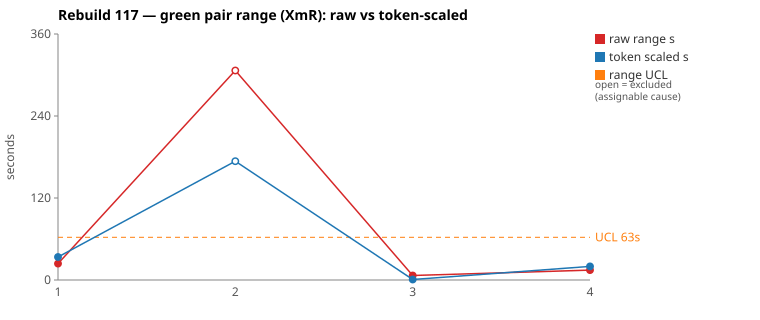
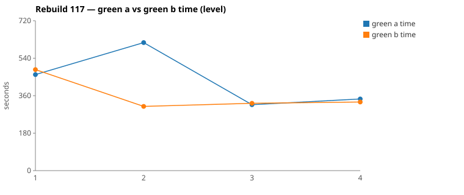

* TOC
{:toc}

---

# Context

This is a batch-level companion to [pbc-83][5] through [pbc-104][41], [pbc-108][42], [pbc-109][43], [pbc-111][44], [pbc-112][45], [pbc-113][46], [pbc-114][47], [pbc-115][49], and [pbc-116][50], using the same in-run pair methodology: since [issue #434][7] every Darmok scenario runs its green phase **twice** — worktree `_a` and `_b`, both branched from the *same red commit*, minutes apart — so the pair-range `|green_a − green_b|` from one metrics row nets out model-of-the-day, red commit, and server window, leaving **work** versus **per-token generation rate**. The charted quantity is the **Selected range** `min(raw, token-scaled)` fixed in [pbc-94][29].

**Rebuild117 is the run where the two detectors moved in opposite directions.** [pbc-116][50]'s a2g → g2a round-trip was followed by a deliberate restructure: the test setup was made **explicit**, which renamed and re-ordered every scenario (`Step Object - From Workspace`, `Step Definition - Component Inherited`, …) and gave each case stated setup steps instead of implied ones. The timing signal responded exactly as intended. The behavioural signal did the opposite.

| | Rebuild115 | Rebuild116 | Rebuild117 |
|---|---|---|---|
| Chartable scenarios | 6 | 4 | 4 |
| Mean green time (developer signal) | 351 s | 422 s | 398 s |
| Selected pair-ranges (tester signal) | `[59, 0, 2, 4, 26, 57]` | `[157, 71, 17, 58]` | **`[24, 174, 1, 15]`** |
| Functional diffs | 2 | 1 | **3** |
| Allowlist violations | 0 | 0 | **0** |

Three of the four rows came in at **1 s, 15 s and 24 s** — the tightest cluster since [pbc-113][46], and a clear improvement on Rebuild116's `[17, 58, 71, 157]`. **And the functional-diff count tripled.** One warn even landed on the **1 s** row. If a quiet Moving-Range chart meant a well-specified batch, that could not happen.

Both reviewed pairs are **assignable**.

| Scenario | Commit | Green `_a` | Green `_b` | Raw range | Token-scaled range | Selected range | Verdict |
|---|---|---|---|---|---|---|---|
| Step Object - From Workspace (4.2) | `1a440379` | 10:15 | **5:08** | 306,616 ms | 174 s | **174 s** (scaled) | **assignable** — functional diff: multi-line descriptions joined with `", "` vs no separator. `_a` also spent its last 3 minutes instrumenting the runtime. |
| Step Object - From Background Steps (4.1) | `3354aca3` | **7:41** | 8:05 | 24,048 ms | 34 s | **24 s** (raw) | **assignable** — functional diff: one half de-duplicates proposals, the other does not. Timing says CELL 1, *equivalent work* — a 7 s scaled range on a 7.5-minute task. |

(Bold = the winning half brought back and refactored.) With **nothing excluded** the limits are `range_mean` **53.5 s**, `range_MR_bar` **112 s**, `range_UCL` **352 s** — no breach, but those limits are meaningless: one point at 174 s among three under 25 s inflates `MRbar` past the mean. Excluding the dominant assignable row leaves `[24, 1, 15]` → mean **13.3 s**, MRbar **18.5 s**, **UCL 63 s**, with the excluded point far outside.

**A caveat that is itself the finding: three of the four rows carry an identified assignable cause.** Wheeler's rule says to remove them all — which would leave `n = 1` and no limits at all. A process with 75 % of its points assignable is not in a state of statistical control, and no limit computed from it describes anything stable. The chart below excludes only row 2 so that it has something to draw.

*(Data note: picks came from the current pair-range sheet (gid `199932363`), and unlike [pbc-116][50] its `A todo`/`B todo` columns **match `metrics.csv` exactly** — the stale-column defect did not recur, nor did [#616][616] for the fourth consecutive run. Nine of the thirteen rows carry a zero green pair because red found them already passing.)*

---

# Charts

Scenarios are numbered in run order; the tables below say which index each is. The Moving-Range chart plots **raw** (red) and **token-scaled** (blue) together so `Selected` — their lower envelope — is visible, with the UCL (off Selected, row 2 excluded) as the dashed orange line. The Green chart is the absolute level.





---

# The token-scaled pair-range (recap)

Wall-clock fuses **real work** (≈ green output tokens) with the **per-token generation rate** (server load, queue, context-prefill jitter — uncontrollable). The full token-scaled derivation is in [pbc-83][5]; [pbc-90][22] added the NET refinement (deduct Edit/Write/TodoWrite bookkeeping) and [pbc-94][29] fixed the selection rule:

- `raw` = `|a − b|`, the wall-clock gap.
- `net_x` = `raw_tokens_x − edit_x − write_x − todo_x`, stripping verbose TodoWrite re-emissions and whole-method Edit/Write payloads.
- `token-scaled` = `|net_a − net_b| × fast_time / fast_raw`, the gap implied by **work** tokens at the faster half's rate.
- **`Selected = min(raw, token-scaled)`.** Scaling only removes variation (rate, bookkeeping); a token-scaled value larger than the clock gap is a phantom, so we keep the clock.

Pair 1 is the widest raw gap the series has recorded — 307 s, **99.4 % of the faster half**. Even after deducting payload and equalising rates it stays at 174 s, because the NET tokens really are 2.3× apart. Pair 2 is the exact opposite and the more interesting one: **CELL 1**, time-similar at 5.2 %, raw tokens 1.5 % apart, a scaled range of **7 s** against 17 s of rate overhead. By every number the gate computes, Pair 2's halves did equivalent work at equivalent speed — and they committed different rules anyway.

---

# Pair 1 — `1a440379` (4.2 Step Object - From Workspace): read the sibling, or instrument the runtime

The run's **widest Selected** range (174 s, run index 2; raw 307 s). The mojo logged:

> `Green: Functional diff between pair (warn): suggestStepObjectNameWorkspace joins multi-line descriptions with ", " (A) vs no separator (B); input: step object with 2+ description lines`

Winner `_b`.

| | `_a` db1f4d20 | `_b` 38d03a19 |
|---|---|---|
| Green wall-clock | 10:15 | **5:08** |
| Green output tokens | 16,021 | 10,154 |
| **NET tokens** | **10,135** | 4,409 |
| Read / Grep | 21 / **23** | 13 / 8 |
| Edit | 3 | 3 |
| **Bash** | **8** | 2 |
| `mvn` cycles | 3 | 2 |
| Tool-result bytes (Bash) | **23,253** | 62 |

Raw tokens differ **36.6 %**, NET **56.5 %** — CELL 3. No stall: every per-minute bucket is non-zero in both halves (`_a` 1071→356, `_b` 1099→939 before its tail minute).

The Bash row is the whole story. `_b` used Bash twice, both `mvn`. `_a` used it eight times and pulled back 23 KB of output.

```
both  00:40:40  Grep "COMPILATION ERROR" ; "Guice configuration errors"
both             verify phase opens; both read jacoco-shortlist and grep the failure

_b    00:41:37 → 00:42:41   reads incl. the SIBLING spec
                            4.1 - Proposals for File Step Objects.feature      ← ONLY _b
      00:43:16 + 00:43:22 + 00:43:29   3× Edit
      00:43:43  mvn  →  00:44:17  mvn                                          → done 00:45:04

_a    00:43:48 + 00:43:58  2× Edit → mvn 00:44:11
      00:45:16  Grep "createStepObject"
      00:45:28  Grep "getTestStepFullName"
      00:46:10  Grep "initTestStep"
      00:46:15  Grep "addTestStepWithFullName"
      00:46:28  Grep "addStepObjectWithFullName"
      00:46:43  Grep "getFullNameFromPath"
      00:46:57  Grep "setCreatedAsFollows|setCreated\b"
      00:47:08  Grep "addLineWithContent"
      00:47:22  Bash "LOG_LEVEL=DEBUG mvn …"                    ← turns on debug logging
      00:47:47  Grep "suggestStepObjectNameWorkspace"  in /logs/sheep-dog-grammar.org.farhan.log
      00:48:07  Grep "Entering suggestStepObjectNameWorkspace"  in the same runtime log
      00:48:16  Bash grep "resetTestProject|Entering suggestStepObjectNameWorkspace"
      00:48:34  Bash grep "6d7e2795|createStepObject|Input file"
      00:48:52  Bash grep -c "resetTestProject"
      00:48:57  Bash grep -c "Entering suggestStepObjectNameWorkspace"
      00:49:26  mvn (third cycle)                                              → done 00:50:12
```

`_b` answered "how does this scenario get its workspace step object" by **reading the sibling Test-Case in 4.1**, which does the same setup. `_a` answered it by reading `logback-test.xml`, re-running the build with `LOG_LEVEL=DEBUG`, and grepping the runtime log for `Entering suggestStepObjectNameWorkspace` and `resetTestProject` — counting invocations to work out whether the test project was being reset between scenarios. That expedition ran from 00:45:16 to 00:49:04 and cost essentially the entire 5-minute gap.

Both stayed inside the allowlist (`src/test/resources/` is allowlisted, so touching `logback-test.xml` is legal), and both passed verify.

**The specification made the setup explicit, and one half still could not read it off the spec.** That is worth stating plainly given the restructure's intent: explicit setup steps helped the *typical* case — three of four rows are now under 25 s — but the discovery route for "what does this Given actually build" is still luck-of-the-draw between the sibling spec and the runtime log.

**The committed divergence is narrower than the time gap suggests.** Both halves wrote a description join; they chose different separators. The scenario's fixture gives the step object exactly **one** description line, so `", "` and `""` produce identical output.

**UML consultation symmetric and complete**: both read all five spec files including `uml-communication.md`, so the [#614][614] routing continues to hold. Neither opened a per-class `uml-class-*.md` — still true of every reviewed pair in the series.

**Verdict: assignable.**

---

# Pair 2 — `3354aca3` (4.1 Step Object - From Background Steps): in control, and still ambiguous

The run's **second-widest Selected** range (24 s, run index 1) — and by the timing gate, an unremarkable pair. The mojo logged:

> `Green: Functional diff between pair (warn): suggestStepObjectNameWorkspace in B deduplicates proposals via LinkedHashSet while A does not; two preceding steps with the same stepObjectName (e.g. "daily batchjob/Output file") produce duplicate proposals in A but not in B`

Winner `_a`.

| | `_a` 9c619736 | `_b` ea359453 |
|---|---|---|
| Green wall-clock | **7:41** | 8:05 |
| Green output tokens | 15,628 | 15,859 |
| **NET tokens** | 4,708 | 5,846 |
| Read / Grep | 17 / 10 | 17 / 13 |
| Edit / Write / Glob | 8 / 4 / 2 | 9 / 3 / 3 |
| `mvn` cycles | 3 | 3 |

This is the flattest pair in the run and one of the flattest in the series:

- **Raw tokens differ 1.5 %** — 15,628 against 15,859.
- **Time differs 5.2 %** of the faster half — inside the 10 % band.
- The gate returns **CELL 1, "equivalent work"**, scales `_b` from 485 s to 468 s, and reports a **scaled range of 7 s** against **17 s of rate overhead**.
- Identical Read counts (17/17), identical `mvn` cycles (3/3), one Edit and one Glob apart.

Everything the pair-range machinery measures says these two halves did the same work at the same speed. They then committed different rules: one wrapped the proposal list in a `LinkedHashSet`, the other did not.

The scenario cannot separate them because its Given supplies preceding steps that each reference a **different** step object. Duplicate suppression only becomes observable when two preceding steps name the *same* object — the input the warn spells out. With every object appearing once, de-duplicating and not de-duplicating return identical lists.

**UML consultation symmetric** — both read all five files.

**Verdict: assignable.** And this is the pair to remember: **had the functional-diff scan not run, nothing in this row would have suggested a problem.** A 24 s raw range, a 7 s scaled range, CELL 1, matching tool counts — it is the profile of a well-specified case.

---

# Batch synthesis

Rebuild117 separates the two detectors more cleanly than any prior run.

**The timing signal improved, and the restructure earned that.** Making the test setup explicit took the Selected column from Rebuild116's `[17, 58, 71, 157]` to `[1, 15, 24, 174]`. Strip the one assignable outlier and the mean is **13.3 s** — back below Rebuild114's 15.3 s, the tightest the series has been. Green time also came down slightly, 422 → 398 s, on the same number of cases. On the Moving-Range chart alone, this is the best batch in four runs.

**The behavioural signal got worse.** One functional diff became three. And their distribution kills any hope of reading one detector off the other:

| Row | Selected | Functional diff |
|---|---|---|
| Step Object - From Background Steps | 24 s | **yes** |
| Step Object - From Workspace | 174 s | **yes** |
| Step Definition - Component Inherited | **1 s** | **yes** |
| Step Parameters - From Workspace | 15 s | no |

A warn on a **1 s** row is the strongest possible statement of the near-miss argument the methodology has been making since [pbc-113][46]: two halves converging on time says nothing about whether they converged on a *rule*. Here they took the same amount of time to disagree.

**All three warns are the same shape, for the third run running: a count the fixture pins at one.** Rebuild114 and Rebuild115 found "every referenced object has a component"; Rebuild116 found "exactly one workspace step object"; Rebuild117 finds *three at once* —

1. exactly **one description line**, so a join separator is unobservable,
2. every preceding step names a **distinct** object, so de-duplication is unobservable,
3. exactly **one lookup path** from step to step object, so a fallback and a delegation agree.

This is now the dominant defect class in the series, and it is mechanical: wherever a fixture supplies exactly one of something the code iterates or joins, the loop body and the degenerate case are indistinguishable.

**The explicit-setup restructure did not cause the extra warns and did not prevent them.** It made the *steps* explicit, which is why the clocks converged. It did not make the *cardinalities* vary, which is why the rules did not.

---

# The Fix, or Why No Fix

**Both reviewed pairs are assignable, and so is the off-pick third.** All three fixes are the same move — add a second instance of something the fixture supplies once.

**Fix 1 — 4.2 Step Object - From Workspace: a second description line.**

```
And ... stepdefs/daily batchjob/Input file.asciidoc file description/lineList node is created as follows
    | Line Content    |
    | First line      |
    | Second line     |
```

and assert the intended `Proposal Description`. This picks the join separator explicitly — `First line, Second line` under the winner's rule, `First lineSecond line` under the loser's. (Neither is obviously right; a newline may well be the intended answer, in which case both halves are wrong and the case is worth more than a tiebreak.)

**Fix 2 — 4.1 Step Object - From Background Steps: two preceding steps naming the same object.** Extend the Given so two setup steps both reference `The daily batchjob Output file`, and assert the proposal appears **once**. That pins de-duplication; without it, the `LinkedHashSet` is decoration.

**Fix 3 — 4.3 Step Definition - Component Inherited (off-pick, 1 s range): a short object name with a qualified predecessor.** The warn names the input directly — a test step using the short object form whose preceding step used the fully-qualified form. Assert which step object the lookup resolves to. This is the one that would never have been found by range.

Together these are the **diff warnings** half of the planned clean-up. All three route to [`/rgr-review-specs`][48] and must land in `pit.<model>.orig.graphml`, not the generated `.feature` — Rebuild116 established that a hand-edit to the feature is overwritten by the next a2g → g2a pass.

**No allowlist violations to address this run.** The whole `2026-08-04` mojo log — covering Rebuild116 *and* Rebuild117 — contains **zero**. The `uml-package.md` gap from [pbc-114][47] (no `{Language}{Type}` rule for `SheepDogStepObjectRef`) is still unfixed, and for the third run running it did not fire. It remains worth closing, but the violation count is not the way to tell whether it is closed.

**On bringing the pair-range inside the UCL:** the un-excluded UCL of 352 s is not a target worth hitting, because it is inflated by the very point that breaks the process. The meaningful number is the excluded one — mean 13.3 s, UCL 63 s over the three common-cause rows — and `Step Object - From Workspace` at 174 s sits nearly 3× outside it. Fixing its ambiguity is the direct route; so is watching whether its 10:15 half recurs, since a 99.4 % time gap is a scale of variation no other row in four runs has approached.

---

# Functional Diffs Found

A `Green: Functional diff between pair` warn fires when the two green halves committed **behaviourally divergent** code that *both* pass the current test — so each warn normally names a **differentiating input the scenario does not pin**. This list is **run-wide**.

`.claude/scripts/rgr-review-functional-diffs.sh 117` returned **3** warns — the most since [pbc-113][46], and the first time a warn has landed on a row whose Selected range is **1 second**.

| # | Scenario (selected range, run index) | Commit | Differentiating input — what a Test-Case must pin |
|---|---|---|---|
| 1 | Step Object - From Background Steps, 4.1 (24 s, idx 1) — *reviewed Pair 2* | `3354aca3` | **Two preceding steps naming the same step object** (e.g. both `The daily batchjob Output file`). Assert the proposal appears once. |
| 2 | Step Object - From Workspace, 4.2 (174 s, idx 2) — *reviewed Pair 1* | `1a440379` | A step object whose description has **2 or more lines**. Assert the joined `Proposal Description`. |
| 3 | Step Definition - Component Inherited, 4.3 (**1 s**, idx 3) — *not a reviewed top-2* | `2d16b537` | A test step using a **short object name whose predecessor used the qualified form**. Assert which step object the lookup resolves to. |

Verbatim warn text:

> **1.** suggestStepObjectNameWorkspace in B deduplicates proposals via LinkedHashSet while A does not; two preceding steps with the same stepObjectName (e.g. "daily batchjob/Output file") produce duplicate proposals in A but not in B

> **2.** suggestStepObjectNameWorkspace joins multi-line descriptions with ", " (A) vs no separator (B); input: step object with 2+ description lines

> **3.** suggestStepDefinitionNameWorkspace: A does manual component-only fallback while B delegates to getStepObjectFullNameForTestStep which also enriches the object via previous-step matching, producing different lookups for short object names with qualified predecessors

**All three are reachable, and all three are cardinality-pinned-at-one.** #1 needs a second reference to one object, #2 a second description line, #3 a second form of the same object name. None requires an exotic document — each is a shape a user would write on an ordinary afternoon.

**#3 is the argument for the run-wide scan.** Its pair-range is 1 second. No ranking, no threshold and no limit would ever have surfaced it.

---

# Mapping to the Research

| Predicted ([pbc-research][2]) | Observed across Rebuild117 |
|---|---|
| Wide pair-range fires the signal | fired on `Step Object - From Workspace` (307 s raw, 99.4 % of the faster half — the widest in the series) |
| A breach of the limit marks a special cause | **no breach against the un-excluded UCL (352 s), three special causes present.** Against the excluded UCL (63 s) the one reviewed outlier is 3× outside |
| The special cause is in the input, not the system | **confirmed three times** — each fix adds one more instance of something the fixture supplies once |
| Both halves pass the same test | yes — all four reviewed halves passed verify, two pairs encoding different rules |
| Two work-trees differ | Pair 1: sibling-spec reading vs runtime instrumentation with `LOG_LEVEL=DEBUG`. Pair 2: **nothing measurable differed** — CELL 1, 1.5 % tokens, 7 s scaled |
| The functional-diff scan catches what the range misses | **the run's defining result** — a warn on a 1 s row, while the range chart recorded its quietest batch in four runs |

---

# Findings by Variable

*Each subsection records this run's findings about one [Wheeler variable][3].*

## green time pair range

Selected `[24, 174, 1, 15]`. Un-excluded: mean **53.5 s**, MRbar **112 s**, **UCL 352 s** — no breach, and no meaning, because `MRbar` exceeds the mean. Excluding the dominant assignable row: `[24, 1, 15]` → mean **13.3 s**, MRbar **18.5 s**, **UCL 63 s**. **The finding is that the common-cause portion of this batch is the tightest in four runs** — 13.3 s against 15.3 / 24.6 / 75.8 for Rebuild114–116 — and that the explicit-setup restructure is the plausible cause.

## green time pair range moving range

MR chain (un-excluded) `[150, 173, 14]` → MRbar 112 s, driven entirely by stepping into and out of the 174 s row. Over the three common-cause rows the chain is `[23, 14]` → MRbar 18.5 s. Two different batches are superimposed here: three tight cases and one that broke.

## green time

Claude-only per [#568][23]. Per-scenario green means run ~473 s, 462 s, 320 s, 337 s — mean **398 s**, down from 422 s in Rebuild116 on the same case count. `_a` of Pair 1 ran **10:15**, the second-longest green half recorded, and it spent roughly a third of that on runtime instrumentation rather than on the code under test. Reviewed halves ran 2–3 `mvn` cycles, all passing verify first attempt.

## scale & green tokens

Two of four rows chart `scaled`. Pair 1 is the series' widest raw gap (307 s, 99.4 % of the faster half) and survives scaling at 174 s because NET tokens really are 2.3× apart — this is not rate jitter. Pair 2 is the mirror image and the more instructive: **CELL 1, the "equivalent work" cell**, with a 7 s scaled range and 17 s of rate overhead — a row the gate declares clean, on a pair that committed divergent rules.

## functional diff between pair

**Three warns — the most since Rebuild113 — on rows whose Selected ranges are 24 s, 174 s and 1 s.** The count rose while the range fell. **All three are the "cardinality pinned at one" shape**, now the dominant defect class across four consecutive runs (component always present, one workspace object, one description line, one reference per object, one lookup path).

## detector independence (confirmed, was new in Rebuild114)

[pbc-114][47] recorded the two detectors disagreeing about a batch. Rebuild117 makes the independence quantitative: **the rank correlation between Selected range and presence of a warn is essentially nil** — the warned rows are 1st, 2nd and 4th by range out of four. The single un-warned row is 3rd. A quiet Moving-Range chart is not evidence of an unambiguous specification, and this run is the cleanest demonstration on record.

## explicit test setup (new variable this run)

The restructure renamed and re-ordered every scenario and stated the setup steps that were previously implied. **It reduced the timing dispersion and did not touch the ambiguity.** That is the expected result on reflection: explicit steps tell a half *what the fixture builds*, shortening discovery; they do not make the fixture's *cardinalities* vary, which is what the ambiguities turn on. Pair 1 is the residual — one half still could not read the setup off the spec and went to the runtime log for it, so the discovery win is real but not uniform.

## the wider half is not the more correct half

Holds for a fourth run, in a new form. Pair 1's slower half spent 3 minutes instrumenting the runtime and still committed the join separator that the winner did not. Pair 2 has no wider half to speak of — 24 s apart — and diverged anyway.

## allowlist violation

**None** — and none in Rebuild116 either; the entire `2026-08-04` mojo log contains zero. `uml-package.md` remains unfixed ([pbc-114][47] Fix 3), so this is a third consecutive silent run on a live defect. The indicator is nondeterministic and should not be read as closure.

## metrics attribution

[#616][616] did not recur (fourth run), **and neither did Rebuild116's sheet defect** — this tab's `A todo`/`B todo` columns match `metrics.csv` exactly, so its derived columns and UCL are sound.

## silent stall / timeout

**None.** Every per-minute bucket in the four reviewed halves is non-zero; the quiet stretches align with `mvn` calls, including `_a` of Pair 1's `LOG_LEVEL=DEBUG` run.

## green-window attribution

All four surveys clipped to each half's green duration from the metrics row per the [#570][25] rule.

---

# Open Questions From This Case

- **Can "cardinality pinned at one" be detected statically?** Four runs, seven warns, and the great majority reduce to a fixture supplying exactly one of something the code loops over or joins. That is checkable from the Given tables without running anything: for each collection the scenario populates, does any case populate it with two? It would have found all three of this run's warns before the run started.
- **Is 13.3 s the new common-cause level?** Strip the one assignable row and this is the tightest batch in four runs, right after the setup was made explicit. One more run with the same spec shape would confirm the restructure owns it.
- **Why did one half go to the runtime log?** `_b` answered its setup question by reading the sibling Test-Case; `_a` enabled DEBUG logging and counted `resetTestProject` calls. Both are legal, one is 5 minutes cheaper. If the sibling-spec route can be made the obvious one, Pair 1's gap largely disappears — and that is a discovery lever, not a Test-Case one.
- **Should the batch size floor be enforced?** Four rows, three of them assignable, produce limits that cannot fail to contain the data. At `n = 4` the XmR framing is decorative; the run-wide functional-diff scan is doing all the work.
- **Do the per-class `uml-class-*.md` contracts need routing too?** Still no half has opened one, now across nine runs.

---

[2]: https://farhan5248.github.io/specificationbyprompt/architecture-and-capabilities/pbc-research
[3]: wheeler-understanding-variation
[5]: 83
[7]: https://github.com/farhan5248/sheep-dog-main/issues/434
[22]: 90
[23]: https://github.com/farhan5248/sheep-dog-main/issues/568
[25]: https://github.com/farhan5248/sheep-dog-main/issues/570
[29]: 94
[41]: 104
[42]: 108
[43]: 109
[44]: 111
[45]: 112
[46]: 113
[47]: 114
[48]: https://github.com/farhan5248/sheep-dog-main/blob/main/.claude/skills/rgr-review-specs/SKILL.md
[49]: 115
[50]: 116
[614]: https://github.com/farhan5248/sheep-dog-main/issues/614
[616]: https://github.com/farhan5248/sheep-dog-main/issues/616
[sheet]: https://docs.google.com/spreadsheets/d/1-TQxiPlFt1TJuXAnJbVmfJlK1rSClU4SwPWYXbLBixI/edit?gid=199932363#gid=199932363
