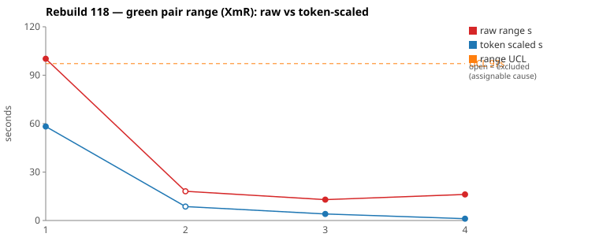
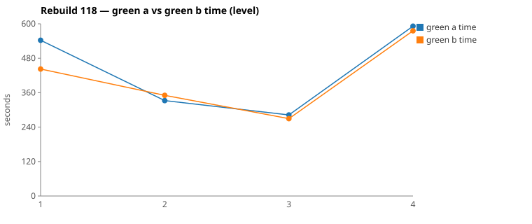

* TOC
{:toc}

---

# Context

This is a batch-level companion to [pbc-83][5] through [pbc-104][41], [pbc-108][42], [pbc-109][43], [pbc-111][44], [pbc-112][45], [pbc-113][46], [pbc-114][47], [pbc-115][49], [pbc-116][50], and [pbc-117][51], using the same in-run pair methodology: since [issue #434][7] every Darmok scenario runs its green phase **twice** — worktree `_a` and `_b`, both branched from the *same red commit*, minutes apart — so the pair-range `|green_a − green_b|` from one metrics row nets out model-of-the-day, red commit, and server window, leaving **work** versus **per-token generation rate**. The charted quantity is the **Selected range** `min(raw, token-scaled)` fixed in [pbc-94][29].

**Rebuild118 is the first run after the review loop closed.** Between Rebuild117 and this run, [pbc-117][51]'s **# Graph Changes** work list was applied to `pit.Issues.orig.graphml` by the new `/rgr-update-graph` skill: three pinning Test-Cases added (`Duplicate References`, `Multi Line Description`, `Different Predecessor Object`), a no-op legacy case deleted, all validated green on main before the run. This run measures whether those input edits — and only input edits — moved the two detectors. They did, in opposite directions again, but this time both the right way:

| | Rebuild116 | Rebuild117 | Rebuild118 |
|---|---|---|---|
| Selected pair-ranges | `[157, 71, 17, 58]` | `[24, 174, 1, 15]` | **`[76, 9, 4, 1]`** |
| Functional diffs | 1 | 3 | **1** |
| Allowlist violations | 0 | 0 | **0** |
| Mean green time | 422 s | 398 s | 437 s |

The widest pair is the run's **first full pair** — `Step Object - From Previous Steps`, the concept-introducing case that implements `suggestStepObjectNameWorkspace` from nothing at the baseline — and it carries **no functional diff**. The green level rose because this run built the feature from the `RebuildBaseSheepDogGrammarIssues` baseline (which has none of the proposals code); the range fell because the pins were in force exactly where the halves diverged in Rebuild114–117. That is the healthy shape [pbc-113][46] defined, produced for the first time by a deliberate graph edit.

The two widest pairs **split** — common cause on the widest, assignable on the second.

| Scenario | Commit | Green `_a` | Green `_b` | Raw range | Token-scaled range | Selected range | Verdict |
|---|---|---|---|---|---|---|---|
| Step Object - From Previous Steps (4.1) | `7459ea62` | 9:48 | **8:20** | 87,772 ms | 76 s | **76 s** (scaled) | **common cause** — `No functional diff`; identical committed code, same route, `_a` at 1.5× the Grep/Edit volume. The run's biggest new-logic delta, by design. |
| Step Object - From Workspace (4.2) | `9cdcbcab` | **5:32** | 5:50 | 18,087 ms | 9 s | **9 s** (scaled) | **assignable** — functional diff: `getLineListAsString` (A) vs first-line-only (B) on multi-line descriptions. The sibling pin then *decided* it — see Pair 2. |

(Bold = the winning half brought back and refactored.) Sheet limits over `[76, 9, 4, 1]`: `range_mean` **22.4 s**, `range_MR_bar` **25 s**, `range_UCL` **88.4 s** — no breach. Excluding the one assignable row: `[76, 4, 1]`, and on the chart's values `[58, 4, 1]` → **UCL 97 s** with the common-cause first case comfortably inside. Three of four rows are at **9 s or below** — the tightest tail the series has recorded.

*(Data note: picks came from the current pair-range sheet (gid `553841928`); its `todo` columns match `metrics.csv`. Two rows were **re-run** later in the day: `Step Object - From Previous Steps` has a second full pair (`497dbe14`, 13:15, raw 100 s → 58 s scaled) and `Step Parameters - From Workspace` a second (`cef93e5d`, 11:04 — the one the sheet carries; its first attempt `5b5cd979` at 02:24 ranged 130 s raw). The sheet carries the *first* From-Previous-Steps pair, the chart script's dedup carries the *last*, so the SVG's first point reads 58 s where the tables read 76 s; the top-2 pick is identical either way, and the 13:15 re-run is also `No functional diff` (winner `_b` again). A 10:46 red-only sweep re-checked thirteen scenarios in ~4 minutes (all zero pairs, all passing) — those rows share one `commit` value (`a106fa64`), the [#616][616] labelling artifact, but zero rows are never charted so nothing downstream is affected.)*

---

# Charts

Scenarios are numbered in run order; the tables below say which index each is. The Moving-Range chart plots **raw** (red) and **token-scaled** (blue) together so `Selected` — their lower envelope — is visible, with the UCL (off Selected, the one assignable row excluded) as the dashed orange line. The Green chart is the absolute level.





---

# The token-scaled pair-range (recap)

Wall-clock fuses **real work** (≈ green output tokens) with the **per-token generation rate** (server load, queue, context-prefill jitter — uncontrollable). The full token-scaled derivation is in [pbc-83][5]; [pbc-90][22] added the NET refinement (deduct Edit/Write/TodoWrite bookkeeping) and [pbc-94][29] fixed the selection rule:

- `raw` = `|a − b|`, the wall-clock gap.
- `net_x` = `raw_tokens_x − edit_x − write_x − todo_x`, stripping verbose TodoWrite re-emissions and whole-method Edit/Write payloads.
- `token-scaled` = `|net_a − net_b| × fast_time / fast_raw`, the gap implied by **work** tokens at the faster half's rate.
- **`Selected = min(raw, token-scaled)`.** Scaling only removes variation (rate, bookkeeping); a token-scaled value larger than the clock gap is a phantom, so we keep the clock.

Pair 1 is CELL 3 with NET 31.4 % apart — a real work-volume difference on the run's biggest task. Pair 2 is the now-familiar false-quiet cell: time-similar (5.4 %), NET within 4.4 %, CELL 4→1 — the gate's cleanest "equivalent work" reading — on a pair that committed different rules. That is the third consecutive run in which the behavioural detector fired inside timing noise ([pbc-115][49] Pair 2, [pbc-117][51] Pair 2, now this).

---

# Pair 1 — `7459ea62` (4.1 Step Object - From Previous Steps): the concept-introducing case, in control

The run's **widest Selected** range (76 s on the sheet's pair; the 13:15 re-run scales to 58 s). The mojo logged **`Green: No functional diff between pair`**, winner `_b` — in both pairs of this scenario.

| | `_a` 9d15b331 | `_b` 34b5dab8 |
|---|---|---|
| Green wall-clock | 9:48 | **8:20** |
| Green output tokens | 18,947 | 15,881 |
| **NET tokens** | 7,639 | 5,241 |
| Read / Grep | 15 / **20** | 16 / 13 |
| Edit / Write / Glob | **11** / 4 / 3 | 8 / 4 / 3 |
| Tool-result bytes (Read) | 120,118 | 142,529 |

Raw tokens differ **16.2 %**, NET **31.4 %** — CELL 3. No stall: every per-minute bucket is non-zero in both halves (`_a` 619→705 across 11 minutes, `_b` 642→294 across 10), and the quiet stretches align with `mvn`.

This is the first scenario of the entire run, branched from the `RebuildBaseSheepDogGrammarIssues` baseline, which contains **no** `suggestStepObjectNameWorkspace` at all. Both halves therefore implemented the whole concept — previous-step traversal, short and long proposal forms, and (because the `Duplicate References` pin sits in the same group) de-duplication — in one green phase. Both committed identical code; the divergence is volume, not route: `_a` needed 20 Greps and 11 Edits to `_b`'s 13 and 8, converging on the same implementation ~90 seconds later.

The two follow-on siblings then passed **at red** with zero green pairs: `Step Object - From Background Steps` (01:46) and `Step Object - From Background Steps - Duplicate References` (01:47) — the [pbc-117][51] dedup pin among them. The first implementation absorbed them, which is design rule 1 working as stated: *the first case of a concept carries the one new method; every later sibling varies only data.*

**UML consultation symmetric and complete**: both read all five spec files including `uml-communication.md`. Neither opened a per-class `uml-class-*.md` — unchanged across the series.

**Verdict: common cause.** The widest range of the batch on its biggest task, no behavioural divergence, no breach (76 s against 88.4 s un-excluded, 58 s against 97 s on the chart's values). A first-of-concept case is *expected* to carry the batch's widest range; acting on it would be tampering. What would shrink it is not a test-case change but the curriculum continuing to work — later runs' first-cases get smaller as the codebase accretes.

---

# Pair 2 — `9cdcbcab` (4.2 Step Object - From Workspace): the warn fired, and the pin caught it

The run's **second-widest Selected** range (9 s, run index 2; raw 18 s). The mojo logged:

> `Green: Functional diff between pair (warn): description extraction in suggestStepObjectNameWorkspace: A concatenates all description lines via getLineListAsString, B takes only the first line; differentiating input is a step object with a multi-line description`

Winner `_a`.

| | `_a` c16aa8b8 | `_b` 876a8991 |
|---|---|---|
| Green wall-clock | **5:32** | 5:50 |
| Green output tokens | 8,080 | 9,227 |
| **NET tokens** | 4,732 | 4,522 |
| Raw range | 18 s (5.4 % of faster half) | |
| Decision matrix | **CELL 4→1 — "equivalent work"** | |

This is the same ambiguity Rebuild117 flagged on this same scenario (join rule for multi-line descriptions), re-split on a re-derived implementation — the [pbc-115][49] winner-flip phenomenon, except this time the run carried the pin.

**What the pin did and did not do.** The Rebuild117 review's fix, applied by `/rgr-update-graph`, added `Step Object - From Workspace - Multi Line Description` as a **sibling** Test-Case asserting `First lineSecond line` — the `getLineListAsString` rule. This run:

1. At `From Workspace` itself, the fixture still has a **single-line** description, so both rules pass, the byte-compare sees two different implementations, and **the warn fires** — the pair still diverged here, costing nothing this time (9 s selected).
2. One scenario later (01:59), `Multi Line Description` hit red **against the winner's code**. Winner `_a` used `getLineListAsString` → the pin passed at red, zero green pair, no Darmok work. Had `_b` (first-line) won on wall-clock, the pin would have gone red and forced the fix in a normal RGR cycle.

So the pin converted an unbounded ambiguity into a **bounded, self-correcting one**: whichever rule wins the coin-flip, the model's decided rule is enforced within one scenario. What it did not do is stop the *pair* from sampling two rules at the scenario whose fixture is single-valued — for that, the ≥2 sample has to live in the **same Test-Case's fixture**, not a sibling. That is this run's one Graph Change.

**UML consultation symmetric** — both read all five files.

**Verdict: assignable** — by the standing rule that a functional-diff warn overrides the token gate. But it is the mildest assignable in the series: 9 s selected, and the divergence is already fenced by the sibling pin.

---

# Batch synthesis

Rebuild118 is the evidence the iteration loop was built to produce.

**The pins worked.** All three Rebuild117 Graph Changes were live in this run's inputs. `Duplicate References` and `Multi Line Description` were absorbed at red by the first implementations of their concepts — the cheapest possible outcome — and `Different Predecessor Object` ran a full pair at **4 s selected** with no diff, on the exact ambiguity (component inheritance) that produced a warn in Rebuild117 and a 1 s stealth divergence before that. The one warn that did fire was immediately arbitrated by its sibling pin.

**The curriculum shape appeared.** The run's Selected column `[76, 9, 4, 1]` is the design-rule-1 profile: the concept-introducing case carries the batch's range (and its green level — 545 s mean), the data-varying siblings collapse toward zero, and thirteen scenarios passed at red in a 4-minute sweep because earlier implementations already covered them. Compare Rebuild116's `[157, 71, 17, 58]` where a *later* case forced a new traversal — the ordering defect the redesign was meant to remove.

**The one residual is precise.** The warn shows that a group-level pin decides the rule but does not stop the pair from diverging at a single-valued fixture. The fix is mechanical and small: the ≥2 sample belongs in the same Test-Case (as a second Test-Data row with a differing assertion), so *both halves face the discriminating input in the scenario they are implementing*. That refines design rule 3 — "somewhere in the group" becomes "in the same case when the collection drives a rule chosen at that scenario."

Green level rose 398 → 437 s; that is the baseline effect (this run built the whole proposals feature from nothing), and it is the developer signal doing what it should while the tester signal tightens.

---

# The Fix, or Why No Fix

**Pair 1 is common cause — no action.** First-of-concept, identical code, inside every limit. Tampering otherwise.

**Pair 2 is assignable, and its fix is one Test-Data row.**

**Fix 1 — 4.2 Step Object - From Workspace: move the multi-line sample into the case itself.** Convert the scenario and its `Multi Line Description` sibling into one outline whose Examples differ on the description and on the assertion:

```
Examples: Single line          | Line Content rows: Description        | Proposal Description: Description
Examples: Multi line           | Line Content rows: First line,        | Proposal Description: First lineSecond line
                               |                    Second line        |
```

Both halves of a future pair then implement against a fixture where first-line-only **fails inside the same scenario**, so the byte-compare has nothing left to catch. This supersedes the standalone `Multi Line Description` case (it merges in as the second Examples row) — net Test-Case count unchanged.

**No harness, prompt, or model fix follows.** No allowlist violations, no stalls, no measurement defects beyond the known [#616][616] labelling on zero-pair sweep rows (uncharted, harmless).

---

# Functional Diffs Found

A `Green: Functional diff between pair` warn fires when the two green halves committed **behaviourally divergent** code that *both* pass the current test. This list is **run-wide**.

`.claude/scripts/rgr-review-functional-diffs.sh 118` returned **1** warn — down from 3 in Rebuild117.

| # | Scenario (selected range, run index) | Commit | Differentiating input — what a Test-Case must pin |
|---|---|---|---|
| 1 | Step Object - From Workspace, 4.2 (9 s, idx 2) — *reviewed Pair 2* | `9cdcbcab` | A step object with a **multi-line description in this scenario's own fixture**. The rule is already decided (`getLineListAsString`, pinned by the sibling); the remaining edit moves the sample into the same case so the pair cannot diverge at implementation time. |

Verbatim warn text:

> **1.** description extraction in suggestStepObjectNameWorkspace: A concatenates all description lines via getLineListAsString, B takes only the first line; differentiating input is a step object with a multi-line description

**Reachable, known, and already fenced** — the sibling pin passed at red against the winner and would have gone red against the loser. This is a warn about *where* the sample sits, not *whether* the rule is pinned.

---

# Graph Changes

*Work list for `/rgr-update-graph` — one entry per assignable cause, per the [graph-design](https://github.com/farhan5248/sheep-dog-main/blob/main/sheep-dog-specs/site/process/graph-design.md) rules.*

1. `model:` Issues · `type:` pin-cardinality · `where:` 4.2 Step Object - From Workspace (+ its Multi Line Description sibling) · `input:` a step object description with **two lines in the same Test-Case's fixture** — restructure the two cases as one outline whose Examples differ on line count and assertion (`Description` vs `First lineSecond line`) · `assert:` `First lineSecond line` for the multi-line row (rule already decided in [pbc-117][51]) · `source:` `9cdcbcab`, functional diff, reviewed Pair 2.

No other entry: Pair 1 is common cause, and no off-pick scenario carried a warn.

---

# Mapping to the Research

| Predicted ([pbc-research][2]) | Observed across Rebuild118 |
|---|---|
| Wide pair-range fires the signal | fired on the concept-introducing first case — which is the one place a wide range is *designed* to appear |
| A breach of the limit marks a special cause | no breach; the one special cause sat at **9 s**, third-narrowest of the batch |
| The special cause is in the input, not the system | **confirmed, with a twist** — the input fix was already half-applied; what remains is *where* the pinning sample sits |
| Both halves pass the same test | yes — and for the first time, a sibling pin then failed-or-passed the winner's rule *within the same run* |
| Two work-trees differ | Pair 1: same route, 1.5× volume. Pair 2: equivalent work (NET 4.4 %), different rules |
| The functional-diff scan catches what the range misses | again — 9 s, CELL 4→1, "equivalent work", divergent code |
| **Input edits move the charts** (the loop's core claim) | **3 warns → 1; three pins absorbed or passed at 4 s; tail `[9, 4, 1]`** — the first run where the change between runs was *only* graph edits |

---

# Findings by Variable

*Each subsection records this run's findings about one [Wheeler variable][3].*

## green time pair range

Selected `[76, 9, 4, 1]` (sheet) — mean **22.4 s**, MRbar **25 s**, **UCL 88.4 s**, no breach. Excluding the assignable row: mean 27 s sheet-side; on the chart's dedup values `[58, 4, 1]` → UCL **97 s**. **The finding is the tail**: three of four rows at or under 9 s, against `[9? — no: 24, 15]`-style tails in prior runs — the tightest the series has been, one run after the pins landed.

## green time pair range moving range

MR chain `[67, 5, 3]` → MRbar 25 s, wholly the step off the first case. The three data-varying rows chain `[5, 3]` — dispersion among siblings is single-digit seconds.

## green time

Claude-only per [#568][23]. Sheet-pair means: ~545 s, 342 s, 276 s, 584 s — mean **437 s**, up from 398 s, on a run that built `suggestStepObjectNameWorkspace`, `suggestStepDefinitionNameWorkspace` and the parameters path from a baseline with none of them. Level up + range down = the [pbc-113][46] healthy shape.

## scale & green tokens

All four rows chart `scaled`. Pair 2 is the false-quiet cell again (CELL 4→1, NET 4.4 %) with a live functional diff — the third run running where "equivalent work" and "same rule" came apart.

## functional diff between pair

**One warn, on-pick, reachable — and already fenced by a sibling pin.** 3 → 1 run-over-run with only input edits in between. The residual names a *placement* defect (sample in a sibling, not the same case), not an undecided rule.

## pin effectiveness (new variable this run)

First run with [pbc-117][51]'s pins in force. Outcomes: `Duplicate References` **absorbed at red** (dedup implemented in the concept case), `Multi Line Description` **passed at red against the winner** (and would have gone red against the loser — the self-correction path), `Different Predecessor Object` **ran a normal pair at 4 s, no diff**, on the previously-warned inheritance rule. All three behaved as designed; none produced a warn of its own.

## re-run behaviour

Two scenarios were re-run hours later. `Step Object - From Previous Steps`: 88 s raw → 100 s raw, both `No functional diff`, same winner side — consistent with a stable concept-case cost, not a flake. `Step Parameters - From Workspace`: 130 s raw (02:24) → 16 s (11:04) — the sheet and chart both carry the re-run; the first attempt's width is unexplained and worth a look if it recurs.

## allowlist violation

**None** — third consecutive clean run; the [pbc-114][47] `uml-package.md` gap remains open and remains silent.

## metrics attribution

[#616][616] resurfaced narrowly: the 10:46 red-only sweep wrote thirteen zero-pair rows sharing one `commit` value. Zero rows are never charted, so no downstream effect; the four full pairs are labelled correctly.

## silent stall / timeout

**None.** Every per-minute bucket in the four reviewed halves is non-zero; quiet stretches align with `mvn`.

## green-window attribution

All surveys clipped to each half's green duration from the metrics row per the [#570][25] rule.

---

# Open Questions From This Case

- **Does rule 3 need the refinement this run demonstrated?** "A ≥2 sample somewhere in the group" decides the rule but lets the pair diverge at single-valued fixtures; "in the same Test-Case when the collection drives a rule chosen there" would silence the warn at source. One more run with Fix 1 applied answers it.
- **How fast does the concept-case cost shrink?** 76 s / 58 s selected on this run's first case. If the curriculum claim holds, Rebuild119's first-of-concept (whatever is next in the walk order) should be narrower as the accreted code grows.
- **What widened the first `Step Parameters - From Workspace` attempt to 130 s?** The re-run collapsed to 16 s with no model change in between. Model-of-the-hour, or something in the 02:24 window worth finding.
- **Is the winner-selection question from [pbc-115][49] now moot?** With same-case pins, a wrong-rule winner goes red inside the run and gets corrected; the mojo may not need to consult the warn at selection time at all.
- **Do the per-class `uml-class-*.md` contracts need routing too?** Still no half has opened one, now across ten runs.

---

[2]: https://farhan5248.github.io/specificationbyprompt/architecture-and-capabilities/pbc-research
[3]: wheeler-understanding-variation
[5]: 83
[7]: https://github.com/farhan5248/sheep-dog-main/issues/434
[22]: 90
[23]: https://github.com/farhan5248/sheep-dog-main/issues/568
[25]: https://github.com/farhan5248/sheep-dog-main/issues/570
[29]: 94
[41]: 104
[42]: 108
[43]: 109
[44]: 111
[45]: 112
[46]: 113
[47]: 114
[49]: 115
[50]: 116
[51]: 117
[616]: https://github.com/farhan5248/sheep-dog-main/issues/616
[sheet]: https://docs.google.com/spreadsheets/d/1-TQxiPlFt1TJuXAnJbVmfJlK1rSClU4SwPWYXbLBixI/edit?gid=553841928#gid=553841928
