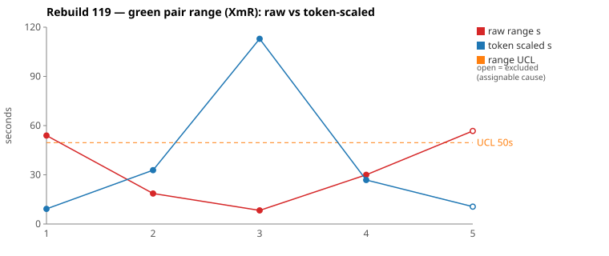
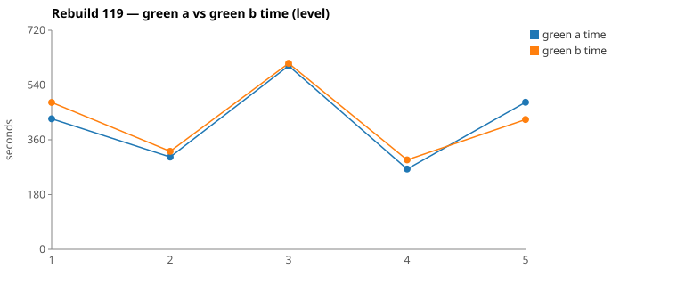

* TOC
{:toc}

---

# Context

This is a batch-level companion to [pbc-83][5] through [pbc-117][51] and [pbc-118][52], using the same in-run pair methodology: since [issue #434][7] every Darmok scenario runs its green phase **twice** — worktree `_a` and `_b`, both branched from the *same red commit*, minutes apart — so the pair-range `|green_a − green_b|` from one metrics row nets out model-of-the-day, red commit, and server window, leaving **work** versus **per-token generation rate**. The charted quantity is the **Selected range** `min(raw, token-scaled)` fixed in [pbc-94][29].

**Rebuild119 ran three times** — tags `Rebuild119Branch1` (the original, 14:15–17:21), `Branch2` (re-run of the first test, 17:51–18:07) and `Branch3` (re-run from the Component-Inherited point, 19:03–19:14) — and this tab carries the user's curated selection across them: the re-run pairs for the two scenarios whose originals went wide. That curation is itself the finding. The run after [pbc-118][52]'s reorder landed:

| | Rebuild117 | Rebuild118 | Rebuild119 (selected) |
|---|---|---|---|
| Selected pair-ranges | `[24, 174, 1, 15]` | `[76, 9, 4, 1]` | **`[9, 19, 8, 27, 11]`** |
| Widest first-test pair | 174 s | 76 s (raw 88–100) | **19 s** (re-run; original 59 s) |
| Functional diffs | 3 | 1 | 2 |
| Allowlist violations | 0 | 0 | **0** |

**The reorder worked.** `Step Object - No Proposals` now leads the walk and absorbed the impl-wiring cost at a 9 s selected range; `From Previous Steps`, which carried 76–100 s as Rebuild118's concept-introducing case, ran 59 s original and **19 s on re-run** — the wiring it used to pay is gone. Limits over the selected rows: `range_mean` **14.7 s**, `range_MR_bar` **14 s**, `range_UCL` **50.9 s** — the tightest limits of the ListProposals era, and no breach.

Both reviewed pairs are **common cause**. The run's substance is elsewhere: one non-reproducing excursion the user flagged (`fc4db325`, 348 s — analyzed below), and two functional-diff warns on Branch1 originals, one of which is the [pbc-114][47] component-less ambiguity **splitting for the third time**.

| Scenario | Commit | Green `_a` | Green `_b` | Raw range | Token-scaled range | Selected range | Verdict |
|---|---|---|---|---|---|---|---|
| Step Definition - Component Inherited - Different Predecessor Object (4.3, Branch3 re-run) | `aa159b2f` | **4:24** | 4:54 | 30,004 ms | 27 s | **27 s** (scaled) | **common cause** — CELL 2: NET 24 % but raw tokens 5.6 %; 15 s scaled range, 45 s rate overhead, no stall, no diff. |
| Step Object - From Previous Steps (4.1, Branch2 re-run) | `70d166d1` | **5:03** | 5:22 | 18,582 ms | 33 s | **19 s** (raw) | **common cause** — CELL 1: tokens 2.3 % apart, 7 s scaled range, no diff. |

*(Data note: picks came from the current pair-range sheet (gid `176549048`), whose rows are the curated cross-branch selection; `metrics.csv` values match each selected pair exactly. The chart script's dedup independently lands on the same rows (last full pair per scenario). The Branch1 originals it supersedes: `From Previous Steps` `b4143b31` 59 s — carrying a warn — and `Component Inherited - DPO` `fc4db325` **348 s**, the excursion analyzed below. One aborted half (`12411a63`, `_b`=0) preceded `b4143b31`. No [#616][616] recurrence on charted rows.)*

---

# Charts

Scenarios are numbered in run order. The Moving-Range chart plots **raw** (red) and **token-scaled** (blue) together so `Selected` — their lower envelope — is visible, with the UCL (off Selected, the warned `Step Parameters` row excluded) as the dashed orange line. The Green chart is the absolute level.

---

# The token-scaled pair-range (recap)

Wall-clock fuses **real work** (≈ green output tokens) with the **per-token generation rate** (server load, queue, context-prefill jitter — uncontrollable). The full derivation is in [pbc-83][5]; [pbc-90][22] added the NET refinement and [pbc-94][29] fixed `Selected = min(raw, token-scaled)`. This run's chart rows include two phantom cases the `min` discards — `From Workspace`'s 113 s token-scaled against an 8 s clock gap (NET differs hugely, clocks do not) — and both reviewed pairs resolve as rate, not work.

---

# Pair 1 — `aa159b2f` (4.3 DPO, Branch3 re-run): rate jitter on a decided rule

The selected tab's **widest** (27 s). **`No functional diff`**, winner `_a`.

| | `_a` 4e38819e | `_b` 30aac085 |
|---|---|---|
| Green wall-clock | **4:24** | 4:54 |
| Green output tokens | 7,102 | 6,704 |
| **NET tokens** | 3,026 | 2,304 |
| Scaled range / rate overhead | **15 s** / 45 s | |

CELL 2 — same work, different speed. No stall (every per-minute bucket non-zero; the 353/370-token tail minutes align with `mvn`). Both halves took the description from the step definition — the rule `fc4db325`'s winner settled — in one edit each. **Verdict: common cause.**

# Pair 2 — `70d166d1` (4.1 From Previous Steps, Branch2 re-run): the wiring is gone

Second-widest (19 s). **`No functional diff`**, winner `_a`.

| | `_a` 42833eef | `_b` 59c0077d |
|---|---|---|
| Green wall-clock | **5:03** | 5:22 |
| Green output tokens | 8,704 | 8,912 (2.3 % apart) |
| Scaled range / rate overhead | **7 s** / 11 s | |

CELL 1. In Rebuild118 this scenario was the concept-introducing case at 76–100 s raw with a 59–95 s Guice-wiring todo item; with `No Proposals` now leading the walk, that item collapsed and the scenario runs at sibling width. **Verdict: common cause.**

---

# The `fc4db325` excursion — 348 s that didn't reproduce, and what it was

The user flagged the Branch1 original of the 4.3 pair: `_a` **9:44** vs `_b` **3:55**, raw range 348 s, no functional diff, no stall, no timeout. The todo-phase breakdown localizes every second:

| Todo item | `_a` 3e104b82 | `_b` 78dc49c3 |
|---|---|---|
| Read five UML files + greps | 68s ·7 | 60s ·7 |
| Read jacoco-shortlist + listed files | 103s ·9 | 47s ·7 |
| Implement src/main changes | 17s ·1 | 14s ·1 |
| **Run mvn verify -Dtest=RGRTest** | **312s ·28** | **36s ·1** |

Both halves wrote their implementation in a single ~15 s edit. The fixture has **two description slots** — the step object's file-level `description/lineList` and the step definition's `stepDefinitionList/1/description/lineList` — and populates only the second. `_b` read the right slot (`sd.getDescription()`) and passed verify first try. `_a`'s first edit read the wrong slot (`stepObject.getDescription()`), which is **empty**, so the test failed with `but was: <>` — and an empty string names nothing. `_a` then spent 20:58–21:01 in `LOG_LEVEL=DEBUG` archaeology chasing the *wrong hypothesis* (inheritance: `getStepObjectFullNameForTestStep`, `Component Inherited` greps in the runtime log) before finding the real confusion and reverting to the SD slot.

The Branch3 re-run came in at 30 s: the coin landed right twice. So the excursion is **non-reproducing — common cause as a level** — but its mechanism is nameable and recurs at coin-flip frequency until pinned. Two candidate preventions were weighed:

1. **Test data (chosen — Graph Changes entry 1):** populate *both* description slots with distinct values and assert the SD's. This cannot stop the wrong first edit (the edit precedes the test run), but it converts the failure from undiagnostic `but was: <>` into `expected: Creates empty file, but was: <the object's text>` — naming the confusion directly and deleting the five-minute log dig. It is the standing cardinality rule in a new coat: a two-slot collection sampled at one.
2. **UML specs (deferred, recorded as the open question):** `uml-class-TypeIssueResolver.md § suggest` says nothing about description sources, and across eleven reviewed runs **no green half has ever opened a per-class `uml-class-*.md`** — partly routing (the [#614][614] fix routed `uml-communication.md` only), partly the naming gap (`TestStepIssueResolver` vs `uml-class-TypeIssueResolver.md`). A one-line contract plus a shortlist pointer would prevent the wrong first edit itself. This is the first finding in the series that test data cannot fully fix.

---

# Batch synthesis

Three things.

**The reorder claim from [pbc-118][52] is confirmed.** The wiring cost moved to `No Proposals` (9 s selected) and `From Previous Steps` fell from 76–100 s to 19 s. The mean Selected is 14.7 s with a 50.9 s UCL — ListProposals now sits where the stabilised quickfix series sat in the lifecycle tab, which is the convergence criterion.

**The re-run protocol is now part of the method.** Both wide Branch1 originals were re-run under their own tags; both collapsed (59→19, 348→30). One re-run distinguishes a level from a fluke — Rebuild118's first-test pair reproduced (88→100, a level, fixed by reorder); Rebuild119's DPO pair did not (348→30, a coin flip whose cost entry 1 bounds).

**The remaining warns are the backlog, not new ambiguity.** `b4143b31`'s component-less axis is the [pbc-114][47] Fix 2 that was never applied, now split **three times** (114: propose-short won; 115: skip won; 119: skip won). `859caff9`'s description-hardcode axis is the same slot-sampling family as the excursion. Both are pinnable today.

---

# The Fix, or Why No Fix

**Both reviewed pairs: no fix — common cause, and acting would be tampering.** The work is in the warns and the excursion:

**Fix 1 (entry 1) — 4.3: populate both description slots.** Per the user's decision, the DPO fixture gains a file-level description (`Object file docs`) alongside the SD's `Creates empty file`, asserting the SD's. Wrong-slot reads become self-diagnosing.

**Fix 2 (entry 2) — 4.1: pin the component-less previous-step ref.** Third split. The winners disagree 2-to-1 for *skip* against [pbc-115][49]'s chosen *propose-short*; the rule needs a human call before pinning — marked ASK.

**Fix 3 (entry 3) — 4.4: pin the `correctCellListWorkspace` axes.** A parameters-set description populated and asserted (pins from-model over the winner's hardcoded empty), and the table-less non-Content param — intended behaviour unknown, marked ASK.

**No harness, prompt, or model fix in this run's scope.** The UML-contract routing gap (`uml-class-*.md` never read, naming gap `{Type}` vs concrete class) is recorded as the series' first data-unfixable finding — a [#614][614]-class GH issue when the user wants it.

---

# Functional Diffs Found

Run-wide scan: **2** warns, both on Branch1 originals, neither on a selected-tab row.

| # | Scenario | Commit | Differentiating input |
|---|---|---|---|
| 1 | Step Object - From Previous Steps (4.1) — *original of reviewed Pair 2* | `b4143b31` | **(a)** a component-less previous-step ref (**third split** of [pbc-114][47] Fix 2); **(b)** dedup by object name — arbitrated in-run by the `Duplicate References` pin passing at red. |
| 2 | Step Parameters - From Workspace (4.4) — *not reviewed; its selected row is the excluded chart point* | `859caff9` | **(a)** a table-less non-Content parameter; **(b)** a parameters-set description — A reads the model, B (the winner) hardcodes empty, and no assertion catches it. |

> **1.** Guard condition differs: component-less object refs (valid per grammar) produce a short proposal in A but are skipped in B; also A deduplicates by object name while B does not

> **2.** In correctCellListWorkspace, A includes table-less non-Content params as proposals while B skips them; also A populates description from the model while B hardcodes empty string

---

# Graph Changes

*Work list for `/rgr-update-graph` — one entry per assignable cause, per the [graph-design](https://github.com/farhan5248/sheep-dog-main/blob/main/sheep-dog-specs/site/process/graph-design.md) rules.*

1. `model:` Issues · `type:` pin-cardinality · `where:` 4.3 Step Definition - Component Inherited - Different Predecessor Object · `input:` **both description slots populated with distinct values** — file-level `description/lineList` = `Object file docs`, `stepDefinitionList/1/description/lineList` = `Creates empty file` · `assert:` `Proposal Description = Creates empty file` (the step definition's own description feeds a step-definition proposal) · `source:` `fc4db325` 348 s excursion — wrong-slot first edit failed as undiagnostic `<>`; user-decided option 1.
2. `model:` Issues · `type:` pin-cardinality · `where:` 4.1 Step Object - From Previous Steps · `input:` a previous step referencing a **component-less** object (`The Output file is present`) · `assert:` **ASK** — propose-short ([pbc-115][49]'s chosen rule, 1 of 3 winners) vs skip (2 of 3 winners, current surviving code) · `source:` `b4143b31` warn, third split of [pbc-114][47] Fix 2.
3. `model:` Issues · `type:` pin-cardinality · `where:` 4.4 Step Parameters - From Workspace (correctCellListWorkspace path) · `input:` **(a)** a parameters-set description populated and asserted (`assert:` from-model text, not empty); **(b)** a **table-less non-Content** parameter (`assert:` **ASK** — proposed or skipped) · `source:` `859caff9` warn.

---

# Findings by Variable

## green time pair range

Selected `[9, 19, 8, 27, 11]` — mean **14.7 s**, MRbar **14 s**, **UCL 50.9 s**, no breach; excluding the warned SP row barely moves it (chart UCL 50 s). **At the lifecycle level this batch sits inside the stabilised series' limits (~10 s mean, ~33 s UCL) for the first time since ListProposals began** — the convergence criterion is one clean run away.

## green time pair range moving range

MR chain `[10, 11, 19, 16]` → MRbar 14 s. No single dominating link — dispersion is even, which the series has not shown since Rebuild113.

## green time

Sheet-pair means ~456, 313, 607, 279, 455 s. `From Workspace` at 607 s mean is now the level ceiling — its NET tokens (13.4k/9.7k) say it is genuinely the biggest case, worth watching as a future `split` candidate if its pair widens.

## functional diff between pair

Two warns, both Branch1, both **backlog items surfacing again** rather than new ambiguity: the thrice-split component-less rule and the description-slot family. The `Duplicate References` pin arbitrated warn 1's dedup axis in-run — second consecutive run a pin has done its job.

## excursion / re-run protocol (consolidated variable)

`fc4db325` 348 s → re-run 30 s: **non-reproducing, coin-flip mechanism, cost bounded by entry 1.** Contrast Rebuild118's first-test pair (88 → 100 s: reproducing, structural, fixed by reorder). Two re-runs now suffice to classify an excursion as level vs fluke; the review treats only reproducing values as redesign signals.

## allowlist violation

**None** — fourth consecutive clean run.

## silent stall / timeout

None on reviewed pairs. One aborted half (`12411a63`, `_b` = 0 ms) preceded the `b4143b31` pair — the run recovered by re-running the scenario; not investigated further.

## green-window attribution

All surveys clipped per the [#570][25] rule.

---

# Open Questions From This Case

- **Should the per-class UML contracts finally get routed?** Eleven runs, zero opens, and now a measured 348 s cost traceable to a rule (`description source`) that `uml-class-TypeIssueResolver.md` could state in one line. Test data bounds this class of cost; only the contract prevents it. A [#614][614]-style issue (shortlist rows pointing to the concrete class's `uml-class-*.md`) is the sanctioned lever.
- **Is the component-less rule finally decidable?** Three splits, winners 2-to-1 against the spec narrative's reading. Entry 2's ASK forces the call.
- **Is `From Workspace` (607 s mean green) the next split candidate?** Biggest case by NET tokens; pair still tight (8 s). Watch, don't act.
- **Convergence check:** one more run with zero warns and the mean holding ~15 s closes the ListProposals iteration per the [graph-design](https://github.com/farhan5248/sheep-dog-main/blob/main/sheep-dog-specs/site/process/graph-design.md) criterion.

---

[5]: 83
[7]: https://github.com/farhan5248/sheep-dog-main/issues/434
[22]: 90
[25]: https://github.com/farhan5248/sheep-dog-main/issues/570
[29]: 94
[47]: 114
[49]: 115
[51]: 117
[52]: 118
[614]: https://github.com/farhan5248/sheep-dog-main/issues/614
[616]: https://github.com/farhan5248/sheep-dog-main/issues/616
[sheet]: https://docs.google.com/spreadsheets/d/1-TQxiPlFt1TJuXAnJbVmfJlK1rSClU4SwPWYXbLBixI/edit?gid=176549048#gid=176549048
