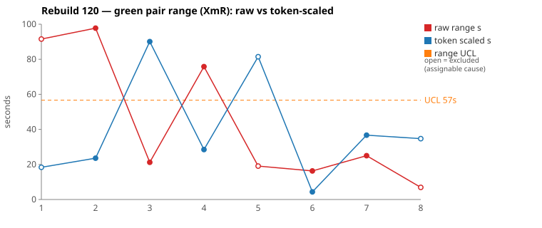
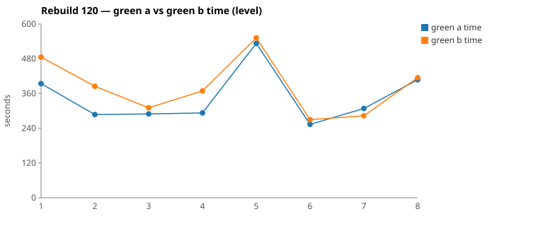

* TOC
{:toc}

---

# Context

This is a batch-level companion to [pbc-83][5] through [pbc-118][52] and [pbc-119][53], using the same in-run pair methodology: since [issue #434][7] every Darmok scenario runs its green phase **twice** — worktree `_a` and `_b`, both branched from the *same red commit*, minutes apart — so the pair-range `|green_a − green_b|` nets out model-of-the-day, red commit, and server window. The charted quantity is the **Selected range** `min(raw, token-scaled)` fixed in [pbc-94][29].

**Rebuild120 is the first run of the full redesigned curriculum, and it validates the loop mid-run.** The user stopped the first attempt at its very first functional diff (`1325e6bf`, on the pre-fix model), the warn was reviewed, the [pbc-119][53]-era Component Filter pin plus its implementability code fix landed on main, and the run was restarted. The restart completed **all eight** ListProposals concepts as full pairs — the largest chartable batch of the era — including all five pins added since Rebuild117:

| Pin (added in) | This run | Verdict on the pin |
|---|---|---|
| Duplicate References (117) | passed at red | held |
| Description Join (117/118 rename) | full pair, **4 s**, no diff | held |
| Different Predecessor Object + dual description slots (117/119) | full pair, **25 s**, no diff | held — no wrong-slot excursion, no `fc4db325` repeat |
| Short Form (119) | full pair, **24 s**, no diff | held — propose-short enforced at red |
| Component Filter (120, mid-run) | full pair, **19 s** | forced both halves to implement filtering — and surfaced the next layer down (warn 3) |

Selected `[18, 24, 21, 28, 19, 4, 25, 7]` — mean **18.4 s**, MRbar **11 s**, **UCL 47.9 s**, no breach, and for the first time **no single scenario dominates**: the widest (28 s) is 1.5× the mean, against 4–12× in Rebuild116–118. Both reviewed pairs are **common cause**.

| Scenario | Commit | Green `_a` | Green `_b` | Raw range | Token-scaled range | Selected range | Verdict |
|---|---|---|---|---|---|---|---|
| Step Object - From Workspace (4.2) | `17e03791` | **4:53** | 6:09 | 75,810 ms | 28 s | **28 s** (scaled) | **common cause** — CELL 3, NET 20.4 %; 43 s scaled + 33 s rate. No diff; the workspace-listing delta being sampled twice. |
| Step Definition - Component Inherited - DPO (4.3) | `c75d69f9` | 5:08 | **4:43** | 25,012 ms | 37 s | **25 s** (raw) | **common cause** — CELL 1, tokens 7.5 %, 2 s rate overhead. No diff; the dual-slot pin held. |

*(Data note: picks came from the current sheet (gid `453912972`); `metrics.csv` matches every row. The stopped first attempt (`1325e6bf`, 01:2x) and two aborted halves (`345e2376`, `c2678e5a`) precede the charted pairs; a 12:xx red-only sweep carries the [#616][616] label artifact on zero rows only. `Step Parameters` — the outline g2a merged from `From Workspace` + `Header Mismatch` in [pbc-119][53]'s update — completed at 13:xx (`0938bd4b`).)*

---

# Charts

Scenarios are numbered in run order. The Moving-Range chart plots **raw** (red) and **token-scaled** (blue) with the UCL (off Selected; the three warn-carrying rows excluded) as the dashed orange line. The Green chart is the absolute level.

---

# The token-scaled pair-range (recap)

`raw = |a − b|`; `token-scaled = |net_a − net_b| × fast_time / fast_raw` with NET stripping Edit/Write/TodoWrite payloads; **`Selected = min(raw, token-scaled)`** ([pbc-83][5], [pbc-90][22], [pbc-94][29]). This batch shows the `min` working in both directions: `From Previous Steps` charts raw 21 s against a 90 s token-scaled phantom (NET differs 2×, clocks don't), while `No Proposals` charts scaled 18 s against a 92 s raw gap that was rate and bookkeeping.

---

# Pair 1 — `17e03791` (4.2 From Workspace): the concept case, sampled honestly

Widest selected (28 s; raw 76 s). **`No functional diff`**, winner `_a`. NET 20.4 % apart (CELL 3): `_b` explored more implementing the same listing — same files, same outcome, 33 s of the raw gap was rate. With the Component Filter sibling now pinning the filter rule one walk later, nothing in the divergence is a spec question. **Verdict: common cause.**

# Pair 2 — `c75d69f9` (4.3 DPO): the excursion scenario, quiet

Second-widest (25 s). **`No functional diff`**, winner `_b`. CELL 1 — tokens 7.5 % apart, 2 s rate overhead. This is the scenario that produced [pbc-119][53]'s 348 s excursion; with both description slots populated, both halves read the SD slot and landed within 25 s. **Verdict: common cause** — and direct evidence the dual-slot pin removed the coin flip.

---

# Batch synthesis

Three statements, in strength order.

**The curriculum ran end-to-end and the dispersion is flat.** Eight concepts, mean 18.4 s, widest 28 s at 1.5× mean. Every prior batch had a dominating scenario (Rebuild117: 174 s at 12× mean); this one has none. The degenerate-first order held (`No Proposals` absorbed the wiring at 18 s selected), and the five pins either passed at red or ran tight pairs with no diffs.

**The warns have moved down a layer.** None of this run's three restart warns is a re-split of a previously pinned rule — they are the *next* rules under the pinned ones: which *source* feeds the component fallback (under the pinned filter), which *value representation* a proposal carries (under the pinned listing), which *string* becomes the proposal value when a parameter's name and cells differ (under the pinned replace). The loop is peeling the ambiguity stack in order.

**Stop-at-first-warn worked as a protocol.** The stopped attempt cost one scenario; the mid-run fix meant the restart's Component Filter case *forced* both halves to implement filtering — converting last run's silent divergence into pinned behaviour within the same day.

---

# The Fix, or Why No Fix

**Both reviewed pairs: no fix — common cause.** The work is in the three restart warns, routed below; entries 1–2 are graph work, the third is the known observability gap.

---

# Functional Diffs Found

Run-wide scan: **4** warns — one on the stopped pre-fix attempt (superseded), three on the restart.

| # | Scenario (selected, idx) | Commit | Differentiating input |
|---|---|---|---|
| 0 | Step Object - No Proposals — *stopped attempt, pre-fix model* | `1325e6bf` | Superseded: reviewed mid-run; produced the Component Filter pin + main's filter fix. |
| 1 | Step Object - No Proposals (18 s, idx 1) | `54663d32` | **String vs `SheepDogStepObjectRef` proposal values** — invisible to popup asserts (`toString` identical); the [pbc-119][53] axis-2 residual, exactly as predicted. |
| 2 | Step Object - From Workspace - Component Filter (19 s, idx 5) | `f06d5aa8` | **Which source feeds the component fallback** for a step whose `stepObjectName` lacks a component: `getStepDefinitionName` (A — empty under real xtext parsing → unfiltered) vs `getFullName` (B — *inherits* the previous step's component → filtered). Differentiating fixture: an object-less, component-less step after a qualified step, with a **multi-component workspace**. |
| 3 | Step Parameters (7 s, idx 8) | `0938bd4b` | A step parameters set whose **name differs from its table cells** (2.2's own fixture shape: name `Multiple Parameters`, cells `N1, N2`): value = first-row cells (A) vs `sp.getName()` (B). |

> **1.** suggestStepObjectNameWorkspace sets proposal value to plain String (A) vs SheepDogStepObjectRef object (B) for any input with matching step objects

> **2.** fallback getComponent call uses getStepDefinitionName (never matches "^The" regex, always empty) vs getFullName (can match), producing different proposal filtering when stepObjectName lacks a component

> **3.** In suggestCellListWorkspace, Candidate A uses table first-row cells as proposal value when a table exists, while Candidate B always uses sp.getName(); differs for any step parameter with a table whose cell content differs from the parameter name.

All three restart warns are on **off-pick** rows (the range picks were both clean) — the run-wide scan earning its keep again.

---

# Graph Changes

*Work list for `/rgr-update-graph` — one entry per assignable cause, per the [graph-design](https://github.com/farhan5248/sheep-dog-main/blob/main/sheep-dog-specs/site/process/graph-design.md) rules.*

1. `model:` Issues · `type:` pin-cardinality · `where:` 4.2, alongside Component Filter · `input:` an **object-less, component-less step** (`empty`) following a qualified step, with a **multi-component workspace** (daily Input file + nightly Output file) · `assert:` **ASK** — does a component-less step see the whole workspace (A's rule, and current main: the reconstructed text yields no component → unfiltered), or does it **inherit** the previous step's component as a filter (B's rule, via `getFullName`)? The import analogy cuts both ways here: an in-scope import could plausibly scope the suggestions, or the absence of any stated component could mean "show me everything" · `source:` `f06d5aa8` warn.
2. `model:` Issues · `type:` pin-cardinality · `where:` 4.4 Step Parameters outline · `input:` a parameters set whose **name differs from its cells** — name `Multiple Parameters`, cells `N1, N2` (the 2.2 fixture shape) · `assert:` proposal **Value = the cells** (`N1, N2`), **Id = the name** — the rule 2.2's mismatch case already established; decided by precedent, not ASK · `source:` `0938bd4b` warn.

No entry for warn 1 (String vs Ref): **not test-expressible** — both types render identically in popup asserts and no apply-from-proposals step phrase exists. It is the standing observability gap from [pbc-119][53]'s discussion (UML contract line + apply-phrase New-Feature work), not a graph edit.

---

# Mapping to the Research

| Predicted ([pbc-research][2]) | Observed across Rebuild120 |
|---|---|
| Wide pair-range fires the signal | fired on the two biggest *deltas* (workspace listing, inheritance) — both clean; all three real findings were off-pick |
| A breach marks a special cause | no breach; the batch has no dominating scenario for the first time |
| The special cause is in the input | two of three warns are pinnable inputs; the third is an observability limit, named as such |
| Both halves pass the same test | yes — eight pairs, three encoding divergent rules the current asserts cannot see |
| The functional-diff scan catches what the range misses | **all three restart findings** were off-pick |
| Input edits move the charts (the loop's claim) | five pins from three prior runs all held; the excursion scenario ran at 25 s; the warn stack moved down a layer |

---

# Findings by Variable

## green time pair range

Selected `[18, 24, 21, 28, 19, 4, 25, 7]`: mean **18.4 s**, MRbar **11 s**, **UCL 47.9 s** (chart, three warned rows excluded: UCL 57 s). No breach, no dominating point — the flattest profile of the series. Against the lifecycle band (~10 s mean, ~33 s UCL): close but not yet inside; the batch is also carrying five first-implementation concepts at once.

## green time

Per-scenario means ~440, 336, 300, 331, **543** (Component Filter — new nightly-batchjob impl wiring), 262, 296, 411 s → mean **365 s** across 8. Level behaving as the curriculum predicts: biggest where new interfaces get created.

## functional diff between pair

Three on the restart, **all off-pick, all one layer below previously pinned rules** (fallback source under the filter; value type under the listing; name-vs-cells under the replace). None is a re-split of a pinned rule — first run in the series where that holds.

## pin effectiveness

Five for five: Duplicate References absorbed at red; Description Join 4 s; DPO 25 s with no wrong-slot excursion; Short Form 24 s enforcing propose-short; Component Filter forcing filter implementation in both halves.

## stop-at-first-warn (new variable this run)

The user stopped the first attempt at its first warn; review + graph pin + code fix landed; the restart converted the divergence into pinned behaviour same-day. Cost: one scenario re-run. This is a faster loop than run-level review and worth keeping for first-of-curriculum runs.

## allowlist violation / stall / attribution

None / none / [#616][616] on the 12:xx sweep's zero rows only. All surveys clipped per [#570][25].

---

# Open Questions From This Case

- **Entry 1's rule is a genuine spec fork:** should a component-less step's workspace suggestions inherit the previous component as a scope filter? Both readings are defensible under the import analogy; the ASK forces the call before Rebuild121.
- **Is the warn stack finite?** Each run's warns now sit strictly below the previous pins. If Rebuild121's warns are again one layer down (or zero), the peeling converges; if a pinned rule re-splits, something is regenerating ambiguity.
- **The String-vs-Ref gap is now warned twice in one day** — the apply-from-proposals phrase (observability) is the only durable close.
- **Mean 18.4 s vs the ~10 s lifecycle band:** is the residual the five simultaneous first-implementations, or the new level? Rebuild121, with all concepts pre-implemented at its baseline, answers it.

---

[2]: https://farhan5248.github.io/specificationbyprompt/architecture-and-capabilities/pbc-research
[5]: 83
[7]: https://github.com/farhan5248/sheep-dog-main/issues/434
[22]: 90
[25]: https://github.com/farhan5248/sheep-dog-main/issues/570
[29]: 94
[52]: 118
[53]: 119
[616]: https://github.com/farhan5248/sheep-dog-main/issues/616
[sheet]: https://docs.google.com/spreadsheets/d/1-TQxiPlFt1TJuXAnJbVmfJlK1rSClU4SwPWYXbLBixI/edit?gid=453912972#gid=453912972
