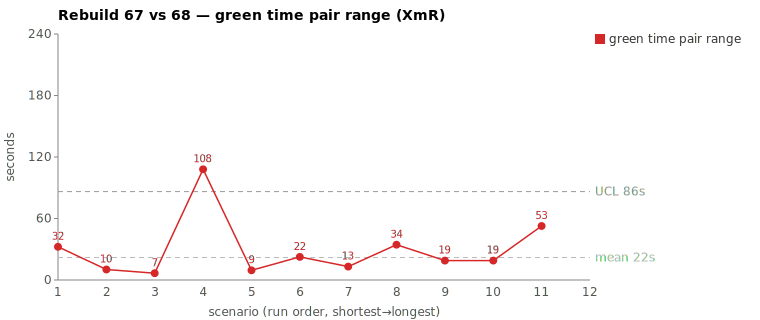
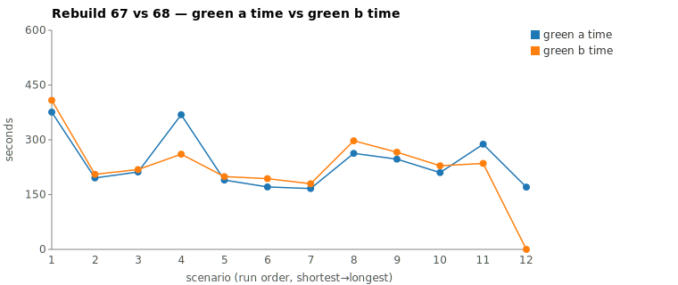

* TOC
{:toc}

---

# Context

This page is a worked comparison in the same tradition as [pbc-4445][3] and [pbc-4849][4]. One Darmok scenario ran twice on the same evening against `sheep-dog-grammar`, on branches `Rebuild67` (22:23) and `Rebuild68` (00:04, ~1.5 h later). The pair-range was the widest on the sheet for this run pair. Unlike [pbc-4849][4] — where the prompt asked Claude to mine a JaCoCo annotation the report never produced — this case has **no missing producer artifact and no assignable cause**. Both runs had byte-identical inputs and produced a byte-identical commit. The spec gave the implementation as a code-body example, and the test fixture itself encoded the one fact that settled the approach. R68 took the shortcut; R67 re-proved the same fact from parser source. That is **common-cause variation** in model deliberation — not a defect in the spec, the prompt, or the harness that hunting this individual pair could remove.

| | Case |
|---|---|
| Scenario | `Test step must have a valid object name validation` |
| Rebuild67 commit | `c0774a4f` |
| Rebuild68 commit | `3b870f25` |
| Green-phase range | **1.8 min** (108,005 ms) |
| Files patched | identical — both produced the same 5-file diff (~78 insertions) |
| Diagnosed cause | **common cause** — the shortcut (read the firing branch off the test's expected value) was available to both; R68 took it, R67 re-derived it from source. No spec gap, no prompt defect; model-of-the-moment variation within a correct system. |

There is no consumer/producer fix here. The only available lever is a **system-level** one — bias the worker to commit to an approach sooner and verify only on first-attempt failure — which is what per-phase `--effort` control ([issue #426][5]) is an experiment toward. It is not expected to *remove* the variance, only to shift the distribution.

---

# Charts

Scenarios are numbered in run order (shortest→longest); see the tables below for which scenario each index is.





---

# What We Observed

| | Rebuild67 (22:23) | Rebuild68 (00:04) |
|---|---|---|
| Commit | `c0774a4f` | `3b870f25` |
| Phase total | 583,551 ms | 455,015 ms |
| Red phase | 76,313 ms | 73,658 ms |
| **Green phase** | **368,680 ms** | **260,675 ms** |
| Refactor phase | 57,004 ms | 51,504 ms |

Green-phase pair-range = **108,005 ms (1.8 min)** — the widest pair on gid `757773815`, next-widest being `This object step definition text parameter doesn't exist validation` at 52,701 ms. This study scopes to the green phase only; red and refactor were within ~3 s of each other on both runs.

Both runs ran the same flow: one `claude --print --session-id <uuid> --model opus @green-compile.md`, with a `green-verify.md` resume on the same session. Both succeeded; the test passed in both. The final commits are the same five files (`scenarios-list.txt`, the regenerated `.feature`, `TestStepIssueDetector.java`, `TestStepIssueTypes.java`, `ValidateActionImpl.java`) with a 78-vs-77 insertion count. The variance is not "Claude wrote different code" and not "Claude wrote more text" — it is "Claude ran more tool calls and thought more before writing the same code."

---

# Where The Time Went

The session JSONLs (`973e2ae8…` for R67, `0f6dfb70…` for R68) were parsed to extract per-segment counts. Both sessions cover green-compile + the green-verify resume; the per-minute token buckets confirm no silent stall in either (every minute non-zero through the working window).

| | Rebuild67 | Rebuild68 |
|---|---|---|
| Green wall-clock (mojo bracket) | 368 s (6:08) | 261 s (4:20) |
| green-compile claude | 5:48 | 3:59 |
| **Time to first Write/Edit** | **4:37** | **2:35 (−2:02)** |
| Assistant turns | 27 | 23 |
| Thinking blocks | 11 | 8 |
| **Output tokens** | **12,104** | **7,041 (−5,063)** |
| Cache-read tokens | 3.70 M | 2.83 M |
| Total tool calls | 41 | 38 |
| Read | 16 | 15 |
| Grep / Glob | 7 | 7 |
| Edit / Write | 4 | 4 |
| `mvn verify` duration | 23 s | 28 s |

Essentially all of the gap is in the **identify portion of green-compile** — the stretch before the first Write. R67 spent **4:37** orienting before it wrote a line; R68 spent **2:35**. After the first write both runs were near-identical: write the two new classes, edit `ValidateActionImpl`, one `mvn verify` (23 vs 28 s), one `validate_main.py`, done. The +5,063 output tokens and +3 thinking blocks all land in that identify stretch — R67's minutes `02:18` (4,484 tok) and `02:19` (3,225 tok) are the heaviest of either session.

---

## The parser-trace divergence — 6 vs 6 greps, different targets

Both sessions open identically (tool calls 1–5: `ToolSearch`→`TodoWrite` seed→`Grep` the error log→`TodoWrite`×2), then both read the jacoco shortlist, the UML interaction spec, and `ValidateActionImpl`. They diverge on **what they grep next**:

| | Rebuild68 (faster) | Rebuild67 (slower) |
|---|---|---|
| Locate the gap | `Grep TestStepIssue` (03:59:13) | — |
| Confirm cursor type | `Grep interface ITestStep` (04:00:00)<br>`Grep public interface ITestStep` (04:00:05) | — |
| **Prove the parse from source** | *(skipped — trusted the spec)* | `Grep addTestStepWithFullName"` (02:17:15)<br>`Grep addTestStepWithFullName` (02:17:19)<br>`Grep assertVertexStep` (02:18:42)<br>`Grep processInputOutputsText` (02:18:49) |
| First Write | 04:00:56 | 02:19:24 |

### What the spec actually gave — and what it can't

The spec is not a signature stub. `site/uml/uml-interaction-main.md` carried the implementation as a **code-body example**, forward-referencing the `TestStepIssueDetector` class that didn't exist yet (both runs noted "no detector yet"). Two relevant blocks:

The cascade in `ValidateActionImpl` (spec lines 98–112) — the `instanceof ITestStep` branch and its fall-through order:
```java
} else if (getProperty("cursor") instanceof ITestStep) {
    ITestStep testStep = (ITestStep) getProperty("cursor");
    validateDialog = TestStepIssueDetector.validateStepObjectNameOnly(testStep);
    if (validateDialog.isEmpty()) {
        validateDialog = TestStepIssueDetector.validateStepDefinitionNameOnly(testStep);
    }
    // … two more fall-throughs to the Workspace variants
}
```

And the body of `validateStepObjectNameOnly` itself (spec lines 205–208):
```java
String stepObjectName = StepObjectRefFragments.getAll(theTestStep.getStepObjectName());
if (stepObjectName.isEmpty()) {
    return TestStepIssueTypes.TEST_STEP_STEP_OBJECT_NAME_ONLY.description;
}
```

So the guard (`getAll(...).isEmpty()` → return that enum) was *handed to both runs verbatim*. What the spec does **not** — and per the project's design **can not** — contain is the runtime fact that `getAll("The is present")` actually evaluates to `""`. Encoding "what does `getAll` return for every input" would drag the whole codebase into the spec. That input-specific evaluation is the only thing genuinely missing from the page.

### The shortcut: the test fixture already pinned it

Neither run needed to derive that runtime fact, because **the test's own expected value encodes it.** The failing assertion's expected text *is* the `TEST_STEP_STEP_OBJECT_NAME_ONLY.description` verbatim. If the expected output equals the Only-branch enum's description, then by construction the cascade lands on the Only branch — which means `getAll` returned empty. The conclusion is readable top-down off the test fixture; no parser trace required.

**R68 read it that way** — it confirmed the cursor type (`grep interface ITestStep`) and that no detector existed (`grep TestStepIssue`), matched the expected assertion to the Only enum, and wrote. **R67 proved it bottom-up instead** — tracing `addTestStepWithFullName` → `assertVertexStep` → `processInputOutputsText` through the parser source to establish that "The is present" drives `getStepObjectName()` to something `getAll` maps to empty. That trace cluster (02:17:15 → 02:18:53) plus the 80 s thinking block at 02:18:41 that consumed it is the ~2 minutes R68 never spent — re-confirming from the codebase a fact the test fixture had already stated.

The thinking transcripts confirm the redundancy: R67 re-states the same sub-conclusion — "`"service,"` runs into `Every test step` with no separator, so it's one concatenated enum description" — five or six times across the `02:16:52` and `02:18:41` blocks, and separately deliberates "minimal vs full cascade implementation." R68 noted the concatenation once ("this is one continuous description string") and moved to write.

---

# Root Cause

There is no missing artifact, no spec defect, and **no assignable cause**. Run the checklist:

- **Spec gap?** No — the spec handed both runs the exact code body, including the `getAll(...).isEmpty()` guard and the enum to return.
- **Prompt defect?** No — the green-compile prompt is the same one that produced the fast run. R68 succeeded under it without strain.
- **Producer/consumer mismatch?** No — unlike [pbc-4849][4], nothing was asked of a report that didn't contain it. The one input-specific fact the spec legitimately can't hold (`getAll("The is present") == ""`) was already encoded in the test's expected value.

What's left is **common-cause variation**. The shortcut — read the firing cascade branch off the expected assertion text — was available to both runs from identical inputs. R68 took it; R67 re-proved the same fact bottom-up from parser source. Both produced the identical five-file commit; R67's extra ~2 minutes and ~5,000 extra output tokens bought no additional correctness. This is the model-of-the-moment landing at different points in its deliberation distribution, not a special cause that inspecting *this* pair could name and remove.

In Wheeler/Deming terms that distinction is the whole point: a wide pair-range is a *signal to investigate*, not proof of a special cause. [pbc-4445][3] and [pbc-4849][4] investigated and found assignable causes (an ambiguous test; a missing producer annotation). This pair investigated and found none — the system is already correct, and the variance is inherent to a stochastic worker. The honest move is to **stop hunting the instance** and ask only whether a system-level change shifts the whole distribution.

---

# The Fix

There is nothing in the spec, prompt, or producer to correct — so the "fix" is not a fix, it is a **system experiment against common-cause variation**.

The lever is per-phase `--effort` control on Darmok's `claude` invocations ([issue #426][5]). The hypothesis is behavioral, not corrective: a lower effort level biases the worker to **commit to an approach sooner and verify only if the first attempt fails**, rather than front-loading a defensive proof it usually doesn't need. R67's 2-minute parser trace is exactly the kind of speculative up-front verification that adaptive thinking would de-prioritize at lower effort — and in the common case (spec + test fixture already agree) skipping it costs nothing, because the first attempt passes `mvn verify` anyway.

Crucially, this is **not expected to remove the variance** — common-cause variation by definition can't be eliminated by tuning the individual run. The measurable claim is distributional: across many scenarios, does `--effort medium` on green-compile narrow the green-phase *spread* (and its pair-ranges) without raising the green-verify failure rate? That is an A/B on the system, read off `metrics.csv`, not a patch whose success is "this pair stops differing."

Start at `medium`, not `low`. The parser trace R67 ran is genuinely required in the minority case where the spec and source disagree (a real compile error, not an assertion mismatch). Set the floor too low and you trade this benign 2-minute tail for occasional red-green retries, which cost far more than they save. The right setting is the one that lets the worker pull the trigger early on the easy cases while still affording the trace when the test signal actually demands it — a setting to be found empirically, not asserted.

A prompt directive ("trust the spec contract, don't re-derive from source") was considered and rejected as the primary lever: it would suppress the defensive trace unconditionally, including the minority case where it's the only thing standing between a wrong patch and a right one. The effort knob is preferable precisely because it's a *bias*, not a *ban* — it lets the test signal still override it.

---

# Mapping to the Research

| Predicted ([pbc-research][2]) | Observed |
|---|---|
| Wide pair-range | green-phase +1.8 min on a 4–6 min baseline |
| Each run individually within in-control band | yes — both typical green-phase range for this scenario |
| Both runs pass the test | yes |
| Two work-trees differ | no — identical 5-file diff, same code |

Like [pbc-4849][4], this is a **pure-path** case: no artifact difference, the variance is entirely in how long the worker took to reach the same output. The pair-range signal fired at 1.8 min anyway. Where it differs is the *outcome* of the investigation — pbc-4849 found a producer/consumer mismatch (a structural defect with a clean fix); this case investigated as thoroughly and found **no assignable cause at all**. That is not a failure of the signal. A control chart's job is to tell you *when to investigate*, not to guarantee every investigation ends in a special cause. Sometimes the answer is "the system is correct and this is common-cause noise" — and recording that honestly is as valuable as a fix.

---

# Findings by Variable

*Each subsection records this run's findings about one [Wheeler variable][2]. Read the same heading across the run sequence to see how our understanding of that variable evolved.*

## green time pair range

This is the cleanest example in the series of the green-time pair-range firing on **common-cause variation** — and the first "common cause — no action" verdict in the series. The pair was the widest on the sheet for this run pair (108,005 ms, 1.8 min), yet the two runs produced a byte-identical 5-file commit from byte-identical inputs. The width was not vague or boundary-uncertain; it was a real, large gap that the investigation chased fully and found to have no assignable cause. The code did not diverge — identical, not divergent — so the wide pair was bought entirely by R67's extra up-front deliberation. The verdict: a wide pair-range is a signal to *investigate*, not proof of a special cause, and this investigation correctly concluded "nothing to remove here."

## green time pair range moving range

No finding this run.

## green time

The absolute green-phase times (368,680 ms vs 260,675 ms) differ by deliberation depth, not output: both runs wrote the same code, but R67 ran more tool calls and thought more before the first Write (4:37 vs 2:35 to first Write/Edit). The scenario was not too big or under-specified — the spec handed both runs the exact code body including the `getAll(...).isEmpty()` guard, and the test fixture pinned the deciding runtime fact. R67's extra ~2 minutes was a redundant bottom-up parser trace re-proving what the fixture had already stated; it bought no additional correctness. This was the longest/widest pair on the run, but the length came from speculative up-front verification, not from a genuinely harder scenario.

## green time moving range

No finding this run.

## scale & green tokens

The headline observation: this run produced **far more output tokens for the SAME commit** — R67 emitted 12,104 output tokens vs R68's 7,041 (−5,063) to generate the identical 5-file diff. That is deliberation depth, not output volume — green-phase cost is dominated by how much the worker thinks before writing, not by how much it writes. The two runs were ~1.5 h apart on the same evening (22:23 vs 00:04), a mild two-runs server-timing confound, but per-minute token buckets confirm no silent stall in either and the gap is far too large to attribute to decode-rate or server noise. The +5,063 output tokens and +3 thinking blocks all land in the identify stretch before the first Write.

## warm-up position

No finding this run.

---

# Open Questions From This Case

- **Does `--effort` actually narrow the green-phase spread, and at what level?** ([#426][5]) The claim is distributional, not per-pair: run the validation family 2–3× each at `high` (current default) vs `medium` and compare green-phase variance *and* green-verify pass rate off `metrics.csv`. If the spread narrows with no pass-rate hit, the experiment succeeded; if pass rate drops, the floor went too low and the parser trace was load-bearing more often than this pair suggests.
- **Is "commit early, verify on failure" the actual behavior `--effort medium` produces, or just the hoped-for one?** The mechanism is assumed (adaptive thinking de-prioritizes speculative up-front work). Worth confirming against the JSONL of a `medium` run on this same scenario — does it skip the parser trace and still pass first try, or does it skip something it needed and trigger a retry?
- The "re-states the same conclusion 5–6 times" pattern in R67's thinking is a candidate cheap signal in its own right — a per-session "thinking-block n-gram repeat" counter might flag over-deliberation before wall-clock does. Parallel to [pbc-4445][3]'s exploration-depth-signature open question. Note this would measure common-cause noise, not catch a defect — useful for tuning the effort experiment, not for finding bugs.

---

# Process Maturity — Are We In Control?

After ~30 runs the mean and standard deviation of the green phase have narrowed and the assignable-cause hunt is drying up — pbc-6768 is the first pair in the series to investigate and find **no** special cause. That raises the natural question: is this as stable as it gets? Three distinctions matter before answering yes.

1. **In control ≠ minimal variance.** Reaching statistical control means the remaining variation is predictable common cause, so hunting individual wide pairs now has diminishing returns — continuing to investigate points inside the limits is *tampering* (Deming), which adds work and can add variance. That part of "stop point-hunting" is correct. But the common-cause band is **not a floor you've hit** — it is a floor you can still lower, only by redesigning the system rather than investigating instances. The true irreducible floor is the model's sampling nondeterminism, and we are almost certainly still above it.

2. **Common cause is still reducible by system redesign — and we've done it before.** [#404][6] (precompute the JaCoCo shortlist) removed not an assignable cause but an entire *opportunity for the model to vary* — it shrank the common-cause band by pre-digesting what the model used to derive ad hoc. That class of lever still has room, and `--effort` is only one of them:
   - **Pre-digestion** — anywhere the prompt asks the model to derive something it could be handed. pbc-6768 is itself an example: the test fixture already pinned the firing branch, yet the model re-derived it from parser source. Each precomputed input removes deliberation surface.
   - **Scenario sizing** — smaller scenarios mean less to deliberate, so the variance tightens mechanically.
   - **Model pinning** — "model of the day" is a common-cause input that can be partly fixed.

3. **The question that matters now is capability, not more control.** In control means *predictable*, not *good enough*. The real decision is whether the current green-phase band meets the throughput/cost requirement. If yes, stop — effort is a nice-to-have. If no, the answer is system redesign (point 2), because more investigation will not move it. The chart alone cannot answer this; it needs a target the chart does not contain.

**Two cautions for the in-control regime.** (a) **Recompute the limits on the recent window** — limits dating from the wide-variance era make today's smaller-scale causes invisible inside stale bounds; re-baseline on the last ~15–20 runs before declaring control. (b) **Keep charting, change its job** — switch from "investigate every wide pair" to "investigate only genuine out-of-limit points." The chart's ongoing value is catching *drift*: a model update, infra change, or cluster slowdown will surface as a fresh assignable cause.

**Planned next steps.** Two system-level moves, in order, both aimed at the common-cause band rather than at any remaining special cause:
1. **`--effort` control ([#426][5])** — bias the worker to commit to an approach sooner and verify only on first-attempt failure. Distributional A/B, not a per-pair fix.
2. **Smaller tests (mbt-tagged GH items)** — the scenario-sizing lever from point 2. Breaking large scenarios into smaller tagged units reduces the per-run deliberation surface, which should tighten the variance independent of effort.

Beyond these two, the expectation is that the process is at or near its common-cause floor and further effort is better spent on capability (is the band good enough) than on chasing variance that the system, not the worker, owns.

---

[2]: wheeler-understanding-variation
[3]: 4445
[4]: 4849
[5]: https://github.com/farhan5248/sheep-dog-main/issues/426
[6]: https://github.com/farhan5248/sheep-dog-main/issues/404
