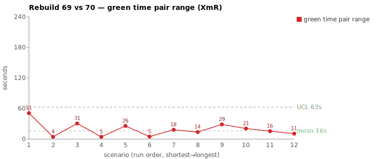
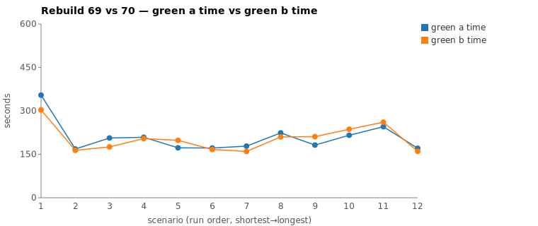

* TOC
{:toc}

---

# Context

This page is a worked comparison in the same tradition as [pbc-4445][3] and [pbc-4849][2]. One Darmok scenario ran twice on the same day against `sheep-dog-grammar`, on branches `Rebuild69` (09:54 EDT) and `Rebuild70` (11:28 EDT), both off the identical parent commit `0947fab`. The pair-range was the widest green-phase spread on the tab; the diagnosis traces to a prompt-level under-specification — when the failing test's family classes aren't found by the first few `Grep`/`Glob` probes, the green prompt leaves the worker free to choose between *broadening the glob inline* and *spawning an `Explore` subagent*. The two choices have the same correctness but very different wall-clock cost, and the two runs happened to choose differently.

| | Case |
|---|---|
| Scenario | `Test suite name should start with a capital letter validation` |
| Rebuild69 commit | `ef03071` |
| Rebuild70 commit | `a0c84fb` |
| Green-phase range | **51.1 s** (51,128 ms) |
| Files patched | same 10 files; `ValidateActionImpl` differs by 1 line — no semantic difference |
| Diagnosed cause | prompt — search-strategy under-specification leaves `Agent`-delegation as a same-correctness, higher-cost option |

The remediation is a prompt tightening: steer the green prompt to resolve in-repo class-location lookups by broadening `Glob`/`Grep` scope inline, and reserve `Agent`/`Explore` subagents for genuinely large fan-out. No GH issue filed yet — proposed below.

---

# Charts

Scenarios are numbered in run order (shortest→longest); see the tables below for which scenario each index is.





---

# What We Observed

| | Rebuild69 (09:54) | Rebuild70 (11:28) |
|---|---|---|
| Commit | `ef03071` | `a0c84fb` |
| Phase total | 560,137 ms | 527,828 ms |
| Red phase | 75,193 ms | 78,186 ms |
| **Green phase** | **354,471 ms** | **303,343 ms** |
| Refactor phase | 54,442 ms | 65,084 ms |

Green-phase pair-range = **51,128 ms (51.1 s)** on a green baseline that runs ~5 min on this scenario. This study focuses on the green phase only; red and refactor variance is real but treated separately.

The two runs ran the same Darmok flow. Green is two `claude` invocations sharing one `--session-id` (both `--model opus`): a first `green-compile.md` pass, then a `green-verify.md --resume --effort low` pass that does the bulk of the locate-and-implement work. Both runs succeeded; the test passed in both. The patches are effectively identical — same 10 files, `ValidateActionImpl.java` differing by a single line. The variance is not "Claude wrote different code," nor even "Claude wrote more text" (green output tokens 8,942 vs 9,219, near-identical) — it is **one blocking subagent call**.

---

# Where The Time Went

The session JSONLs (`e5f20c85…` for R69, `b89fb51a…` for R70) were parsed for per-segment counts, scoped to the green segment only.

| | R69 green | R70 green |
|---|---|---|
| Wall-clock | ~332 s | ~281 s (−51 s) |
| Assistant turns | 89 | 84 |
| Thinking blocks | 5 | 5 |
| Output tokens | 8,942 | 9,219 |
| Cache-read tokens | 5.29 M | 4.86 M |
| Bash calls | 3 | 3 |
| Read | 18 | 19 |
| **Grep** | **15** | **11** |
| **Glob** | **5** | **9** |
| Write / Edit | 6 | 6 |
| **`Agent` (Explore) calls** | **1** | **0** |

Every line except the last three is within noise. The signal is the single `Agent` call in R69 and the way each run located the `*IssueDetector` / `*IssueTypes` class family: R69 escalated to a subagent after a handful of greps; R70 stayed inline and widened its globs (5 → 9). The blocking subagent call accounts for essentially the entire 51 s gap.

## The inline-Glob vs Explore-subagent divergence

Both runs hit the same sub-problem at the same point: after a few direct probes for `IssueTypes` / `IssueDetector` came up short, *where do those classes actually live?* The first four probes are nearly identical in shape. The fifth is the split.

| time (UTC) | Rebuild69 (slower) | Rebuild70 (faster) |
|---|---|---|
| ~T+0 | `Glob **/issues/*IssueTypes.java` (grammar) | `Grep TestSuiteIssueDetector\|TestSuiteIssueTypes` |
| ~T+3 | `Glob **/issues/*IssueDetector.java` | `Grep TestSuiteIssue` |
| ~T+6 | `Grep IssueTypes\|IssueDetector` (core) | `Glob **/dsl/issues/*IssueDetector.java` |
| ~T+9 | `Grep IssueTypes\|IssueDetector\|issues` | `Grep IssueDetector\|IssueTypes` (core) |
| **~T+18** | **`Agent` (Explore): "Find IssueDetector/IssueTypes patterns"** | `Glob **/*IssueDetector.java` (core) |
| ~T+21 | *(blocked on subagent)* | `Glob **/*IssueTypes.java` (core) |
| ~T+24 | *(blocked on subagent)* | `Glob **/*IssueDetector.java` **(whole monorepo)** |
| ~T+30 | *(blocked on subagent)* | `Glob **/*IssueTypes.java` (whole monorepo) |
| **~T+52** | **subagent returns → `Grep org.farhan.dsl.issues`** | `Read` first source file (located) |

The divergence is at **command #5**. R69's `Explore` subagent was dispatched at `13:47:36.030` and the next tool call in the parent session did not appear until `13:48:27.853` — a **51.8 s** blocked window while the subagent ran its own multi-step search and composed a < 300-word report. R70, facing the identical lookup, instead *widened the `Glob` path* in two steps — from `sheep-dog-grammar` to `sheep-dog-core` to the whole `sheep-dog-main` monorepo — and resolved the location in **~18 s**, then went straight to reading the file.

The R69 subagent prompt:

```
In /home/farhan/git/sheep-dog-main/sheep-dog-core/sheep-dog-grammar, find any
existing *IssueDetector*, *IssueTypes*, *IssueResolver* classes or references.
Also check sibling projects under sheep-dog-core for examples of these classes.
... Quick search, report in under 300 words.
```

This is a small, well-bounded lookup that two broadening `Glob` calls answer directly. Delegating it to an `Explore` subagent buys nothing on a monorepo this size — the subagent's fixed spawn + its own grep/glob sequence + report synthesis is pure overhead relative to the inline path. 51.8 s of subagent ≈ the 51.1 s pair-range.

---

# Root Cause

Verified from the two transcripts: both runs reached the same point with the same information, and the only material difference is the tool *chosen* to resolve a class-location lookup. R69 spawned an `Explore` subagent; R70 broadened its `Glob` scope inline. Both found the right files; both produced the same patch set (confirmed by `git diff --stat 0947fab <commit>` on each branch — identical 10-file set, one 1-line difference in `ValidateActionImpl.java`).

The cause sits in the **green prompt**. It tells the worker to locate the failing test's family classes but does not prescribe *how* when the direct grep misses. With `Agent`/`Explore` available and no guidance against it, the worker is free to delegate — a reasonable instinct for a large unknown codebase, but a 50 s tax on a small monorepo where two wider globs would have answered the same question. This is the same class of finding as [pbc-4849][2] (prompt under-specifies the search step), but the proximate symptom is subagent-delegation overhead rather than a missing-annotation chase.

This is not a spec problem (the test admits one implementation and both runs produced it) and not a harness problem (no process stall, no timeout, no model-of-the-day effect — the blocked window is a real subagent doing real work). It is a producer-side prompt gap.

---

# The Fix

A prompt tightening in the green-phase template (`green-compile.md` / `green-verify.md`), sited where the worker is told to locate the failing test's classes:

1. When a class-location lookup misses on the first `Grep`/`Glob`, **broaden the `Glob` path scope inline** (project → `sheep-dog-core` → `sheep-dog-main`) before reaching for anything heavier.
2. **Reserve `Agent`/`Explore` subagents for genuinely large fan-out** (many candidate locations, unknown naming conventions across unrelated trees) — not for "which package is `*IssueDetector` in." On a single monorepo, a subagent's spawn-plus-search overhead (~50 s here) dominates the lookup it replaces.
3. Optionally, surface the precomputed `jacoco-shortlist.md` (already produced by `GreenPhase` per [#404][4]) as the *first* place to look for the family's classes, so the location is often known before any glob runs at all.

The change is in the system (the prompt the worker reads), not in either run. Expected effect: the subagent-delegation tax on small in-repo lookups disappears, narrowing this scenario's green-phase pair-range. No GH issue exists yet for this specific tightening; the proposed issue would read *"green prompt: prefer inline Glob-broadening over Explore subagents for in-repo class lookups."*

---

# Mapping to the Research

| Predicted ([pbc-research][2-research]) | Observed |
|---|---|
| Wide pair-range | green-phase +51 s on a ~5 min baseline |
| Each run individually within in-control band | yes — both within typical green range for this scenario |
| Both runs pass the test | yes |
| Two work-trees differ | no — identical 10-file patch set (1-line cosmetic delta); variance is entirely in *how long the locate step took* |

Like [pbc-4849][2], this is a **same-artifact, different-path** case: a range chart that only flagged artifact-differing pairs would miss it, and the pair-range signal caught it anyway. The new wrinkle is the *shape* of the path variance — a single blocking subagent call rather than a long bash-retry chain. One expensive tool choice, not many cheap ones.

---

# Findings by Variable

*Each subsection records this run's findings about one [Wheeler variable][2-research]. Read the same heading across the run sequence to see how our understanding of that variable evolved.*

## green time pair range

This was the widest green-phase pair-range on the tab: **51.1 s** on a ~5 min green baseline. The two runs (`Rebuild69` and `Rebuild70`, same parent `0947fab`) produced the *same artifact* — an identical 10-file patch, with `ValidateActionImpl.java` differing by a single cosmetic line — yet diverged entirely on *path*. The cause was one expensive tool choice: R69 spawned an `Explore` subagent (~51.8 s blocked window) to locate the `*IssueDetector`/`*IssueTypes` class family, while R70 resolved the same lookup with two broadening inline `Glob` calls. This is a same-artifact, different-path case: a range chart that only flagged artifact-differing pairs would miss it, but the pair-range signal caught it. The width traces to a green-prompt under-specification that leaves subagent delegation as a same-correctness, higher-cost option.

## green time pair range moving range

No finding this run.

## green time

No finding this run.

## green time moving range

No finding this run.

## scale & green tokens

Output tokens were near-identical (R69 8,942 vs R70 9,219), confirming the variance was not "Claude wrote more text." Note a two-runs server confound: the pair ran ~1.5 h apart (09:54 vs 11:28 EDT) rather than concurrently, so any decode-rate or server-load difference between the two windows is not controlled for — but the dominant cost here was a discrete blocking subagent call, not a rate effect.

## warm-up position

No finding this run.

---

# Open Questions From This Case

- **A cheap subagent-cost counter would pre-flag this shape.** [pbc-4849][2] noted an "exploration-depth" signal (subagent count, distinct files read). This case is the concrete instance: an `Agent`-call count per phase, weighted by its blocked duration, would surface delegation-tax variance without a full transcript walk.
- **Does the `--effort low` setting on `green-verify.md` interact with the choice?** The bulk of the locate work happened in the low-effort verify pass in both runs. Whether a higher-effort pass would more consistently pick inline globbing (or more consistently delegate) is worth a controlled re-run.
- After the prompt tightening lands, re-running this scenario 2–3 times on one branch will show whether the green pair-range narrows. If a residual gap remains, the next assignable cause (likely Grep/Glob count variance at ~2 s/turn) becomes visible.

---

[2]: 4849
[2-research]: wheeler-understanding-variation
[3]: 4445
[4]: https://github.com/farhan5248/sheep-dog-main/issues/404
