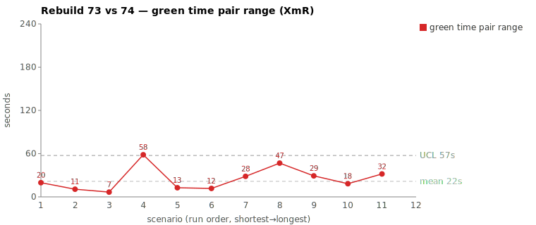
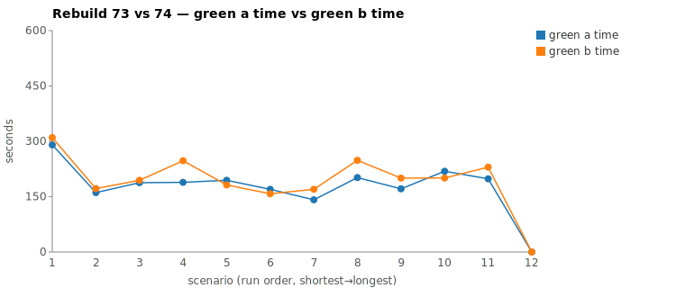

* TOC
{:toc}

---

# Context

This page is a worked comparison in the same tradition as [pbc-4445][3] and [pbc-4849][2], but it is the case where the assignable cause **dissolves** once you measure the right thing. Two Darmok scenarios each ran twice against `sheep-dog-grammar`, on branches `Rebuild73` (2026-05-30, ~21:00 EDT) and `Rebuild74` (~23:00 EDT). The first scenario was the widest green-phase pair on the `714137558` tab; the second was the next widest. Both looked like a worker doing different amounts of work. Both turned out to be **server-side time-to-first-token (TTFT) variance** — the model's actual compute was nearly identical run-to-run, and the visible green-phase spread was almost entirely the client idling, waiting for the API to begin streaming.

| | Primary case | Corroborating case |
|---|---|---|
| Scenario | `Test step must have a valid object name validation` | `This object doesn't exist validation` |
| Rebuild73 commit | `103530e2` | `6ca5963b` |
| Rebuild74 commit | `342b5037` | `b52c8014` |
| Green-phase range | **58.4 s** (58,417 ms) | **46.8 s** (46,824 ms) |
| Files patched | same 5 files | same 5 files |
| Code difference | cosmetic only (see below) | cosmetic only (see below) |
| Diagnosed cause | **harness — TTFT/server-wait variance, not spec/prompt/work** | same |

The remediation is **not** a prompt or spec change. There is no defect in either run's code, and `green-verify.md` is a generic cross-project template that cannot carry a scenario-specific instruction anyway. The actionable output is a **methodology fix**: pair-range computed on raw green wall-clock mostly measures TTFT noise; compute an *active* time from the JSONL (`total − idle`) and pair-range that instead. Details in [The Fix](#the-fix).

> **Correction.** An earlier draft of this page diagnosed the primary case as prompt under-specification — claiming Rebuild74 was slower because it read five extra grammar files to re-derive a validation message the sibling detector already provided. That was wrong on two counts: (1) `green-verify.md` is generic, so the proposed "name the sibling detector as the template" fix had nowhere to live; and (2) once green time is decomposed into active vs idle, Rebuild74's *active* time is actually ~2 s **lower** than Rebuild73's — the extra reads cost essentially zero wall-clock. The whole 58 s spread is server idle. This rewrite supersedes that draft.

---

# Charts

Scenarios are numbered in run order (shortest→longest); see the tables below for which scenario each index is.





---

# What We Observed

Primary case (`valid object name`):

| | Rebuild73 (21:01) | Rebuild74 (22:49) |
|---|---|---|
| Commit | `103530e2` | `342b5037` |
| Phase total | 403,252 ms | 514,344 ms |
| Red phase | 86,838 ms | 130,380 ms |
| **Green phase** | **188,879 ms** | **247,296 ms** |
| Refactor phase | 52,310 ms | 62,729 ms |

Green-phase pair-range = **58,417 ms** on a green baseline of ~3 min. The local `metrics.csv` agreed exactly with the gsheet on both runs. This study scopes to green only.

Green is two `claude` invocations sharing one `--session-id` (both `--model opus`): a `green-compile.md` pass, then a `green-verify.md --resume --effort low` pass doing the locate-and-implement work. Both runs passed on the first `mvn verify`; no timeout, no retry, no silent stall (per-minute output buckets non-zero throughout).

The committed code is functionally identical. The same 5 files change in both runs; `TestStepIssueTypes.java` is byte-identical; `TestStepIssueDetector.java` differs only in two `logger.debug` wordings; `ValidateActionImpl.java` differs only because each run mirrored a different *baseline* coding style (+5 vs +10 lines, no semantic difference). The corroborating case shows the same shape — see [Two cases, one signature](#two-cases-one-signature).

---

# Where The Time Went

The breakthrough is decomposing each green session's wall-clock from the JSONL. Every inter-event interval is one of three kinds:

- **idle (TTFT / server-wait)** — a `tool_result` (or the initial prompt) is logged, then nothing until the *next* assistant message's first block appears. The model has not started emitting. This window is queue scheduling + context prefill + network — the client is idle.
- **tool-exec** — an assistant `tool_use` block, then its `tool_result`. Real work: `mvn verify`, `Read`, `Edit`.
- **generation** — consecutive blocks within one streaming assistant message. Real model output.

`active = total − idle = tool + generation`. Each window is the phase's mojo bracket (here, green = `green-compile` start → `/compact` start), measuring the claude session's own work and excluding the inter-phase `/compact` and trailing maven. This per-phase decomposition comes from `.claude/scripts/jsonl-active-time.py`; the run-level `metrics_<AB>.tsv` (all scenarios, active-green ms, drop-in for the gsheet) comes from `.claude/scripts/rgr-active-green.py`.

| Green session | Total | Idle (TTFT) | Tool | Gen | **Active** |
|---|---|---|---|---|---|
| `valid object name` R73 | 165.3 s | 116.3 s | 24.8 s | 24.2 s | **49.0 s** |
| `valid object name` R74 | 224.8 s | 176.5 s | 23.7 s | 24.6 s | **48.3 s** |
| `object doesn't exist` R73 | 178.0 s | 131.8 s | 24.2 s | 22.0 s | **46.3 s** |
| `object doesn't exist` R74 | 225.0 s | 173.9 s | 24.0 s | 27.1 s | **51.1 s** |

Read the primary-case rows: total differs by **+59.5 s**, but active differs by **−0.7 s** (R74 is faster). The entire pair-range lives in idle (116 → 177 s, +60 s). Tool time is a clean control — ~24 s in all four sessions, dominated by the single `mvn verify`, stable run-to-run as you'd expect for deterministic work. Generation is ~22–27 s everywhere. **The only thing that moved is the server-wait.**

## Anatomy of one idle gap

The clearest single gap in Rebuild74's primary session, straight from the event stream:

```
03:18:32.511  tool_result delivered to the API   (previous turn complete)
   … 17.66 s, zero blocks logged …
03:18:50.170  next message's first block (thinking) appears
03:18:52.564  same message's last block — 995 output tokens — done
```

Once the response *started*, the whole turn — thinking block, text, two tool calls, 995 tokens — streamed in **~2.4 s**. The 17.66 s before it produced nothing. This is the discriminator that rules out "the model thought harder": extended-thinking tokens stream as they are produced, so a 17 s think would dribble out across the window. Instead the thinking block appeared all at once at the end. The gap is pre-first-token wait, not generation.

## Two cases, one signature

Both 73/74 pairs share the identical fingerprint:

| | `valid object name` | `object doesn't exist` |
|---|---|---|
| `*IssueTypes.java` | byte-identical | byte-identical |
| Detector logic | identical | identical |
| Detector diff | 2 debug-log wordings | debug-log wordings + one null guard |
| `ValidateActionImpl` | +5 (R73) vs +10 (R74) lines, no semantics | +3 (R73) vs +6 (R74) lines, no semantics |
| Read calls (slow run) | **more** (13 vs 8) | **fewer** (11 vs 13) |
| Active time | flat (49.0 vs 48.3 s) | near-flat (46.3 vs 51.1 s) |
| Idle / spread | +60 s | +42 s |

The Read-count column is the tell: in the primary case the slow run read *more* files, in the corroborating case it read *fewer*. If exploration depth drove wall-clock, the sign would be consistent. It isn't. The consistent driver is idle/TTFT. Read count is noise here because reads return in milliseconds and vanish into the ~21 s `mvn` that dominates tool time.

The cosmetic code differences (debug-log convention, `contentEquals` vs `!= null && equals`, bare `if (isEmpty())` vs full `null || isEmpty()` + null-coalesce, tabs vs 4-spaces) all trace to **baseline style drift between the two rebuild branches** — earlier scenarios in each full rebuild left `ValidateActionImpl` and the sibling detectors in slightly different styles, and each new detector mirrors its own branch. This affects line count, not wall-clock.

---

# Root Cause

**Harness — server-side time-to-first-token variance.** Across both 73/74 pairs, the model's active compute (token generation + deterministic tool execution) is essentially constant. What varies, by 42–60 s, is the cumulative time the client spends waiting for the API to *begin* each streamed response. Decomposed in [Where The Time Went](#where-the-time-went) and proved at the single-gap level in [Anatomy of one idle gap](#anatomy-of-one-idle-gap).

TTFT is not purely random — it has a component that scales with context size (prefill of the cached prompt before the first token). Rebuild74's primary session carried a larger context (~2.56 M cache-read tokens vs ~1.95 M, from its extra reads), so part of its extra idle is self-inflicted prefill. But the corroborating case removes any doubt that *work* is the driver: there Rebuild74 read **fewer** files, had near-equal context (~2.69 M vs ~2.54 M cache-read), and **still** idled +42 s. That residual is server scheduling / load at request time — uncontrollable from the spec, prompt, or worker behavior.

Verified from artifacts: `git show` on all four commits confirms functionally identical code; the per-event JSONL timeline confirms idle gaps are `tool_result → next-assistant` windows with zero intervening blocks; the gap-ending messages confirm full content (incl. thinking) streams in 2–3 s once generation starts.

---

# The Fix

There is **no prompt or spec change** to make. Neither run is wrong, `green-verify.md` is a generic template, and the variance isn't work-driven. The fix is to the **measurement**:

1. **Pair-range on *active* time, not raw wall-clock.** Add a green-phase active-time column derived from the JSONL: `active = total − Σ idle`, where an idle interval is `tool_result → next new assistant message`. A one-pass script over the session file produces it (the `total / idle / tool / gen / active` decomposition used in the table above). Pair-range on active time would have ranked both these scenarios near zero and not flagged them — correctly, because nothing assignable happened in the worker.
2. **Treat raw-wall-clock pair-range as a noisy pre-filter.** It is dominated by TTFT and will keep surfacing server-latency pairs. Use it to nominate candidates, then confirm with active time before writing a case study. A pair that is wide on wall-clock but flat on active time is a server-latency artifact, not a prompt/spec bug.
3. **Optional, marginal:** reduce redundant reads to shrink per-turn context prefill — the only worker-influenceable slice of idle. Worth it for token cost regardless, but it buys only a few seconds of wall-clock and won't touch the server-load component.

No GH issue is needed for a code fix. If anything is filed, it is a tooling task: *"add JSONL active-time decomposition to the rgr-review tooling and pair-range chart so server-TTFT pairs stop masquerading as assignable causes."*

---

# Mapping to the Research

| Predicted symptom ([pbc-research][2-research]) | Observed here |
|---|---|
| Pair-range fires on an assignable cause | **Partially refuted** — it fired, but the cause was server TTFT, not anything in spec/prompt/work |
| Spec/prompt admits multiple valid paths, all pass | True but irrelevant to the timing — both paths cost the same active time |
| Same-file output is not the disambiguator | Confirmed — near-identical patches, byte-identical types class |
| Cause sites in the producer/prompt, not either run | **Refuted for this pair** — cause sites in the platform; no producer/prompt fix exists |
| Exploration-depth signal (files read) flags the shape | **Refuted** — slow run read more in one case, fewer in the other; active time is the honest signal |

This is the counter-example the methodology needed: not every wide pair has a fixable cause. [pbc-6970][5] found a *real* active-time difference (one blocking `Explore` subagent call); this page found a wide pair with **no** active-time difference. The two are only distinguishable by computing active time — which is the upgrade this case motivates.

---

# Findings by Variable

*Each subsection records this run's findings about one [Wheeler variable][2-research]. Read the same heading across the run sequence to see how our understanding of that variable evolved.*

## green time pair range

A wide wall-clock pair-range here was **not** a vague test — it over-reported. The 58 s primary green spread decomposed to a −0.7 s active-time difference (R74 actually faster); the entire range lived in server idle, not in any work or spec ambiguity. Treating raw-wall-clock pair-range as a noisy pre-filter, then confirming with active time, re-ranked the board: recomputing on active time collapsed both wall-clock-widest pairs to near-zero and promoted a *different* scenario (`Test step must have a valid step definition name validation`) as the real outlier on active time.

## green time pair range moving range

No finding this run.

## green time

No finding this run.

## green time moving range

No finding this run.

## scale & green tokens

This is one of the two canonical server-noise cases (with pbc-7980): the wide wall-clock pair-range **dissolved** once active time was computed — the two runs did near-identical work, and the spread was almost entirely server time-to-first-token (TTFT) and decode noise rather than tokens generated. Idle was 70–79 % of total green time in all four sessions; once a response started, a full turn (incl. a 995-token thinking block) streamed in ~2–3 s. TTFT has a context-prefill component that scales with cache-read token count (R74's primary session carried ~2.56 M vs ~1.95 M), but the corroborating case (fewer reads, near-equal context, still +42 s idle) shows server scheduling / time-of-day load dominates. This is the case that motivated normalizing for the per-token rate.

## warm-up position

No finding this run.

---

# Open Questions From This Case

- **How much of idle is context-prefill vs pure server scheduling?** Prefill scales with cache-read token count; a controlled run holding the worker's read set fixed while varying nothing else would isolate the server-load component. The corroborating case (fewer reads, equal context, still +42 s idle) suggests scheduling dominates, but it isn't quantified.
- **Should `--effort low` on `green-verify.md` change TTFT?** Effort affects thinking budget, which is generation, not TTFT — so it should not. Worth confirming it doesn't accidentally inflate prefill.
- **Re-ranking the tab by active time changes the answer.** Recomputing all 11 tracked scenarios' green time as active-ms (`metrics_7374.tsv`, produced by `.claude/scripts/rgr-active-green.py 73 74`) collapses both wall-clock-widest pairs to near-zero active range (`valid object name` 58,417 → 654 ms; `object doesn't exist` 46,824 → 4,857 ms) and promotes a *different* scenario — `Test step must have a valid step definition name validation` — from a 12,687 ms wall-clock range to a **30,896 ms active range**, the widest on the active board. That pair has a genuine work difference the wall-clock idle was masking, and is the one that actually warrants a divergence walk. A follow-up case should run that scenario down.

---

[2]: 4849
[2-research]: wheeler-understanding-variation
[3]: 4445
[5]: 6970
