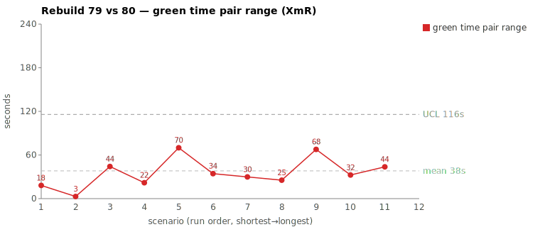
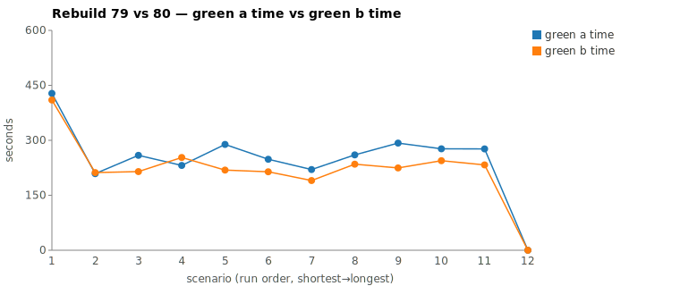

* TOC
{:toc}

---

# Context

This page is a worked comparison in the same tradition as [pbc-4445][3], [pbc-4849][4], and [pbc-7576][6], and it lands on the same side of the classification gate as [pbc-7374][5]: **common cause, no scenario fix.** The scenario `Test step must have a valid step definition name validation` ran against `sheep-dog-grammar` on branches `Rebuild79` (early-morning EDT) and `Rebuild80` (midday EDT). It topped the green-phase pair-range sheet at **70.0 s** (288,806 ms vs 218,834 ms) — the widest pair covering both runs.

The investigation found no assignable cause. The two runs took the **same route** — same exploration sequence, same three files patched, same two `mvn verify` cycles, the same number of tool calls (33 vs 32) — and produced functionally identical code. The entire 70 s gap is server-side **decode throughput**: the 1 AM run generated tokens at roughly half the rate of the midday run. The cleanest single tell is that the **faster** run (Rebuild80) emitted **more** output tokens (7,971 vs 5,962) while finishing 70 s sooner. You cannot do *more* work in *less* time and have the gap be about work. The gap is about how fast the model server was decoding that day.

| | Rebuild79 | Rebuild80 |
|---|---|---|
| Scenario | `Test step must have a valid step definition name validation` | (same) |
| Commit | `8a3f1a2b` | `44aa20cb` |
| Scenario start (EDT) | 01:08:49 | 12:47:52 |
| Green-phase metric | 288,806 ms | 218,834 ms |
| Green-phase range | **70,000 ms (70.0 s)** | |
| Files patched | `TestStepIssueTypes`, `TestStepIssueDetector`, `ValidateActionImpl` | same three |
| Resulting code | functionally identical | |
| Verdict | **common cause** — no scenario fix | |
| Action | measurement-level only (chart decode-normalized / active time per [pbc-7374][5]) | |

This is the second "common cause — no action" result in the series (after [pbc-7576][6] Case A), and the purest: prior common-cause cases still had a *navigation* difference (Read-heavy vs Grep-heavy) to explain. Here even navigation is identical, leaving decode speed as the only variable.

---

# Charts

Scenarios are numbered in run order (shortest→longest); see the tables below for which scenario each index is.





---

# What We Observed

The study scopes to the green phase only. Red and refactor are reported for context but not analyzed.

| | Rebuild79 (01:08 EDT) | Rebuild80 (12:47 EDT) |
|---|---|---|
| Commit | `8a3f1a2b` | `44aa20cb` |
| Phase total | 9:31 (571,104 ms) | 6:48 (408,463 ms) |
| Red phase | 1:12 (72,374 ms) | 1:07 (67,177 ms) |
| **Green phase** | **4:48 (288,806 ms)** | **3:38 (218,834 ms)** |
| Refactor phase | 1:55 (115,642 ms) | 1:00 (60,577 ms) |

Every phase ran longer on Rebuild79 — red +5 s, green +70 s, refactor +55 s. That uniform stretch across *all three independent phases* is itself a fingerprint of a slow-server day rather than a scenario-specific defect: a spec/prompt gap would inflate one phase, not scale all three.

Both green phases split into two `claude` calls against one shared session id: a short **green-compile** (`--print … green-compile.md`) that checks `log.txt` for compilation errors, then a **green-verify** (`--resume … --effort low … green-verify.md`) that reads the JaCoCo shortlist, implements the change, and runs `mvn verify`. The mojo-log brackets give the sub-segment split:

| Green sub-segment | Rebuild79 | Rebuild80 | Δ |
|---|---|---|---|
| green-compile (`Running` → `Writing jacoco-shortlist`) | 54.7 s | 47.3 s | 7.4 s |
| green-verify (`Writing jacoco-shortlist` → `Completed`) | 213.1 s | 151.0 s | **62.1 s** |
| green total (mojo bracket) | 267.8 s | 198.3 s | 69.5 s |
| allowlist + `mvn verify` tail | 20.9 s | 20.5 s | 0.4 s |
| **green metric** | **288.8 s** | **218.8 s** | **70.0 s** |

The spread lives in green-verify (the implement-and-build call). The post-implementation `mvn verify` tail is identical to within 0.4 s — the build itself is not the cause.

---

# Where The Time Went

Measured over each session's green window (compile + verify), from the per-session JSONL:

| Metric | Rebuild79 | Rebuild80 | Note |
|---|---|---|---|
| green wall-clock (mojo bracket) | 267.8 s | 198.3 s | +69.5 s on R79 |
| assistant turns | 49 | 48 | ~equal |
| **tool calls** | **33** | **32** | R79 +1 (one extra `Edit`) |
| TodoWrite | 10 | 10 | identical |
| Read | 11 | 11 | **identical** |
| Grep | 5 | 5 | **identical** |
| Edit | 4 | 3 | R79 split one detector edit in two |
| Bash (`mvn`) | 2 | 2 | **identical** |
| thinking blocks | 3 | 3 | identical |
| output tokens | 5,962 | **7,971** | **faster run produced MORE** |
| cache-read tokens | 2,975,768 | 2,892,921 | ~equal |
| decode rate (output tok / green min) | **~1,366** | **~2,503** | **R80 ~1.8× faster** |
| `mvn verify` cycles | 2 (scoped `-Dtest=RGRTest` + full) | 2 (same) | **identical** |
| stop reasons | all clean (`end_turn` / tool continuations) | all clean | no stall, no retry, no hang |

The work proxies are the same column twice over: same 11 Reads, same 5 Greps, same 2 `mvn` cycles, same three files patched, turn counts within one. The only structural difference is that Rebuild79 made one extra `Edit` — it split the `TestStepIssueDetector` change into an import edit and a logic edit, where Rebuild80 did both in one. That is a 9 s difference at most, and it cuts the *wrong way*: the run with one more edit and fewer output tokens still took 70 s longer.

## The same route, at two speeds (the "divergence" that isn't)

The tool-call timelines run in lockstep. Both open `ToolSearch` → seed `TodoWrite` → `Read uml-package.md` → `Grep "COMPILATION ERROR"` → `Grep "Guice configuration errors"` (green-compile), then `Read jacoco-shortlist.md` → read the three issue-detector source files → `Read` the runner log → `Grep "FAILED|BUILD FAILURE|AssertionError"` → make the edits → `mvn verify -Dtest=RGRTest` → `mvn verify` (green-verify). The two `Bash` commands are character-for-character identical:

```
cd /home/farhan/.../sheep-dog-grammar && mvn verify -Dtest=RGRTest > log.txt 2>&1
mvn verify > log.txt 2>&1
```

The `mvn` segments are nearly equal: scoped build ~23 s on both; full `verify` ~30 s (R79) vs ~24 s (R80), a 6 s difference attributable to cold-vs-warm Maven, not the model. Subtract the ~6 s of `mvn` variance and ~64 s of the 70 s gap is pure model time — the *same* turns, each one taking longer to think and decode on the 1 AM run.

The per-minute output-token buckets make the throughput difference visible directly:

| | R79 green minutes | R80 green minutes |
|---|---|---|
| peak output tok/min | 1,667 (05:11) | **3,827 (16:50)** |
| profile | 1286 / 1667 / 1397 / 1224 / 388 | 2044 / 3827 / 1560 / 540 |

Same number of tokens' worth of work, decoded at roughly half the rate — so the wall-clock stretches by roughly 2×, exactly the green-verify Δ. There is no command one run ran and the other skipped; there is no file one run read and the other didn't. There is only a slower server.

---

# Classification

**Verdict: common cause. No assignable cause is present.**

Evidence, work-proxy by work-proxy:

| Proxy | R79 | R80 | Equivalent? |
|---|---|---|---|
| Files edited | `TestStepIssueTypes`, `TestStepIssueDetector`, `ValidateActionImpl` | same three | ✅ |
| Edit count | 4 | 3 | ≈ (R79 split one edit; same net change) |
| Read / Grep counts | 11 / 5 | 11 / 5 | ✅ identical |
| `mvn verify` cycles | 2 (scoped + full) | 2 | ✅ identical |
| Resulting code | new `step definition name` validation wired through detector + impl | same wiring, same enum string | ✅ functionally identical |
| Output tokens | 5,962 | 7,971 | faster run produced *more* |
| Stalls / retries / timeouts | none | none | ✅ |
| Decode rate | ~1,366 tok/min | ~2,503 tok/min | ❌ R80 ~1.8× faster |

The only proxy that differs is decode rate, and decode rate is not something any spec, prompt, or harness change can control — it is queue wait + context prefill (TTFT) + per-token decode speed on the model server, which varies with time-of-day load and model-of-the-day. Both runs followed the green prompts exactly as written, converged on the same code, and passed `mvn verify` on the first full build. There is no instruction that would have made the slow run faster, because the slow run did nothing wrong — it did the same thing, slower.

This is common-cause variation by definition: inside the system's normal behavior, no single removable cause, and the next run could land anywhere on the same spread for reasons unrelated to this scenario.

---

# The Fix, or Why No Fix

**No scenario-level fix is warranted, and proposing one would be tampering.**

There is no tempting "fix" to even reach for here. Unlike [pbc-7576][6] Case A (where one run was Read-heavy and the other Grep-heavy, inviting a "bias toward Grep" non-fix) or pbc-4849 (where one run typed the wrong `grep` regex), the two runs in this pair did *identical* work. Biasing the prompt toward any tool, reordering any step, or tightening any spec would change nothing about the gap, because the gap is not in anything the prompt controls. Editing the scenario to chase a 70 s wall-clock difference that is entirely server decode throughput is the textbook Deming/Wheeler tampering failure — reacting to common-cause noise as if it were a special cause, which increases variation rather than reducing it.

The legitimate follow-ups are at the **measurement** level, not the scenario level:

1. **Rank on decode-normalized / active time, not wall-clock.** This pair is the strongest argument yet for the [pbc-7374][5] active-time work: the wall-clock sheet ranked it #1, but normalized by output tokens (5,962 vs 7,971) or decode rate the pair is *inverted* — the "slower" run did less generation. A decode-normalized metric (e.g. wall-clock per output token, or idle-stripped active time) would push this pair off the top of the sheet and stop it consuming investigation budget.
2. **Apply SPC limits to selection.** Treat each scenario's green series as an individuals/moving-range (XmR) chart and only investigate points outside 3σ. A uniform slow-server day that inflates *every* phase (red +5 s, green +70 s, refactor +55 s here) is common cause by construction and should be left alone.

Both follow-ups are tracked as the open active-time / moving-range discussions; no scenario GH issue is appropriate here.

---

# Mapping to the Research

| [pbc-research][2] prediction | What we observed |
|---|---|
| Pair-range flags "look here", not "something is broken" | Confirmed — the widest pair on the sheet had zero assignable cause. The flag is triage, not diagnosis. |
| Same-artifact does not imply same-path | **Inverted here** — same artifact *and* same path. Even the navigation matched; only decode speed differed. The cleanest same-everything case in the series. |
| Wall-clock fuses work with server overhead | Confirmed in the extreme — ~64 s of the 70 s gap is pure decode/TTFT overhead with the work held constant, and the faster run did *more* work. |
| Assignable cause appears on first or second pass | Did not hold — no assignable cause exists. The second "common cause, no action" verdict in the series (after [pbc-7576][6] Case A). A legitimate outcome. |

---

# Findings by Variable

*Each subsection records this run's findings about one [Wheeler variable][2]. Read the same heading across the run sequence to see how our understanding of that variable evolved.*

## green time pair range

This was the widest pair on the sheet (70.0 s), but the width was NOT a vague or under-specified test. Both runs took the same route, patched the same three files (`TestStepIssueTypes`, `TestStepIssueDetector`, `ValidateActionImpl`), and produced functionally identical code — the only structural difference was Rebuild79 splitting one detector edit into two, worth at most ~9 s. The pair-range flag here is triage pointing at "look here", and the answer was common cause, not a scenario fix.

## green time pair range moving range

No finding this run.

## green time

No finding this run.

## green time moving range

No finding this run.

## scale & green tokens

This is the canonical server-decode-noise case. Rebuild79 (01:08 EDT) and Rebuild80 (12:47 EDT) ran ~11 h apart and did identical work, yet the faster run (Rebuild80) emitted MORE output tokens (7,971 vs 5,962) while finishing 70 s sooner — so the whole pair range is decode-rate / time-of-day noise (~1,366 vs ~2,503 tok/min, R80 ~1.8× faster), not input. You cannot do more work in less time and have the gap be about work, which makes the case for ranking on a decode-normalized / active-time basis and motivates token-scaling and concurrent same-commit pairing.

## warm-up position

No finding this run.

---

# Open Questions From This Case

- **How often is the widest wall-clock pair an inversion?** This pair's faster run did more generation. If an audit of recent top-of-sheet pairs finds several such inversions, the case for decode-normalized ranking is no longer theoretical — it is correcting a metric that actively mis-ranks.
- **Is decode rate loggable per run?** If Darmok recorded output-tokens and wall-clock per `claude` call, a decode rate (tok/s) per run would let the sheet flag "slow-server day" pairs automatically and exclude them from pair-range selection without a transcript walk.
- **Where is the active-time / XmR work anchored?** Both measurement follow-ups depend on the idle/active definition and the SPC framing being settled; neither has a GH issue yet. They should get one before the sheet's ranking column changes.

---

[2]: wheeler-understanding-variation
[3]: 4445
[4]: 4849
[5]: 7374
[6]: 7576
