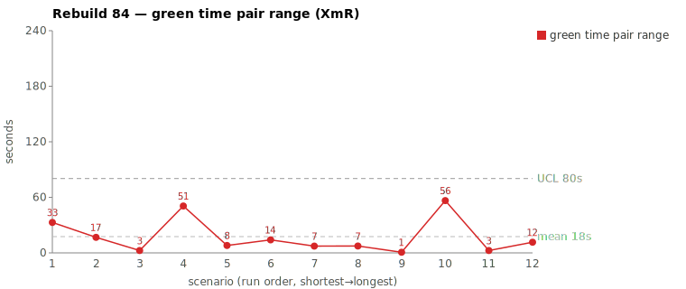
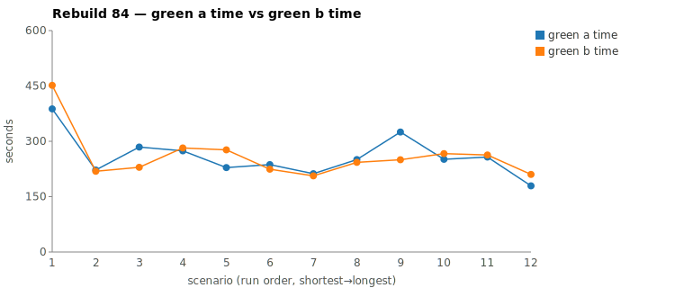
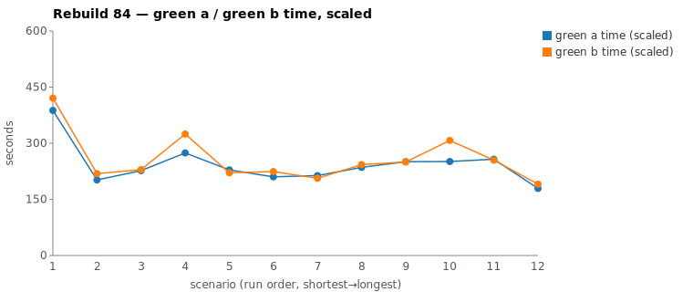

* TOC
{:toc}

---

# Context

This is a batch-level companion to [pbc-83][5], using the same in-run pair methodology: since [issue #434][7] every Darmok scenario runs its green phase **twice** — worktree `_a` and worktree `_b`, both branched from the *same red commit*, sequentially minutes apart — and keeps the shorter. The pair-range is `|green_a − green_b|` from a single metrics row, so the model-of-the-day, the red commit, and the server window are all held constant across the two halves. What's left in the range is **work** versus **per-token generation rate**, and the [token-scaled pair-range][5] gate splits them.

Where Rebuild83 produced one example of each of the gate's three regimes, **Rebuild84's two widest pairs both land *within* the token-similarity threshold** — neither half did materially different work — and both resolve to **common cause**. One is pure rate jitter; the other is a small exploration-volume difference the divergence walk clears. There is no beyond-threshold pair in the batch's worst two: the slowest scenarios this run were slow because of *how the time decoded*, not because either half was driven down a longer path.

| Scenario | Commit | Green `_a` | Green `_b` | Range | Token diff | Regime → verdict |
|---|---|---|---|---|---|---|
| This object step definition doesn't exist validation | `b9d893a` | 5:25 | **4:09** | 1:15 | 0.3% | within / small scaled range → **rate jitter, common** |
| Test suite name should start with a capital letter validation | **6:27** | 7:31 | `8383ee6` | 1:03 | 7.8% | within / large scaled range → small work-volume diff, walk → **common** |

(Bold = the winning half that was brought back and refactored.) Both ranges (75s, 64s) sit well under the run's range UCL of **125.6s** — neither breaches the 3σ limit. The batch is in statistical control.

---

# Charts

Scenarios are numbered in run order (shortest→longest); see the tables below for which scenario each index is.







---

# The token-scaled pair-range (recap)

Wall-clock fuses **real work** (closely tracked by output tokens generated) with the **per-token generation rate** (server load, queue, context-prefill jitter — uncontrollable). The gate, computed off each half's green-phase JSONL, is two numbers:

1. **Token similarity.** Within `TOKEN_SIMILARITY_THRESHOLD` (default 15%), the two halves did *near-equivalent work*; beyond it, one generated materially more.
2. **The scaled range.** Within threshold, scale the slower half to the faster half's per-token rate. The **scaled range** is the work-attributable part of the gap; the **rate overhead** (`raw − scaled`) is generation-rate jitter — not recoverable by any input change.

Both Rebuild84 pairs are within threshold, so both get scaled — and the two scaled ranges are what separate them: pair 1's is ~0, pair 2's is not. The full three-regime derivation is in [pbc-83][5].

---

# Pair 1 — `b9d893a`: rate jitter (common cause)

| | `_a` (loser) | `_b` (winner) |
|---|---|---|
| Green wall-clock | 5:25 | 4:09 |
| Green output tokens | 6,925 | 6,905 |
| Read / Grep | 13 / 6 | 12 / 6 |
| `mvn verify` cycles | 2 | 2 |
| Edit | 4 | 4 |

Token similarity **0.3%** (within threshold); raw range **75s**. Scaling `_a` to `_b`'s rate gives a **scaled range of 1s** and **74s of rate overhead** — the entire 75-second gap is generation-rate jitter. At equal rate the two halves are within one second of each other.

The proxies leave nothing to explain: 13 vs 12 Reads, 6 vs 6 Greps, 4 vs 4 Edits, 2 vs 2 `mvn` cycles, the same four edits implementing the same single validation rule, and no stall in either per-minute token bucket (every minute non-zero). This is the cleanest regime — equivalent work, the range dissolves under scaling. **Common cause — no fix.** It is the Rebuild84 analogue of pbc-83's `62c1749c`.

---

# Pair 2 — `8383ee6`: a small work-volume difference (common cause via the walk)

| | `_a` (winner) | `_b` (loser) |
|---|---|---|
| Green wall-clock | 6:27 | 7:31 |
| Green output tokens | 11,984 | 13,001 |
| Total tool calls | 59 | 75 |
| `mvn verify` cycles | 4 | 4 |
| Grep | 9 | **24** |
| Write / Edit | 5 / 4 | 5 / 5 |

Token similarity **7.8%** (within threshold), raw range **64s** — but scaling tells a different story than pair 1: scaled range **33s** with only **31s of rate overhead**. The per-token rate was about equal; roughly half the gap is **work volume**, not jitter. So the case routes to the divergence walk.

Both halves open identically (the `${logPath}` `COMPILATION ERROR` / `Guice configuration errors` grep, the `uml-package.md` read), then split on **exploration style**. `_a` located the wiring directly — `Glob **/objects/xtext/ValidateAction.java`, `Glob **/impl/TestConfig.java`, read, write. `_b` *hunted* for the same target: **24 Greps vs `_a`'s 9**, walking a chain of candidate names —

```
Grep "interface ValidateAction"      Grep "XtextValidateAction"
Grep "TEST_SUITE_NAME_ONLY"          Grep "TestSuiteIssueTypes"
Grep "TestSuiteIssueDetector"        Grep "XtextValidateAnnotation"
Grep "ValidateAnnotationImpl"        Grep "TestStepIssueTypes"  ...
```

— sixteen more tool calls to reach the *same* insertion point `_a` found by Glob. The decisive observations: identical outcome (both wrote the same files and passed), **4 vs 4 `mvn` cycles**, comparable Write/Edit counts (5/4 vs 5/5), and only a **7.8% token difference** despite the 16 extra calls — Greps are cheap on output, so `_b`'s extra *steps* cost search time, not materially more *generation*. This is the **Grep-heavy-vs-Glob-direct nondeterminism** [pbc-6768][6] and [pbc-83][5]'s `0f4deff8` named — equally-valid exploration luck, not a spec ambiguity forcing one half down a longer path. **Common cause.**

What would tip this to *assignable* is if `_b`'s extra grepping traced to a genuine ambiguity in the test case that `_a` got to skip. It doesn't: both were looking for the same wiring; `_b` just took more searches to find it.

**The fix that already held.** This exact scenario — "suite name capital" — was the **assignable** case in [pbc-7576][10] Case B, where one run burned 3.5 minutes hunting `~/.m2` and dependency jars for classes it had *already decided to create*. The fix there was to have `green-compile` read `uml-package.md` and the interaction specs *before* the log ([#415][11]), so the shared session carries "spec'd ⇒ create" into the search. In Rebuild84 that fix is visibly holding: `_b`'s 24 greps stay **inside the project tree** — `ValidateAction`, `IssueTypes`, `IssueDetector` — and never escape into `~/.m2` jar-hunting. The same scenario that was assignable two batches ago is now in-control. The residual variance is search-order luck within the project, which no instruction can null out.

---

# Root cause across the two

No spec gap, no prompt defect, no producer/consumer mismatch in either pair. Run the [pbc-6768][6] checklist and every box comes back clean. What remains is **common-cause variation** in two of the gate's flavors: per-token rate jitter (`b9d893a`) and a small nondeterministic difference in exploration volume / style (`8383ee6`). Neither has a recoverable slice — there is not even a silent stall this time (every per-minute bucket in all four halves is non-zero). The batch's two *worst* pairs being both within-threshold and both common cause is the strongest possible read that the harness is in control: even where it varies most, the work was equivalent.

In Wheeler/Deming terms, investigating points this far inside the limits — both under a 125.6s UCL — would be **tampering**. The honest result is "the system is in control," and pair 2 adds a second, sharper claim: a scenario that was *assignable* under an earlier harness is now *common cause* under the fixed one. That is the assignable-cause hunt working as designed — the special cause was found, fixed, and has stayed fixed.

---

# A third lens: token divergence vs wall-clock range

Picking the batch's two widest pairs *by wall-clock range* is only one way to rank it. Rank the same 12 scenarios by **token divergence** between the halves and a **different** two come to the top — and they are nearly invisible on the range chart:

| Scenario | Commit | Token diff | Raw pair-range | Range rank |
|---|---|---|---|---|
| Test step must have a valid object name validation | `7476bbb` | **15.6%** | 8s | near-bottom |
| This object step definition parameter set doesn't exist validation | `1dd042e` | **18.4%** | 15s | near-bottom |

Both cross the 15% token-similarity threshold — the halves did **materially different work** — yet both finished within ~8–15 seconds of each other. The reason is decode rate: the extra work was absorbed by faster per-token generation, so the **wall-clock pair range never registered it**. A range chart reads these two as among the *most* reproducible in the batch; the token axis reads them as the *least*.

What the higher-token half actually did extra, in both cases, was **search/comprehension depth of the issue-detector + interface hierarchy**, not divergent production code:

- **`7476bbb`** — `_b` ran **20 Reads vs `_a`'s 15**, reading deeper into the `TestStepIssue*` interface surface before the *identical* 2-Write / 2-Edit implementation. Both passed, 2 `mvn` cycles each.
- **`1dd042e`** — `_b` ran **9 Greps vs `_a`'s 4** (plus 4 more Reads and one extra Edit) walking the `IRow` / `RowIssueDetector` / `RowIssueTypes` tree (`"interface IRow"`, `"class.*IRow"`, `RowIssueDetector|RowIssueTypes`…). `_a` found its target with fewer searches.

In **both** the **leaner, fewer-token half won** (was brought back), and the production output was the same files. So the divergence walk still lands on **common cause** — exploration-depth nondeterminism, no spec ambiguity forcing two valid implementations. But these are the **closest-to-assignable signal in the batch**, and they point the same direction as [pbc-7576][10]'s Case B and [pbc-83][5]: the over-token half is consistently the one *hunting for the right insertion class*, the symptom of `jacoco-shortlist.md` / uml-interaction guidance not always pinning the exact class to edit. Not a per-pair fix; the standing distributional lever ("point the prompt at the exact file/class") if it recurs.

The methodological takeaway outlives this batch: **wall-clock pair-range and token pair-difference are two orthogonal reproducibility axes, and a scenario can be quiet on one while loud on the other.** A fast-decode day can mask a real work divergence in the time range (a false "reproducible"); the token difference catches it. Screen on **both**, not just the range the selection sheet ranks by. This is the dual of the long-known caveat that a *low* range on a *big* test can be luck rather than clarity — here a low range on an *ambiguous-enough-to-diverge* test is decode speed rather than agreement.

---

# The Fix

None at the scenario level — proposing one would be tampering, and pair 2 specifically shows the relevant special cause was *already* fixed upstream. The only standing, system-level levers are the distributional ones from [pbc-6768][6] and [pbc-83][5]:

1. **`--effort` control ([#426][9])** to lower the rate-overhead band itself, distributionally, rather than chasing any one pair.
2. **Smaller scenarios** — splitting net-new-logic Test-Cases into single-behavior cases shrinks the solution space and narrows the band toward its floor. Neither Rebuild84 pair is a net-new-logic case (both are validation-rule wirings), which is consistent with both landing within threshold.

---

# Mapping to the Research

| Predicted ([pbc-research][2]) | Observed across the two |
|---|---|
| Wide pair-range fires the signal | yes — 1:03 and 1:15, both flagged for review |
| Each run individually in-control | yes — every half a typical green for its scenario, both ranges under UCL |
| Both halves pass the test | yes — all four |
| Two work-trees differ | no — same outcome each pair; the variance is in rate / exploration, not code |

Both are **pure-path** cases in the [pbc-4849][4] / [pbc-6768][6] sense — same output, the variance entirely in how the worker got there. The token-scaled range puts a number on it: pair 1's gap is 1s of work plus 74s of rate; pair 2's is 33s of work-volume plus 31s of rate. No part of either points at the input.

---

# Findings by Variable

*Each subsection records this run's findings about one [Wheeler variable][2]. Read the same heading across the run sequence to see how our understanding of that variable evolved.*

## green time pair range

The batch's two widest in-run pair-ranges — `|green_a − green_b|` from a single metrics row — were 75s (`b9d893a`) and 64s (`8383ee6`), both under the run's range UCL of 125.6s. Both halves of each pair produced the *same* files and passed, so the divergence is never in the code: pair 1 was equivalent work (13 vs 12 Reads, 4 vs 4 Edits, 2 vs 2 `mvn` cycles) and pair 2 split only on exploration style — `_a` found the insertion point by Glob, `_b` hunted for it with 24 Greps vs 9, sixteen more tool calls reaching the same point. In both pairs the leaner, fewer-token half won and was brought back; pair 2's extra grepping stayed inside the project tree (the [#415][11] fix holding, no `~/.m2` jar-hunt). Both resolve to **common cause** — rate jitter for pair 1, equally-valid exploration luck for pair 2 — with no assignable, beyond-threshold pair in the batch's worst two.

## green time pair range moving range

No finding this run.

## green time

The longest scenario this run was "Test suite name should start with a capital letter validation" at 6:27 (winning half) / 7:31 (losing half). The slowest scenarios were slow because of *how the time decoded*, not because either half was driven down a longer path; neither pair is a net-new-logic case (both are validation-rule wirings), consistent with both landing within the token-similarity threshold.

## green time moving range

No finding this run.

## scale & green tokens

Wall-clock fuses real work (tracked by output tokens) with the per-token generation rate, and the token-scaled pair-range gate splits them: within the 15% token-similarity threshold the slower half is scaled to the faster half's per-token rate, leaving a scaled (work-attributable) range and a rate-overhead remainder. Pair 1 (0.3% token diff, 6,925 vs 6,905 output tokens) scales to a 1s range with 74s of rate overhead — pure jitter. Pair 2 (7.8% token diff, 11,984 vs 13,001 tokens) scales to 33s with 31s overhead — roughly half the gap is real work volume. Ranking the same 12 scenarios by **token divergence** instead of wall-clock range surfaces a *different* top two (`7476bbb` at 15.6%, `1dd042e` at 18.4%) that are near-invisible on the range chart — fast decode absorbed materially different work, so the range never registered it. The methodological takeaway: wall-clock pair-range and token pair-difference are orthogonal reproducibility axes; screen on **both**, since a fast-decode day can mask a real work divergence in the time range.

## warm-up position

No finding this run.

---

# Open Questions From This Case

- **Pair 2's "Grep-heavy vs Glob-direct" — is there a prompt nudge that is *not* tampering?** A hint to prefer `Glob` for known class names over name-guessing `Grep` chains would target the 33s work-volume slice. But it acts on common-cause variation, so it belongs as a *distributional experiment* (like `--effort`), measured on the band, not justified by this one pair.
- **Does the same-scenario-across-batches comparison generalize?** Pair 2 gave a clean before/after on one scenario (7576 assignable → 84 common). Tracking a fixed scenario's pair-range *across* batches, rather than within one batch, may be a sharper regression detector than the per-batch top-2.

---

[2]: wheeler-understanding-variation
[4]: 4849
[5]: 83
[6]: 6768
[7]: https://github.com/farhan5248/sheep-dog-main/issues/434
[8]: https://github.com/farhan5248/sheep-dog-main/issues/417
[9]: https://github.com/farhan5248/sheep-dog-main/issues/426
[10]: 7576
[11]: https://github.com/farhan5248/sheep-dog-main/issues/415
