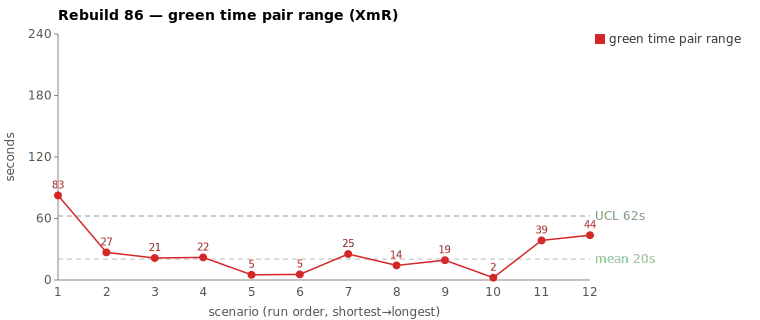
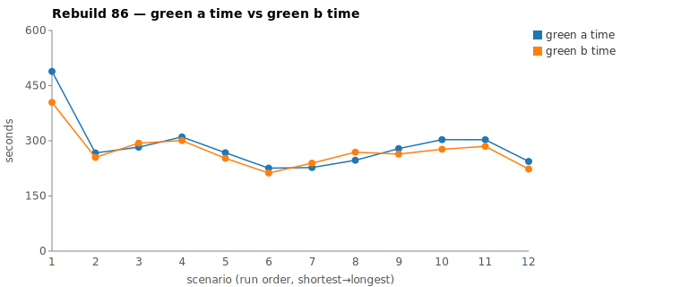
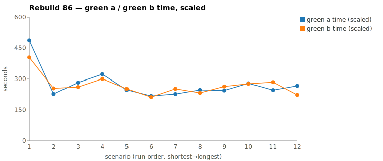

* TOC
{:toc}

---

# Context

This is a batch-level companion to [pbc-83][5], [pbc-84][4], and [pbc-85][13], using the same in-run pair methodology: since [issue #434][7] every Darmok scenario runs its green phase **twice** — worktree `_a` and worktree `_b`, both branched from the *same red commit*, and the shorter wall-clock is kept. The pair-range is `|green_a − green_b|` from one metrics row, so the model-of-the-day, the red commit, and the server window are all held constant across the halves; what's left is **work** versus **per-token generation rate**, split by the [token-scaled pair-range][5] gate.

Rebuild86 is the first batch to run on the [#439][14] **concurrent** green pair (both halves launched together rather than sequentially), and its two widest *scaled* pair-ranges land on opposite sides of the verdict — a **split**:

| Scenario | Commit | Green `_a` | Green `_b` | Raw range | Scaled range | Token diff | Verdict |
|---|---|---|---|---|---|---|---|
| Test suite name should start with a capital letter validation | `c35443c` | 8:08 | **6:44** | 84s | **82.6s** | 17.0% | **assignable — warm-up position** |
| This object step definition text parameter exists with other parameters validation | `87d49c6` | 4:04 | **3:43** | 21s | 43.7s | 16.4% | **common cause** |

(Bold = the winning half, brought back and refactored.) Pair 1's scaled range of **82.6s breaches the run's range UCL of 67.7s** — the only out-of-control point in the batch. Pair 2 does not breach it; its scaled range is an artifact of token-scaling a 21-second raw range, as the synthesis below shows.

The decisive fact for pair 1 is structural and was named while the run was being read: **"Test suite name" is the first scenario in the batch.** It does the heaviest lifting — it has to figure out the test-automation framework (the issue-detector + interface scaffolding) that every later validation scenario then reuses. Its wide, over-limit pair-range is a **warm-up position effect**, not a defect in that test case.

---

# Charts

Scenarios are numbered 1–12 in run order (shortest→longest); see the tables below for which scenario each index is.







---

# The token-scaled pair-range (recap)

Wall-clock fuses **real work** (closely tracked by green output tokens) with the **per-token generation rate** (server load, queue, context-prefill jitter — uncontrollable). The gate is two numbers off each half's green-phase JSONL: **token similarity** (within `TOKEN_SIMILARITY_THRESHOLD`, default 15%, the halves did near-equivalent work) and, when within threshold, the **scaled range** (the slower half normalized to the faster half's rate — the work-attributable residual, with `raw − scaled` being rate overhead). Beyond the threshold the halves are flagged as *non-equivalent work* — one generated materially more — and the range is treated as possibly assignable rather than scaled away. The full three-regime derivation is in [pbc-83][5]. **Both** Rebuild86 pairs sit just **over** the 15% threshold (17.0% and 16.4%), so the gate flags both as candidates; the divergence walk is what separates them.

---

# Pair 1 — `c35443c`: the first scenario does the heaviest lifting (assignable: warm-up position)

| | `_a` (loser) | `_b` (winner) |
|---|---|---|
| Green wall-clock | 8:08 | 6:44 |
| Green output tokens | 14,527 | 12,064 |
| Total tool calls | 72 | 65 |
| Grep / Read | 19 / 17 | 21 / 15 |
| **Glob** | **8** | **2** |
| `mvn verify` cycles | 4 | 3 |
| Write / Edit | 5 / 4 | 5 / 4 |

Token similarity **17.0%** — just over threshold, so the gate declines to scale and flags non-equivalent work. Raw range **84s**; the sheet's token-scaled range is **82.6s, over the 67.7s UCL**. No stall in either half: every per-minute token bucket is non-zero (`_a` 1001/2745/1322/2026/2246/2146/1732/719/590; `_b` 991/2447/1659/2292/2383/1704/588). Both were continuously productive; the gap is generation *volume*, not a hang.

Both halves open identically — `ToolSearch`→`TodoWrite` seed, read `uml-package.md`, grep `${logPath}` for `COMPILATION ERROR` / `Guice configuration errors`. They split on **how widely each had to map the issue-detection framework before editing**:

```
_a (8 Glob, 19 Grep — wide framework survey):
  Glob **/objects/xtext/ValidateAction.java     Glob **/impl/TestConfig.java
  Glob **/TestSuiteIssueDetector.java           Glob **/TestSuiteIssueTypes.java
  Glob **/issues/*.java   Glob **/*IssueDetector*.java   Glob **/*IssueTypes*.java
  Grep IssueDetector|IssueTypes                 Grep TestStepIssueTypes|TextIssueTypes|CellIssueTypes
  Grep navigateToDocument  Grep setCreated  Grep addTestSuiteWithFullName  Grep "interface ITestSuite"

_b (2 Glob, 21 Grep — narrower, found the seam faster):
  Grep ValidateAnnotation   Grep XtextValidateActionSteps   Grep TestSuiteIssueDetector
  Grep TestSuiteIssueTypes  Grep TestStepIssueDetector      Grep ValidateAnnotationImpl
  Grep TitleFragments       Grep "interface ITestSuite"     Glob **/issues/*.java
```

`_a` ran a **broad survey of the whole issue-type family** — `TestStep`, `Text`, `Cell` issue types, not just the `TestSuite` one the rule needs — and four `mvn verify` cycles to `_b`'s three. That breadth is exactly the heaviest-lifting cost of being **first**: there is no issue-detector framework yet, so this scenario stands up `*IssueDetector` / `*IssueTypes` and the interface wiring (`ITestSuite`, `navigateToDocument`, `addTestSuiteWithFullName`) that the *next* twenty validation scenarios consume for free. `_a` simply mapped more of that new surface than `_b` before landing the edit. The outcome confirms it was overhead, not divergent work: the mojo log records **"No functional diff between pair"** — identical code, `_b` won by wall-clock alone.

This is the same scenario that was the **assignable** Case B in [pbc-7576][10] (the `~/.m2` jar-hunt) and then **common cause** in [pbc-84][4] after [#415][11] made `green-compile` read the specs first. In Rebuild86 the **[#415][11] fix is still holding**: both halves' searches stay **entirely inside the project tree** — zero `~/.m2` hits in either session. The recurring symptom is no longer escaping into dependency jars; what remains is in-project breadth that is structurally unavoidable for the framework-founding first scenario.

**Verdict: assignable, but to position — not to a splittable test-case defect.** The scaled range breaches the UCL, so by SPC there is a special cause. The cause is the **warm-up / first-scenario position**: this Test-Case carries the one-time cost of erecting the test-automation scaffolding the batch reuses. You cannot split "suite name must be capitalized" — it is a single atomic rule — and you would not *want* to move the framework cost elsewhere; it has to land on some scenario, and landing it first is correct. The only honest action is at the **measurement** level (below), not the scenario.

---

# Pair 2 — `87d49c6`: token-scaling inflated a 21-second range (common cause)

| | `_a` (loser) | `_b` (winner) |
|---|---|---|
| Green wall-clock | 4:04 | 3:43 |
| Green output tokens | 5,994 | 5,012 |
| Total tool calls | 28 | 26 |
| Read / Grep | 7 / 7 | 6 / 7 |
| `mvn verify` cycles | 2 | 2 |
| Edit | 2 | 1 |

Token similarity **16.4%** — over threshold, so the gate again declines to scale. But the **raw range is only 21 seconds**, and the 16.4% is a 982-token gap on a small ~5–6K base: it is *one extra explore-edit*, not a different path. Both halves open identically, run **two `mvn verify` cycles each**, and edit the same impl; they differ only in that `_a` did a second `Edit` plus a confirming `Grep getCellListAsString` where `_b` reached the same code in one `Edit`. No stall in either (`_b`'s trailing `1`-token minute is just the green-complete tail). Same files, `_b` won by 21 seconds.

**Verdict: common cause.** This is the "leaner half won, exploration-depth nondeterminism" pattern of [pbc-84][4]'s pair 1 and [pbc-85][13] — a marginal threshold crossing on a small base with matching tool actions and a trivial 21s range. No test-case fix; investigating a 21-second gap would be tampering.

The reason this small-raw-range pair surfaced as the batch's **second widest** at all is itself the finding: the selection sheet ranks by **token-scaled** range, and scaling a 21s raw range up by the 16.4% token gap produces a **43.7s** scaled figure — promoting it above pairs with genuinely larger raw ranges. By raw range, the second-widest in the batch was "step definition parameter set doesn't exist" at 26s (token diff 0.8%, never inflated); pair 2's raw 21s is only fourth. Token-scaling did its job — it flags work-volume differences a fast-decode day would hide — but here it over-promoted noise.

---

# Batch synthesis — a split, and what it says together

The two worst *scaled* pairs land on opposite verdicts, and read together they point the diagnosis at **measurement**, not at any scenario:

1. **The one genuine outlier is the warm-up scenario.** Pair 1 is the only point over the UCL, the widest on **both** raw (84s) and scaled (82.6s) range, and it is the **first** scenario — the one that founds the issue-detector/interface framework. Its variance is *structurally different* from the rest: every other scenario inherits the scaffolding, so their halves explore a known framework, while the first scenario's halves each build/map it from nothing and naturally diverge in how much they map. Treating the first scenario's range as one more sample from the same distribution inflates the limits the whole batch is judged against.

2. **The second outlier is a scaling artifact.** Pair 2's 43.7s scaled range comes from token-scaling a 21s raw range; the work was equivalent (2 vs 2 `mvn`, same files, one extra edit). It is common cause that the *selection* metric over-surfaced.

So the batch's two worst pairs contain **no actionable test-case defect**. One is a position effect on an unsplittable atomic scenario; the other is jitter the sheet promoted. The honest reading is that the harness is in control *once the warm-up position is accounted for* — the recurring near-assignable scenario ([pbc-7576][10] → [pbc-84][4] → here) is still in-project (no `~/.m2` escape, [#415][11] holding), and the only thing that pushed it over the limit this run is that it ran first.

---

# The Fix, or Why No Fix

No scenario-level fix for either pair — splitting an atomic rule (pair 1) or chasing a 21-second gap (pair 2) would be tampering. The actions are at the **measurement** level:

1. **Stratify or exclude the warm-up position from the pair-range limits.** The first scenario of a batch carries one-time framework-scaffolding cost that no later scenario does; its pair-range is not a sample from the same process. The sheet currently has `exclude_from_limits = FALSE` for every row including this one. Setting it `TRUE` for the first scenario (or computing the limits over scenarios 2..N and plotting scenario 1 against them) would stop the warm-up point from inflating the UCL — and would correctly re-flag scenario 1 as the special-cause point it is, attributed to position rather than to its (atomic, unfixable) Test-Case. This is the [moving-range-3sigma][3] warm-up stratification this series has been carrying as an open item.
2. **Cross-check the selection on raw range, not only token-scaled range.** Pair 2 shows token-scaling can promote a small-raw-range pair above larger-raw ones. This is the dual of [pbc-84][4]'s "screen on both axes": rank by *both* raw and scaled range and review a pair only if it is wide on at least one for the *right* reason. A 21s raw range that is "wide" only after scaling is decode-volume noise, not a reproducibility concern.

The standing **distributional** lever from [pbc-7576][10] / [pbc-84][4] — pointing the prompt at the exact insertion class so the agent greps less to find the seam — would shave the warm-up survey too, but it acts on common-cause breadth across the whole batch and belongs as an experiment measured on the band ([#426][9] `--effort`), never as a per-pair fix. The harness, prompt, and model stay in control.

---

# Mapping to the Research

| Predicted ([pbc-research][2]) | Observed across the two |
|---|---|
| Wide pair-range fires the signal | yes — 84s and 21s raw, both surfaced by the scaled-range sheet |
| A breach of the limit marks a special cause | yes — pair 1's 82.6s scaled range over the 67.7s UCL |
| The special cause is in the input, not the system | **partly** — it is in the *position* of the input (first scenario), not a defect in the Test-Case; the system (harness/prompt) is in control |
| Both halves pass the same test | yes — all four; pair 1 "No functional diff between pair" |
| Two work-trees differ | no — same outcome each pair; variance is in framework-mapping breadth (pair 1) and one edit (pair 2) |

Pair 1 is a **position** case — the variance is real and over the limit, but it traces to *where in the batch the scenario ran*, which is why the fix is measurement-stratification rather than an input rewrite. Pair 2 is a **pure-path** case in the [pbc-4849][12] / [pbc-6768][6] sense, with the added twist that the selection metric over-promoted it.

---

# Findings by Variable

*Each subsection records this run's findings about one [Wheeler variable][3]. Read the same heading across the run sequence to see how our understanding of that variable evolved.*

## green time pair range

The wide pair (84s) was **in-project framework-mapping breadth**, not the old `~/.m2` jar-hunt — [#415][11] still holds, zero `~/.m2` hits in either half. The two halves produced identical code (mojo log: "No functional diff between pair"), so a wide pair here is *reproducibility under breadth*, not divergent work. This is the first **concurrent** ([#439][14]) batch: because `_a` and `_b` share the same red commit and server window, the pair range is finally clean of the time-of-day confound the early *two-run* pairs carried ([pbc-7374](7374), [pbc-7980](7980) were entirely that confound). What's left in the range is genuine work breadth plus per-token rate.

## green time pair range moving range

No finding this run — the batch was reviewed at the pair-range level, not its moving range.

## green time

The first scenario carries the **longest green time in the batch** — its three re-runs land 376–489s against 220–310s for every other scenario — and it is the lone point over the run's UCL. No timeout this batch, so no contradiction / forbidden-dependency signal on the absolute green time.

## green time moving range

No finding this run.

## scale & green tokens

Both pairs sit just **over** the 15% token-similarity threshold (17.0%, 16.4%), so the gate declines to scale and flags non-equivalent work. Token-scaling **over-promoted** pair 2: a 21s raw range scaled up to 43.7s by a 16.4% token gap on a small ~5–6K base, surfacing decode-volume noise as a top-2 pair — so the selection sheet must be cross-checked on raw range, not scaled alone. Every per-minute token bucket in all four halves is non-zero: no silent stall on the concurrent pair's first outing ([#417][8] not recurring). Token-scaling is the mechanism that replaced eyeballing two runs taken at different times — it normalizes the per-token rate so a fast-decode day can't hide a real work difference, the step the series took before concurrent pairing removed the timing gap outright.

## warm-up position

The lone over-UCL point is the **first** scenario, which founds the issue-detector / interface scaffolding every later validation scenario reuses; its pair-range is one-time framework cost, not a Test-Case defect (the rule "suite name must be capitalized" is atomic and unsplittable). It is structurally a different process from scenarios 2..N and should be **stratified** out of — or given its own baseline within — the control limits. This makes the [moving-range-3sigma][3] warm-up open item concrete: it is the recurring near-assignable scenario ([pbc-7576][10] → [pbc-84][4] → here), now over the limit only because it ran first.

---

# Open Questions From This Case

- **How to encode "warm-up position" in the chart?** Excluding scenario 1 per batch is the blunt instrument. A sharper one: track each scenario's pair-range *across* batches and let the framework-founding scenario have its own baseline, since it is consistently the longest green (this run: 3 re-runs all 376–489s vs 220–310s for the rest). That turns position from a confound into a tracked stratum.
- **Should the selection sheet rank on raw range, scaled range, or both?** Pair 2 argues for both with an explicit gate (review only if wide on at least one axis *and* the width is work, not scaling). The single-column ranking the sheet uses today surfaced a 21-second pair as a top-2 case.
- **Does the concurrent green pair ([#439][14]) change the rate-overhead band?** Both halves now contend for the same server window simultaneously rather than minutes apart. Rebuild86 shows no stall and a clean split, but a few batches of concurrent runs are needed before the pair-range limits computed under sequential pairs can be trusted for the concurrent regime.

---

[2]: wheeler-understanding-variation
[3]: wheeler-understanding-variation
[4]: 84
[5]: 83
[6]: 6768
[7]: https://github.com/farhan5248/sheep-dog-main/issues/434
[8]: https://github.com/farhan5248/sheep-dog-main/issues/417
[9]: https://github.com/farhan5248/sheep-dog-main/issues/426
[10]: 7576
[11]: https://github.com/farhan5248/sheep-dog-main/issues/415
[12]: 4849
[13]: 85
[14]: https://github.com/farhan5248/sheep-dog-main/issues/439
