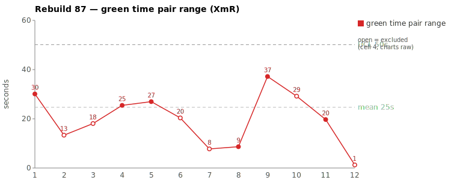
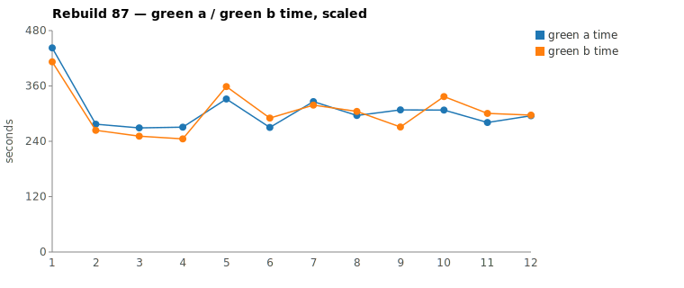

* TOC
{:toc}

---

# Context

This is a batch-level companion to [pbc-83][5], [pbc-84][4], [pbc-85][13], and [pbc-86][15], using the same in-run pair methodology: since [issue #434][7] every Darmok scenario runs its green phase **twice** — worktree `_a` and worktree `_b`, both branched from the *same red commit*, the shorter wall-clock kept. The pair-range is `|green_a − green_b|` from one metrics row, so model-of-the-day, red commit, and server window are held constant across the halves; what's left is **work** versus **per-token generation rate**, split by the [token-scaled pair-range][5] gate.

Rebuild87 reran the **[issue #444][16]** "Validation for Issues" set — the batch in which the one bundled *"Test step must have a valid object name"* validation had already been **split** into focused Only / File / Workspace / TestStep-Full-Name tests. The point of re-running the chart after that split is to ask: did the split clear the variation, or did it surface the *next* ambiguous test? It surfaced the next one. The two widest *scaled* pair-ranges land on opposite verdicts — a **split** — and, unlike [pbc-86][15], the assignable one is a **genuine functional divergence**: the two halves produced **different validation behavior**, the strongest assignable signal the harness emits.

| Scenario | Commit | Green `_a` | Green `_b` | Raw range | Scaled range | Token diff | Verdict |
|---|---|---|---|---|---|---|---|
| This object step definition parameter set doesn't exist validation | `1f45ce4` | **5:07** | 5:36 | 29s | **58.9s** | 16.1% | **assignable — ambiguous edge case** |
| Header row Cell names should start with a capital letter validation | `845efb8` | 4:29 | **4:11** | 18s | 40.6s | 13.9% | **common cause** |

(Bold = the winning half, brought back and refactored.) **Neither** pair breaches the run's range UCL of **74.2s** — Rebuild87 has *no* out-of-control point on the chart. The assignable cause below is therefore flagged by the **functional-diff warning**, not by a limit breach — a case where the behavioral signal is sharper than the control limit.

---

# Charts

Scenarios are numbered 1–12 in run order (shortest→longest); see the tables below for which scenario each index is.






---

# The token-scaled pair-range (recap)

Wall-clock fuses **real work** (closely tracked by green output tokens) with the **per-token generation rate** (server load, queue, context-prefill jitter — uncontrollable). The gate is two numbers off each half's green-phase JSONL: **token similarity** (within `TOKEN_SIMILARITY_THRESHOLD`, default 15%, the halves did near-equivalent work) and, when within threshold, the **scaled range** (the slower half normalized to the faster half's rate). Beyond the threshold the halves are flagged as *non-equivalent work* — one generated materially more — and the range is treated as possibly assignable rather than scaled away. The full three-regime derivation is in [pbc-83][5]. The two Rebuild87 pairs sit on opposite sides of the 15% line — **16.1%** (over → candidate) and **13.9%** (under → scale) — and the divergence walk plus the mojo's functional-diff check separate them.

---

# Pair 1 — `1f45ce4`: an under-specified edge case made the halves disagree (assignable)

The two green halves split **29 s raw / 58.9 s scaled**, and the mojo logged a **functional difference between the pair** — the two worktrees committed *different validation behavior* for the same input:

```
/logs/darmok.mojo.2026-06-29.log
2026-06-29 19:22:12.400 INFO  [mojo] Processing Scenario: Language Definition/Issues/Validation for Workspace Issues/This object step definition parameter set doesn't exist validation [RGR]
2026-06-29 19:23:50.604 INFO  [mojo]   Red: Completed maven (00:01:38)
2026-06-29 19:23:50.907 INFO  [mojo]   Green: A - Running...
2026-06-29 19:23:51.073 INFO  [mojo]   Green: B - Running...
2026-06-29 19:28:23.167 INFO  [mojo]   Green: A - Completed (00:04:32)
2026-06-29 19:28:58.666 INFO  [mojo]   Green: A - Verify passed (00:00:35)
2026-06-29 19:29:06.988 INFO  [mojo]   Green: B - Completed (00:05:15)
2026-06-29 19:29:28.034 INFO  [mojo]   Green: B - Verify passed (00:00:20)
2026-06-29 19:31:22.753 WARN  [mojo]   Green: Functional diff between pair (warn): When step object is absent, A returns "" (no issue) but B returns ROW_CELL_LIST_WORKSPACE for the row; differentiating input is validate-action on a row whose parent step's step object file does not exist.
2026-06-29 19:31:22.753 INFO  [mojo]   Green: Pair green _a=00:05:07 _b=00:05:36, winner=_a
2026-06-29 19:33:34.303 INFO  [mojo]   Commit: 1f45ce4429d252c141d872f6faccf15b6e1c869e
```

The two halves did not merely take different wall-clocks — they **disagreed on what the correct validation is** when validate-action runs on a row whose parent step's step-object file does not exist. The scenario as written does not pin that case, so each half had to *decide* it, and they decided differently (`_a`: no issue, `""`; `_b`: `ROW_CELL_LIST_WORKSPACE`).

| | `_a` (winner) | `_b` |
|---|---|---|
| Green wall-clock | 5:07 | 5:36 |
| Green output tokens | 8,426 | **10,038** |
| Assistant turns (stop events) | 28 | 32 |
| Read calls | 11 | **17** |
| Grep calls | 7 | 7 |
| Write / Edit | 2 / 2 | 2 / 2 |
| `mvn verify` cycles | 2 | **3** |

Token similarity **16.1% — over threshold**, so the gate declines to scale and flags non-equivalent work. No stall in either half: every per-minute token bucket is non-zero (`_a` 1997/2354/2930/584/561; `_b` 54/2438/2329/1886/2374/785/172). The gap is generation **volume**, not a hang — `_b` generated ~1,600 more tokens deciding the edge case.

They split on **how far each had to read the row/cell/step-parameters hierarchy before it could decide**:

```
_a (direct — resolved to "absent ⇒ no issue"):
  Grep getCellListAsString  →  Edit  →  mvn  →  mvn          (2 verify cycles)

_b (deep hierarchy walk — resolved to "absent ⇒ ROW_CELL_LIST_WORKSPACE"):
  Grep class RowIssueDetector   Grep class RowIssue
  Grep interface IRow           Grep interface IStepParameters
  →  Edit  →  mvn  →  mvn  →  mvn                            (3 verify cycles)
```

`_b` spent the extra ~30 s and a whole extra `mvn verify` cycle spelunking `RowIssueDetector` → `IRow` → `IStepParameters` to *work out what the absent-file case should mean* — and still landed on a **different answer** than `_a`. That is the signature of an assignable cause rooted in the **test-case input**, not the harness: when the spec is ambiguous, equally-correct agents diverge, and the slower one burns its budget resolving the ambiguity.

**Verdict: assignable — and unlike [pbc-86][15]'s warm-up position, this one is a splittable / disambiguable Test-Case defect.** The scenario silently bundles an under-specified edge case (parameter-set validation *plus* the absent-parent-step-object-file interaction). The functional-diff warning is decisive: the halves committed different code, so the variation is in the spec.

---

# Pair 2 — `845efb8`: token-scaling a small raw range (common cause)

Green split **18 s raw / 40.6 s scaled**; the mojo logged **"No functional diff between pair"** — both halves produced identical behavior.

| | `_a` | `_b` (winner) |
|---|---|---|
| Green wall-clock | 4:29 | 4:11 |
| Green output tokens | 7,450 | 6,414 |
| Read calls | 12 | 12 |
| Grep calls | 8 | 6 |
| Write / Edit | 2 / 2 | 2 / 2 |
| `mvn verify` cycles | 2 | 2 |

Token similarity **13.9% — within threshold** → work equivalent. Scaling `_a` to the faster half's rate gives a scaled time of 292 s and a **rate overhead of −22 s** — i.e. most of the gap is generation-rate jitter, uncontrollable. Same Read count, same edits, **same 2 `mvn` cycles**, no functional diff.

**Verdict: common cause.** The 18 s is jitter on equivalent work; chasing it would be tampering. Its appearance as the batch's *second-widest scaled* pair is itself the [pbc-86][15] artifact recurring — the selection sheet ranks by token-scaled range, and a 13.9% token gap inflates an 18 s raw range to 40.6 s, promoting a noise pair above larger-raw ones.

---

# Batch synthesis — a split, and the chart found the *next* ambiguity

The two worst scaled pairs do not share a cause:

1. **The widest pair is a genuine spec ambiguity.** `parameter set doesn't exist` made the halves *disagree on behavior* (functional diff), with one burning extra hierarchy-reading + a verify cycle to resolve it — over the 15% token gate. This is the same **class** of defect [#444][16] was created to remove (ambiguity driving variation), surviving in a *different* Workspace-validation scenario.
2. **The second pair is a scaling artifact.** `Header row Cell names` is equivalent work (2 vs 2 `mvn`, same files, no functional diff); its 40.6 s scaled range is token-scaling an 18 s raw range.

So the batch is **not** systematically over-bundled — the #444 split worked. What the chart now points at is the **next** ambiguous test. That is the intended use of re-running after a split: it does not declare victory, it advances the queue. Note too that **neither point breaches the UCL** — the assignable cause here would be *missed by the control limit alone* and is caught only by the functional-diff warning, which is the sharper trigger for ambiguity-class causes.

---

# The Fix, or Why No Fix

**Pair 1 (assignable) — disambiguate the spec.** `This object step definition parameter set doesn't exist validation` does not state the expected outcome when validate-action runs on a **row whose parent step's step-object file is absent**. The two halves filled that gap differently. The fix is in the **test-case input**: add a `Then` assertion (or split a focused scenario) declaring the single correct behavior — either "no issue" or `ROW_CELL_LIST_WORKSPACE`, decided by the spec author, not left to the implementer. That removes the decision the halves were each forced to make. Filed as its own work item ([the fix issue][17]); per the run convention a new assignable cause gets its own issue rather than reopening [#444][16].

**Pair 2 (common cause) — no scenario fix.** The spread is generation-rate jitter; changing the scenario would be tampering. The legitimate follow-up is at the **measurement** level: cross-check selection on **raw** range, not scaled alone (the same [pbc-86][15] recommendation — a pair "wide" only after scaling an 18 s raw range is decode-volume noise). And since the genuine assignable pair sits *under* the UCL, the functional-diff warning — not the limit — should be treated as the primary trigger for ambiguity-class causes.

No prompt, harness, or model change is proposed; those are held in statistical control.

---

# Mapping to the Research

| Predicted ([pbc-research][2]) | Observed across the two |
|---|---|
| Wide pair-range fires the signal | yes — 29 s and 18 s raw, surfaced by the scaled-range sheet |
| A breach of the limit marks a special cause | **no breach** — both under the 74.2 s UCL; the special cause was caught by the functional-diff warning instead |
| The special cause is in the input, not the system | **yes** — pair 1's ambiguity is a Test-Case spec gap |
| Both halves pass the same test | yes — all four passed verify |
| Two work-trees differ | **yes (pair 1)** — different committed behavior (`""` vs `ROW_CELL_LIST_WORKSPACE`); no (pair 2) |

Pair 1 is the cleanest **input-ambiguity** case in the series so far — the divergence is not depth-of-exploration noise ([pbc-84][4]/[pbc-85][13]) nor warm-up position ([pbc-86][15]) but two agents *committing different code* because the spec under-determined the answer. Pair 2 is the [pbc-86][15] scaling-artifact pattern recurring.

---

# Findings by Variable

*Each subsection records this run's findings about one [Wheeler variable][3]. Read the same heading across the run sequence to see how our understanding of that variable evolved.*

## green time pair range

The wide pair (29 s raw) was a **functional divergence** — the two halves committed different validation behavior for an absent step-object-file row — not exploration noise and not the old `~/.m2` jar-hunt. This is the first case in the series where a wide pair coincided with a `Functional diff between pair` warning, making the assignable verdict near-certain. The pair range alone (29 s) is modest; its *meaning* came from the behavioral check, not its magnitude.

## green time pair range moving range

No finding this run — reviewed at the pair-range level, not its moving range.

## green time

No timeout this batch; absolute green times sit in the 251–337 s band for both reviewed pairs, well inside the run. No contradiction / forbidden-dependency signal.

## green time moving range

No finding this run.

## scale & green tokens

The two pairs straddle the 15% token-similarity threshold (16.1% over, 13.9% under), and the threshold did its job: it flagged pair 1's genuine extra generation (deciding the edge case, +1,600 tokens, +1 `mvn` cycle) and scaled pair 2's equivalent work. But — as in [pbc-86][15] — token-scaling **over-promoted** the common-cause pair: an 18 s raw range inflated to 40.6 s scaled, surfacing it as the batch's second-widest. Selection must be cross-checked on raw range. Every per-minute token bucket across all four halves is non-zero: no silent stall ([#417][8] not recurring).

## functional diff between pair

**New finding / first prominent appearance.** The mojo's pairwise functional-equivalence check is the sharpest assignable-cause trigger yet: when the two halves commit *different behavior*, the cause is unambiguously in the spec, regardless of whether the pair-range breaches the UCL. Here it caught an ambiguity that the control limit missed (58.9 s scaled < 74.2 s UCL). Recommendation: treat the functional-diff warning as a **primary** selection trigger alongside the pair-range, not just a corroborating note.

## warm-up position

No finding this run — neither reviewed pair was the first scenario; the [pbc-86][15] warm-up stratification open item is unaffected.

---

# Open Questions From This Case

- **Should the functional-diff warning drive selection, not just corroborate it?** This run's only genuine assignable cause sat *under* the UCL and would have been missed by a pair-range-only screen. If the warning is a reliable ambiguity detector, the selection sheet should surface every functional-diff pair regardless of range.
- **Where should the absent-parent-step-object-file behavior be defined?** Per-scenario (`Then` assertion in this one test) or **once centrally** for all Workspace validations, since the absent-file interaction is cross-cutting? The latter would pre-empt the same ambiguity in sibling scenarios.
- **Raw-vs-scaled selection, again.** Pair 2 repeats [pbc-86][15]: token-scaling promoted an 18 s raw range to a top-2 slot. The dual-axis screen ("wide on at least one axis for the right reason") is now recommended by two consecutive runs.

---

[2]: wheeler-understanding-variation
[3]: wheeler-understanding-variation
[4]: 84
[5]: 83
[6]: 6768
[7]: https://github.com/farhan5248/sheep-dog-main/issues/434
[8]: https://github.com/farhan5248/sheep-dog-main/issues/417
[9]: https://github.com/farhan5248/sheep-dog-main/issues/426
[10]: 7576
[11]: https://github.com/farhan5248/sheep-dog-main/issues/415
[12]: 4849
[13]: 85
[14]: https://github.com/farhan5248/sheep-dog-main/issues/439
[15]: 86
[16]: https://github.com/farhan5248/sheep-dog-main/issues/444
[17]: https://github.com/farhan5248/sheep-dog-main/issues/554
