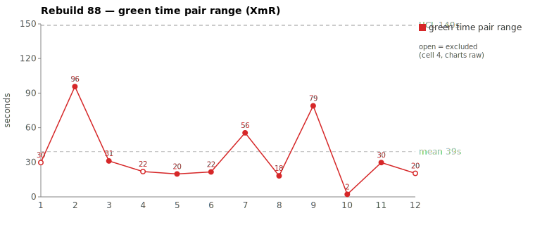
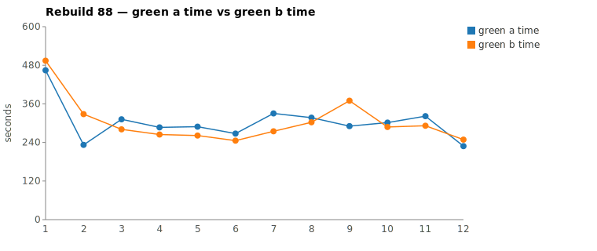
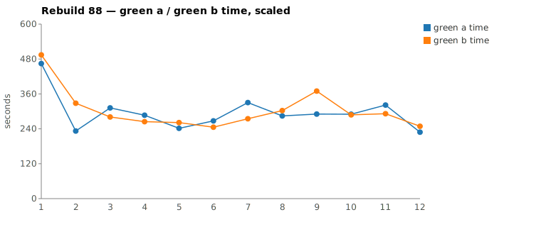

* TOC
{:toc}

---

# Context

This is a batch-level companion to [pbc-83][5], [pbc-84][4], [pbc-85][13], [pbc-86][15], and [pbc-87][18], using the same in-run pair methodology: since [issue #434][7] every Darmok scenario runs its green phase **twice** — worktree `_a` and worktree `_b`, both branched from the *same red commit*, the shorter wall-clock kept. The pair-range is `|green_a − green_b|` from one metrics row, so model-of-the-day, red commit, and server window are held constant across the halves; what's left is **work** versus **per-token generation rate**, split by the [token-scaled pair-range][5] gate.

Rebuild88 reran the **[issue #444][16]** "Validation for Issues" set — the same family Rebuild87 advanced. Where [pbc-87][18] found a *split* (one assignable, one scaling artifact), Rebuild88's two widest *scaled* pairs are **both assignable**, and both over the 15% token-similarity gate. But they are assignable for **different reasons**, which is the useful result: pair 2 trips the mojo's **`Functional diff between pair`** warning — the two halves committed *different validation behavior* for a digit-leading name — while pair 1 has **no** functional diff yet still splits on token volume plus an extra `mvn verify` cycle, the signature of a spec that leaves the step-definition-lookup path for the model to discover. One ambiguity is behavioral; one is exploratory. Neither is harness noise.

| Scenario | Commit | Green `_a` | Green `_b` | Raw range | Scaled range | Token diff | Verdict |
|---|---|---|---|---|---|---|---|
| This object step definition doesn't exist validation | `f721c48` | **4:50** | 6:09 | 79s | 139.7s | 32.5% | **assignable — under-specified lookup path** |
| Test suite name should start with a capital letter validation | `b8e69a7` | **7:44** | 8:14 | 30s | 98.9s | 17.6% | **assignable — functional diff (digit-leading name)** |

(Bold = the winning half, brought back and refactored.) **Neither** pair breaches the run's range UCL of **199.7s** — Rebuild88 has *no* out-of-control point on the chart. As in [pbc-87][18], both assignable causes are flagged by the token gate and (for pair 2) the **functional-diff warning**, not by a limit breach.

---

# Charts

Scenarios are numbered 1–12 in run order (shortest→longest); see the tables below for which scenario each index is.







---

# The token-scaled pair-range (recap)

Wall-clock fuses **real work** (closely tracked by green output tokens) with the **per-token generation rate** (server load, queue, context-prefill jitter — uncontrollable). The gate is two numbers off each half's green-phase JSONL: **token similarity** (within `TOKEN_SIMILARITY_THRESHOLD`, default 15%, the halves did near-equivalent work) and, when within threshold, the **scaled range** (the slower half normalized to the faster half's rate). Beyond the threshold the halves are flagged as *non-equivalent work* — one generated materially more — and the range is treated as possibly assignable rather than scaled away. The full three-regime derivation is in [pbc-83][5]. Both Rebuild88 pairs sit **over** the 15% line — **32.5%** and **17.6%** — so the gate declines to scale either; both are non-equivalent-work candidates, and the divergence walk plus the mojo's functional-diff check separate *why*.

---

# Pair 1 — `f721c48`: the halves agreed, but one spelunked the lookup path (assignable)

The two green halves split **79 s raw / 139.7 s scaled** — the widest pair in the run — yet the mojo logged **"No functional diff between pair"**: both worktrees committed *identical* validation behavior.

```
/logs/darmok.mojo.2026-06-30.log
2026-06-30 21:32:43.993 INFO  [mojo] Processing Scenario: Language Definition/Issues/3 - Validation for Workspace Issues/This object step definition doesn't exist validation [RGR]
2026-06-30 21:34:12.301 INFO  [mojo]   Red: Completed maven (00:01:28)
2026-06-30 21:34:12.609 INFO  [mojo]   Green: A - Running...
2026-06-30 21:34:12.902 INFO  [mojo]   Green: B - Running...
2026-06-30 21:38:36.239 INFO  [mojo]   Green: A - Completed (00:04:23)
2026-06-30 21:39:03.375 INFO  [mojo]   Green: A - Verify passed (00:00:27)
2026-06-30 21:40:01.558 INFO  [mojo]   Green: B - Completed (00:05:48)
2026-06-30 21:40:22.628 INFO  [mojo]   Green: B - Verify passed (00:00:20)
2026-06-30 21:42:12.965 INFO  [mojo]   Green: No functional diff between pair
2026-06-30 21:42:12.965 INFO  [mojo]   Green: Pair green _a=00:04:50 _b=00:06:09, winner=_a
2026-06-30 21:44:19.158 INFO  [mojo]   Commit: f721c48a2d9fd714f5bb1eb880a5a8fb336b5311
```

So the divergence is not *what* they built — it's *how much they had to read to build it*.

| | `_a` (winner) | `_b` |
|---|---|---|
| Green wall-clock | 4:50 | 6:09 |
| Green output tokens | 6,905 | **10,223** |
| Assistant turns (stop events) | 25 | **32** |
| Read calls | 14 | 12 |
| Grep calls | 5 | **11** |
| Write / Edit | 0 / 4 | 0 / 5 |
| `mvn verify` cycles | **2** | **3** |

Token similarity **32.5% — well over threshold**, so the gate declines to scale and flags non-equivalent work. No stall in either half: every per-minute token bucket is non-zero (`_a` 1618/1964/1726/1208/389; `_b` 1562/1754/835/3867/1255/767/183). The 79 s is generation **volume plus an extra build round-trip**, not a hang.

They split on **how much of the step-definition-lookup structure each read before editing**:

```
_a (direct — edited, two verify cycles, done):
  Read jacoco-shortlist  →  4× Edit  →  mvn  →  mvn                       (2 verify cycles)

_b (extra interface exploration, then a third build):
  Grep "interface IStepObject|ITestDocument|extends.*IStepObject"
  Grep "getStepDefinitionList"
  →  5× Edit  →  mvn  →  mvn  →  mvn                                       (3 verify cycles)
```

`_b` spent minute 3 grepping `interface IStepObject` / `getStepDefinitionList` to *work out how the step-definition list is looked up* — structure `_a` inferred without reading — then needed a **third `mvn verify`** cycle to land it. Both arrived at the same committed behavior, so the extra ~79 s is pure resolution cost: the spec under-determines *which* lookup an "object step definition doesn't exist" check should walk, and `_b` discovered it the long way. That is an assignable cause rooted in the **test-case input**: when the scenario doesn't name the lookup path, equally-correct agents pay different exploration tolls.

**Verdict: assignable — under-specified lookup path.** Same class as [pbc-84][4]/[pbc-85][13] depth-of-exploration, but sharper: the token gap is 32.5% (vs their ~10–16%) and it cost a whole extra `mvn` cycle, not just reasoning tokens. The functional-equivalence check confirms the fix is *not* behavioral — it is to name the lookup path in the scenario so neither half has to derive it.

---

# Pair 2 — `b8e69a7`: the halves committed different behavior (assignable — functional diff)

Green split **30 s raw / 98.9 s scaled**; the mojo logged a **functional difference between the pair** — the two worktrees disagreed on a digit-leading name:

```
/logs/darmok.mojo.2026-06-30.log
2026-06-30 19:10:55.264 INFO  [mojo] Processing Scenario: Language Definition/Issues/1 - Validation for Only Issues/Test suite name should start with a capital letter validation [RGR]
2026-06-30 19:12:20.089 INFO  [mojo]   Red: Completed maven (00:01:23)
2026-06-30 19:12:20.402 INFO  [mojo]   Green: A - Running...
2026-06-30 19:12:20.674 INFO  [mojo]   Green: B - Running...
2026-06-30 19:19:39.231 INFO  [mojo]   Green: A - Completed (00:07:18)
2026-06-30 19:20:04.867 INFO  [mojo]   Green: A - Verify passed (00:00:25)
2026-06-30 19:20:13.229 INFO  [mojo]   Green: B - Completed (00:07:52)
2026-06-30 19:20:34.909 INFO  [mojo]   Green: B - Verify passed (00:00:21)
2026-06-30 19:23:04.349 WARN  [mojo]   Green: Functional diff between pair (warn): !isUpperCase vs isLowerCase: a TestSuite name starting with a digit (e.g. "1Process") is flagged by A but not by B
2026-06-30 19:23:04.350 INFO  [mojo]   Green: Pair green _a=00:07:44 _b=00:08:14, winner=_a
2026-06-30 19:25:19.617 INFO  [mojo]   Commit: b8e69a773df968ac640b3c972cbaa8844290b1a8
```

The two halves **disagreed on what "start with a capital letter" means for a name that starts with a digit**. `_a` implemented `!isUpperCase(first)` — so `"1Process"` is *not* upper-case and **is flagged**; `_b` implemented `isLowerCase(first)` — so `"1Process"` is *not* lower-case and **is not flagged**. Both pass the scenario as written, because the scenario only exercises the lower-case-letter case; the digit-leading case is unspecified, so each half decided it — and they decided oppositely.

| | `_a` (winner) | `_b` |
|---|---|---|
| Green wall-clock | 7:44 | 8:14 |
| Green output tokens | 11,562 | **14,024** |
| Assistant turns (stop events) | 41 | **50** |
| Read calls | 13 | **19** |
| Grep calls | **22** | 15 |
| Write / Edit | 6 / 4 | 5 / 4 |
| `mvn verify` cycles | 2 | **3** |

Token similarity **17.6% — over threshold** → non-equivalent work. No stall: every per-minute bucket is non-zero across both halves (`_a` 1114/2041/1448/869/1567/2961/988/574; `_b` 1447/2776/1084/2010/1811/2093/1528/721/554). `_b` generated ~2,500 more tokens and ran an extra `mvn` cycle — but the decisive signal is not the token gap, it is the **functional-diff warning**: the halves committed *different code*.

**Verdict: assignable — functional diff.** This is the sharpest assignable signal the harness emits (cf. [pbc-87][18] pair 1). The cause is squarely in the **test-case input**: `Test suite name should start with a capital letter validation` never pins the digit-leading case, so the two halves filled the gap with mutually-exclusive predicates (`!isUpperCase` vs `isLowerCase`). The 30 s raw / 98.9 s scaled range is a corroborating symptom; the warning is the diagnosis.

---

# Batch synthesis — both assignable, both spec gaps, two flavors

The two worst scaled pairs share a **root** (an under-specified test case) but present differently:

1. **Pair 1 is an exploratory ambiguity.** `object step definition doesn't exist` doesn't name the lookup path, so `_b` spelunked `IStepObject` / `getStepDefinitionList` and paid an extra `mvn` cycle to reach the *same* committed behavior `_a` inferred. No functional diff — the halves agreed on the answer, disagreed only on the cost of finding it.
2. **Pair 2 is a behavioral ambiguity.** `Test suite name … capital letter` doesn't pin the digit-leading case, so the halves committed *different* predicates (`!isUpperCase` vs `isLowerCase`). Functional diff — they disagreed on the answer itself.

So Rebuild88 is the **both-assignable** counterpart to [pbc-87][18]'s split: re-running the [#444][16] family after the earlier splits keeps advancing the queue, and this batch surfaced *two* residual ambiguities of different kinds rather than one. The chart is doing exactly what a control chart should — flagging where the input still under-determines behavior. And, as in [pbc-87][18], **neither point breaches the UCL** (139.7 s and 98.9 s < 199.7 s): pair 2's assignable cause would be *missed by the control limit alone* and is caught only by the functional-diff warning — a second consecutive run where the behavioral signal is sharper than the limit.

---

# The Fix, or Why No Fix

**Pair 1 (assignable) — name the lookup path.** `This object step definition doesn't exist validation` does not state *which* step-definition lookup the check should walk, so `_b` had to derive it. The fix is in the **test-case input**: make the scenario name the object → step-definition-list relationship it exercises (or add a focused `Given`/step that establishes it), so neither half has to grep the interface graph to discover it. This is a *disambiguation*, not a split — the behavior is agreed; only the path is unstated.

**Pair 2 (assignable) — pin the digit-leading case.** `Test suite name should start with a capital letter validation` must declare the expected outcome for a name that starts with a **digit** (e.g. `"1Process"`): is it flagged or not? Add a `Then` assertion (or an `Examples` row) fixing the single correct behavior — `!isUpperCase` (digit-leading is flagged) *or* `isLowerCase` (digit-leading is allowed), decided by the spec author. That removes the decision the halves each made oppositely. Per the run convention a new assignable cause gets its **own issue** rather than reopening [#444][16] or [#554][17]; this one is not yet filed — the user files it.

No prompt, harness, or model change is proposed; those are held in statistical control.

---

# Mapping to the Research

| Predicted ([pbc-research][2]) | Observed across the two |
|---|---|
| Wide pair-range fires the signal | yes — 79 s and 30 s raw, surfaced by the scaled-range sheet |
| A breach of the limit marks a special cause | **no breach** — both under the 199.7 s UCL; pair 2's special cause was caught by the functional-diff warning instead |
| The special cause is in the input, not the system | **yes (both)** — pair 1 an unnamed lookup path, pair 2 an unspecified digit-leading case |
| Both halves pass the same test | yes — all four passed verify |
| Two work-trees differ | **yes (both)** — pair 2 different *committed behavior* (`!isUpperCase` vs `isLowerCase`); pair 1 same behavior, different exploration cost + extra `mvn` cycle |

Pair 2 joins [pbc-87][18] pair 1 as a clean **input-ambiguity-with-functional-diff** case — two agents committing different code because the spec under-determined the answer. Pair 1 is a heavier version of the [pbc-84][4]/[pbc-85][13] depth-of-exploration pattern: agreed behavior, but a 32.5% token gap and an extra build cycle spent discovering an unnamed path.

---

# Findings by Variable

*Each subsection records this run's findings about one [Wheeler variable][3]. Read the same heading across the run sequence to see how our understanding of that variable evolved.*

## green time pair range

Both reviewed pairs were assignable — the widest (79 s raw) was an *exploratory* divergence (agreed behavior, unnamed lookup path, +1 `mvn` cycle) and the second (30 s raw) a *behavioral* divergence (functional diff on a digit-leading name). This is the first run where **both** top-2 pairs were assignable, and where a smaller-raw pair (30 s) carried the sharper signal (functional diff) than the wider one (79 s, no functional diff). Magnitude ranked them; *meaning* came from the functional-diff check, not the range.

## green time pair range moving range

No finding this run — reviewed at the pair-range level, not its moving range.

## green time

No timeout this batch; absolute green times sit in the 291–494 s band across the two reviewed pairs, inside the run. No contradiction / forbidden-dependency signal.

## green time moving range

No finding this run.

## scale & green tokens

Both pairs cleared the 15% token gate (32.5% and 17.6%), so the gate correctly declined to scale either and flagged non-equivalent work in both. The token gap tracked real cost in each: pair 1's +3,318 tokens bought an extra interface walk + `mvn` cycle; pair 2's +2,462 tokens bought a divergent implementation. Every per-minute token bucket across all four halves is non-zero: no silent stall ([#417][8] not recurring). Note the token gate over-selected neither pair this run — unlike [pbc-86][15]/[pbc-87][18], both top-2 were genuinely wide on raw range too (79 s, 30 s), so the raw-vs-scaled selection concern did not bite here.

## functional diff between pair

**Second appearance (first was [pbc-87][18]).** The pairwise functional-equivalence check again caught an ambiguity the control limit missed (98.9 s scaled < 199.7 s UCL): `!isUpperCase` vs `isLowerCase` on a digit-leading TestSuite name. Its recurrence strengthens the [pbc-87][18] recommendation — treat the functional-diff warning as a **primary** selection trigger. This run also shows its *complement*: pair 1 had **no** functional diff yet was still assignable (exploratory ambiguity), so the warning is a sufficient-but-not-necessary assignable signal — its absence does not clear a wide token-gap pair.

## warm-up position

No finding this run — pair 2 is scenario 1 in run order (the *first* scenario), yet its divergence is a genuine functional diff, not warm-up jitter; the [pbc-86][15] warm-up stratification open item is neither confirmed nor refuted by a functional-diff case.

---

# Open Questions From This Case

- **Should a no-functional-diff wide pair still be treated as assignable?** Pair 1 agreed on behavior but split 32.5% on tokens + a whole `mvn` cycle over an unnamed lookup path. If "agreed behavior" tempts a common-cause verdict, this run argues against it — the exploration cost is real and input-fixable. Where is the line between depth-of-exploration noise ([pbc-84][4]) and an assignable unnamed-path gap?
- **Should the digit-leading name rule be defined once, centrally?** The `!isUpperCase` vs `isLowerCase` split will recur in every "name should start with a capital letter" validation (TestSuite, TestCase, Cell, …). Pin it per-scenario, or once for the whole naming-validation family?
- **Warm-up vs functional diff.** Pair 2 is the run's first scenario *and* a functional diff. Does first-position amplify ambiguity-driven divergence, or is the coincidence incidental? A cross-run tally of functional-diff-by-position would settle it.

---

[2]: wheeler-understanding-variation
[3]: wheeler-understanding-variation
[4]: 84
[5]: 83
[6]: 6768
[7]: https://github.com/farhan5248/sheep-dog-main/issues/434
[8]: https://github.com/farhan5248/sheep-dog-main/issues/417
[9]: https://github.com/farhan5248/sheep-dog-main/issues/426
[10]: 7576
[11]: https://github.com/farhan5248/sheep-dog-main/issues/415
[12]: 4849
[13]: 85
[14]: https://github.com/farhan5248/sheep-dog-main/issues/439
[15]: 86
[16]: https://github.com/farhan5248/sheep-dog-main/issues/444
[17]: https://github.com/farhan5248/sheep-dog-main/issues/554
[18]: 87
