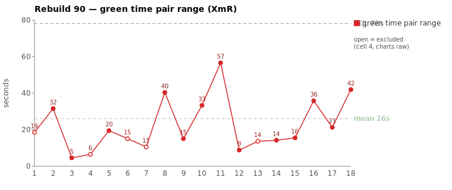
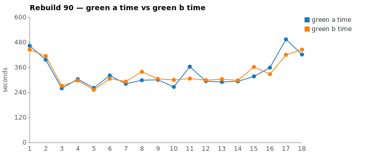
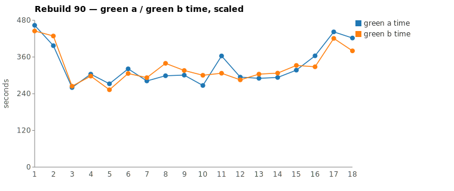

* TOC
{:toc}

---

# Context

This is a batch-level companion to [pbc-83][5], [pbc-84][4], [pbc-85][13], [pbc-86][15], [pbc-87][18], and [pbc-88][19], using the same in-run pair methodology: since [issue #434][7] every Darmok scenario runs its green phase **twice** — worktree `_a` and worktree `_b`, both branched from the *same red commit*, the shorter wall-clock kept. The pair-range is `|green_a − green_b|` from one metrics row, so model-of-the-day, red commit, and server window are held constant across the halves; what's left is **work** versus **per-token generation rate**, split by the [token-scaled pair-range][5] gate.

Rebuild90 reran the [#444][16] "Validation for Issues" family again. Unlike [pbc-87][18] (a split) and [pbc-88][19] (both assignable), Rebuild90's story is **methodological, not a hunt for two outliers**: chasing the run's widest pairs — as every prior report did — led to a **refinement of the token gate itself**. The widest raw ranges kept tracing back not to exploration but to two **work-free token sinks**: `TodoWrite` (each call re-serialises the whole todo list) and `Edit`/`Write` verbosity (a block-rewrite vs a surgical edit). Subtracting both yields a **NET** token count — the exploration work proper. Under NET, every wide pair in the run resolves to **common cause**: either bookkeeping jitter that NET erases, or a residual Read-heavy divergence that the walk traces to the **[#565][20] stale-report leak** — infrastructure, already fixed, *not* the test-case input. So this run produced **no assignable test-case cause** and one new tool: the NET-token gate.

A **second, independent** finding sits alongside it: the run's last four scenarios — the deepest nodes of the `Step object…` subtree — **climb** in green time (visible as the right-edge rise on the scaled chart). This is *not* a pair-width or NET phenomenon; the halves agree (flat pair-range). A same-scenario cross-run comparison (the **table** parameter-set case, run in both Rebuild86 and Rebuild90) isolates the cause: **~55% more green time** at position 47 than position 18, not from a bigger tree to wade through but from **which sibling each half templated the new code off**. Rebuild90's ordering made the table half adapt the *irregular* text mapping instead of a regular one — **intrinsic concept-mapping difficulty surfaced by scenario order**. The lever is ordering, not targeted UML. The run's range UCL stayed **below 60 s**; nothing breached control.

| Scenario | Commit | Green `_a` | Green `_b` | Raw range | Token diff | **NET diff** | Verdict |
|---|---|---|---|---|---|---|---|
| 1 - Validation for Only Issues - 2 | `bcbd946` | **4:13** | 6:21 | 128s | 12.2% | 20.5% | **common cause — #565 leak residual** |
| Step object … parameter set for text | `963d75c` | 8:15 | **7:01** | 74s | 4.8% | 6.2% | **common cause — rate jitter** |
| This object step def exists with no parameter set | `723b6dd` | 6:04 | **5:07** | 57s | 16.5% | **8.4%** | **common cause — NET clears it** |
| 1 - Validation for Only Issues - 1 | `dab1498` | **7:14** | 8:05 | 51s | 21.5% | 28.5% | **common cause — #565 leak residual** |

(Bold = the winning half, brought back and refactored.) **No** pair breaches the run's range UCL (**< 60 s** scaled MR limit on the chart). No functional-diff warning fired anywhere in the run.

---

# Charts

Scenarios are numbered in run order (shortest→longest); see the tables below for which scenario each index is.







---

# The token-scaled pair-range (recap), and the NET refinement

Wall-clock fuses **real work** (closely tracked by green output tokens) with the **per-token generation rate** (server load, queue, context-prefill jitter — uncontrollable). The gate is two numbers off each half's green-phase JSONL: **token similarity** (within `TOKEN_SIMILARITY_THRESHOLD`, default 15%, the halves did near-equivalent work) and, when within threshold, the **scaled range**. The full three-regime derivation is in [pbc-83][5].

**Rebuild90's refinement: raw green tokens over-count work.** Turn-attributing each half's output tokens to the tool that turn called reveals two large buckets that are *not* exploration:

1. **`TodoWrite`** — every call re-emits the entire todo list, so a half that checkpoints more often, or keeps wordier todo strings, burns hundreds of tokens per call with no additional problem-solving. On `80c83e9` (a wide pair from this family), `TodoWrite` alone accounted for **+1126 of a +1233 raw-token gap**.
2. **`Edit`/`Write`** — the diff payload. One half can emit a verbose whole-method `Edit` while the other makes a surgical one, same behavior committed. On `8b42e1e`, one `Edit` turn (1013 tokens) vs its sibling (156) drove ~970 of the gap.

Define **NET = green_tokens − Edit − Write − TodoWrite** — the exploration/reasoning work proper. The gate then compares *NET* similarity, not raw. This is now emitted by the review script and, per [#566][21], recorded as temporary `green_edit_tokens_*` / `green_todo_tokens_*` / `green_read_tokens_*` columns so the sheet can subtract them directly. Under NET, Rebuild90's wide pairs split into two clean common-cause classes — the point of this run.

---

# Pair 1 — `963d75c` / `723b6dd`: NET erases the gap (common cause — bookkeeping/rate jitter)

The clean case for the refinement. `Step object … parameter set for text` split **74 s raw** — the widest *raw* pair after the run's warm-up — yet its tokens were already within threshold (4.8%) and NET keeps it there (6.2%). `This object step definition exists with no parameter set` is sharper: **raw tokens 16.5% (over the gate)** but **NET 8.4% (under it)** — the raw over-count came from an edit-verbosity difference, and NET clears it.

| | `963d75c` `_a` | `_b` | | `723b6dd` `_a` | `_b` |
|---|---|---|---|---|---|
| Green wall-clock | 8:15 | **7:01** | | 6:04 | **5:07** |
| Green output tokens | 9,280 | 8,833 | | **13,751** | 11,487 |
| **NET tokens** | 4,079 | 4,348 | | 5,630 | 5,157 |
| Token diff / **NET diff** | 4.8% / **6.2%** | | | 16.5% / **8.4%** | |

No stall in any half (every per-minute token bucket non-zero). The `723b6dd` raw gap of 16.5% would have been flagged "non-equivalent work" by the old gate; NET shows the halves did the *same* exploration and one merely wrote a bulkier edit. **Verdict: common cause.** Fixing it would be tampering — there is no scenario-level lever, and the only legitimate action is the measurement change (compare NET, not raw), which this run adopts.

---

# Pair 2 — `bcbd946` / `dab1498`: a Read-heavy residual survives NET (common cause — #565 leak, not the test case)

The instructive case. The two `1 - Validation for Only Issues` scenarios are the run's **widest raw** pairs (128 s, 51 s), and — unlike pair 1 — their gap **grows** under NET (`- 2`: 12.2% → **20.5%**; `- 1`: 21.5% → **28.5%**). So there is a genuine *exploration* asymmetry here, not bookkeeping. The divergence walk locates it:

```
_a / _b diverge on how they diagnose the failing test:
  one half re-reads the red-phase log.txt 3× (344 + 141 + 166 tokens) to mine the failure,
  the other reads it once (2 tokens) and instead gets pulled into
    target/site/uml/..main-report.md   ← a STALE compliance report (empty-project-name),
    and sibling *IssueDetector / *IssueTypes classes that are not the target
```

The residual is **not** a test-case ambiguity. It is the [#565][20] signature: a prior scenario's refactor writes `target/site/uml/*.main-report.md`; `target/` is git-ignored and (before the fix) uncleaned between scenarios, so a green half that explores `target/` reads a **stale** report instead of the `site/uml` source contract — a luck-of-the-draw exploration divergence. `bcbd946`'s `_b` read `target/site/uml/..main-report.md` (the malformed empty-basename form) via an absolute path that escaped its own worktree. Both halves still committed identical behavior (`No functional diff`); the extra reads were wasted, not productive.

| | `bcbd946` `_a` | `_b` | | `dab1498` `_a` | `_b` |
|---|---|---|---|---|---|
| Green wall-clock | **4:13** | 6:21 | | **7:14** | 8:05 |
| Green output tokens | 10,971 | 12,492 | | 13,167 | 16,781 |
| **NET tokens** | 5,707 | 7,181 | | 6,811 | 9,523 |
| NET diff | **20.5%** | | | **28.5%** | |

**Verdict: common cause — infrastructure, not input.** NET correctly refused to scale these away (the extra work is real), and the walk correctly attributed it to a **known, already-fixed** cause rather than the test case. [#565][20] closes the leak (delete `target/site` before red); [#566][21]'s `green_read_tokens` column will make this Read-heavy signature visible directly on the sheet next run. No scenario-level fix is warranted.

---

# The tail-climb — concept-mapping difficulty, driven by scenario order (not accumulated subtree)

Independent of any pair-range or NET question: the run's **last four scenarios climb** in green time. These are the deepest nodes of the `Step object…` chain, and they are slowest not because their pairs diverge (they agree — pair-ranges stay flat) but because of **how hard the concept each one maps is, given the sibling exemplar available to template from at that point in the run**.

| # in tail | Scenario | Green (winner) | Explore tokens (Read+Grep+Glob) | Explore % of green |
|---|---|---|---|---|
| 1 | Step object doesn't exist | 9,204 | 2,867 | 31% |
| 2 | …step definition doesn't exist | 8,341 | 3,061 | 36% |
| 3 | …parameter set for text | 9,280 | 3,430 | 36% |
| 4 | …parameter set for table | 10,760 | **4,368** | **40%** |

Exploration tokens climb **+52%** (2,867 → 4,368) and the **share** of green spent orienting rises **31% → 40%**. A controlled natural experiment isolates the cause. The **table** parameter-set scenario ran in *both* Rebuild86 and Rebuild90, with the same committed behavior and near-identical pair-range (**26 s** vs **24 s**), but its absolute green time rose **~55%** (`7b946346`, 4:37–5:03, run-position 18 → `01edd6bc`, 7:01–7:25, run-position 47) and its NET tokens rose **+49%** (3,330 → 4,956). The difference is *not* accumulated-subtree noise — it is **which sibling each half templated the new `Row*` (table-mapping) classes from**:

```
86 (table-mapping): templated off CellIssueDetector / CellIssueTypes  → close analogy → cheap
90 (table-mapping): templated off TextIssueDetector / TextIssueTypes  → distant analogy → costly
   signature: read TextIssueDetector/Types, then interface IRow, re-reading the
   feature file 3× to reconcile the text-mapping template against the table requirement
```

Rebuild90's ordering committed the **text** parameter-set scenario *before* the **table** one, so when the table half went looking for the nearest committed exemplar it found the **irregular text mapping** and had to adapt text→table — a genuinely harder concept mismatch (a step-table→parameter-**text** mapping is less regular than a step-table→parameter-**table** one). Rebuild86, running a single combined scenario earlier, templated off the *regular* Cell sibling instead. So the extra cost is **intrinsic concept-mapping difficulty surfaced by scenario order**, not orientation overhead from a bigger tree.

This **revises the earlier reading of this variable**: the lever is **not** targeted UML scoping ([#565][20]/[#566][21] would not help — the work is real adaptation, not re-derivation of a growing tree). The lever is **ordering**: present the *regular* mapping (table→param-table) before the *irregular* one (table→param-text), so each later half templates off a close analogy and the cost stays flat. It is common cause — the halves agree, no test-case is broken — but with an **ordering-sensitive intrinsic-difficulty** component, tracked as its own variable below.

---

# Batch synthesis — the run that refined the ruler

Rebuild90 is not a "which scenario is broken" run; it is a **"how we measure divergence"** run.

1. **Chasing width found the sinks.** Following the widest pairs — the standing method — surfaced that raw pair-width is dominated by `TodoWrite` re-serialisation and `Edit` verbosity, both work-free. That produced the **NET** refinement.
2. **NET splits the wide pairs cleanly.** Some (pair 1) were pure bookkeeping/edit inflation → NET erases them → common cause, rate jitter. Some (pair 2) retain a real Read-heavy residual → but the walk ties that to the **[#565][20] stale-report leak**, infrastructure already fixed → common cause, not input.
3. **No assignable test-case cause this run.** Unlike [pbc-87][18]/[pbc-88][19], nothing traced to an under-specified or ambiguous scenario; no functional-diff warning fired.
4. **The tail-climb is a separate, ordering-driven trend.** The same table scenario cost ~55% more green time in Rebuild90 (position 47) than Rebuild86 (position 18) at flat pair-range — because Rebuild90's ordering left the table half templating off the *irregular* text mapping instead of a regular sibling. Intrinsic concept-mapping difficulty surfaced by scenario order; not a pair-width or NET signal, and not a test-case defect.

The control chart did its job: it flagged where to look, and the refined gate correctly declined every "assignable" temptation. **A run of all-common-cause is the right answer**, not a failed investigation — the fix work this run generated ([#565][20], [#566][21]) is at the *measurement and infrastructure* level, exactly where common-cause improvement belongs.

---

# The Fix, or Why No Fix

**No test-case fix.** Every wide pair resolved to common cause; sizing or splitting a scenario in response would be tampering. The legitimate actions are all measurement/infrastructure:

1. **Adopt NET as the gate signal ([#566][21]).** Compare `green_tokens − edit − todo` similarity, not raw. Temporary `green_edit_tokens_*`, `green_todo_tokens_*`, `green_read_tokens_*` columns are now written so the sheet subtracts them directly; the run's chart already applies this.
2. **Close the stale-report leak ([#565][20]).** Delete the whole `target/site` before red (widened from `target/site/uml` after this run showed a malformed `..main-report.md` leaking from a sibling dir). This removes the Read-heavy residual behind pair 2.
3. **Flatten the tail by ordering.** The table-vs-Rebuild86 comparison shows the late-scenario cost is intrinsic concept-mapping difficulty surfaced by order, *not* subtree-orientation overhead — so targeted UML ([#565][20]/[#566][21]) is **not** the lever here. Instead, order the family so each scenario's nearest committed exemplar is a **regular** analogy: present table→param-**table** (regular) before table→param-**text** (irregular), so the harder mapping templates off the easier one rather than the reverse. This is a scenario-*ordering* change, not a scenario-*content* change, so it is not tampering with the test case.

No prompt, harness, or model change is proposed; those are held in statistical control.

---

# Mapping to the Research

| Predicted ([pbc-research][2]) | Observed across Rebuild90 |
|---|---|
| Wide pair-range fires the signal | yes — 128 s, 74 s, 57 s, 51 s surfaced by the sheet |
| A breach of the limit marks a special cause | **no breach** — UCL < 60 s held all run; no out-of-control point |
| The special cause is in the input, not the system | **not this run** — every wide pair was bookkeeping/rate jitter or the [#565][20] infra leak; none traced to the test-case input |
| Both halves pass the same test | yes — all halves passed verify; no functional diff anywhere |
| Two work-trees differ | yes, but the difference was **measurement artifact (todo/edit tokens) or stale-report exploration**, not committed behavior |

Rebuild90 is the **all-common-cause** counterpart to [pbc-88][19]'s both-assignable: same family, but the residual variation this run was in the *ruler* (raw tokens over-count) and the *environment* (stale reports), not the spec.

---

# Findings by Variable

*Each subsection records this run's findings about one [Wheeler variable][3]. Read the same heading across the run sequence to see how our understanding of that variable evolved.*

## green time pair range

Every reviewed pair was common cause. The two *widest raw* (128 s, 51 s) retained a real exploration residual under NET but traced to the [#565][20] stale-report leak (infrastructure), not the test case; the next two (74 s, 57 s) were bookkeeping/edit inflation that NET erased. First run where **raw pair-width was shown to systematically over-count** via `TodoWrite`/`Edit` tokens — magnitude no longer implies assignable.

## green time pair range moving range

Range MR UCL held **below 60 s** all run — no out-of-control moving range. Reviewed at the pair-range level, not its MR.

## green time

No timeout this batch. Absolute green times sit in the 253–495 s band; the **tail four climb** within that band (see below), but no contradiction / forbidden-dependency signal and no breach.

## green time moving range

No finding this run.

## scale & green tokens

**The variable that moved this run.** Raw green tokens were shown to fuse exploration with two work-free sinks — `TodoWrite` (list re-serialisation) and `Edit`/`Write` (diff verbosity). Defining **NET = raw − edit − write − todo** reclassified wide pairs: `723b6dd` flipped from 16.5% raw (over-gate) to 8.4% NET (under-gate) → common cause; `bcbd946`/`dab1498` *grew* under NET (12.2%→20.5%, 21.5%→28.5%), correctly preserving a real residual the walk then tied to [#565][20]. Every per-minute bucket non-zero — no silent stall ([#417][8] not recurring). Recommendation adopted: **gate on NET, not raw** ([#566][21]).

## functional diff between pair

No functional diff fired anywhere in Rebuild90 — the third data point on this signal ([pbc-87][18], [pbc-88][19] had one each). Its *absence* here is consistent with an all-common-cause run: no half committed divergent behavior.

## tail-climb / concept-mapping difficulty (new this run)

**First explicit record, with a controlled comparison.** The last four subtree scenarios climb in green time, exploration share (31% → 40%), and exploration tokens (+52%). A same-scenario cross-run comparison isolates the cause: the **table** parameter-set scenario cost **~55% more green** in Rebuild90 (position 47) than Rebuild86 (position 18) — same behavior, flat pair-range (24 s vs 26 s), NET +49% — because Rebuild90's ordering left the table half **templating off the irregular `Text*` mapping** (re-reading the feature 3× to reconcile it) where Rebuild86 templated off the regular `Cell*` sibling. So the driver is **intrinsic concept-mapping difficulty surfaced by scenario order**, *not* accumulated-subtree orientation overhead. This **corrects** the initial reading: the lever is **ordering** (regular mapping before irregular), not targeted-UML scoping. Common cause, ordering-sensitive. Track green time vs run-position-vs-exemplar-analogy in future runs.

## warm-up position

No finding this run — the run's first scenario was not among the reviewed pairs' assignable signals (there were none), and the tail-climb is an *end-of-run* effect, the opposite end from warm-up.

---

# Open Questions From This Case

- **Should NET replace raw as the gate signal outright, or run alongside it?** This run adopts NET, but a raw-vs-NET disagreement is itself informative (a pair that is wide raw but clean NET is a bookkeeping tell). Keep both columns, or collapse to NET once confidence is established? Tracked in [#566][21].
- **Should `text` (no-tool reasoning turns) also be stripped from NET?** NET currently strips Edit/Write/TodoWrite. Pure reasoning turns are genuine exploration, so they stay — but a half that "thinks out loud" more inflates NET without more *tool* work. Is reasoning-token verbosity signal or noise?
- **Does reordering regular-before-irregular flatten the tail-climb?** The table-vs-Rebuild86 comparison predicts the late-scenario cost falls if each scenario's nearest committed exemplar is a *regular* analogy — i.e. present table→param-table before table→param-text. A next-run tally of green time vs exemplar-analogy (regular/irregular) before and after reordering would confirm the ordering lever (and confirm targeted-UML scoping is *not* the lever, since the work is real adaptation, not tree re-derivation).
- **Can "nearest committed exemplar analogy" be measured directly?** The tail signature was a half re-reading the feature 3× while templating off `Text*` for a `Row*` (table) class. A metric that flags *which* sibling a half read most before its first Write would make exemplar-mismatch visible on the sheet, the way `green_read_tokens` will make Read-heaviness visible.
- **Is there a run position where subtree-orientation cost breaches control?** Rebuild90's tail climbed but stayed under UCL. A deeper subtree, or a longer run, might push a late scenario out of control purely on accumulated-orientation cost — a special cause with no test-case behind it.

---

[2]: wheeler-understanding-variation
[3]: wheeler-understanding-variation
[4]: 84
[5]: 83
[7]: https://github.com/farhan5248/sheep-dog-main/issues/434
[8]: https://github.com/farhan5248/sheep-dog-main/issues/417
[13]: 85
[15]: 86
[16]: https://github.com/farhan5248/sheep-dog-main/issues/444
[18]: 87
[19]: 88
[20]: https://github.com/farhan5248/sheep-dog-main/issues/565
[21]: https://github.com/farhan5248/sheep-dog-main/issues/566
