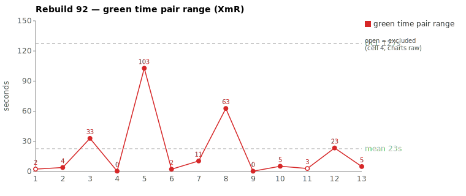
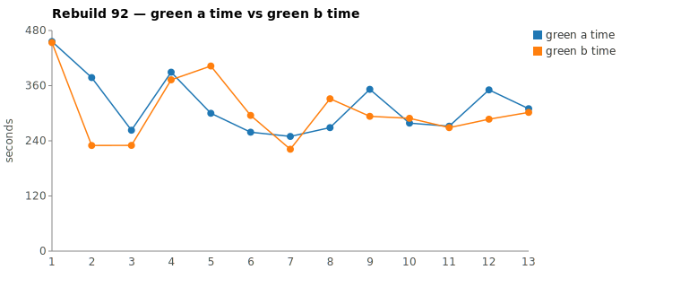
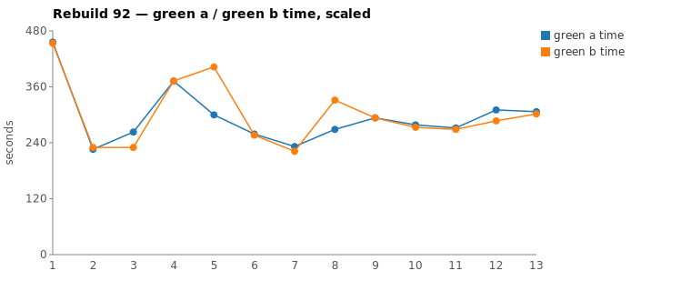

* TOC
{:toc}

---

# Context

This is a batch-level companion to [pbc-83][5], [pbc-84][4], [pbc-85][13], [pbc-86][15], [pbc-87][18], [pbc-88][19], and [pbc-90][22], using the same in-run pair methodology: since [issue #434][7] every Darmok scenario runs its green phase **twice** — worktree `_a` and worktree `_b`, both branched from the *same red commit*, the shorter wall-clock kept. The pair-range is `|green_a − green_b|` from one metrics row; what's left after the pair nets out model-of-the-day, red commit, and server window is **work** versus **per-token generation rate**, split by the [token-scaled pair-range][5] gate with [pbc-90][22]'s **NET** refinement (raw − Edit − Write − TodoWrite).

Rebuild92 reran the "Validation for Issues" family, and — like [pbc-90][22] — its story is more about the **ruler** than the scenarios. Both of the run's widest pairs resolve to **common cause**, but each one taught the measurement something:

1. The run's **widest scaled pair is an artifact of the scaling formula itself.** `1 - Validation for Only Issues - 1` has a raw range of **2 seconds** — the halves finished together — yet the sheet ranks it widest at 75,957 ms *scaled*, because the token-heavier half also *generated faster*, and scaling it to the slower half's per-token rate inflates it past its own raw time (the "rate overhead" goes negative). Magnitude on the scaled column no longer implies anything by itself; the sheet's own `exclude_from_limits=TRUE` on this row already reflects that.
2. The second-widest pair is a genuine exploration asymmetry — NET 43%, well over the gate — but the divergence walk traces it to a **discovery lottery**, not the test case: one half learned the issue-detector pattern by surveying four sibling classes because the class under construction has **no per-class UML contract** to route both halves to. The same scenario ran at a **7-second** pair-range in Rebuild91.

Alongside the two pairs, Rebuild92 is a housekeeping-heavy run for the measurement system itself: it is the **first run whose `phase_green_ms` excludes the mojo's jacoco/shortlist window** ([#568][23], ~26–45 s per half), it triggered the **fail-fast-on-stall** proposal ([#569][24]) after a genuine 92-second silent stall killed the batch's first attempt, and it exposed — and closed as a false alarm — a phantom "worktree escape" ([#570][25]) that turns out to also cast a retroactive caveat on [pbc-90][22]'s Pair-2 attribution.

| Scenario | Commit | Green `_a` | Green `_b` | Raw range | Scaled range | Token diff | **NET diff** | Verdict |
|---|---|---|---|---|---|---|---|---|
| 1 - Validation for Only Issues - 1 | `d289f80` | 7:36 | **7:33** | **2s** | 75,957 ms (artifact) | 14.3% | 12.8% | **common cause — scaling artifact** |
| Test Step Name - Missing State | `9a13a85` | **4:59** | 6:42 | 103s | 44,746 ms | 23.0% | **43.0%** | **common cause — discovery lottery (spec-discovery gap)** |

(Bold = the winning half, brought back and refactored.) **No** pair breaches the run's `range_UCL` (99,391 ms). No functional-diff warning fired anywhere in the run.

---

# Charts

Scenarios are numbered in run order; see the tables below for which scenario each index is.







---

# The token-scaled pair-range (recap), and a degenerate case

Wall-clock fuses **real work** (closely tracked by green output tokens) with the **per-token generation rate** (server load, queue, context-prefill jitter — uncontrollable). The gate is two numbers off each half's green-phase JSONL: **token similarity** (raw and, since [pbc-90][22], **NET** = raw − Edit − Write − TodoWrite) and, when within threshold, the **scaled range**. The full derivation is in [pbc-83][5].

**Rebuild92's finding: the scaling formula has a degenerate case.** Scaling assumes the token-heavier half would have finished proportionally sooner at the faster half's rate. When the token-heavier half is *also the faster generator* — `d289f80`'s `_a` emitted 14,524 tokens to `_b`'s 12,441 yet finished within 2 s of it — the "scaled time" of the heavy half (529,618 ms) exceeds its own raw time (456,012 ms) and the rate-overhead term goes **negative** (−74 s). The resulting 75,957 ms "scaled range" is pure arithmetic, not work: there is no 76-second gap anywhere in the run's wall-clocks. Rule adopted: **when raw range is near zero or rate overhead is negative, the scaled range is void** — fall back to raw + NET + the divergence walk. The sheet's `exclude_from_limits` flag on such rows is the right treatment.

A second measurement change lands this run: [#568][23] brackets the mojo-side jacoco re-run + `jacoco-shortlist.md` write (measured at 23–46 s, avg ~34 s per half on Rebuild91) and subtracts it from `claudeMs`, so **Rebuild92's `phase_green_ms` is claude-time only**. The mojo log now shows it directly — `Green: A - Completed (00:08:07)` vs `Pair green _a=00:07:36` differ by exactly the excluded window. Cross-run comparisons of absolute green time against pre-92 runs must account for this ~30–45 s/half definitional drop.

---

# Pair 1 — `d289f80` (1 - Validation for Only Issues - 1): the widest scaled pair isn't a pair at all (common cause — scaling artifact)

The run's first scenario, and the sheet's widest scaled range — with a **2-second raw range**. Both halves did the run's heaviest genuine work: this is the subtree-opening scenario, and uniquely, **green-compile had real work** (both halves hit a Guice `No implementation for … was bound` failure, wired up `ValidateAnnotationImpl`/`TestConfig`, and ran an mvn cycle before the shortlist even arrived), after which green-verify created the detector layer from nothing (`mkdir …/dsl/issues`, Writes of `TestSuiteIssueDetector`/`TestSuiteIssueTypes`, edits to `ValidateActionImpl`).

| | `_a` c420a2f4 | `_b` b38b7396 |
|---|---|---|
| Green wall-clock | 7:36 | **7:33** |
| Green output tokens | 14,524 | 12,441 |
| **NET tokens** | 6,981 | 6,086 |
| Assistant turns | 56 | 51 |
| Read / Grep / Glob | 16 / 13 / 6 | 15 / 15 / 4 |
| Writes / Edits | 5 / 4 | 5 / 4 |
| `mvn` cycles | 3 | 3 |

Token diff 14.3%, NET 12.8% — both under the gate. No stall in either half (every near-zero minute lines up with an mvn Bash call). The divergence walk found only discovery texture: `_a` leaned Glob and read `TestObject.java`; `_b` leaned Grep (hunting `TitleFragments`) and read `ITestDocument.java`. The committed file sets are identical; the four `TestConfig` edits are **byte-identical in size and order** across the halves, and the five written files differ by ~130 chars of formatting in one class. The entire raw-token gap is per-turn reasoning volume — `_a` thought a few sentences longer per tool call across 5 extra turns, with no single turn over 563 tokens.

```
walk: identical through call 11 (TodoWrite seed, 4 UML reads,
      grep "COMPILATION ERROR" / "Guice configuration errors" /
      _a: "No implementation for .* was bound"  _b: "No implementation for")
      → same Guice fix, same detector files written, same 3 mvn cycles
      → No functional diff
```

**Verdict: common cause.** The 75,957 ms scaled number is the formula degenerating (see recap): `_a` was token-heavier *and* faster per token, so "scaling" it manufactures a gap that raw wall-clock says never existed. Nothing to fix at any level except the arithmetic rule itself.

---

# Pair 2 — `9a13a85` (Test Step Name - Missing State): NET 43% survives, and the walk finds a discovery lottery (common cause — spec-discovery gap)

The instructive pair. Raw range **103 s**, raw tokens 23%, and NET *grows* to **43%** — by the gate alone, the strongest "non-equivalent work" candidate the in-run pair method has produced in this family. And the extra work is real: `_b` genuinely explored more. But the walk shows *what* it explored:

```
_a 3cf7c325: shortlist → StepDefinitionRefFragments.java → 3 edits (~1:20 shortlist→first Edit)
_b 2bf1fa80: shortlist → StepDefinitionRefFragments.java
             → TestSuiteIssueTypes.java          ← sibling survey, none of these
             → TestSuiteIssueDetector.java        ← are the class under construction
             → TestStepContainerIssueTypes.java   ←
             → TestStepContainerIssueDetector.java←
             → one 60s deliberation turn (328 tokens in the 13:46 bucket, no Bash running)
             → 3 edits (~2:50 shortlist→first Edit)
```

| | `_a` 3cf7c325 | `_b` 2bf1fa80 |
|---|---|---|
| Green wall-clock | **4:59** | 6:42 |
| Green output tokens | 7,455 | 9,686 |
| **NET tokens** | 2,159 | 3,786 |
| Reads | 13 | 17 |
| Writes / Edits | 0 / 3 | 0 / 3 |
| `mvn` cycles | 2 | 2 |

Both halves committed the **same three edits** — the `TEST_STEP_STEP_DEFINITION_NAME_ONLY` enum constant, a `validateStepDefinitionNameOnly()` mirroring the existing ObjectName check, and the cascade call in `ValidateActionImpl` — and the mojo logged `No functional diff between pair`.

Why did `_b` survey siblings at all? The class under construction has **no per-class UML contract**: `site/uml/` carries `uml-class-TypeIssueDetector.md` and thirteen other per-class files, but nothing for `TestStepIssueDetector` or its `TestSuite`/`TestStepContainer` siblings. With no contract to route to, each half improvises its discovery — `_a` wrote the pattern straight from the shortlist files, `_b` reverse-engineered it from four sibling classes. Which path a half draws is luck: **the same scenario ran at a 7-second pair-range in Rebuild91** (`41f3191`), where both halves happened to skip the survey. That cross-run contrast is the discovery lottery made visible.

**Verdict: common cause — no test-case fix.** The scenario is small (3 surgical edits) and unambiguous (identical behavior committed twice across two rebuilds); splitting or rewording it would be tampering. The gap is **spec-discovery**, and the lever is discovery-level: author per-class `uml-class-*.md` contracts for the issue-detector family (extend the existing `uml-class-TypeIssueDetector.md` pattern to `TestStepIssueDetector` and siblings) so both halves are routed to one contract instead of one guessing from siblings.

---

# Batch synthesis — two common causes, three ruler fixes

Rebuild92 continues [pbc-90][22]'s trajectory: the control chart flags where to look, and what it keeps finding is the measurement system.

1. **The widest scaled pair was the formula, not the run.** A 2-second raw pair ranked widest because scaling degenerates when the token-heavier half generates faster. Void the scaled range when rate overhead is negative; the sheet's `exclude_from_limits` already encodes the right instinct.
2. **The widest real pair was a discovery lottery.** NET's job is to preserve genuine exploration asymmetry, and it did (43%); the walk's job is to say whether that asymmetry is the *scenario's* fault, and it isn't — it's a missing per-class UML contract making pattern-discovery a coin flip. Same-scenario evidence across runs (7 s in Rebuild91, 103 s here) is the cleanest demonstration yet that pair-width can be a property of the *discovery environment*, not the input.
3. **The metric itself got cleaner mid-family.** [#568][23] removes the ~34 s/half mojo jacoco window from `phase_green_ms` starting this run, so the pair-range now compares claude-time to claude-time. (The window was roughly symmetric between halves, so past pair-*ranges* remain valid; absolute green levels shift.)
4. **A genuine stall, correctly detected, wastefully retried.** The batch's first attempt died at scenario 2: a 92-second silent stall in green-compile (tool result returned in 32 ms; the next model turn never came, while the sibling half generated normally). The [#417][8] watchdog fired correctly — but the nudge/`mvn clean install` recovery loop is structurally unable to succeed during green-compile (tests are red by design, so install can never pass), burned ~1:52, and the batch aborted anyway, discarding the sibling's completed, verified green. [#569][24] proposes stall → fail-fast, mirroring the [#382][9] hard-timeout semantics.
5. **A phantom worktree escape — and a retro-caveat for pbc-90.** Mid-review, green halves appeared to be reading `target/site/uml/*.main-report.md` from the **main checkout**, escaping their worktrees ([#570][25]). JSONL timestamps disproved it: every such read belonged to the **pair winner's session**, whose same UUID is resumed by *refactor* — and refactor's prompt legitimately runs `validate_main.py` and reads those reports in the main checkout. Unclipped session-wide path diffs folded refactor turns into the green comparison; the review recipes now clip to the green window. **Caveat**: [pbc-90][22]'s Pair 2 attributed a NET residual to green halves reading stale `..main-report.md` via the [#565][20] leak — if that evidence came from the same unclipped diff over winner sessions, the attribution deserves re-verification against the refactor windows.

**A run of all-common-cause is the right answer**, not a failed investigation — and this one hardened the ruler in three places ([#568][23], the void-scaled-range rule, green-window clipping) while filing the two real defects it did find at the infrastructure level ([#569][24] stall handling, and the missing per-class UML contracts as a discovery gap).

---

# The Fix, or Why No Fix

**No test-case fix.** Both pairs are common cause; touching either scenario would be tampering. The legitimate actions:

1. **Void the scaled range in the degenerate case.** When raw range ≈ 0 or the rate-overhead term is negative (token-heavier half generated faster), the scaled column is arithmetic noise — gate on raw + NET + the walk, and keep `exclude_from_limits=TRUE` on such rows.
2. **Author per-class UML contracts for the issue-detector family.** `uml-class-TestStepIssueDetector.md` (and `TestSuite`/`TestStepContainer` siblings) don't exist; their absence makes pattern-discovery a lottery that showed up as a 7 s → 103 s cross-run swing on the same scenario. `/rgr-gen-spec` is the authoring tool. Discovery-level, not a scenario content change.
3. **Fail fast on stall ([#569][24]).** Treat the stall kill like the [#382][9] hard timeout — no nudge, no install-check loop (which cannot pass during green-compile), no retry. The stalled run is already excluded from clean SPC data.
4. **Keep the green metric claude-only ([#568][23], landed).** And when charting green *levels* across runs, annotate Rebuild92 as the definition change point.
5. **Clip review diffs to the green window ([#570][25], closed).** The winner session's refactor turns must never fold into the green divergence walk; the skill recipes now take a green-end cutoff. Re-verify [pbc-90][22]'s stale-report attribution with the clipped method.

No prompt, harness, or model change is proposed; those are held in statistical control.

---

# Mapping to the Research

| Predicted ([pbc-research][2]) | Observed across Rebuild92 |
|---|---|
| Wide pair-range fires the signal | yes — the sheet surfaced 75,957 ms and 44,746 ms scaled ranges |
| A breach of the limit marks a special cause | **no breach** — `range_UCL` 99,391 ms held; the widest point was a formula artifact, flagged `exclude_from_limits` |
| The special cause is in the input, not the system | **not this run** — one artifact of the ruler, one discovery-environment lottery; neither traces to the test-case input |
| Both halves pass the same test | yes — every completed half passed verify; `No functional diff` on both reviewed pairs |
| Two work-trees differ | pair 2 genuinely differed in *exploration* (43% NET) yet converged to identical committed behavior — the difference was discovery path, not spec interpretation |

Rebuild92 pairs with [pbc-90][22] as a second consecutive **all-common-cause** run in this family, with the residual variation again in the *ruler* (scaled-range degeneracy, jacoco padding, refactor-read contamination) and the *environment* (missing per-class contracts, stall retry policy) — not the spec.

---

# Findings by Variable

*Each subsection records this run's findings about one [Wheeler variable][3]. Read the same heading across the run sequence to see how our understanding of that variable evolved.*

## green time pair range

Both reviewed pairs common cause. The **widest scaled** value (75,957 ms) sits on a 2-second raw pair — first recorded instance of the **scaled-range degenerate case** (token-heavier half generated faster; rate overhead negative). The widest **raw** pair (103 s) was a real exploration asymmetry traced to the discovery lottery, not the input. No breach of `range_UCL` (99,391 ms).

## green time pair range moving range

No out-of-control moving range. Reviewed at the pair-range level.

## green time

**Definition change this run**: [#568][23] excludes the mojo jacoco/shortlist window (~26–45 s per half) from `phase_green_ms` — Rebuild92 green levels are claude-time only and sit lower than pre-92 runs by construction. One scenario (the first attempt's `1 - Validation for Only Issues - 2`) recorded a failed half (`green_b=0`) from the stall abort; the rerun's row is the valid one.

## green time moving range

No finding this run.

## scale & green tokens

NET did its job in both directions: it kept pair 1 under the gate (14.3% raw → 12.8% NET, bookkeeping/verbosity) and it *preserved* pair 2's real asymmetry (23% → 43%), which the walk then attributed to sibling-survey discovery rather than the scenario. New nuance: the per-turn token attribution showed pair 1's raw gap living in **reasoning volume with identical tool payloads** (byte-identical edits both sides) — verbosity is not always in the Edit bucket NET strips. Sheet hygiene note: the sheet's `B Tokens` for `Test Step Name - Missing State` (8,567) disagrees with metrics.csv `green_tokens_b` (9,686); the CSV is authoritative.

## functional diff between pair

No functional diff fired anywhere in Rebuild92 — consistent with two identical-implementation pairs. Fourth run of data on this signal; still only [pbc-87][18]/[pbc-88][19] have positives.

## silent stall / timeout (recurring)

**First genuine silent stall since the [#417][8] watchdog landed**: 92 s of no model output in `_b`'s green-compile at scenario 2 of the first attempt (tool result on disk in 32 ms; sibling half generating normally in the same window — per-request, not environmental). Watchdog fired correctly at 90 s. The recovery loop is the defect: nudge + `mvn clean install` cannot succeed during green-compile (tests red by design), so it burned ~1:52 and the batch aborted anyway, wasting the sibling's verified green. [#569][24]: stall → fail fast like [#382][9].

## green-window attribution (new this run)

**First explicit record.** The pair winner's session UUID is resumed by refactor, so a session-wide JSONL scan mixes refactor turns into "green" evidence. This run that mix manufactured a phantom worktree escape — winner halves "reading" `target/site/uml/*.main-report.md` from the main checkout — that timestamp-clipping dissolved ([#570][25], closed as false alarm; refactor legitimately reads those reports post-bring-back). Review recipes now clip to the half's last green `end_turn`. Retro-caveat filed against [pbc-90][22] Pair 2's [#565][20]-leak attribution.

## tail-climb / concept-mapping difficulty

No finding this run — the reviewed pairs sit at the run's head (scenario 1) and middle; no tail analysis performed.

## warm-up position

Pair 1 **is** the run's first scenario, and its absolute green (7:33–7:36 both halves) is the run's highest — the subtree-opening cost is real work (green-compile Guice wiring + creating the detector layer + 3 mvn cycles) and **symmetric**, so it widens nothing: the pair agrees to 2 s. Warm-up position inflates *level*, not *range*.

---

# Open Questions From This Case

- **Should the sheet compute NET-scaled rather than raw-scaled?** Pair 1 ranked widest on a scaled column fed by raw tokens (and, for pair 2, by a `B Tokens` value that disagrees with metrics.csv). With [#566][21]'s per-bucket columns on the row, the sheet could scale on NET and void the result when rate overhead goes negative — encoding this run's degenerate-case rule directly.
- **Is reasoning-volume verbosity a NET blind spot?** Pair 1's raw gap lived in per-turn *thinking* attached to turns whose tool payloads were byte-identical. NET strips payload buckets (Edit/Write/TodoWrite) but reasoning tokens ride along inside every bucket. A per-turn "args-only" token split would separate deliberation from payload exactly.
- **Does authoring the missing `uml-class-*.md` contracts collapse the discovery lottery?** Prediction: with `uml-class-TestStepIssueDetector.md` in place, the Missing-State scenario's cross-run pair-range variance (7 s ↔ 103 s) collapses, and sibling-survey signatures (a half reading 3+ sibling detector classes before its first Edit) disappear from the walks. A before/after tally over the next rebuild of this family would confirm.
- **Does [pbc-90][22]'s Pair-2 attribution survive green-window clipping?** The [#565][20] stale-report reading predates the clip rule, and the `..main-report.md` reads observed this run were all refactor-phase. Re-run the pbc-90 walks with the clipped recipes.
- **What does the pair-range distribution look like now that green is claude-only?** [#568][23] removed a roughly-symmetric ~34 s/half additive term. Ranges should be unchanged in expectation but their *relative* spread (range as % of green) grows; the XmR limits will recompute over the next few runs.

---

[2]: wheeler-understanding-variation
[3]: wheeler-understanding-variation
[4]: 84
[5]: 83
[7]: https://github.com/farhan5248/sheep-dog-main/issues/434
[8]: https://github.com/farhan5248/sheep-dog-main/issues/417
[9]: https://github.com/farhan5248/sheep-dog-main/issues/382
[13]: 85
[15]: 86
[18]: 87
[19]: 88
[20]: https://github.com/farhan5248/sheep-dog-main/issues/565
[21]: https://github.com/farhan5248/sheep-dog-main/issues/566
[22]: 90
[23]: https://github.com/farhan5248/sheep-dog-main/issues/568
[24]: https://github.com/farhan5248/sheep-dog-main/issues/569
[25]: https://github.com/farhan5248/sheep-dog-main/issues/570
