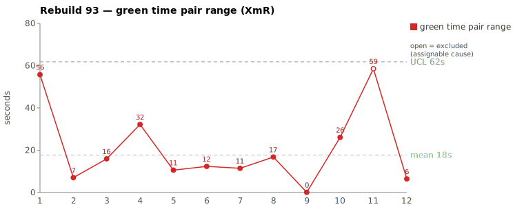
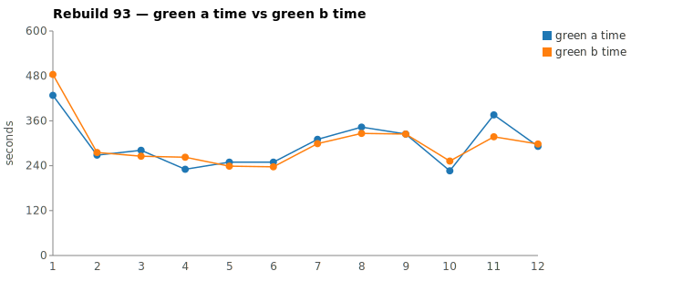
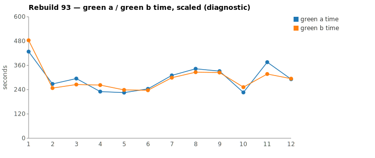

* TOC
{:toc}

---

# Context

This is a batch-level companion to [pbc-83][5], [pbc-84][4], [pbc-85][13], [pbc-86][15], [pbc-87][18], [pbc-88][19], [pbc-90][22], and [pbc-92][26], using the same in-run pair methodology: since [issue #434][7] every Darmok scenario runs its green phase **twice** — worktree `_a` and worktree `_b`, both branched from the *same red commit*, the shorter wall-clock kept. The pair-range is `|green_a − green_b|` from one metrics row; what's left after the pair nets out model-of-the-day, red commit, and server window is **work** versus **per-token generation rate**, split by the [token-scaled pair-range][5] gate with [pbc-90][22]'s **NET** refinement (raw − Edit − Write − TodoWrite) and [pbc-92][26]'s decision matrix.

**A sheet-methodology change lands this run**: the pair-range sheet now ranks and charts on the **raw range** (col K) for every row, keeping the scaled range (col L) as a per-row diagnostic rather than the charting basis. This sidesteps [pbc-92][26]'s scaled-range degenerate case entirely — a phantom scaled value can no longer rank a 2-second pair widest — and `exclude_from_limits` reverts to its plain Wheeler meaning: a point with an **identified assignable cause** is excluded so the limits describe common-cause variation only. The XmR limits are recomputed accordingly, all-raw: `range_mean` 17,699 ms, `range_UCL` 61,815 ms over the eleven common-cause rows.

Rebuild93 ran the "Validation for Workspace Issues" family (plus reruns of the Only-Issues subtree), and after two consecutive all-common-cause runs ([pbc-90][22], [pbc-92][26]) it breaks the streak with a **split verdict** on the top-2 raw ranges:

1. The widest pair carries the first **`Functional diff between pair`** warning since [pbc-87][18]/[pbc-88][19] — the two halves committed *behaviorally different* row-validation semantics from the same red commit, the deterministic assignable-cause signal that overrides every wall-clock argument. The test case is **ambiguous** about *which table row* gets validated. This is the sheet's one `exclude_from_limits=TRUE` row.
2. The second-widest pair is the run's opening scenario doing its usual heavy subtree-opening work with one half exploring more broadly than the other — a **discovery lottery** rerun of [pbc-92][26]'s pattern (the *same scenario* paired to 2 seconds there), common cause, no fix.

The pair-1 finding also closes a prediction from [pbc-92][26]: the missing per-class UML contracts that made pattern-discovery a *time* lottery there have now produced a *functional* divergence here — one half invented a new `RowIssueDetector` class, the other bolted row-0 validation onto the existing `TestStepIssueDetector`, and the two encode different rules.

| Scenario | Commit | Green `_a` | Green `_b` | Raw range | Token diff | **NET diff** | Verdict |
|---|---|---|---|---|---|---|---|
| Step Parameters - 2 - Parameter doesn't exist | `37b0a34` | 6:15 | **5:17** | **58,537 ms** | 21.5% | **35.1%** | **assignable — functional diff: row-0 vs cursor-row semantics** (`exclude_from_limits=TRUE`) |
| 1 - Validation for Only Issues - 1 | `1bed3f1` | **7:08** | 8:03 | 55,742 ms | 10.7% | 15.2% | **common cause — discovery-breadth lottery on the subtree opener** |

(Bold = the winning half, brought back and refactored.) With the assignable point excluded, **no common-cause row breaches** the raw `range_UCL` (61,815 ms); pair 2's 55,742 ms is the widest in-limits point and sits just under it. Notably, the assignable pair itself is *also* under the limit — the functional-diff check caught what the chart alone would not have flagged.

**Cross-run stability of the assignable pair.** The same scenario in Rebuild92 ran `_a` 5:50 / `_b` 4:47 — raw range **63,738 ms**, tokens 11,085/10,249 — against Rebuild93's 58,537 ms and 12,939/10,158. Levels, tokens, and width all reproduce within ~10%. That stability is itself evidence: jitter doesn't repeat a ~60-second gap two runs in a row, but a *standing ambiguity* in the input does — each rebuild re-rolls which rule each half picks. No functional-diff warning fired on it in Rebuild92 (the halves presumably drew the same rule that time); Rebuild93's draw split them and named the ambiguity.

---

# Charts

Scenarios are numbered in run order; see the tables below for which scenario each index is. The pair-range chart uses the **raw range** for every row and the all-raw XmR limits (mean 17,699 / UCL 61,815 ms); the one assignable point (SP-2) is excluded and drawn as an open circle, with the moving-range chain bridging across it — the generator and the sheet now agree exactly. The scaled-green chart is retained as a diagnostic view only.







---

# The token-scaled pair-range (recap), demoted to diagnostic

Wall-clock fuses **real work** (closely tracked by green output tokens) with the **per-token generation rate** (server load, queue, context-prefill jitter — uncontrollable). The gate is two numbers off each half's green-phase JSONL: **token similarity** (raw and **NET** = raw − Edit − Write − TodoWrite) and, when within threshold, the **scaled range**. The full derivation is in [pbc-83][5].

As of this run the scaled value informs the **per-pair verdict** but no longer feeds the chart: the sheet ranks, charts, and computes limits on the raw range alone. The trade is deliberate — raw ranges carry some rate-jitter the scaled column would remove, but they can never manufacture variation that isn't in the clock ([pbc-92][26]'s degenerate case), and one consistent column keeps the XmR limits honest. The [pbc-92][26] matrix survives as the *investigation* protocol: time band × token band still says whether a wide pair is rate, payload, or real work before the divergence walk runs.

One standing override outranks the whole token argument: the mojo's **functional-diff check**. When `_a` and `_b` committed implementations that *behave differently* on some input yet both passed the same Then-assertions, the test case admits more than one valid rule — assignable by construction, whatever the tokens say. Rebuild93's pair 1 is that case.

Rebuild93's green times are claude-only per [#568][23] (the mojo bracket shows it directly: `Green: B - Completed (00:05:54)` vs `Pair green _b=00:05:17` — the 37 s delta is the excluded allowlist/verify/jacoco window). All review recipes were clipped to each half's green window per the [#570][25] rule; no phantom asymmetries appeared.

---

# Pair 1 — `37b0a34` (Step Parameters - 2 - Parameter doesn't exist): the functional diff fires (assignable — ambiguous row semantics)

The run's widest raw range (58,537 ms) — and the one where the token gate doesn't even get the last word, because the mojo bracket carries the deterministic signal:

> `2026-07-08 14:35:10.934 WARN [mojo] Green: Functional diff between pair (warn): A validates step-parameters against hardcoded row 0 of the test step's table, while B validates against the actual cursor row; they diverge when cursor is on a non-first row whose cells differ from row 0's cells.`

| | `_a` aecc07a2 | `_b` 750c14f4 |
|---|---|---|
| Green wall-clock | 6:15 | **5:17** |
| Green output tokens | 12,939 | 10,158 |
| **NET tokens** | 7,266 | 4,717 |
| Assistant turns | 55 | 58 |
| Read / Grep / Glob | 13 / 5 / 2 | 11 / 6 / 0 |
| Writes / Edits | 0 / 4 | 2 / 2 |
| `mvn verify` cycles | 2 | 2 |

The matrix reads real work all the way down — time differs (18.5% of the faster half), raw tokens differ (21.5%), NET *grows* to **35.1%**. No stall in either half: every per-minute token bucket is non-zero, and the one soft minute in each (18:27) is the shortlist/`--resume` gap between green-compile and green-verify, symmetric across the halves.

The divergence walk shows the two halves splitting exactly where the warn line says they should — at the *site* of the row validation:

```
identical through ~call 12 (TodoWrite seed, 4 site/uml reads,
      grep "COMPILATION ERROR" / "Guice configuration errors")
_a aecc07a2: grep log "Step Parameters - 2|expected:|but was:|AssertionError|assert"
             → Glob **/RowIssueDetector.java (missing) → Glob **/*IssueDetector.java
             → Read TestStepIssueDetector.java → grep "interface IStepParameters"
             → Read src-gen IStepParameters.java
             → 4 Edits: TestStepIssueTypes, TestStepIssueDetector ×2, ValidateActionImpl
               (row validation folded into the existing detector, keyed to table row 0)
_b 750c14f4: Bash tail -100 log.txt
             → grep "RowIssueDetector" / "RowIssueTypes"
             → grep "getStepParametersList" / "interface IStepDefinition"
             → Write RowIssueDetector.java + Write RowIssueTypes.java (new classes)
             → 2 Edits: ValidateActionImpl ×2
               (a new row-level detector validating the actual cursor row)
```

Different implementation sites, different rules: `_a` never created the row layer and hardcoded row 0 inside `TestStepIssueDetector`; `_b` built `RowIssueDetector`/`RowIssueTypes` from scratch and validated the cursor row. Both passed the same Then-assertions, because the scenario's fixture never puts the cursor on a non-first row whose cells differ from row 0 — precisely the input the warn line names.

**UML consultation was symmetric** — both halves read the same four family-level files (`uml-overview`, `uml-package`, `uml-interaction-main`, `uml-interaction-test`) and nothing else — but there was nothing class-level *to* read: `site/uml/` has no `uml-class-*.md` for `TestStepIssueDetector`, and `RowIssueDetector` didn't exist until `_b` invented it. This is [pbc-92][26]'s discovery gap escalated: with no contract pinning the row-validation design, the halves didn't just take different *paths* to the same code — they designed **different code**.

**Verdict: assignable — excluded from the limits.** The functional-diff line is decisive on its own; the NET asymmetry (35.1%) and the ~60 ms-stable cross-run width (63.7 s in Rebuild92, 58.5 s here) independently corroborate a standing cause in the input, not a bad draw. The fix is in the test-case input — see The Fix below.

---

# Pair 2 — `1bed3f1` (1 - Validation for Only Issues - 1): the subtree opener re-rolls the discovery lottery (common cause)

The second-widest raw range (55,742 ms) is the run's **opening scenario** — the same subtree-opener [pbc-92][26] reviewed as its pair 1, where its two halves finished **2 seconds apart**. Here they finished 56 seconds apart. Same scenario, same heavy opening work, opposite pair-width: that cross-run swing is the signature of a lottery, not a scenario defect.

The mojo logged **`Green: No functional diff between pair`**, winner `_a`. Both halves did the run's heaviest genuine work, exactly as in Rebuild92: green-compile had real work (both hit the Guice `No implementation for … was bound` failure, fixed `TestConfig` with a Write + 2 Edits, and ran an mvn cycle before the shortlist even arrived), then green-verify created the detector layer from nothing (`mkdir …/dsl/issues`, Writes of `TestSuiteIssueDetector`/`TestSuiteIssueTypes`, edits to `ValidateActionImpl`, 2 verify cycles).

| | `_a` b4238b48 | `_b` 939de898 |
|---|---|---|
| Green wall-clock | **7:08** | 8:03 |
| Green output tokens | 13,336 | 14,927 |
| **NET tokens** | 6,942 | 8,191 |
| Assistant turns | 96 | 101 |
| Read / Grep / Glob | 19 / 17 / 5 | 16 / 18 / 7 |
| Writes / Edits | 5 / 4 | 5 / 4 |
| `mvn` cycles | 3 | 3 |

Raw tokens are within the 15% threshold (10.7%); NET lands at 15.2%, just over the band — a modest real-work difference, and the scaled diagnostic agrees (51 s of the 56 s range is work-attributable, only 5 s rate jitter). No stall in either half: the 01:52 dip in both buckets is the green-compile `mvn` running, symmetric.

The walk shows where `_b`'s extra work went — breadth, not a different design:

```
identical green-compile arc (Guice grep → TestConfig Write + 2 Edits → mvn)
identical skeleton after shortlist: mkdir dsl/issues → Write TestSuiteIssueDetector
      + TestSuiteIssueTypes → Edit ValidateActionImpl ×2 → 2 mvn verify cycles
_a b4238b48: reads ITestSuite.java + sibling TestStepIssueDetector/Types,
             ~17 greps, first detector Write at 01:55:20
_b 939de898: same skeleton, but hunts utilities first — greps "doEdgeStep",
             "assertVertexStep", "processInputOutputsText", "navigateToDocument",
             "interface ITestDocument", globs **/*Issue*.java; reads TestObject.java,
             SheepDogIssueProposal.java — first detector Write at 01:55:57,
             ~10 extra turns, 2.3× the grep result bytes (15,197 vs 6,525)
```

Both committed the same detector layer; the file sets differ only in which *reference* material each consulted (`_a` the src-gen interfaces and existing sibling detectors, `_b` the shared `TestObject`/utility classes). **UML consultation was symmetric** — the same four family-level `site/uml/` files each, and again no per-class `uml-class-*.md` exists for the `TestSuiteIssueDetector` family, so what each half grabbed as its design reference was the draw.

**Verdict: common cause — no fix.** Equally-valid exploration styles converging on identical behavior, with the same scenario pairing to 2 s in [pbc-92][26]. Splitting or rewording the scenario would be tampering. The lever, unchanged from [pbc-92][26] and now twice-evidenced on this exact scenario family, is discovery-level: per-class UML contracts so both halves are routed to one design reference instead of improvising.

---

# Batch synthesis — a good run: the signal fired, the ruler simplified

Rebuild93 is the family's healthiest run-review yet, on three counts:

1. **The functional-diff check earned its keep.** It caught a real, *reproducibly wide* ambiguity (SP-2: 63.7 s in Rebuild92, 58.5 s here) that the control limit alone never flagged — both widths sit under their runs' UCLs. The warn line named the two rules and the discriminating input, turning a statistical hint into a concrete test-case fix.
2. **The chart's widest common-cause point is a known, benign pattern.** The subtree opener's 2 s ↔ 56 s cross-run swing on identical inputs is [pbc-92][26]'s discovery lottery re-observed, and the verdict reproduces: heavy symmetric opening work, breadth-vs-depth exploration texture, identical committed behavior.
3. **The sheet methodology simplified and got internally consistent.** Raw col K everywhere; scaled demoted to a diagnostic; `exclude_from_limits` restored to its Wheeler meaning (exclude the *assignable* point); limits recomputed all-raw (mean 17,699, MRbar 16,585 with the MR chain skipping the excluded row, UCL 61,815). The degenerate-case machinery from [pbc-92][26] becomes dormant by construction — a phantom scaled value can no longer reach the chart.
4. **The two verdicts meet in the missing contract layer.** With no `uml-class-*.md` for the issue-detector family, discovery improvisation cost *time* on pair 2 and *design convergence* on pair 1 — the same absence, two severities. The contract-authoring lever now has evidence at both.

---

# The Fix, or Why No Fix

**Pair 1 — assignable: add a disambiguating Test-Case.** The spec is *ambiguous*, not too big (the committed work is 4 surgical edits either way). Per the standing rule, the fix is a new Test-Case in the same `3 - Validation for Workspace Issues` subtree whose input is **exactly the warn line's discriminating example**: a test step with a multi-row table, the cursor on a non-first row whose cells differ from row 0's, asserting the one intended outcome. The existing `Step Parameters - 1…5` siblings never vary the cursor row, which is why both rules passed — twice, given the stable ~60 s width across Rebuild92/93. The winner `_b`'s cursor-row rule is the natural candidate (validation should follow the position being edited), but the new case's assertion is where that intent gets decided and recorded. New `Start/<n>` chain, `d18` = next `Step Parameters - <k>`, `d15` = the row-semantics rule the case pins. No GitHub issue filed yet — flagged for the user to create if wanted.

**Pair 2 — common cause: no fix.** Identical behavior, identical edit skeleton, and the same scenario paired to 2 s one run earlier. Touching it would be tampering. Measurement- and environment-level actions only:

1. **Author the per-class UML contracts for the issue-detector family** — carried forward from [pbc-92][26], now with upgraded evidence: the gap's cost graduated from a cross-run time lottery (2 s ↔ 56 s on this exact scenario) to an in-run functional divergence (pair 1). `/rgr-gen-spec` is the authoring tool.

The chart generator (`rgr-review-charts.py`) has been aligned with the raw-col-K convention this run: it charts the raw range for every row, takes assignable-row exclusions as an explicit `--exclude` argument (nothing auto-excluded), and bridges the moving-range chain across excluded rows, reproducing the sheet's `range_mean`/`range_MR`/`range_UCL` exactly. No prompt, harness, or model change is proposed; those are held in statistical control.

---

# Mapping to the Research

| Predicted ([pbc-research][2]) | Observed across Rebuild93 |
|---|---|
| Wide pair-range fires the signal | yes — the top-2 raw ranges (58.5 s, 55.7 s) selected both reviewed pairs |
| A breach of the limit marks a special cause | **no breach** — with the assignable point excluded, the raw `range_UCL` 61,815 ms held; the assignable cause itself sat *under* the limit and was caught by the functional-diff check instead |
| The special cause is in the input, not the system | **yes** — pair 1 traces to the test case admitting two row-validation rules, stable across two runs; the fix is a disambiguating Test-Case, not a harness change |
| Both halves pass the same test | yes — every completed half passed verify; that both of pair 1's *divergent* implementations passed is precisely the ambiguity evidence |
| Two work-trees differ | pair 1 differed in committed *behavior* (row 0 vs cursor row); pair 2 differed only in discovery breadth and converged to the same detector layer |

After two all-common-cause runs, Rebuild93 is the family's first assignable verdict since the functional-diff signal landed — and it arrived below the control limit, reinforcing that the warn line and the pair-range are complementary detectors, not redundant ones.

---

# Findings by Variable

*Each subsection records this run's findings about one [Wheeler variable][3]. Read the same heading across the run sequence to see how our understanding of that variable evolved.*

## green time pair range

**Charting basis changed to raw (col K) for every row**; scaled retained as a diagnostic. Limits all-raw with the assignable row excluded: mean 17,699 ms, UCL 61,815 ms — no common-cause breach. The widest raw pair (58,537 ms, assignable via functional diff) and the second-widest (55,742 ms, common cause) both sit under the UCL — first recorded case here of an assignable cause living *inside* the limits, caught only by the functional-diff override.

## green time pair range moving range

The sheet's MR chain now skips the excluded assignable row (the MR after it spans back to the prior common-cause point); MRbar 16,585 ms. No out-of-control moving range.

## green time

Second run on the [#568][23] claude-only definition; levels are comparable to Rebuild92, not to pre-92 runs. The batch crossed an overnight gap (scenarios 1–6 on the evening of 2026-07-07, the rest the next morning) with no visible level shift between the segments. One scenario (`Step Parameters - 1`) recorded a failed first attempt (`green_b=0`); the same-day rerun's row is the valid one and is what the sheet uses.

## green time moving range

No finding this run.

## scale & green tokens

The scaled column is demoted from charting basis to per-pair diagnostic, closing [pbc-92][26]'s open question about it: rather than compute NET-scaled sheet-side and void degenerate rows, the sheet stops charting scaled altogether. In diagnostic use it behaved: pair 2's scaled split (51 s work-attributable, 5 s rate) matched the walk's breadth finding, and NET moved in the informative direction on both pairs — amplifying pair 1's real asymmetry (21.5% → 35.1%) and holding pair 2 near the band (10.7% → 15.2%).

## functional diff between pair

**Third positive, and the sharpest.** The warn line named the two rules *and* the discriminating input (cursor on a non-first row differing from row 0). Verified against the JSONLs: `_a` made 4 Edits into the existing `TestStepIssueDetector` layer; `_b` Wrote two new classes (`RowIssueDetector`, `RowIssueTypes`). Two corroborations new to this run: the signal fired on a pair whose raw range was **under the control limit**, and the same scenario ran ~60 s wide in Rebuild92 **without** a warn — consistent with a latent ambiguity where each rebuild re-rolls whether the halves' rules coincide.

## silent stall / timeout (recurring)

No stall this run. Every near-zero per-minute bucket in all four reviewed halves aligns with the shortlist/`--resume` boundary or an `mvn` Bash call. ([#569][24]'s fail-fast proposal remains open but got no new data.)

## green-window attribution

First review conducted fully under the [#570][25] clip rule (every jq bounded by the half's last green `end_turn`). No phantom worktree escapes or refactor-read contamination appeared in any of the four halves' path diffs.

## tail-climb / concept-mapping difficulty

No finding this run.

## warm-up position

The run's opening scenario was reviewed directly this time. Its absolute green (7:08/8:03) is again the run's highest — the subtree-opening cost is real work (green-compile Guice wiring + creating the detector layer + 3 mvn cycles) — but unlike Rebuild92, where the opener's halves agreed to 2 s, here they disagreed by 56 s. Warm-up position inflates *level* deterministically; whether it also widens the *range* depends on the discovery draw, which is the lottery finding restated.

---

# Open Questions From This Case

- **Which row does validation intend to read?** The disambiguating Test-Case forces the decision (row 0 vs cursor row). The winner `_b`'s cursor-row rule is the natural reading for an editor-position validator, but the assertion in the new case — not the surviving implementation — should be the recorded authority.
- **Does the disambiguating case collapse SP-2's stable width?** Prediction: with the row-semantics case in place, SP-2's pair-range drops from its reproducible ~60 s (63.7 s, 58.5 s) into the run's common-cause body on the next rebuild. This is the cleanest before/after test the functional-diff signal has yet offered.
- **Why no warn on SP-2 in Rebuild92 despite the same width?** Either both halves drew the same rule that run, or the diff check missed a behavioral split. A retro walk of Rebuild92's SP-2 pair (`350,776/287,038`) would distinguish luck from sensitivity.
- **Does authoring the missing `uml-class-*.md` contracts collapse the discovery lottery?** Carried from [pbc-92][26], now with two data points on one scenario (2 s ↔ 56 s) and an escalation (pair 1's design divergence). A before/after tally over the next rebuild of this family tests both severities.
- **Standing amendment to pair selection:** always review any pair with a functional-diff warn regardless of rank — this run it coincided with the widest raw range, but the Rebuild92 evidence shows an assignable cause can sit quietly under the UCL.

---

[2]: wheeler-understanding-variation
[3]: wheeler-understanding-variation
[4]: 84
[5]: 83
[7]: https://github.com/farhan5248/sheep-dog-main/issues/434
[13]: 85
[15]: 86
[18]: 87
[19]: 88
[22]: 90
[23]: https://github.com/farhan5248/sheep-dog-main/issues/568
[24]: https://github.com/farhan5248/sheep-dog-main/issues/569
[25]: https://github.com/farhan5248/sheep-dog-main/issues/570
[26]: 92
