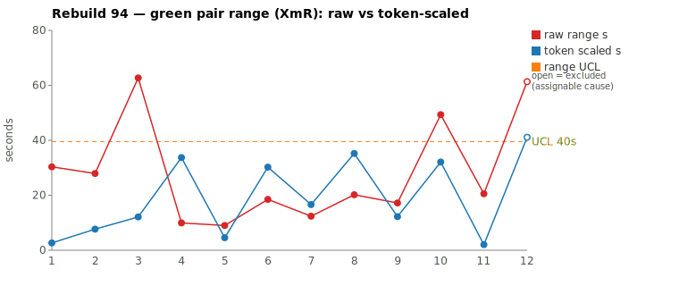
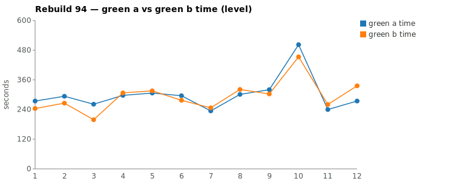

* TOC
{:toc}

---

# Context

This is a batch-level companion to [pbc-83][5], [pbc-84][4], [pbc-85][13], [pbc-86][15], [pbc-87][18], [pbc-88][19], [pbc-90][22], [pbc-92][26], and [pbc-93][27], using the same in-run pair methodology: since [issue #434][7] every Darmok scenario runs its green phase **twice** — worktree `_a` and `_b`, both branched from the *same red commit*, minutes apart — so the pair-range `|green_a − green_b|` from one metrics row nets out model-of-the-day, red commit, and server window, leaving **work** versus **per-token generation rate**.

**The biggest measurement change since [#434][7] lands this run: a new operational definition for the charted range.** Following Deming/Wheeler's rule that *how you measure decides what you interpret*, the pair-range is now the **Selected range**:

- `raw` = `|a − b|`, the wall-clock gap.
- `net_x` = `raw_tokens_x − edit_x − todo_x`, stripping the two token classes that are *bookkeeping, not reasoning*: verbose TodoWrite re-emissions and whole-method Edit payloads.
- `token-scaled` = `|net_a − net_b| × fast_time / fast_raw`, the gap implied by **work** tokens, converted to time at the faster half's rate — which strips generation-rate jitter (infrastructure, not the test case).
- **`Selected = min(raw, token-scaled)`.** Scaling can only *remove* variation (rate, bookkeeping); it can never manufacture it. So a token-scaled value larger than the clock gap is a phantom — the clocks barely moved but the tokens did — and we keep the clock. No mean, no threshold, no iteration: `min` is not self-referential, which retires [pbc-93][27]'s iterated-mean gate and its degenerate cases entirely.

The two corrections this encodes — **deduct todo+edit** (bookkeeping the test case didn't cause) and **scale to a common rate** (infrastructure jitter) — are the levers we tuned, and we validated them against *known process behavior*: `Test Step Name - Missing Object` is a scenario we know from experience is consistently the hard one, and the definition is correct when it isolates that scenario at the top while rate/bookkeeping false positives collapse inside the limits. They do: `Body row` runs the run's widest **raw** range (63 s) but its gap is almost all rate/bookkeeping, so it collapses to **12 s** selected and drops out of contention — exactly the false positive the old raw-range ranking would have chased.

**The charts also split into two, by who is in the loop** (the tester-vs-developer decomposition):

- **Moving Range** (the pair range, raw + token-scaled + UCL) — an excursion means two runs of the *identical* test case diverged, so the case is too big / ambiguous → **tester-in-the-loop**.
- **Green** (green `_a` vs `_b` absolute level) — an excursion means the whole task got harder (code/harness) → **developer-in-the-loop**.

Rebuild94 ran the "Validation for Only Issues" family. Ranked by **Selected** range, the top-2 give a **split verdict**:

| Scenario | Commit | Green `_a` | Green `_b` | Raw range | Token-scaled | **Selected** | Verdict |
|---|---|---|---|---|---|---|---|
| Test Step Name - Missing Object | `a9eaf83` | **4:34** | 5:35 | 61,338 ms | 41,120 ms | **41 s** (scaled) | **assignable — exploration-breadth over an unpinned container level** (`exclude_from_limits=TRUE`) |
| 1 - Validation for Only Issues - 1 | `45c07da` | 8:22 | **7:32** | 49,319 ms | 32,106 ms | **32 s** (scaled) | **common cause — reasoning-composition variance on the subtree opener** |

(Bold = the winning half, brought back and refactored.) With the known assignable point excluded, the XmR limits over the eleven common-cause rows are `range_mean` **12.2 s**, `range_MR_bar` 10.3 s, `range_UCL` **39.5 s**. Missing Object's 41 s selected sits **just above** that UCL — the known cause breaches once removed, the Wheeler treatment working as designed — while the widest common-cause point, Validation-1 at 32 s, sits under it. (All-in, without excluding: mean 14.6 s, UCL 48.9 s.)

---

# Charts

Scenarios are numbered in run order; the tables below say which index each is. The Moving-Range chart plots **raw** (red) and **token-scaled** (blue) together so `Selected` — their lower envelope — is visible, with the UCL (off Selected, Missing Object excluded) as the dashed orange line. The Green chart is the absolute level.





---

# The Selected-Range definition (recap)

Wall-clock fuses **real work** (≈ green output tokens) with the **per-token generation rate** (server load, queue, context-prefill jitter — uncontrollable). The full token-scaled derivation is in [pbc-83][5], with [pbc-90][22]'s NET refinement (deduct Edit/Write/TodoWrite). What is new this run is the *selection*: `min(raw, token-scaled)`.

Two properties make the `min` the honest ruler:

1. **It cannot manufacture range.** The clock is the measurement of record; a token difference on a pair whose wall-clocks nearly agree is discarded, because scaling removes noise — it never adds signal. This is [pbc-92][26]'s phantom-range failure closed by construction, with no threshold to tune: `min` keeps raw exactly when the time-gap fraction `raw/fast` is below the token-gap fraction `|scale−1|`.
2. **We cannot measure how much time todo/edit actually consumed** — there are no per-token timestamps — so converting deducted tokens to deducted time assumes those tokens were generated at the reasoning rate. That assumption is declared, not measured; the `min` bounds its damage (it can only ever pull a value *down* toward the clock).

One standing override still outranks the whole token argument: the mojo's **functional-diff check**. Neither pair carried a `Functional diff between pair` warn this run — both logged `No functional diff` — so the divergence walk decides each.

A **methodology note worth recording**: the per-commit review script's older decision matrix keys on *raw* tokens, and on Validation-1 it read the pair as "raw tokens ~equal (0.6 %) → rate jitter → 3 s". The Selected definition keys on **NET** and reads 32 s, because the halves emitted near-equal *raw* tokens but composed them differently (`_a` more reasoning, `_b` more bookkeeping). Both keep the pair in-limits and common-cause, so the verdict is unaffected — but the new ruler is more sensitive to reasoning-composition differences than the raw-token matrix was (see Open Questions).

---

# Why we changed the measurement (design rationale)

*This is the first run on the new data source — the per-half `edit`/`todo` token columns added to `metrics.csv` under [#566][28] — and the first to chart `Selected = min(raw, token-scaled)`. Because the definition is what every future report in this series will build on, the reasoning that produced it is recorded here in full, the way [pbc-83][5] recorded the original token-scaled derivation.*

**The starting problem: two confounds sit between the pair-range and the thing we want to see.** We want the pair-range to answer one question — *did two runs of the identical test case diverge because the test case admits variable solutions?* (the tester-in-the-loop signal). But `|green_a − green_b|` in raw wall-clock fuses that signal with two things that have nothing to do with the test case:

1. **Token-generation rate.** The same tokens can take different wall-clock time because of server load, queue depth, and context-prefill jitter. That is *infrastructure*, not the model's reasoning and not the test case. Two halves that did identical work can finish a minute apart purely on rate.
2. **Non-reasoning tokens.** Not every output token is deliberation. `TodoWrite` re-emits the *entire* checklist on every checkpoint, and `Edit`/`Write` carry the changed-code payload as bytes. A half that checkpoints more often, or writes one verbose whole-method edit instead of a surgical one, generates more tokens without doing more *thinking about the test case*.

**Operational definitions (Deming/Wheeler): how you measure decides what you interpret.** If the ruler leaves those two confounds in, the chart flags rate jitter and bookkeeping verbosity as if they were test-case ambiguity — false positives. So the definition removes each with a named correction:

- **Correction 1 — rate → scale to a common rate.** Measure the work in *tokens*, not seconds, and express both halves at the faster half's per-token rate. Rate drops out; what remains is the token-difference converted to time.
- **Correction 2 — bookkeeping → deduct `todo` + `edit`.** Define work tokens as `net = raw − edit − todo` and compare the halves on NET. `TodoWrite` re-emission and `Edit` payload are removed because they are mechanical, not reasoning about the test case. (`TodoWrite` is the clean case — 100 % bookkeeping; `Edit` is muddier since the change *is* the deliverable, but only its *verbosity* is noise, and the pairwise form below removes only the asymmetry, never the edit-as-work.)

Combined: `token-scaled = |net_a − net_b| × fast_time / fast_raw`.

**Why `min(raw, token-scaled)`, and not a threshold.** The hard constraint is that **we cannot measure how much wall-clock the `todo`/`edit` tokens actually consumed** — the JSONL has each half's total time and total tokens, but no per-token or per-segment timestamps. So converting deducted tokens back to deducted time *must* assume those tokens were generated at the reasoning rate. That assumption is declared, not measured. The `min` is what bounds its consequences: scaling is a *noise-removal* (it strips rate and bookkeeping), and a noise-removal can only shrink apparent variation or leave it unchanged — it can never manufacture variation the clock didn't show. So if `token-scaled` comes out *larger* than the raw clock gap, that larger value is a phantom (the clocks barely moved but the token counts differ), and we keep the clock. `Selected = min(raw, token-scaled)`. The implicit gate is exactly the phantom boundary — `min` keeps raw whenever the time-gap fraction `raw/fast` is below the token-gap fraction `|scale−1|` — so no threshold has to be chosen, and the definition is not self-referential (no iterated mean, unlike [pbc-93][27]'s gate).

**Alternatives we rejected, and why:**

- **Each half at its own rate** (deflate each half's time by its own `net/raw` fraction). Rejected: it uses `rate_a` for `_a` and `rate_b` for `_b`, so it *keeps* the cross-half rate difference — the very infrastructure confound Correction 1 exists to remove. On this run it inflated `Validation-1` to 56 s and buried the known-assignable `Missing Object` at 4th; against the known-behavior anchor, it fails.
- **Exclude *all* `todo`/`edit` from both halves** (full deduction, not the pairwise difference). Rejected: that is the correct definition for an *absolute* per-half work-time, but the pair-range is a *difference anchored on one half's observed wall-clock*. The faster half's own bookkeeping time is already inside the baseline we scale against, so only the slower half's bookkeeping *in excess of* the faster half should be removed — the difference, not the whole. Full deduction over-corrects bookkeeping-heavy halves and mis-ranks them.
- **A control-limit gate** (`raw > mean`, or `raw > mean + MR̄`, approaching the UCL). Rejected: it is circular — the gate feeds off the limits, the limits feed off the selected values the gate produced — with *positive* feedback, so the fixed point is seed-sensitive and can run away. The `min` needs no such gate.

**How we knew the definition was done: validate against known process behavior.** An operational definition is not "right" because it is elegant; it is right when the chart agrees with what we already know about the process. We hold one fixed anchor — `Test Step Name - Missing Object` is, from experience across runs, the family's consistently hard scenario, an assignable cause. The definition is complete when it isolates that scenario at the top of the range chart *and* collapses the rate/bookkeeping false positives inside the limits. Under `min`, it does: Missing Object is the sole breach of the excluded-limits UCL, while `Body row` — the widest *raw* pair at 63 s — collapses to 12 s because its gap was rate and bookkeeping, not divergent work. Removing sources of variation we can *name* (rate, bookkeeping) and stopping when only the unexplained variation remains is establishing an operational definition; it is the opposite of fitting to noise.

**Why two charts.** The same data feeds two control charts because two different people are in the loop. The **pair range** (this Selected value) isolates *test-case*-driven variation — two runs of the identical case, same red commit, can only diverge on the case's ambiguity or noise — so its excursions are **tester-in-the-loop**. The **absolute green level** captures everything, including code and harness difficulty, so its excursions are **developer-in-the-loop**. Charting them separately routes a signal to the right owner instead of fusing the two into one number.

**The data-source dependency.** All of the above needs the per-half `edit`/`todo` token counts, which is why this is gated on the [#566][28] columns in `metrics.csv`; the older TSV upload carries raw tokens only, so on that fallback `token-scaled` degrades to `raw` and Correction 2 silently does nothing. Future runs must read `metrics.csv`, not the TSV, for the deduction to apply.

---

# Pair 1 — `a9eaf83` (Test Step Name - Missing Object): breadth over an unpinned container level (assignable)

The run's widest Selected range (41 s), and the scenario we independently know is the family's hard case. The mojo logged **`Green: No functional diff between pair`**, winner `_a`.

| | `_a` 88e9806f | `_b` 3bbedda1 |
|---|---|---|
| Green wall-clock | **4:34** | 5:35 |
| Green output tokens | 6,802 | 8,940 |
| **NET tokens** | 3,113 | 4,132 |
| Assistant turns | ~65 | ~59 |
| Read / Grep / Glob | 13 / 6 / 2 | 17 / 6 / 2 |
| Writes / Edits | 2 / 2 | 2 / 2 |
| `mvn verify` cycles | 2 | 2 |

Time differs (22.3 % of the faster half), raw tokens differ 23.9 %, and NET *holds* at **24.7 %** — a real exploration-volume difference, not a payload or bookkeeping artifact (`_b` read four more files than `_a`). No stall in either half: every per-minute token bucket is non-zero, and the soft minutes align with the shortlist/`--resume` boundary and the two `mvn` calls.

The divergence is **breadth**, not a different design:

```
identical through ~call 11 (TodoWrite seed, 4 site/uml reads,
      grep "COMPILATION ERROR" / "Guice configuration errors")
_a 88e9806f: Glob **/*IssueDetector.java + **/*IssueTypes.java
             → Read TestStepIssueDetector/Types + TestSuiteIssueDetector/Types
             → 2 Writes + 2 Edits (validation folded onto the existing
               TestStep/TestSuite detector layer)
_b 3bbedda1: same start, then ALSO reads src-gen ITestStep.java and
             TestStepContainerIssueDetector.java + TestStepContainerIssueTypes.java
             — the container level _a never opened —
             → same committed impl, reached after the wider survey
```

Both halves committed the same behavior; `_b` spent its extra ~1,000 NET tokens surveying whether the missing-object check belonged at the **TestStepContainer** level before landing where `_a` went directly. **UML consultation was symmetric** — both read the same four family-level files (`uml-overview`, `uml-package`, `uml-interaction-main`, `uml-interaction-test`) and there was nothing class-level *to* read: `site/uml/` has no `uml-class-*.md` for `TestStepIssueDetector` or the container detectors. This is [pbc-92][26]/[pbc-93][27]'s discovery gap once more — with no contract pinning *which container level* owns the check, one half explored the space and the other guessed right.

**Verdict: assignable — excluded from the limits.** The pair combines a real 24.7 % NET-exploration asymmetry with our standing process knowledge that this scenario is reliably the family's widest, and the excess work traces to a specific under-specification (the container level the check attaches to). That is a test-case/spec cause, not a bad draw. The fix is below.

---

# Pair 2 — `45c07da` (1 - Validation for Only Issues - 1): the subtree opener's reasoning-composition variance (common cause)

The second-widest Selected range (32 s) is the run's **opening scenario** — the same subtree-opener [pbc-92][26]/[pbc-93][27] reviewed, whose absolute green is again the run's highest (8:22 / 7:32). The mojo logged **`No functional diff`**, winner `_b`.

| | `_a` 96d77348 | `_b` bfd2ef70 |
|---|---|---|
| Green wall-clock | 8:22 | **7:32** |
| Green output tokens | 13,753 | 13,669 |
| **NET tokens** | 7,137 | 6,168 |
| Assistant turns | ~101 | ~100 |
| Read / Grep / Glob | 17 / 16 / 5 | 18 / 14 / 2 |
| Writes / Edits | 5 / 6 | 5 / 6 |
| `mvn` cycles | 3 | 3 |

Raw output tokens are all but identical (0.6 %); NET diverges to 13.6 % because `_a` put more of an equal token budget into reasoning and `_b` into bookkeeping. No stall in either half: the 01:52-region dip in both buckets is the green-compile `mvn`, symmetric.

The walk shows near-identical work:

```
both: same 4 site/uml files, same src-gen interfaces (ITestSuite),
      same ValidateAction/ValidateAnnotation objects + stepdefs,
      same TestSuiteIssueDetector/Types, same ValidateActionImpl edits,
      3 mvn cycles each
_a 96d77348: additionally reads AddDocumentActionImpl.java
_b bfd2ef70: additionally reads TestObject.java + EditDocumentActionImpl.java
```

The file sets differ by one or two *reference* reads — equally valid, and again driven by the absent per-class UML contract for the `TestSuiteIssueDetector` family. **UML consultation was symmetric.** Both committed the identical detector layer.

**Verdict: common cause — no fix.** Symmetric UML, near-identical file sets, no stall, and a NET gap that is reasoning-composition variance on the run's heaviest scenario, not a test-case defect. Splitting or rewording it would be tampering. The 32 s selected sits under the 39.5 s UCL as the widest in-limits point.

---

# Batch synthesis — the new ruler passes its acceptance test

Rebuild94's value is as much about the *ruler* as the two pairs:

1. **The Selected definition isolates the known cause.** With `min(raw, token-scaled)`, the scenario we knew to be assignable (Missing Object) is the run's top point and the only one to breach the excluded-limits UCL, while the widest **raw** pair (Body row, 63 s) — a rate/bookkeeping inflation — collapses to 12 s and never reaches the chart. That is the false-positive reduction the operational-definition work was for, validated against process knowledge rather than fit to noise.
2. **The verdicts split cleanly by mechanism.** Pair 1 is a *breadth* asymmetry over an unpinned container level (assignable, spec-discovery); pair 2 is *composition* variance on identical committed work (common cause). Same missing-contract root, two severities — the recurring [pbc-92][26]/[pbc-93][27] finding.
3. **The two charts separate the two loops.** The Moving-Range (tester) chart carries the range signal; the Green (developer) chart carries the level. Validation-1 is again the level leader — warm-up/subtree-opening cost — without being a range problem.

---

# The Fix, or Why No Fix

**Pair 1 — assignable: pin the container level (spec-discovery, not scenario split). Done this session.** The two halves committed the same behavior, so the scenario is not *ambiguous* in the functional-diff sense and not *too big* (2 writes + 2 edits either way). What cost `_b` its extra exploration was the absence of a contract saying **which container level** (`TestStep` vs `TestStepContainer` vs `TestSuite`) owns the missing-object check. Investigating revealed the family already has a `{Type}`-pattern contract (`uml-class-TypeIssueDetector.md`) covering all of Cell/Row/TestStep/TestStepContainer/TestSuite via the `{Type}` variable — so the gap was never a *missing file*; it was that nothing pinned *which* `{Type}` owns *which* check. Per-class files would have fragmented the `{Type}` pattern (and broken the site validator, which expects the pattern file). The fix instead adds a **validation-ownership table** to `uml-class-TypeIssueDetector.md`: it states the containment order (`Cell ⊂ Row ⊂ Table ⊂ TestStep ⊂ TestStepContainer ⊂ TestSuite`), the rule that a check is owned by the *innermost* element it constrains, and a per-check owner map that pins the missing-object rule to `TestStepIssueDetector.validateStepObjectNameWorkspace(ITestStep)` — `TestStep × Workspace`, explicitly *not* a container or suite concern. Both halves are now routed to one owner instead of surveying the hierarchy. Site validation still passes (the two pre-existing `{Language}IssueProposal` failures are unrelated). No GitHub issue filed — flagged for the user to create if wanted.

**Pair 2 — common cause: no fix.** Identical behavior, near-identical exploration, same scenario in the common-cause body. Touching it would be tampering. The only lever is the same per-class contract above, which would also damp the reasoning-composition spread.

No prompt, harness, or model change is proposed; those are held in statistical control. The chart generator (`rgr-review-charts.py`) now computes `Selected = min(raw, token-scaled)`, charts raw + token-scaled + UCL, emits the two tester/developer SVGs, and takes assignable-row exclusions as an explicit `--exclude` argument (nothing auto-excluded), reproducing the sheet's limits.

---

# Mapping to the Research

| Predicted ([pbc-research][2]) | Observed across Rebuild94 |
|---|---|
| Wide pair-range fires the signal | yes — the top-2 **Selected** ranges (41 s, 32 s) selected both reviewed pairs; ranking on raw would have mis-fired on Body row (63 s → 12 s selected) |
| A breach of the limit marks a special cause | **yes, once the known cause is excluded** — Missing Object's 41 s breaches the 39.5 s UCL; no common-cause row does |
| The special cause is in the input, not the system | **yes** — pair 1 traces to the spec not pinning the container level for the missing-object check; the fix is a per-class contract, not a harness change |
| Both halves pass the same test | yes — every half passed verify; both pairs logged `No functional diff` |
| Two work-trees differ | pair 1 differed in exploration *breadth* (container level surveyed or not); pair 2 differed only in reasoning *composition* and converged on identical behavior |

---

# Findings by Variable

*Each subsection records this run's findings about one [Wheeler variable][3].*

## green time pair range

**Charting basis changed to `Selected = min(raw, token-scaled)`** with a todo+edit NET deduction — the operational definition this run introduces. Limits with the known assignable row excluded: mean 12.2 s, UCL 39.5 s. Missing Object (41 s) is the sole breach; the widest common-cause point (Validation-1, 32 s) sits under. The definition's acceptance test — isolate the known-hard scenario, collapse rate/bookkeeping false positives (Body row 63 s → 12 s) — passed.

## green time pair range moving range

MRbar 10.3 s with the MR chain bridging across the excluded assignable row. No out-of-control moving range.

## green time

Claude-only per [#568][23]; Validation-1 is again the level leader (8:22 / 7:32) as the subtree opener. The "Green" chart is now a first-class deliverable (developer-in-the-loop signal), not a diagnostic.

## scale & green tokens

The NET-based Selected value diverged from the per-commit review script's raw-token decision matrix on Validation-1 (32 s vs a raw-token reading of ~3 s), because raw tokens were equal but composition differed. New sensitivity of the ruler, recorded for watching; it did not change the verdict.

## functional diff between pair

No warn this run — both pairs `No functional diff`. The divergence walk carried both verdicts.

## silent stall / timeout (recurring)

No stall. Every near-zero per-minute bucket in all four halves aligns with the shortlist/`--resume` boundary or an `mvn` Bash call. ([#569][24] remains open, no new data.)

## spec-discovery gap (recurring)

Third consecutive run pointing at the issue-detector family — but this run refined the diagnosis. The family *does* have a contract (`uml-class-TypeIssueDetector.md`, a `{Type}`-pattern file); what was missing was an **ownership map** pinning which `{Type}` owns which check. Pair 1's cost was `_b` surveying the container level to find that out. Fixed this session by adding a validation-ownership table to the pattern file (missing-object → `TestStep × Workspace`). This reframes [pbc-92][26]/[pbc-93][27]'s "missing per-class contract" as "unpinned check ownership" — the lever is a table, not new files.

## green-window attribution

All four halves' path diffs were clipped to each half's last green `end_turn` per the [#570][25] rule; no phantom worktree escapes or refactor-read contamination appeared.

---

# Open Questions From This Case

- **Does the NET-min ruler over-rate rate-dominated pairs?** Validation-1 read 32 s under Selected but ~3 s under a total-token view, the gap being reasoning-composition (equal raw tokens, different net). It stayed in-limits and common-cause here, but a rate-dominated pair with a large composition split could approach the UCL. Watch whether any future common-cause pair breaches on composition alone.
- **Does pinning the container level collapse Missing Object's width?** Prediction: with a per-class contract routing both halves to one container level, Missing Object's pair-range drops into the common-cause body next rebuild — the same before/after test [pbc-93][27] set for its ambiguity fix.
- **Is Missing Object's width cross-run stable?** [pbc-93][27] used cross-run width stability as assignable-cause evidence. A retro of Missing Object across earlier rebuilds would confirm whether its ~40-60 s width repeats (standing cause) or varies (draw).
- **Two-chart monitoring across functions.** The tester/developer split is now generated per run; the next step is per-function control charts (the "DB insert floor/ceiling" monitor) so a range excursion routes to the tester and a level excursion to the developer automatically.

---

[2]: wheeler-understanding-variation
[3]: wheeler-understanding-variation
[4]: 84
[5]: 83
[7]: https://github.com/farhan5248/sheep-dog-main/issues/434
[13]: 85
[15]: 86
[18]: 87
[19]: 88
[22]: 90
[23]: https://github.com/farhan5248/sheep-dog-main/issues/568
[24]: https://github.com/farhan5248/sheep-dog-main/issues/569
[25]: https://github.com/farhan5248/sheep-dog-main/issues/570
[26]: 92
[27]: 93
[28]: https://github.com/farhan5248/sheep-dog-main/issues/566
