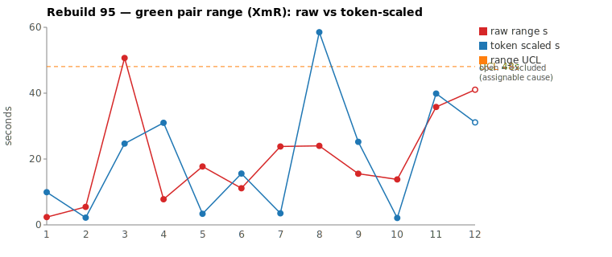
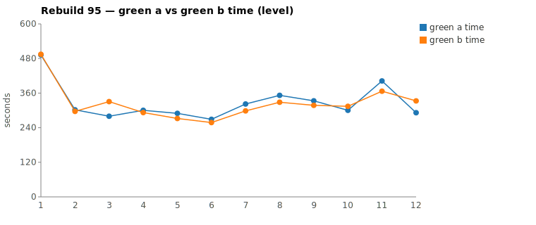

* TOC
{:toc}

---

# Context

This is a batch-level companion to [pbc-83][5], [pbc-84][4], [pbc-85][13], [pbc-86][15], [pbc-87][18], [pbc-88][19], [pbc-90][22], [pbc-92][26], [pbc-93][27], and [pbc-94][29], using the same in-run pair methodology: since [issue #434][7] every Darmok scenario runs its green phase **twice** — worktree `_a` and `_b`, both branched from the *same red commit*, minutes apart — so the pair-range `|green_a − green_b|` from one metrics row nets out model-of-the-day, red commit, and server window, leaving **work** versus **per-token generation rate**. [pbc-94][29] fixed the charted quantity as the **Selected range** `min(raw, token-scaled)`; this run uses that definition unchanged and puts it to a new test.

**Rebuild95's contribution is that the run's two assignable-cause detectors dissociate.** There are two independent ways a pair can be flagged as a special cause:

1. A **range excursion** — the Selected pair-range breaching the XmR `UCL` (the tester-in-the-loop signal the chart carries).
2. The mojo's **`Functional diff between pair` warn** — a deterministic proof that `_a` and `_b` committed *behaviorally different* implementations that both passed the same assertions, so the test case is ambiguous. This overrides the whole token/range argument.

In [pbc-94][29] these coincided — the assignable scenario (`Test Step Name - Missing Object`) was also the widest range point. **This run they come apart:** the widest Selected range is a *common-cause* pair, and the only *assignable* pair carries a functional-diff warn while sitting **below** the range UCL. The range chart alone would not have flagged it. That is the run's lesson — the two detectors are complementary, not redundant.

Rebuild95 ran the Issues family across the workspace-validation subtrees. Ranked by **Selected** range, the top-2 give a **split verdict**:

| Scenario | Commit | Green `_a` | Green `_b` | Raw range | Token-scaled | **Selected** | Verdict |
|---|---|---|---|---|---|---|---|
| Step Parameters - 2 - Parameter doesn't exist | `2d96208f` | 6:42 | **6:06** | 35,795 ms | 40 s | **36 s** (raw) | **common cause — detector-ownership exploration breadth, identical committed impl** |
| Step object step definition parameter set for text doesn't exist | `7529af6c` | **4:51** | 5:33 | 41,049 ms | 31 s | **31 s** (scaled) | **assignable — `Functional diff between pair` warn; the matchedDef-null branch is unpinned** (`exclude_from_limits=TRUE`) |

(Bold = the winning half, brought back and refactored.) With the functional-diff row excluded, the XmR limits over the eleven common-cause rows are `range_mean` **12.1 s**, `range_MR_bar` **13.6 s**, `range_UCL` **48 s**. **No common-cause row breaches** — the widest, Step Parameters-2 at 36 s, sits well under the 48 s UCL. And the assignable row's Selected is **31 s, also under the UCL**: had we relied on the range chart alone, this special cause would have been invisible. It was caught by the functional-diff warn instead.

The [pbc-94][29] calibration anchor validates the ruler once more: `Test Step Name - Missing Object` ran the run's **widest raw** pair (51 s) but its gap is mostly rate/bookkeeping, so it collapses to **25 s** Selected, drops to third, and lands mid-pack in the common-cause body — no functional diff, an equally-valid Grep-vs-Glob exploration split. The raw-range ranking would have chased it into the top-2; Selected correctly demotes it.

*(Data note: the pair-range Google Sheet tab was not machine-readable this session — its export redirects through an auth-gated host — so all ranges and commits were taken from the local `metrics.csv` (the skill's preferred source), which carries the per-half `edit`/`todo` columns the deduction needs.)*

---

# Charts

Scenarios are numbered in run order; the tables below say which index each is. The Moving-Range chart plots **raw** (red) and **token-scaled** (blue) together so `Selected` — their lower envelope — is visible, with the UCL (off Selected, the functional-diff row excluded) as the dashed orange line. The Green chart is the absolute level.





---

# The token-scaled pair-range (recap)

Wall-clock fuses **real work** (≈ green output tokens) with the **per-token generation rate** (server load, queue, context-prefill jitter — uncontrollable). The full token-scaled derivation is in [pbc-83][5]; [pbc-90][22] added the NET refinement (deduct Edit/Write/TodoWrite bookkeeping) and [pbc-94][29] fixed the selection rule:

- `raw` = `|a − b|`, the wall-clock gap.
- `net_x` = `raw_tokens_x − edit_x − todo_x`, stripping verbose TodoWrite re-emissions and whole-method Edit payloads.
- `token-scaled` = `|net_a − net_b| × fast_time / fast_raw`, the gap implied by **work** tokens at the faster half's rate.
- **`Selected = min(raw, token-scaled)`.** Scaling only removes variation (rate, bookkeeping); a token-scaled value larger than the clock gap is a phantom, so we keep the clock. No mean, no threshold, no iteration.

One standing override outranks the whole token argument: the mojo's **functional-diff check**. Pair 2 carries a `Functional diff between pair (warn)` this run, so its verdict is assignable **regardless** of its 31 s Selected sitting under the UCL. Pair 1 logged `No functional diff`, so its divergence walk decides.

---

# Pair 1 — `2d96208f` (Step Parameters - 2 - Parameter doesn't exist): detector-ownership breadth, identical impl (common cause)

The run's widest Selected range (36 s, run index 11). The mojo logged **`Green: No functional diff between pair`**, winner `_b`.

| | `_a` b889908d | `_b` 64e05d28 |
|---|---|---|
| Green wall-clock | 6:42 | **6:06** |
| Green output tokens | 12,423 | 10,991 |
| **NET tokens** | 7,112 | 5,916 |
| Assistant turns | ~41 | ~39 |
| Read / Grep / Glob | 10 / 14 / 2 | 11 / 8 / 2 |
| Writes / Edits | 2 / 2 | 2 / 2 |
| `mvn verify` cycles | 3 | 3 |

Raw tokens differ 11.5 %, NET **16.8 %** (marginally over the 15 % threshold); the raw time-range is only 9.8 % of the faster half, and the rate overhead is **negative** (−12 s) — the slower-by-clock half (`_a`) also generated *more* tokens, so this is a small work-volume difference, not rate jitter. No stall in either half: every per-minute bucket is non-zero, and the soft minute is the green-compile→green-verify `--resume` boundary, symmetric.

The divergence is **breadth over which detector owns the check**, plus a pure tool-*style* split — not a different design:

```
identical through ~call 11 (TodoWrite seed, 4 site/uml reads,
      grep "COMPILATION ERROR" / "Guice configuration errors")
_a b889908d: Grep-tool heavy (14 greps) — greps "step parameters don't exist",
             Glob **/RowIssue*.java + **/StepParametersIssue*.java,
             greps "Step Parameters - 1", getStepParametersList
             — surveys BOTH the Row and StepParameters detector levels
_b 64e05d28: Bash-grep heavy (10 Bash `grep`) for the same log/source scan,
             Glob **/RowIssueDetector.java + **/*IssueTypes.java,
             greps interface IStepParameters / IStepDefinition
             → same committed impl, reached via shell greps instead of the Grep tool
```

Both halves committed the same behavior. `_a`'s extra ~1,200 NET tokens went to surveying whether the "parameter doesn't exist" check belonged at the **Row** level or the **StepParameters** level before landing where `_b` went; `_b` did the equivalent log-inspection work through Bash `grep` rather than the Grep tool (which is why its Bash bucket is 10 and its Grep bucket only 8). **UML consultation was symmetric** — both read the same four family-level files (`uml-overview`, `uml-package`, `uml-interaction-main`, `uml-interaction-test`); `site/uml/` has no per-class contract pinning which detector owns the step-parameters rule.

**Verdict: common cause — no fix.** No functional diff, identical 2-write/2-edit impl, symmetric UML, no stall. The NET gap is exploration breadth (which detector level) plus a Grep-tool-vs-Bash-grep style difference — an equally-valid draw, not a test-case defect. Its 36 s Selected is the widest in-limits point, under the 48 s UCL. The only lever is the recurring detector-ownership contract (see below), which would damp the breadth.

---

# Pair 2 — `7529af6c` (Step object step definition parameter set for text doesn't exist): the unpinned matchedDef-null branch (assignable)

The second-widest Selected range (31 s, run index 12) and the run's only special cause. The mojo logged a **`Green: Functional diff between pair (warn)`**, winner `_a`:

```
Green: Functional diff between pair (warn): When matchedDef is null (step
definition not found in step object), Candidate A returns the issue
description while Candidate B returns empty string; differentiating input is
a text test step referencing a non-existent step definition in an existing
step object.
```

| | `_a` 44944a3c | `_b` 162cd0ce |
|---|---|---|
| Green wall-clock | **4:51** | 5:33 |
| Green output tokens | 9,495 | 9,265 |
| **NET tokens** | 3,881 | 4,893 |
| Assistant turns | ~33 | ~40 |
| Read / Grep / Glob | 10 / 8 / 2 | 13 / 11 / 1 |
| Writes / Edits | 2 / 2 | 2 / 2 |
| `mvn verify` cycles | 3 | 3 |

Raw tokens are within threshold (2.4 %); NET diverges to 20.7 %, with `_b` doing *more* net exploration despite finishing slower. But **the token numbers are not the signal here** — the functional-diff warn is. Both halves passed the identical Then-assertions, yet `_a` implemented "missing step definition ⇒ raise the issue" and `_b` implemented "missing step definition ⇒ return empty (no issue)." Two behaviorally different rules survived the same test, which is only possible because **the test case admits both** — it is ambiguous on the matchedDef-null sub-path.

The divergence walk locates the split at the detector-shape reads:

```
identical through ~call 11 (TodoWrite seed, 4 site/uml reads,
      grep "COMPILATION ERROR" / "Guice configuration errors")
both: Glob **/TextIssue*.java, read the TextIssue detector + jacoco-shortlist
_a 44944a3c: reads the detector, writes the matchedDef-null branch to RETURN
             the issue description (raise) → verify green
_b 162cd0ce: greps "class TextIssue" + "interface IText", reads more of the
             text interaction, writes the matchedDef-null branch to RETURN
             EMPTY (no issue) → verify green
```

No stall in either half; UML consultation was symmetric (same family-level files, no per-class contract for the text detector). The wall-clock gap is ordinary, but the *behavioral* split is decisive.

**Verdict: assignable — excluded from the limits.** The scenario's name is about the **parameter set** not existing, which presupposes the step definition *is* found; it never pins what happens when the step definition itself is missing (matchedDef null). That gap let two valid rules through. This is a test-case/spec cause, and — unlike [pbc-94][29] — it is **not** a range excursion (31 s < 48 s UCL); only the functional-diff detector caught it. The fix is below.

---

# Batch synthesis — two detectors, one catch each

Rebuild95's two worst pairs, read together, say the batch is in control on *range* and the assignable cause came from elsewhere:

1. **The widest range is common cause.** Step Parameters-2 (36 s Selected) is a detector-ownership breadth split plus a Grep-tool-vs-Bash-grep style difference, with identical committed behavior — the recurring [pbc-92][26]/[pbc-93][27]/[pbc-94][29] "unpinned ownership" pattern in its benign form. It stays in the limits.
2. **The assignable cause is not a range excursion.** Step object (31 s Selected, under UCL) is assignable purely on the `Functional diff between pair` warn — the deterministic proof of test-case ambiguity. The Moving-Range chart, on its own, shows an in-control process; the functional-diff signal is what flags the special cause.
3. **The calibration anchor collapsed as designed.** Missing Object — [pbc-94][29]'s known-hard scenario — ran the widest **raw** pair (51 s) but no functional diff and a Grep-vs-Glob style split, so Selected demotes it to 25 s and mid-pack. The ruler resisted the raw false positive.

The takeaway is methodological: **range-excursion and functional-diff are complementary special-cause detectors.** A run can be in control on the XmR chart and still contain an ambiguous test case; only the functional-diff warn will find it. Both belong in the monitor.

---

# The Fix, or Why No Fix

**Pair 2 — assignable: disambiguate the matchedDef-null branch with a dedicated text Test-Case.** The two halves committed *different rules* for a text test step that references a **non-existent step definition in an existing step object**, and the current scenario (`Step object step definition parameter set for text doesn't exist`) never asserts that sub-path — it constrains the *parameter set*, assuming the definition is found. The intended behavior is already implied by the non-text sibling `Step Definition - 1 - doesn't exist` (missing step definition ⇒ raise the issue, i.e. Candidate `_a`'s rule), but nothing pins it for the **text** validation path. The fix is a new Test-Case in the text subtree whose input is exactly the differentiating input — a text test step whose step definition does not exist in its (existing) step object — asserting that the issue **is** raised. That closes the ambiguity the pair exposed. This is a spec-authoring change (new scenario + forward-engineer), so it belongs in a dedicated prep cycle rather than this review; **a GitHub issue should be filed** — flagged for the user to create.

**Pair 1 — common cause: no fix.** Identical committed behavior, symmetric UML, no stall. Touching the scenario would be tampering. The only lever is the recurring detector-ownership contract (which `{Type}` detector owns the "parameter/definition doesn't exist" checks); [pbc-94][29] added a validation-ownership table to `uml-class-TypeIssueDetector.md` for the missing-object rule, and extending that same table to the step-parameter and step-definition checks would damp this pair's exploration breadth. That is a discovery-level lever, not a scenario change.

No prompt, harness, or model change is proposed; those are held in statistical control. The chart generator (`rgr-review-charts.py`) computed `Selected = min(raw, token-scaled)`, charted raw + token-scaled + UCL, emitted the two tester/developer SVGs, and took the functional-diff row as an explicit `--exclude` argument (nothing auto-excluded).

---

# Mapping to the Research

| Predicted ([pbc-research][2]) | Observed across Rebuild95 |
|---|---|
| Wide pair-range fires the signal | partly — the top-2 **Selected** ranges (36 s, 31 s) selected both reviewed pairs, but the assignable one was **not** the widest and did not breach the UCL |
| A breach of the limit marks a special cause | **not this run** — no common-cause row breaches the 48 s UCL, and the one special cause (31 s) sits under it; it was caught by the functional-diff warn, not the chart |
| The special cause is in the input, not the system | **yes** — pair 2 traces to the scenario not pinning the matchedDef-null branch; the fix is a disambiguating Test-Case, not a harness change |
| Both halves pass the same test | yes — every half passed verify; pair 2's halves passed the *same* assertions with *different* behavior (the ambiguity proof) |
| Two work-trees differ | pair 1 differed in exploration *breadth* + tool style, converging on identical impl; pair 2 differed in *committed behavior* (functional diff) |

---

# Findings by Variable

*Each subsection records this run's findings about one [Wheeler variable][3].*

## green time pair range

Charted on `Selected = min(raw, token-scaled)` (todo+edit NET deduction) per [pbc-94][29]. Limits with the functional-diff row excluded: mean 12.1 s, MRbar 13.6 s, UCL 48 s. **No common-cause row breaches**, and the widest (Step Parameters-2, 36 s) sits under the UCL — the range chart is in control this run. Missing Object collapsed 51 s raw → 25 s Selected, confirming the ruler demotes rate/bookkeeping false positives.

## green time pair range moving range

MRbar 13.6 s with the MR chain bridging across the excluded (functional-diff) row. No out-of-control moving range.

## green time

Claude-only per [#568][23]. `1 - Validation for Only Issues - 1` is again the absolute-level leader (~8:12 / 8:15 deduped) as the subtree opener — the recurring warm-up/opening cost — with Step Parameters-2 (6:42 / 6:06) second. No developer-chart excursion beyond the expected opener cost.

## scale & green tokens

Pair 1 showed a **negative rate overhead** (−12 s): the slower-by-clock half generated more tokens, so `Selected` kept raw (36 s) and the token-scaled value (40 s) was the discarded phantom. A clean example of `min` doing its job — scaling could only have inflated the range, so the clock won.

## functional diff between pair

**The decisive variable this run.** Pair 2 carried a `Functional diff between pair (warn)` (matchedDef-null ⇒ raise vs empty), making it assignable independent of its sub-UCL range. First run in this series where the functional-diff detector, not a range excursion, is the sole special-cause catch — the two detectors dissociated.

## spec-discovery / detector-ownership gap (recurring)

Fourth consecutive run pointing at the issue-detector family. Pair 1's breadth was `_a` surveying Row-vs-StepParameters ownership; the [pbc-94][29] validation-ownership table (in `uml-class-TypeIssueDetector.md`) covers the missing-object rule but not yet the parameter/definition checks — extending it is the standing lever. Pair 2 is a *different* gap: not which detector owns the check, but which *behavior* an under-specified branch (matchedDef null) should take — an ambiguity, fixed by a Test-Case, not a table.

## silent stall / timeout (recurring)

No stall. Every near-zero per-minute bucket across all four halves aligns with the green-compile→green-verify `--resume` boundary or an `mvn` Bash call. ([#569][24] remains open, no new data.)

## green-window attribution

All four halves' surveys were clipped to each half's last green `end_turn` per the [#570][25] rule; no phantom worktree escapes or refactor-read contamination appeared.

---

# Open Questions From This Case

- **Should the two special-cause detectors be charted together?** This run proved a pair can be in-control on range yet ambiguous by functional diff. A combined monitor — Selected range XmR *plus* a functional-diff flag lane — would route each catch to the tester without relying on the range chart to find ambiguity.
- **Does pinning detector ownership collapse Step Parameters-2's width?** Prediction: extending the [pbc-94][29] validation-ownership table to the parameter/definition checks drops this pair's breadth into the common-cause body next rebuild — the same before/after test [pbc-94][29] set for the missing-object rule.
- **Will the disambiguating text Test-Case remove pair 2's functional diff?** Once the matchedDef-null branch is asserted, both halves should be forced to the same rule; the functional-diff warn should not recur on this scenario. Worth confirming in the next run that touches subtree 4.
- **How often is the assignable cause sub-UCL?** [pbc-94][29]'s assignable was a range breach; this run's was not. Tracking the fraction of functional-diff catches that also breach the range UCL tells us how much the range chart alone would miss.

---

[2]: wheeler-understanding-variation
[3]: wheeler-understanding-variation
[4]: 84
[5]: 83
[7]: https://github.com/farhan5248/sheep-dog-main/issues/434
[13]: 85
[15]: 86
[18]: 87
[19]: 88
[22]: 90
[23]: https://github.com/farhan5248/sheep-dog-main/issues/568
[24]: https://github.com/farhan5248/sheep-dog-main/issues/569
[25]: https://github.com/farhan5248/sheep-dog-main/issues/570
[26]: 92
[27]: 93
[29]: 94
