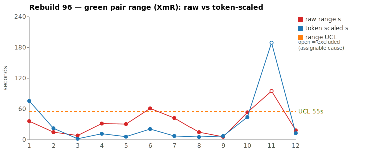
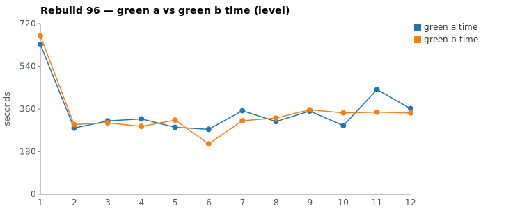

* TOC
{:toc}

---

# Context

This is a batch-level companion to [pbc-83][5], [pbc-84][4], [pbc-85][13], [pbc-86][15], [pbc-87][18], [pbc-88][19], [pbc-90][22], [pbc-92][26], [pbc-93][27], [pbc-94][29], and [pbc-95][30], using the same in-run pair methodology: since [issue #434][7] every Darmok scenario runs its green phase **twice** — worktree `_a` and `_b`, both branched from the *same red commit*, minutes apart — so the pair-range `|green_a − green_b|` from one metrics row nets out model-of-the-day, red commit, and server window, leaving **work** versus **per-token generation rate**. The charted quantity is the **Selected range** `min(raw, token-scaled)` fixed in [pbc-94][29].

**Rebuild96's contribution is a verdict the in-run pair cannot deliver alone.** [pbc-95][30] showed the run's two special-cause detectors (range excursion, functional-diff warn) dissociating within one run. This run goes one step further: the widest pair carries **no functional-diff warn and converges on identical code** — the in-run gate, applied by the book, says common cause — yet the scenario is **assignable anyway**, convicted by its own *history*. The same scenario fired a `Functional diff between pair` warn in [Rebuild93][27] (row-0 vs cursor-row validation rules), and reading all five rebuilds' green transcripts side by side shows every single half fighting the same puzzle the test case never answers. A third detector emerges: **longitudinal reasoning burn** — the same confusion, run after run, on a pair that happens to converge each time the cursor sits where the two rules agree.

Rebuild96 ran the Issues family across the workspace-validation subtrees. Ranked by **Selected** range, the top-2 are the two Step Parameters siblings — a **split verdict**:

| Scenario | Commit | Green `_a` | Green `_b` | Raw range | Token-scaled | **Selected** | Verdict |
|---|---|---|---|---|---|---|---|
| Step Parameters - 2 - Parameter doesn't exist | `555e98fd` | 7:21 | **5:46** | 95,047 ms | 189 s | **95 s** (raw) | **assignable — known-ambiguous scenario ([Rebuild93][27] functional diff, recurring N1 name-vs-header puzzle); fix tracked in [#571][31]** (`exclude_from_limits=TRUE`) |
| Step Parameters - 1 - Definition doesn't exist | `a632a1e1` | **4:49** | 5:43 | 53,505 ms | 44 s | **44 s** (scaled) | **common cause — reasoning-volume jitter on equivalent work, identical committed impl** |

(Bold = the winning half, brought back and refactored.) With the SP-2 row excluded, the XmR limits over the eleven common-cause rows are `range_mean` **15.2 s**, `range_MR_bar` **15.1 s**, `range_UCL` **55.3 s**. **No common-cause row breaches** — the widest in-limits point, Step Parameters-1 at 44 s, sits under the UCL. SP-2's 95 s Selected would breach any reasonable limit; here it is excluded as an *identified* assignable cause rather than left in to inflate the limits.

The calibration anchors both behave: `Body row Cell names can be any case validation` ran a 61 s raw pair that collapses to **21 s** Selected (`edit_b`=1 vs `edit_a`=835 — a pure Edit-payload bookkeeping gap), and `Test Step Name - Missing Object` — [pbc-94][29]'s assignable — ran quiet at 2 s Selected, its ownership-table fix apparently holding.

*(Data note: the pair-range Google Sheet tab (`96ab MR O`) computes Selected in column N and the moving range in column O; its CSV export redirects through an auth-gated host, so values were cross-checked against the local `metrics.csv`. The sheet currently excludes **both** Step Parameters rows; this review's verdict keeps SP-1 **in** the limits — its pair is common cause and its 44 s Selected is sub-UCL — hence the small limit difference (sheet UCL 54.96 s over 10 rows vs 55.3 s over 11 here). The sheet's O-column moving-range formulas must be manually re-chained when a row's exclusion changes.)*

---

# Charts

Scenarios are numbered in run order; the tables below say which index each is. The Moving-Range chart plots **raw** (red) and **token-scaled** (blue) together so `Selected` — their lower envelope — is visible, with the UCL (off Selected, the SP-2 row excluded) as the dashed orange line. The Green chart is the absolute level.





---

# The token-scaled pair-range (recap)

Wall-clock fuses **real work** (≈ green output tokens) with the **per-token generation rate** (server load, queue, context-prefill jitter — uncontrollable). The full token-scaled derivation is in [pbc-83][5]; [pbc-90][22] added the NET refinement (deduct Edit/Write/TodoWrite bookkeeping) and [pbc-94][29] fixed the selection rule:

- `raw` = `|a − b|`, the wall-clock gap.
- `net_x` = `raw_tokens_x − edit_x − todo_x`, stripping verbose TodoWrite re-emissions and whole-method Edit payloads.
- `token-scaled` = `|net_a − net_b| × fast_time / fast_raw`, the gap implied by **work** tokens at the faster half's rate.
- **`Selected = min(raw, token-scaled)`.** Scaling only removes variation (rate, bookkeeping); a token-scaled value larger than the clock gap is a phantom, so we keep the clock.

This run stresses a **blind spot in NET** discovered while walking pair 1: in headless `claude --print` sessions the model's extended-thinking tokens are **billed as `output_tokens` but not persisted to the JSONL** — a turn can carry 2,535 output tokens and store only a 169-character tool call. NET deducts Edit/Write/TodoWrite but **cannot deduct thinking**, so a half that deliberates harder shows an inflated NET gap that *looks like* extra exploration. The tie-breaker is the **input side**: Tool-result bytes (what the half actually read) are immune to reasoning volume. Pair 1's halves read essentially the same bytes — the 53 % NET gap was invisible deliberation, not divergent exploration.

---

# Pair 1 — `555e98fd` (Step Parameters - 2 - Parameter doesn't exist): the pair converged, the history convicts (assignable)

The run's widest Selected range (95 s, run index 11). The mojo logged **`Green: No functional diff between pair`**, winner `_b` — and that is precisely what makes this pair instructive.

| | `_a` 28f542ec | `_b` c6d33392 |
|---|---|---|
| Green wall-clock | 7:21 | **5:46** |
| Green output tokens | 14,223 | 9,483 |
| **NET tokens** | 9,726 | 4,540 |
| Read / Grep / Glob | 15 / 11 / 0 | 13 / 10 / 2 |
| Read tool-result bytes (input) | 121,673 | **149,465** |
| Writes / Edits | 2 / 2 | 2 / 2 |
| `mvn verify` cycles | 3 | 3 |

Raw tokens differ 33.3 %, NET **53.3 %** — far beyond threshold, decision-matrix CELL 3, chart RAW (the 189 s token-scaled value is a phantom the `min` discards). Read by the book, "NET beyond threshold ⇒ materially different exploration ⇒ possibly assignable." But the *input side* contradicts the exploration story: `_b` read **more** bytes than `_a` (149 KB vs 122 KB) while `_a` emitted **4×** the output tokens on its Read turns (6,991 vs 1,653; max single turn **2,535** vs 560). That 2,535-token turn stores nothing but a Read call — it is **un-persisted extended thinking**, billed as output. `_a` didn't explore more; it *deliberated* more.

What was it deliberating? The transcripts across **five rebuilds** (92, 93, 94, 94-rerun, 95, 96 — ten green halves) all narrate the same trap. The scenario creates a step parameters **named "N1"** and a row cell **named "N1"** — they look like a match — yet asserts *"The step parameters don't exist for the step definition."* Every half loops on some form of:

```
"The step parameters name is 'N1' and the cell name is 'N1' — but the
 expected error says they DON'T match. Why would it say don't exist?"
"Wait, let me re-read the scenario..."
"Actually I think I'm overcomplicating this..."
```

before reverse-engineering the intended rule from the UML interaction example: the match is on the step-parameters **table header cells**, not the parameters *name* — and the created "N1" parameters has no table, so no header can match. The test case states the setup and the expected string but never the *semantics* connecting them.

And [Rebuild93][27] proved the second ambiguity axis behaviorally — its SP-2 pair fired the deterministic warn:

```
Green: Functional diff between pair (warn): A validates step-parameters
against hardcoded row 0 of the test step's table, while B validates against
the actual cursor row; they diverge when cursor is on a non-first row whose
cells differ from row 0's cells.
```

The scenario's When names the cursor row (`…/table/rowList/1`) — but choosing the **first** row makes the two candidate rules indistinguishable: row-0-as-header and cursor-row agree exactly there. Line-level specificity is not rule-level specificity. In runs 92, 94, 95, and 96 both halves happened to land the same rule and the warn stayed silent; in 93 they split. A scenario that convicts itself once and burns invisible deliberation every other run is a **stable assignable cause**, not five independent coin flips.

**Verdict: assignable — excluded from the limits.** Not on this pair's own in-run evidence (converged, no warn — the gate alone would say common cause) but on the scenario's longitudinal record: one behavioral split ([Rebuild93][27]) plus the same unanswered question re-derived in all ten halves. UML consultation was symmetric (both halves read the four family-level files; no per-class contract). The fix is below — already filed as [#571][31].

---

# Pair 2 — `a632a1e1` (Step Parameters - 1 - Definition doesn't exist): reasoning jitter on equivalent work (common cause)

The second-widest Selected range (44 s, run index 10). The mojo logged **`Green: No functional diff between pair`**, winner `_a`.

| | `_a` 7d3b05c0 | `_b` 34ca3875 |
|---|---|---|
| Green wall-clock | **4:49** | 5:43 |
| Green output tokens | 7,087 | 8,202 |
| **NET tokens** | 3,530 | 4,611 |
| Read / Grep / Bash | 9 / 4 / 9 | 8 / 10 / 3 |
| Read tool-result bytes (input) | 96,407 | 96,239 |
| Writes / Edits | 0 / 2 | 0 / 2 |
| `mvn verify` cycles | 3 | 3 |

Raw tokens are within threshold (13.6 %); NET diverges to 23.4 %; the raw time-range is 18.5 % of the faster half — CELL 3, so the divergence walk decides. The scaled range is 46 s with only 8 s of rate overhead: a small real work-volume difference, not a stall (every per-minute bucket is non-zero in both halves; the soft minutes align with `mvn` calls).

The walk finds only style, not design:

```
identical through ~call 12 (TodoWrite seed, 4 site/uml reads,
      grep "COMPILATION ERROR" / "Guice configuration errors")
_a 7d3b05c0: Bash-grep heavy (9 Bash) on the log, reads
             TestStepIssueDetector.java + TestStepIssueTypes.java to
             confirm the cascade's method shapes, then 2 edits
_b 34ca3875: Grep-tool heavy (10 Grep) for the same log/interface scan
             (greps "^public interface IRow"), skips the detector read,
             goes straight to the same 2 edits
```

Both halves committed the **identical rule**: extend `ValidateActionImpl`'s `IRow` branch with the full 4-check cascade (`validateStepObjectNameOnly → validateStepDefinitionNameOnly → validateStepObjectNameWorkspace → validateStepDefinitionNameWorkspace`). Input bytes are equal to within 0.2 %. Zero confusion markers in either transcript — across **all twelve** green halves of runs 92–96 this scenario shows almost no re-read/reconsider loops at all (SP-2's halves show 3–15 each). The test case tells the model everything it needs.

**Verdict: common cause — no fix; stays in the limits.** Its 44 s Selected is the widest in-limits point, under the 55.3 s UCL. Excluding it (as the sheet currently does) would be tampering — reacting to noise as if it were signal. One longitudinal observation is worth recording without a verdict change: **the committed rule drifted across runs** — Rebuild92 implemented *only* `validateStepDefinitionNameWorkspace` in the IRow branch, while Rebuilds 93–96 all implemented the full cascade. Both pass, because a row-cursor with a *missing step object* is never exercised, and the in-run functional-diff gate can't see cross-run drift (each run's halves agreed with each other). That is a latent under-specification of the same family as SP-2's, but a dormant one: it costs no reasoning burn and has produced no in-run split. A plain sibling Test-Case (row cursor, step object absent, assert the step-object message) would pin it whenever the subtree is next touched — no docstring params needed.

---

# Batch synthesis — the third detector

Rebuild96's two worst pairs are the two Step Parameters siblings, and together they complete a detector taxonomy:

1. **Range excursion** (tester signal, [pbc-94][29]) — SP-2's 95 s Selected is a genuine breach, but this run shows the excursion alone can't say *why*; its own pair converged.
2. **Functional-diff warn** (deterministic, [pbc-95][30]) — silent on both pairs this run, yet the decisive evidence for SP-2 comes from the warn it fired **three runs ago** in [Rebuild93][27].
3. **Longitudinal reasoning burn** (new) — the same puzzle narrated in every transcript of a scenario across five rebuilds, surfacing this run as a 2,535-token un-persisted thinking burst. A pair-level gate can call each instance common cause; the *scenario-level* series is the signal. SP-1 is the control: same sibling family, same runs, zero burn — and it is common cause.

The methodological consequence: **the in-run pair gate has a scope, and it is the pair.** Assignability is a property of the *scenario*, and a scenario can be ambiguous in a way that only splits behavior on inputs the case never exercises (SP-2's first-row cursor; SP-1's present step object). When a wide pair converges, check the scenario's history — prior warns, prior reviews, recurring narration — before accepting the common-cause verdict the single pair supports.

---

# The Fix, or Why No Fix

**Pair 1 (SP-2) — assignable: disambiguate with a parameterized docstring Test-Case ([#571][31], already filed).** The scenario is ambiguous on two axes: (a) the match semantics — parameters **table header cells**, not the parameters *name*, must match the row (the N1-vs-N1 trap every transcript falls into); and (b) which row the validator reads — row-0-as-header vs cursor-row (the [Rebuild93][27] functional diff). The intended rule, decided in this review: **the header row must match** — cursor on row 1 (the header) with no matching parameters table ⇒ the validation error; cursor on row 2 (a data row) ⇒ no error. Pinning that contrast needs one docstring holding both a valid and an invalid example with the When pointing at a non-first row — which the fixture can't express today. That is exactly [#571][31]'s task list: parameterize docstring rows, then add the disambiguating SP-2 case, then confirm this scenario's pair-range drops into the common-cause body. This is a test-case input change; the harness, prompt, and model are held in control.

**Pair 2 (SP-1) — common cause: no fix.** Identical committed rule, equal input bytes, symmetric UML, no stall, no confusion in any of twelve halves. The 44 s Selected is reasoning-volume jitter and stays in the limits; the sheet's current exclusion of this row should be reverted (and its O-column MR formulas re-chained). The dormant cross-run drift (92's single check vs 93–96's cascade) is noted for a future sibling case — a spec-authoring nicety, not a response to this pair's variation.

No prompt, harness, or model change is proposed. The chart generator (`rgr-review-charts.py`) computed `Selected = min(raw, token-scaled)`, charted raw + token-scaled + UCL, and took the SP-2 row as an explicit `--exclude` argument (nothing auto-excluded).

---

# Mapping to the Research

| Predicted ([pbc-research][2]) | Observed across Rebuild96 |
|---|---|
| Wide pair-range fires the signal | yes — the top-2 Selected ranges (95 s, 44 s) selected both reviewed pairs, and the assignable one was the widest |
| A breach of the limit marks a special cause | yes, but with a twist — SP-2 breaches, yet its *own pair* carries no in-run evidence of the cause; the conviction is longitudinal (Rebuild93's warn + recurring burn) |
| The special cause is in the input, not the system | **yes** — SP-2 traces to unpinned match semantics and row selection in the scenario; the fix is [#571][31]'s parameterized docstring case, not a harness change |
| Both halves pass the same test | yes — all four halves passed verify; SP-2's halves passed with the *same* behavior this run, and with *different* behavior in Rebuild93 — the same ambiguity, sampled twice |
| Two work-trees differ | SP-2 differed in un-persisted deliberation volume (thinking billed as output); SP-1 differed in Bash-grep vs Grep-tool style — both converging on identical impls |

---

# Findings by Variable

*Each subsection records this run's findings about one [Wheeler variable][3].*

## green time pair range

Charted on `Selected = min(raw, token-scaled)` per [pbc-94][29]. Limits with SP-2 excluded: mean 15.2 s, MRbar 15.1 s, UCL 55.3 s. No common-cause row breaches; SP-1 (44 s) is the widest in-limits point. `Body row` collapsed 61 s raw → 21 s Selected (the `edit_b`=1 payload-gap false positive the ruler exists for), and `Test Step Name - Missing Object` sat at 2 s — the [pbc-94][29] fix holding for a second consecutive run.

## green time pair range moving range

MRbar 15.1 s with the MR chain bridging across the excluded SP-2 row. Largest MRs (38 s, 31 s) flank SP-1; MR-UCL (3.267 × MRbar ≈ 49 s) is not breached.

## green time

Claude-only per [#568][23]. `1 - Validation for Only Issues - 1` is again the absolute-level leader (10:32 / 11:08) as the subtree opener — the recurring warm-up cost — with SP-2's `_a` (7:21) second. No developer-chart excursion beyond the opener.

## scale & green tokens

SP-2's token-scaled value (189 s) is **double** its raw (95 s) — the largest phantom in the series so far, and the `min` rule discarded it correctly. Root cause is the new variable below: un-persisted thinking inflates the NET token gap while the clocks move far less.

## invisible reasoning tokens (new this run)

Headless `claude --print` + extended thinking bills deliberation as `output_tokens` without persisting the thinking text: SP-2 `_a`'s max Read turn carried 2,535 output tokens against a 169-character stored tool call. Consequences: (a) **NET cannot deduct thinking**, so NET-beyond-threshold does not always mean divergent exploration; (b) the corrective cross-check is **input-side** — Tool-result bytes (here: `_b` read *more* than `_a` while emitting 4× less) and the max-single-turn column (burst vs diffuse). The decision matrix's CELL 3/4 "check bytes and bursts first" caveat is now load-bearing.

## functional diff between pair

Silent on all pairs this run — and still decisive: [Rebuild93][27]'s SP-2 warn (row-0 vs cursor-row) is the anchor evidence for this run's assignable verdict. A warn is evidence *about the scenario*, not just about the run that fired it; it should stay attached to the scenario until the ambiguity is fixed.

## spec-discovery / detector-ownership gap (recurring)

Both pairs consulted UML symmetrically (four family-level files each; no per-class contract for `RowIssueDetector`). SP-2's halves each re-derived the row-validation design from `uml-interaction-main.md`'s example — the interaction spec *shows* code comparing cell lists but the semantics ("header cells, not name") are never stated as a rule. The [#571][31] Test-Case fix pins it at the assertion level; a `uml-class-RowIssueDetector.md` contract would pin it at the spec level.

## silent stall / timeout (recurring)

No stall. Every near-zero per-minute bucket across all four halves aligns with the green-compile→green-verify `--resume` boundary or an `mvn` Bash call. ([#569][24] remains open, no new data.)

## green-window attribution

All four halves' surveys were clipped to each half's last green `end_turn` per the [#570][25] rule; no phantom worktree escapes or refactor-read contamination appeared (SP-1/SP-2 winners' 14–15 unclipped edit counts are refactor-phase work, correctly excluded).

---

# Open Questions From This Case

- **Should scenario history be a first-class input to the pair gate?** This run's assignable verdict required manually pulling five rebuilds' transcripts. A per-scenario ledger — prior functional-diff warns, prior verdicts, confusion-marker counts — would let the review skill check "has this scenario convicted itself before?" in one step.
- **Can the metrics capture thinking tokens separately?** The NET deduction needs a `green_thinking_tokens` column to stop deliberation masquerading as exploration. Until then, Tool-result bytes are the only corrective, and they live in the JSONL, not `metrics.csv`.
- **Does the [#571][31] case collapse SP-2?** Prediction: once the parameterized-docstring Test-Case pins header-row semantics (row 1 ⇒ error, row 2 ⇒ none), both the pair-range and the per-half confusion narration drop into the common-cause body — the same before/after test [pbc-94][29] ran for Missing Object, which held for a second run here.
- **Is SP-1's dormant drift worth a case now?** Rebuild92 vs 93–96 committed different IRow cascades and no run ever noticed. It costs nothing today; the question is whether every dormant under-specification deserves a pinning case or only the ones that start burning reasoning.

---

[2]: wheeler-understanding-variation
[3]: wheeler-understanding-variation
[4]: 84
[5]: 83
[7]: https://github.com/farhan5248/sheep-dog-main/issues/434
[13]: 85
[15]: 86
[18]: 87
[19]: 88
[22]: 90
[23]: https://github.com/farhan5248/sheep-dog-main/issues/568
[24]: https://github.com/farhan5248/sheep-dog-main/issues/569
[25]: https://github.com/farhan5248/sheep-dog-main/issues/570
[26]: 92
[27]: 93
[29]: 94
[30]: 95
[31]: https://github.com/farhan5248/sheep-dog-main/issues/571
