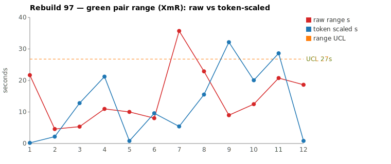
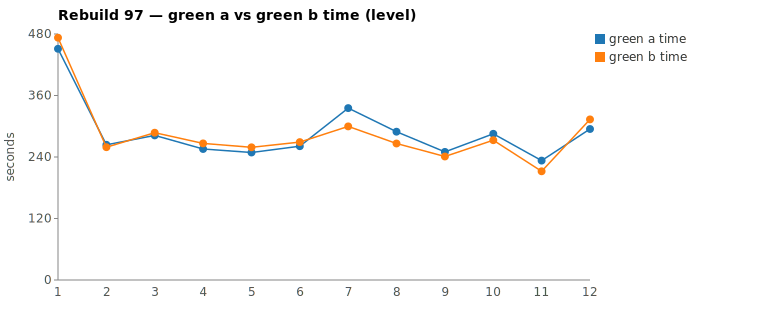

* TOC
{:toc}

---

# Context

This is a batch-level companion to [pbc-83][5], [pbc-84][4], [pbc-85][13], [pbc-86][15], [pbc-87][18], [pbc-88][19], [pbc-90][22], [pbc-92][26], [pbc-93][27], [pbc-94][29], [pbc-95][30], and [pbc-96][32], using the same in-run pair methodology: since [issue #434][7] every Darmok scenario runs its green phase **twice** — worktree `_a` and `_b`, both branched from the *same red commit*, minutes apart — so the pair-range `|green_a − green_b|` from one metrics row nets out model-of-the-day, red commit, and server window, leaving **work** versus **per-token generation rate**. The charted quantity is the **Selected range** `min(raw, token-scaled)` fixed in [pbc-94][29].

**Rebuild97's contribution is the ruler doing its job on the run's two *loudest* raw signals.** The pair-range Google Sheet ranks scenarios by the raw `|a − b|` clock gap, and this run's two widest raw pairs are the two `-1-doesn't exist` siblings from the workspace-validation subtree — a **35.7 s** and a **22.9 s** raw gap that would sit near the top of any raw chart. Both **collapse under the Selected ruler** to 5 s and 16 s, both carry **no functional-diff warn and converge on identical committed code**, and neither comes close to the run's limit. The run's *widest Selected* range belongs to a **third**, quieter scenario (`3 - Validation for Workspace Issues - 1`, 21 s raw = 21 s Selected) that the raw sheet ranks mid-pack. This is the calibration case [pbc-94][29] built the ruler for — `Body row`'s 61 s→21 s collapse made concrete on the two raw leaders of a whole run: the raw top-2 are **rate/bookkeeping phantoms**, and the batch verdict is **both common cause, no action**.

Rebuild97 ran the Issues family across the workspace-validation subtrees. Picked by the raw sheet's top-2 (widest `|green_a − green_b|`), the two pairs are a **both-common-cause** batch:

| Scenario | Commit | Green `_a` | Green `_b` | Raw range | Token-scaled | **Selected** | Verdict |
|---|---|---|---|---|---|---|---|
| Step Object - 1 - doesn't exist | `a828c192` | 5:35 | **4:59** | 35,700 ms | 5 s | **5 s** (scaled) | **common cause — equivalent work, rate jitter; identical committed rule (`validateStepObjectNameWorkspace`), no functional diff** |
| Step Definition - 1 - doesn't exist | `bef60a72` | 4:49 | **4:26** | 22,888 ms | 16 s | **16 s** (scaled) | **common cause — small work-volume difference, identical committed rule (`validateStepDefinitionNameWorkspace`), no functional diff** |

(Bold = the winning half, brought back and refactored; both rows are `scaled` because token-scaled < raw.) Over all **twelve** run-order rows (nothing excluded — nothing is assignable this run) the XmR limits on **Selected** are `range_mean` **7.6 s**, `range_MR_bar` **7.4 s**, `range_UCL` **27 s**. **No row breaches.** The widest Selected point is `3 - Validation for Workspace Issues - 1` at **21 s** (raw-kept, its token-scaled 29 s a phantom), sitting under the 27 s UCL; both reviewed pairs (5 s, 16 s) sit far below it. The two raw leaders that put us here rank **7th and 3rd** by Selected.

The calibration anchors behave as designed: `Body row Cell names can be any case validation` ran a 10 s raw pair collapsing to **1 s** Selected (a pure Edit-payload bookkeeping gap), and `Step Object - 1 - doesn't exist` — this run's **raw** leader at 36 s — collapses to **5 s**, the single largest raw-to-Selected demotion of the batch.

*(Data note: the pair-range Google Sheet tab (gid `1010860399`) computes Selected and its moving range; its CSV export redirects through an auth-gated Google host that returned HTTP 400, so all values were taken from the local `metrics.csv` — the 17-column rows carry the `green_edit_tokens`/`green_todo_tokens` the NET deduction needs, so the chart's Selected is authoritative over the commit script's coarser output-token NET. The two disagree on `Step Definition`: the commit script's output-token NET reads its token-scaled as 35 s (> raw → keep raw 23 s), while the chart script's column-based NET reads 16 s (< raw → keep scaled). Per the skill the chart value wins: Selected 16 s.)*

---

# Charts

Scenarios are numbered in run order; the tables below say which index each is. The Moving-Range chart plots **raw** (red) and **token-scaled** (blue) together so `Selected` — their lower envelope — is visible, with the UCL (off Selected, nothing excluded) as the dashed orange line. The Green chart is the absolute level.





---

# The token-scaled pair-range (recap)

Wall-clock fuses **real work** (≈ green output tokens) with the **per-token generation rate** (server load, queue, context-prefill jitter — uncontrollable). The full token-scaled derivation is in [pbc-83][5]; [pbc-90][22] added the NET refinement (deduct Edit/Write/TodoWrite bookkeeping) and [pbc-94][29] fixed the selection rule:

- `raw` = `|a − b|`, the wall-clock gap.
- `net_x` = `raw_tokens_x − edit_x − todo_x`, stripping verbose TodoWrite re-emissions and whole-method Edit payloads.
- `token-scaled` = `|net_a − net_b| × fast_time / fast_raw`, the gap implied by **work** tokens at the faster half's rate.
- **`Selected = min(raw, token-scaled)`.** Scaling only removes variation (rate, bookkeeping); a token-scaled value larger than the clock gap is a phantom, so we keep the clock.

This run is the ruler's clean case. Both reviewed pairs did **near-equivalent work** — output-token gaps of 7.8 % and 11.5 %, NET gaps of 3.6 % and 11.7 % — so the double-digit-second clock gaps are almost entirely generation-rate jitter. `min(raw, token-scaled)` strips it: 36 s → 5 s, 23 s → 16 s. No mean, no threshold, no iteration; the raw leaders demote themselves the moment the work tokens are put beside the clock.

---

# Pair 1 — `a828c192` (Step Object - 1 - doesn't exist): the raw leader, work-equivalent (common cause)

The run's **widest raw** range (36 s, run index 7) and its **largest** raw-to-Selected collapse (to 5 s). The mojo logged **`Green: No functional diff between pair`**, winner `_b`.

| | `_a` 1deb1236 | `_b` 46c00b37 |
|---|---|---|
| Green wall-clock | 5:35 | **4:59** |
| Green output tokens | 9,498 | 8,756 |
| **NET tokens** | 4,173 | 4,331 |
| Read / Grep | 13 / 10 | 12 / 11 |
| Read tool-result bytes (input) | 115,527 | **135,668** |
| Writes / Edits | 0 / 6 | 0 / 4 |
| `mvn verify` cycles | 3 | 3 |

Output tokens differ 7.8 %, **NET 3.6 %** — both inside the 15 % threshold; the halves did the same work. The raw time-range is 11.9 % of the faster half (just outside the 10 % band), so time reads "different" while tokens read "similar": the [pbc-94][29] decision matrix's CELL 2 — *same work, different speed, a rate cause*. The per-minute buckets confirm it: every minute is non-zero in both halves, and the two soft minutes in `_a` (03:41 = 587, 03:42 = 387) align exactly with its third `mvn verify` cycle, not a stall. Input bytes actually favor `_b` (136 KB read vs 122 KB) even though it finished 36 s **faster** — the slower half was not exploring more, it was generating at a lower per-token rate.

The divergence walk finds no design difference — the two halves trace the same route and commit the same rule:

```
identical through ~call 10 (ToolSearch→TodoWrite seed, 3 site/uml reads,
      grep "COMPILATION ERROR" / "Guice configuration errors")
_a 1deb1236: reads jacoco-shortlist + TestStepIssueDetector/Types, greps
             getTestDocument, 6 Edits across ValidateActionImpl +
             TestStepIssueDetector + TestStepIssueTypes, 3 mvn cycles
_b 46c00b37: same reads, greps getTestDocument + navigateToDocument
             (2 extra pattern probes), 4 Edits on the same 3 files,
             ~3 mvn cycles
```

Both committed the **identical rule**: extend `ValidateActionImpl`'s cascade with `TestStepIssueDetector.validateStepObjectNameWorkspace(testStep)` (guarded by `validateDialog.isEmpty()`), add the detector method, and add the enum type. The functional-diff gate was silent because there was nothing to differ on.

**Verdict: common cause — no fix; stays in the limits.** Its 5 s Selected is the largest raw-collapse of the run and sits far under the 27 s UCL. The 36 s raw that ranked it #1 on the sheet was generation-rate jitter over equivalent work — the exact phantom the ruler exists to discard.

---

# Pair 2 — `bef60a72` (Step Definition - 1 - doesn't exist): the raw runner-up, small work gap (common cause)

The run's **second-widest raw** range (23 s, run index 8), collapsing to 16 s Selected. The mojo logged **`Green: No functional diff between pair`**, winner `_b`.

| | `_a` caf1d43f | `_b` c4099f86 |
|---|---|---|
| Green wall-clock | 4:49 | **4:26** |
| Green output tokens | 8,640 | 7,649 |
| **NET tokens** | 3,802 | 3,356 |
| Read / Grep | 12 / 7 | 11 / 5 |
| Read tool-result bytes (input) | 115,787 | 110,869 |
| Writes / Edits | 0 / 4 | 0 / 4 |
| `mvn verify` cycles | 2 | 2 |

Output tokens differ 11.5 %, NET 11.7 % — inside the 15 % threshold but outside the 10 % band, so this is a **small real work-volume difference**, not pure rate. The raw time-range is only 8.6 % of the faster half — time-**similar**. The column-based NET scaling reads the work-attributable range as 16 s (raw − scaled ≈ 7 s of rate overhead); the commit script's coarser output-token NET would have called it a CELL-4 phantom and kept raw 23 s, but the metrics columns resolve it to 16 s scaled, which the skill takes as authoritative. Either way it is a modest common-cause range well under the UCL. No stall: every per-minute bucket is non-zero except the 21-token `03:46` boundary minute (the green-compile `--resume` seam), and both halves' soft minutes sit on their `mvn` calls.

The walk again finds only style, not design:

```
identical through ~call 9 (ToolSearch→TodoWrite seed, 3 site/uml reads,
      grep "COMPILATION ERROR" / "Guice configuration errors",
      read jacoco-shortlist)
_a caf1d43f: Read-heavy (12 Read, 7 Grep) across the detector/interface
             files, 4 Edits, 2 mvn cycles
_b c4099f86: leaner (11 Read, 5 Grep), one grep "interface IStepObject",
             4 Edits on the same files, 2 mvn cycles
```

Both committed the **identical rule**: extend the `ValidateActionImpl` cascade with `TestStepIssueDetector.validateStepDefinitionNameWorkspace(testStep)`, the sibling of Pair 1's method, plus the matching detector method and enum type. Input bytes are within 4 %; zero confusion markers in either transcript.

**Verdict: common cause — no fix; stays in the limits.** The 16 s Selected is the third-widest of the run and sub-UCL. The `_a` half simply generated ~450 more NET tokens of equivalent reasoning; excluding this row would be tampering.

---

# Batch synthesis — the raw sheet's top-2 are both phantoms

Rebuild97's two worst pairs on the raw sheet are the two workspace-existence siblings — new-step-object and new-step-definition validation, structurally the same task — and together they make one point sharply:

1. **The raw pair-range over-ranks rate/bookkeeping jitter.** A 36 s and a 23 s raw gap led the sheet; put beside the work tokens they are 5 s and 16 s of real variation. Rank by raw and you'd investigate two non-events; rank by Selected and they fall to 7th and 3rd.
2. **Convergence is the norm, not the exception, on well-specified siblings.** Both pairs carried no functional-diff warn and committed byte-identical rules. Unlike [pbc-96][32]'s Step Parameters family — where a converged pair still hid a longitudinal ambiguity — these scenarios show no confusion markers, no cross-run rule drift, and equal input bytes. The workspace-existence checks are unambiguous: setup, expected error, and the detector-method name line up one-to-one.
3. **The signal this run is where it *isn't*.** The widest Selected range (21 s) belongs to `3 - Validation for Workspace Issues - 1`, a scenario the raw sheet buried mid-pack — a reminder that Selected and raw rankings diverge, and the ruler is what reconciles them. Even that widest point is in-limits, so the whole batch is common cause.

The methodological consequence: **when the raw top-2 both collapse and converge, the correct output is "no action."** A case study that ends there is the ruler working, not an investigation that failed — the same result [pbc-94][29] validated on `Body row`, now demonstrated on the two loudest raw signals of an entire run.

---

# The Fix, or Why No Fix

**No fix — both pairs common cause.** Both reviewed scenarios did work-equivalent halves (NET within 3.6 % and 11.7 %), converged on byte-identical committed rules, fired no functional-diff warn, and stalled nowhere. Their raw ranges (36 s, 23 s) are generation-rate and small work-volume jitter; the Selected ruler demotes them to 5 s and 16 s, both far under the 27 s UCL. Excluding either — or "fixing" a scenario whose two halves already agree — would be tampering: reacting to noise as if it were signal.

No scenario-level input change is warranted, and no prompt, harness, or model change is ever proposed. The chart generator (`rgr-review-charts.py`) computed `Selected = min(raw, token-scaled)` per row, charted raw + token-scaled + UCL, and ran with **no** `--exclude` argument — nothing this run is an identified assignable cause. The one measurement-level note for follow-up: the commit script's output-token NET and the metrics-column NET disagreed on `Step Definition`'s token-scaled value (35 s vs 16 s); the column-based value is the intended one, and the commit script's coarser deduction should be treated as a cross-check only.

---

# Functional Diffs Found

A `Green: Functional diff between pair` warn fires when the two green halves committed **behaviourally divergent** code that *both* pass the current test — so each warn names a **differentiating input the scenario does not pin**, which is exactly the raw material for creating or tightening a Test-Case. This list is **run-wide** (every scenario, not just the reviewed top-2), because a functional diff routinely lands on a scenario whose pair-range is mid-pack: **neither** of this run's two warns is one of the reviewed pairs. Rebuild97 logged **2**, produced by `.claude/scripts/rgr-review-functional-diffs.sh 97`:

| # | Scenario | Commit | Differentiating input (the Test-Case must pin) |
|---|---|---|---|
| 1 | `1 - Validation for Only Issues - 4` (raw range 11 s, not reviewed) | `112bb0c8` | A cell name whose **first character is a non-letter but whose first letter-starting word-token is lowercase** — e.g. `"1 test"`. A checks only the first char of the whole name (no issue); B scans whitespace-delimited tokens for the first letter-starting word (flags `CELL_NAME_ONLY`). |
| 2 | `Step object step definition parameter set for text doesn't exist` (raw range 19 s, not reviewed) | `44a3031c` | A **text test step referencing a name for which no matching document *or* step definition exists in the workspace**. A reports `TEXT_NAME_WORKSPACE`; B returns empty (no error). |

Verbatim warn text (for the downstream authoring skill):

> **1 — `1 - Validation for Only Issues - 4` (`112bb0c8`):** CellIssueDetector.validateNameOnly: A checks only the first character of the whole name, B scans whitespace-delimited tokens for the first letter-starting word; input "1 test" produces no-issue in A vs CELL_NAME_ONLY in B

> **2 — `Step object step definition parameter set for text doesn't exist` (`44a3031c`):** Candidate A reports TEXT_NAME_WORKSPACE error when no matching document or stepDef exists; Candidate B returns empty string (no error) for the same input.

Both are unpinned-input ambiguities of the same shape [pbc-96][32] traced for Step Parameters: the scenario states a setup and an expected string but leaves a rule underspecified, so two conforming implementations disagree on an input the case never exercises. Each is a candidate for a new or parameterized Test-Case that fixes the intended rule (for #1, decide whether a leading non-letter token defers the letter-case check to the next token; for #2, decide whether a text step with neither a matching document nor step definition is an error). These are **test-case input** changes, not harness/prompt/model changes.

---

# Mapping to the Research

| Predicted ([pbc-research][2]) | Observed across Rebuild97 |
|---|---|
| Wide pair-range fires the signal | the **raw** sheet fired on the two widest raw pairs (36 s, 23 s) — but Selected demoted both to 5 s / 16 s; the true widest-Selected signal (21 s) is a third scenario |
| A breach of the limit marks a special cause | **no breach** — every Selected point, including the 21 s leader, sits under the 27 s UCL; the process is in control |
| The special cause is in the input, not the system | n/a this run — no special cause; the raw leaders traced to rate/work jitter, not scenario defects |
| Both halves pass the same test | yes — all four halves passed verify, and both pairs committed **byte-identical** rules (converged) |
| Two work-trees differ | only in rate (Pair 1: `_b` read *more* yet finished faster) and diffuse reasoning volume (Pair 2: `_a` ~450 more NET tokens) — no design divergence |

---

# Findings by Variable

*Each subsection records this run's findings about one [Wheeler variable][3].*

## green time pair range

Charted on `Selected = min(raw, token-scaled)` per [pbc-94][29]. Limits over all 12 rows (nothing excluded): mean 7.6 s, MRbar 7.4 s, UCL 27 s. No row breaches. The two **raw** leaders collapsed hardest — `Step Object` 36 s → 5 s (the run's largest demotion) and `Step Definition` 23 s → 16 s — while the widest **Selected** point is `3 - Validation for Workspace Issues - 1` at 21 s (raw-kept). `Body row` collapsed 10 s → 1 s (Edit-payload bookkeeping), the familiar false positive the ruler exists for.

## green time pair range moving range

MRbar 7.4 s. The largest MR (≈20 s) flanks the run-order transition into `3 - Validation for Workspace Issues - 1` (index 11, the widest Selected point); MR-UCL (3.267 × MRbar ≈ 24 s) is not breached.

## green time

Claude-only per [#568][23]. `1 - Validation for Only Issues - 1` is again the absolute-level leader (7:31 / 7:52) as the subtree opener — the recurring warm-up cost — and its pair-range Selects to **0 s** (equal NET tokens), a wide absolute level with a vanishing pair gap. No developer-chart excursion beyond the opener.

## scale & green tokens

The defining finding this run: both raw leaders are **token-light relative to their clocks**. `Step Object`'s 36 s raw rides on a 7.8 % output-token / 3.6 % NET gap; `Step Definition`'s 23 s on 11.5 % / 11.7 %. Scaling to the faster half's rate removes almost all of the first gap and about a third of the second. No phantom this run inflated *past* raw for a reviewed pair — the `min` kept the scaled value both times.

## functional diff between pair

Silent on both **reviewed** pairs — and there, silence is corroborated by convergence: both committed byte-identical rules, so there was genuinely nothing to warn about. But the **run-wide** scan (see [# Functional Diffs Found](#functional-diffs-found)) found **2** warns on *other* scenarios — `1 - Validation for Only Issues - 4` and `Step object step definition parameter set for text doesn't exist`, both mid-pack by range and both missed by the top-2 pick. This is the key structural finding: the range-based top-2 and the functional-diff signal point at **different scenarios**, so the run-wide functional-diff list is now emitted as first-class test-case-authoring input, not folded into the pair walks. A warn is evidence *about the scenario*; it should stay attached until the ambiguity is pinned.

## commit-script vs chart-script NET (recurring)

The two NET computations diverged on `Step Definition`: the commit script's per-turn output-token deduction read token-scaled 35 s (would keep raw 23 s), while the chart script's `green_edit_tokens`/`green_todo_tokens` columns read 16 s (keeps scaled). The column-based value is authoritative per the skill; the discrepancy is a reminder that the commit script's decision-matrix cell is a *cross-check*, not the chart value. No verdict change — both readings are common cause and sub-UCL.

## silent stall / timeout (recurring)

No stall. Every near-zero per-minute bucket across all four halves aligns with an `mvn verify` cycle or the green-compile→green-verify `--resume` seam (Pair 2 `_a`'s 21-token `03:46` boundary minute). ([#569][24] remains open, no new data.)

## green-window attribution

All four halves' surveys were clipped to each half's last green `end_turn` per the [#570][25] rule; no phantom worktree escapes or refactor-read contamination appeared. Refactor phases logged `No changes, skipping verify` for both commits — the winners' brought-back code needed no further edits.

---

# Open Questions From This Case

- **Should the review skill pick the top-2 by Selected, not raw?** Step 1 picks the widest **raw** ranges from the sheet; this run they were both phantoms, and the widest-Selected scenario (`3 - Validation for Workspace Issues - 1`) went unreviewed. Ranking the pick by Selected would aim the per-pair analysis at the genuine signal — but the sheet's Selected column is what would have to drive the pick, and its CSV export is auth-gated. Worth reconciling.
- **Can the commit script adopt the column-based NET?** The `Step Definition` discrepancy (35 s vs 16 s token-scaled) came from the commit script deducting output-token *attribution* rather than the measured `green_edit_tokens`/`green_todo_tokens`. Feeding it the same columns the chart uses would make its decision-matrix cell agree with the chart value.
- **Is a converged, no-warn, no-burn pair ever assignable?** [pbc-96][32] found one that was (SP-2, via history). These two show the opposite pole — converged *and* clean across every axis. A per-scenario ledger (prior warns, confusion counts) would let the skill distinguish "converged because unambiguous" from "converged but historically split" in one step, instead of pulling transcripts by hand.

---

[2]: wheeler-understanding-variation
[3]: wheeler-understanding-variation
[4]: 84
[5]: 83
[7]: https://github.com/farhan5248/sheep-dog-main/issues/434
[13]: 85
[15]: 86
[18]: 87
[19]: 88
[22]: 90
[23]: https://github.com/farhan5248/sheep-dog-main/issues/568
[24]: https://github.com/farhan5248/sheep-dog-main/issues/569
[25]: https://github.com/farhan5248/sheep-dog-main/issues/570
[26]: 92
[27]: 93
[29]: 94
[30]: 95
[32]: 96
