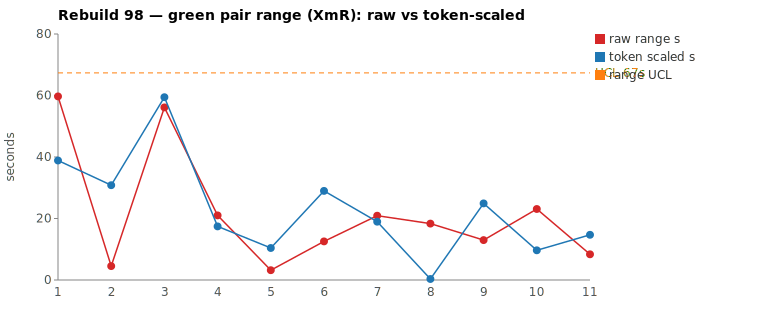
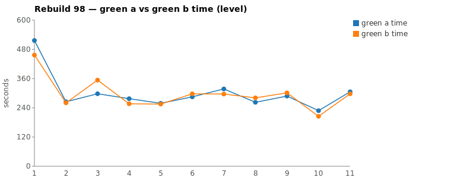

* TOC
{:toc}

---

# Context

This is a batch-level companion to [pbc-83][5], [pbc-84][4], [pbc-85][13], [pbc-86][15], [pbc-87][18], [pbc-88][19], [pbc-90][22], [pbc-92][26], [pbc-93][27], [pbc-94][29], [pbc-95][30], [pbc-96][32], and [pbc-97][33], using the same in-run pair methodology: since [issue #434][7] every Darmok scenario runs its green phase **twice** — worktree `_a` and `_b`, both branched from the *same red commit*, minutes apart — so the pair-range `|green_a − green_b|` from one metrics row nets out model-of-the-day, red commit, and server window, leaving **work** versus **per-token generation rate**. The charted quantity is the **Selected range** `min(raw, token-scaled)` fixed in [pbc-94][29].

**Rebuild98's contribution is a range that *survives* the ruler and is still common cause.** Where [pbc-97][33]'s two raw leaders both collapsed to phantoms (36 s→5 s, 23 s→16 s), Rebuild98's raw runner-up **keeps its clock**: `1 - Validation for Only Issues - 3` posts a 56 s raw gap whose token-scaled value (59 s) is *larger* than the clock, so `min` discards the phantom and Selects the full **56 s** — the run's **widest Selected point**. Yet the per-pair analysis returns **common cause**: the two halves committed byte-identical code (no functional-diff warn), and the range is a genuine *exploration-volume* difference — one half read more files to reach the same rule — not a design split. This is the case [pbc-96][32] flagged in the abstract: a **converged wide range** is a *near miss*, not a special cause. The run's raw leader, meanwhile, behaves like Rebuild97's — `1 - Validation for Only Issues - 1`'s 60 s raw demotes to 39 s Selected, equivalent work at different rate. Both reviewed pairs are common cause; the run's genuine ambiguity signal is a **functional diff on a third, mid-pack scenario** the range pick never touches.

Rebuild98 ran the Issues family across the only-issues and workspace-validation subtrees. Picked by the raw sheet's top-2 (widest `|green_a − green_b|`), the two pairs are a **both-common-cause** batch:

| Scenario | Commit | Green `_a` | Green `_b` | Raw range | Token-scaled | **Selected** | Verdict |
|---|---|---|---|---|---|---|---|
| 1 - Validation for Only Issues - 1 | `70fc6004` | 8:36 | **7:36** | 59,716 ms | 39 s | **39 s** (scaled) | **common cause — equivalent work, rate jitter; identical committed rule, no functional diff** |
| 1 - Validation for Only Issues - 3 | `60a38349` | **4:57** | 5:53 | 56,129 ms | 59 s | **56 s** (raw) | **common cause — real exploration-volume difference, converged on identical rule, no functional diff; the run's widest Selected, sub-UCL** |

(Bold = the winning half, brought back and refactored. Pair 1 is `scaled` — token-scaled < raw, a rate phantom removed; Pair 2 is `raw` — token-scaled > raw, so the phantom is the *scaled* value and `min` keeps the clock.) Over all **eleven** deduped run-order rows (nothing excluded — nothing is assignable this run) the XmR limits on **Selected** are `range_mean` **16.6 s**, `range_MR_bar` **19.1 s**, `range_UCL` **67 s**. **No row breaches.** The widest Selected point is Pair 2 at **56 s**, sitting under the 67 s UCL; Pair 1's 39 s sits well below it. The raw leader that put us here (Pair 1) ranks **2nd** by Selected; the run's widest Selected (Pair 2) is *also* the raw runner-up — the two rankings agree at the top this run, but for different reasons (rate phantom vs surviving work range).

*(Data note: the pair-range Google Sheet tab (gid `850834182`) computes Selected and its moving range off **twelve** rows and reports `range_UCL` **61.5 s**; the chart script deduped to **eleven** rows — dropping a second zero-range scenario (`Step Parameters - 1 - Definition doesn't exist`, `_a`=`_b`) — and computes `range_UCL` **67 s**. The two agree on every Selected value (Pair 1 = 39 s scaled, Pair 2 = 56 s raw); they disagree only on the limit line because of the extra zero row and run-order. Per the skill the chart script's value is authoritative for this report. Both pairs are sub-UCL under either number.)*

---

# Charts

Scenarios are numbered in run order; the tables below say which index each is. The Moving-Range chart plots **raw** (red) and **token-scaled** (blue) together so `Selected` — their lower envelope — is visible, with the UCL (off Selected, nothing excluded) as the dashed orange line. The Green chart is the absolute level.





---

# The token-scaled pair-range (recap)

Wall-clock fuses **real work** (≈ green output tokens) with the **per-token generation rate** (server load, queue, context-prefill jitter — uncontrollable). The full token-scaled derivation is in [pbc-83][5]; [pbc-90][22] added the NET refinement (deduct Edit/Write/TodoWrite bookkeeping) and [pbc-94][29] fixed the selection rule:

- `raw` = `|a − b|`, the wall-clock gap.
- `net_x` = `raw_tokens_x − edit_x − todo_x`, stripping verbose TodoWrite re-emissions and whole-method Edit payloads.
- `token-scaled` = `|net_a − net_b| × fast_time / fast_raw`, the gap implied by **work** tokens at the faster half's rate.
- **`Selected = min(raw, token-scaled)`.** Scaling only removes variation (rate, bookkeeping); a token-scaled value larger than the clock gap is a phantom, so we keep the clock.

This run exercises **both** sides of the `min`. Pair 1's clock gap (60 s) is larger than its token gap (39 s), so the scaled value wins — the extra 21 s was generation-rate jitter over equivalent work. Pair 2's token gap (59 s) is *larger* than its clock gap (56 s), so the raw value wins — the halves genuinely did different-volume work, and scaling it to the faster rate would only *inflate* a real range into a phantom, which `min` correctly refuses. The rule is the same both directions; the data decides which term is the artefact.

---

# Pair 1 — `70fc6004` (1 - Validation for Only Issues - 1): the raw leader, work-equivalent (common cause)

The run's **widest raw** range (60 s, run index 1) and the subtree opener. The mojo logged **`Green: No functional diff between pair`**, winner `_b`.

| | `_a` 8ca7b5fb | `_b` 70588fee |
|---|---|---|
| Green wall-clock | 8:36 | **7:36** |
| Green output tokens | 14,628 | 13,713 |
| **NET tokens** | 8,091 | 6,924 |
| Read / Grep | 17 / 19 | 16 / 19 |
| Read tool-result bytes (input) | 97,966 | 97,094 |
| Writes / Edits | 5 / 6 | 5 / 6 |
| `mvn verify` cycles | 3 | 3 |

Output tokens differ **6.3 %** — well inside the 15 % threshold; the halves did the same work. The raw time-range is 13.1 % of the faster half (just outside the 10 % band), so time reads "different" while tokens read "similar": the [pbc-94][29] decision matrix's CELL 2 — *same work, different speed, a rate cause*. Input bytes are within **1 %** (98.0 KB vs 97.1 KB), tool counts are near-identical (17/16 Read, 19/19 Grep, 5/5 Write, 6/6 Edit, 3/3 mvn), and the per-minute buckets confirm no stall: every minute is non-zero in both halves (`_a` bottoms at 423 in its final tail minute, `_b` at 615), so the 60 s gap is pure generation rate, not exploration.

The divergence walk finds no design difference — the two halves trace the same route and commit the same rule:

```
identical through ~call 10 (ToolSearch→TodoWrite seed, 3 site/uml reads,
      grep "COMPILATION ERROR" / "Guice configuration errors" /
      "No implementation for", grep "ValidateAction")
_a 8ca7b5fb: greps navigateToDocument + setTestSuiteName + ITestSuite,
             Globs *IssueTypes/*IssueDetector, writes jacoco-shortlist,
             6 Edits across ValidateActionImpl + detector + types, 3 mvn
_b 70588fee: greps ValidateAnnotation + MissingImplementation +
             navigateToDocument, same Globs, writes jacoco-shortlist,
             6 Edits on the same 3 files, 3 mvn
```

Both committed the **identical rule**: extend `ValidateActionImpl`'s cascade with the only-issues first-step validation (guarded by `validateDialog.isEmpty()`), add the detector method, and add the enum type. The functional-diff gate was silent because there was nothing to differ on.

**Verdict: common cause — no fix; stays in the limits.** Its 39 s Selected is a 21 s raw-collapse and sits far under the 67 s UCL. The 60 s raw that ranked it #1 on the sheet was generation-rate jitter over equivalent work — the phantom the ruler exists to discard.

---

# Pair 2 — `60a38349` (1 - Validation for Only Issues - 3): the surviving range, converged (common cause)

The run's **second-widest raw** range (56 s, run index 3) — and the run's **widest Selected**, because `min` keeps the clock. The mojo logged **`Green: No functional diff between pair`**, winner `_a` (the faster half).

| | `_a` 126221b8 | `_b` 0ba41671 |
|---|---|---|
| Green wall-clock | **4:57** | 5:53 |
| Green output tokens | 9,172 | 10,875 |
| **NET tokens** | 3,787 | 5,618 |
| Read / Grep | 16 / 6 | 19 / 8 |
| Read tool-result bytes (input) | 118,360 | **147,122** |
| Writes / Edits | 2 / 2 | 2 / 2 |
| `mvn verify` cycles | 2 | 2 |

Output tokens differ **15.7 %** (just over the 15 % threshold) and **NET 32.6 %** — a materially larger work-volume gap than any Rebuild97 pair. The raw time-range is 18.8 % of the faster half, so time reads "different" and tokens read "different": the decision matrix's CELL 3 — *real work difference, investigate*. The chart value is **raw 56 s** (token-scaled 59 s > raw, so the scaled value is the phantom here). The divergence is a **read-volume** difference: `_b` read **19 files / 147 KB** and probed the test-data setup helpers (`grep initTestStep`, `grep addTestStepWithFullName`) while `_a` took a leaner **16 files / 118 KB** route. No stall — every per-minute bucket is non-zero in both halves (both peak at ~2.7 K mid-run, taper to their `mvn` tails).

The walk shows the extra work led to the *same place*, not a different one:

```
identical through ~call 9 (ToolSearch→TodoWrite seed, uml reads,
      grep "COMPILATION ERROR" / "Guice configuration errors")
_a 126221b8: reads jacoco-shortlist + files, grep TestStepIssueDetector,
             Glob dsl/issues/TestStep* + ITestStep, 2 Writes, 2 Edits, 2 mvn
_b 0ba41671: read-heavier (19 Read/147 KB), grep TestStepIssueDetector/
             Types, then initTestStep + addTestStepWithFullName probes,
             2 Writes, 2 Edits on the same files, 2 mvn
```

Both committed the **identical rule**: extend the `ValidateActionImpl` cascade with the only-issues TestStep validation, plus the matching `TestStepIssueDetector` method and enum type. `_b` simply explored ~48 % more NET tokens of the setup-helper surface before writing the same code `_a` wrote after a shorter look. The functional-diff gate was silent — the two halves converged.

**Verdict: common cause — no fix; stays in the limits.** The 56 s Selected is the run's widest and sits under the 67 s UCL. This is the **near-miss** [pbc-96][32] named: a wide range that *converged this run*. Convergence here is not proof of a well-pinned scenario — the two halves may have sampled the same conforming rule by luck — but the timing signal alone gives no assignable cause, and the run's actual behavioural ambiguity surfaced elsewhere (see below). Excluding this row would be tampering; a wide-but-converged range stays in the limits. But the range is not *free* of a cause — reading `_b`'s transcript, its extra 32.6 % NET went to reverse-engineering how a test-step full name decomposes into its step-object and step-definition segments (the `{Assignment}` axis). That is a **documentation** gap, not a scenario defect, and it has a fix — see [# The Fix](#the-fix-or-why-no-fix).

---

# Batch synthesis — one phantom, one surviving range, both common cause

Rebuild98's two worst raw pairs are two siblings from the only-issues subtree (`- 1` and `- 3`), and together they show the two ways a wide range resolves to common cause:

1. **Pair 1 is a rate phantom.** 60 s raw, 6.3 % token gap, byte-equal input volume, no stall → the clock gap is generation rate, and `min` demotes it to 39 s. Same lesson as Rebuild97's raw leaders.
2. **Pair 2 is a *surviving* range.** 56 s raw that the ruler **keeps** (token-scaled 59 s is the phantom), driven by a real 32.6 % NET exploration-volume gap — yet the halves **converged on byte-identical code**. A wide Selected range is therefore *not* automatically assignable: it flags "the halves thought for different lengths," and the per-pair walk decides whether that was disagreement (assignable) or just a longer route to the same answer (common cause). Here it was the latter.
3. **The genuine ambiguity is where the range chart isn't looking.** The run's one `Functional diff between pair` warn landed on `Step object step definition parameter set for text doesn't exist` — a **mid-pack** scenario (8 s Selected, run index 11) neither reviewed pair touched. That is the direct behavioural signal; the range chart's two loudest pairs are both benign.

The methodological consequence sharpens [pbc-97][33]'s: **"widest Selected" and "assignable" are different questions.** Rebuild97 made the point that the raw top-2 can be phantoms; Rebuild98 makes the complementary point that even a range that *survives* the ruler as the run's widest can be common cause. Pair-range is the trigger, never the diagnosis — and never proof. Check the functional-diff scan (run-wide) before concluding the run is in control.

---

# The Fix, or Why No Fix

**No fix — both pairs common cause.** Pair 1 did work-equivalent halves (6.3 % token gap) at different generation rates; its 60 s raw demotes to 39 s Selected. Pair 2 did a real exploration-volume difference (32.6 % NET) but **converged on byte-identical committed code** with no functional-diff warn; its 56 s Selected is the run's widest yet sub-UCL. Neither traces to a scenario defect: excluding either — or "fixing" a scenario whose two halves already agree — would be tampering, reacting to noise as if it were signal.

No scenario-level input change is warranted for the reviewed pairs, and no prompt, harness, or model change is ever proposed. The chart generator (`rgr-review-charts.py`) computed `Selected = min(raw, token-scaled)` per row, charted raw + token-scaled + UCL, and ran with **no** `--exclude` argument — nothing this run is an identified assignable cause. The one genuine test-case signal this run is the run-wide functional diff below, which is a candidate for the downstream Test-Case authoring skill, not a change to any reviewed scenario. Measurement-level follow-up: the sheet (12 rows, UCL 61.5 s) and chart (11 deduped rows, UCL 67 s) disagree on the limit line because of a duplicated zero-range row; reconciling the dedup would make the two dashboards report the same UCL.

**Pair 2 — a spec-*example* fix, not a test-case fix (a new category this run).** Pair 2 is common cause on every axis, yet the review still produced a concrete improvement — just not to the scenario. `_b`'s exploration went to deriving the two-segment name decomposition (step-object | step-definition) from the grammar `*RefFragments`, because the `validate{Assignment}{Scope}` section of `uml-interaction-main.md` shows only the **cascade** (the `{Scope}` axis — the "Pattern 4" that made [pbc-97][33]'s Workspace-scope pairs converge cheaply) and never the *inside* of a `validate…` method (the `{Assignment}` axis). The run-97-vs-98 transcript comparison is decisive: run-97 halves cite the cascade example *by number* and converge; run-98's had no example for the segment decomposition and rebuilt it from source. The fix is a **companion worked example** in the interaction spec — a concrete full name traced through decomposition → `RefFragments.getAll()` → cell — deliberately an *example*, because the file's own evidence is that examples get used and prose rules get ignored. This is a **spec-pattern** fix: it lowers exploration variance (the near-miss width) without pinning the scenario, and is a third option beside "assignable → split the test case" and "common cause → no action."

**Byproduct — a stale-model bug, found and fixed.** Chasing this run's lone functional diff (below) surfaced an unrelated infrastructure defect: the run-rgr cleanup regen ran a2u/u2c with `onlyChanges=true` on the batch tag, so the `pst.<tag>.orig.uml` on the service PVC was never rebuilt and kept a pre-outline standalone `Interaction` (a Test-Case since demoted to a Test-Data row), which u2c re-emitted as a phantom `Scenario` in every cleanup commit from Rebuild91 on. Fixed by forcing cleanup to `onlyChanges=false` (full model rebuild), so the model host now prunes restructured-away scenarios. Not a pair-range finding — but the kind of correctness bug the run-wide review turns up.

---

# Functional Diffs Found

A `Green: Functional diff between pair` warn fires when the two green halves committed **behaviourally divergent** code that *both* pass the current test — so each warn names a **differentiating input the scenario does not pin**, which is exactly the raw material for creating or tightening a Test-Case. This list is **run-wide** (every scenario, not just the reviewed top-2), because a functional diff routinely lands on a scenario whose pair-range is mid-pack: this run's one warn is **not** either reviewed pair. Rebuild98 logged **1**, produced by `.claude/scripts/rgr-review-functional-diffs.sh 98`:

| # | Scenario | Commit | Differentiating input (the Test-Case must pin) |
|---|---|---|---|
| 1 | `Step object step definition parameter set for text doesn't exist` (Selected 8 s, run index 11, not reviewed) | `10c90e77` | A `StepParameters` whose **name is `"Content"` but whose table first-row cells are *not* `"Content"`**. Candidate A keys the parameter set on the name alone (name `== "Content"` → matches, returns `""`); Candidate B *additionally* requires the table's first-row cells to equal `"Content"` (mismatch → error string). The two disagree on exactly this input. |

Verbatim warn text (for the downstream authoring skill):

> **1 — `Step object step definition parameter set for text doesn't exist` (`10c90e77`):** Candidate A checks only StepParameters name=="Content", Candidate B also requires table first-row cells to equal "Content"; input with name "Content" but different table cells yields "" vs error string

This is an unpinned-input ambiguity of the same shape [pbc-96][32] traced for Step Parameters: the scenario states a setup and an expected string but leaves the *matching key* underspecified — name-only vs name-plus-table-cells — so two conforming implementations disagree on an input the case never exercises. **Note this is the same scenario that carried a functional diff in [pbc-97][33]** (`44a3031c`, TEXT_NAME_WORKSPACE vs empty): the text-parameter-set family is **chronically ambiguous** across runs, which is exactly the longitudinal signal the run-wide scan exists to catch — a single narrow-range run would read it as "fine." It is a candidate for a new or parameterized Test-Case that fixes the intended matching rule (decide whether the parameter-set identity is the name alone or the name together with the table's first-row cells). This is a **test-case input** change, not a harness/prompt/model change.

---

# Mapping to the Research

| Predicted ([pbc-research][2]) | Observed across Rebuild98 |
|---|---|
| Wide pair-range fires the signal | the raw sheet fired on the two only-issues siblings (60 s, 56 s); Pair 1 demoted to 39 s (scaled), Pair 2 kept 56 s (the run's widest Selected) |
| A breach of the limit marks a special cause | **no breach** — every Selected point, including the 56 s leader, sits under the 67 s UCL; the process is in control |
| The special cause is in the input, not the system | n/a for the reviewed pairs — no special cause; the one behavioural ambiguity (functional diff) is a *third*, mid-pack scenario, and its fix is a Test-Case change |
| Both halves pass the same test | yes — all four halves passed verify, and both reviewed pairs committed **byte-identical** rules (converged) |
| Two work-trees differ | Pair 1: only in rate (equal input bytes, 6.3 % token gap); Pair 2: in exploration volume (`_b` read 147 KB / 32.6 % more NET) but reached the same rule — no design divergence |

---

# Findings by Variable

*Each subsection records this run's findings about one [Wheeler variable][3].*

## green time pair range

Charted on `Selected = min(raw, token-scaled)` per [pbc-94][29]. Limits over all 11 deduped rows (nothing excluded): mean 16.6 s, MRbar 19.1 s, UCL 67 s. No row breaches. This run exercised **both** branches of the `min`: Pair 1's 60 s raw collapsed to 39 s (token-scaled < raw, rate phantom removed), while Pair 2's 56 s raw was **kept** (token-scaled 59 s > raw, the scaled value being the phantom). The widest Selected is Pair 2 at 56 s — a *surviving* range, not a phantom, yet still common cause.

## green time pair range moving range

MRbar 19.1 s — larger than Rebuild97's 7.4 s, driven by the two adjacent double-digit Selected values early in run order (39 s at index 1, 56 s at index 3, with a 5 s index 2 between them producing MRs of 34 s and 51 s). MR-UCL (3.267 × MRbar ≈ 62 s) is not breached; the largest single MR (51 s) flanks the index-2→3 transition into the widest Selected point.

## green time

Claude-only per [#568][23]. `1 - Validation for Only Issues - 1` (Pair 1) is again the absolute-level leader (8:36 / 7:36) as the **subtree opener** — the recurring warm-up cost seen every run — and its pair also carries the widest raw gap, though it Selects to 39 s. No developer-chart excursion beyond the opener; Pair 2's levels (4:57 / 5:53) are mid-pack.

## scale & green tokens

The defining contrast this run. Pair 1's 60 s raw rides on a 6.3 % output-token gap → almost pure rate, scaled away to 39 s. Pair 2's 56 s raw rides on a **32.6 % NET** gap → a real work-volume difference the ruler *keeps* (scaling it up to 59 s would be the phantom). First run where the widest Selected point is `raw`-kept because its token-scaled value *exceeds* the clock — the `min` refusing to manufacture variation.

## functional diff between pair

Silent on both **reviewed** pairs — and there, silence is corroborated by convergence: both committed byte-identical rules. But the **run-wide** scan (see [# Functional Diffs Found](#functional-diffs-found)) found **1** warn on a *different* scenario — `Step object step definition parameter set for text doesn't exist` (mid-pack, index 11), **the same scenario that fired a functional diff in [pbc-97][33]**. This is the key finding: the text-parameter-set family is **chronically ambiguous** across runs while its pair-range stays narrow, so only the run-wide, longitudinal functional-diff scan catches it — the range chart never would. A warn is evidence *about the scenario*; recurring warns are evidence the scenario is structurally underspecified.

## surviving vs phantom range (new this run)

Rebuild98 is the first reviewed batch where the widest Selected point is a `raw`-kept **surviving** range (Pair 2, token-scaled > raw) rather than a phantom-collapse. It establishes that "survives the ruler" and "is assignable" are independent: a range can keep its full clock value (real exploration-volume work) and still be common cause, because the halves converged. The per-pair divergence walk, not the Selected magnitude, is what separates the two.

## silent stall / timeout (recurring)

No stall in any of the four halves. Every per-minute bucket is non-zero; the softest minutes align with `mvn verify` cycles or the green-compile→green-verify `--resume` seam. ([#569][24] remains open, no new data.)

## green-window attribution

All four halves' surveys were clipped to each half's last green `end_turn` per the [#570][25] rule; no phantom worktree escapes or refactor-read contamination appeared. Refactor phases logged `No changes, skipping verify` for both commits — the winners' brought-back code needed no further edits.

---

# Open Questions From This Case

- **Should a converged-but-wide surviving range be flagged for a second look?** Pair 2 kept 56 s (the run's widest Selected) yet converged. Convergence can be luck — the same ambiguity that produced Rebuild97's/Rebuild98's functional diffs could split a wide-range scenario on a different input. A ledger of "wide Selected + converged" scenarios would let the skill watch for one that eventually splits, distinguishing a real near-miss from a genuinely well-pinned range.
- **Should the run-wide functional-diff scan track recurrence?** `Step object step definition parameter set for text doesn't exist` has now fired a functional diff in two consecutive runs (97, 98) on different inputs of the same family. A recurrence counter would promote it from "one warn to consider" to "chronically ambiguous — pin it now," which is a stronger prompt for the downstream Test-Case skill than a single-run warn.
- **Should the sheet and chart reconcile their dedup?** The 61.5 s (sheet, 12 rows) vs 67 s (chart, 11 rows) UCL gap comes entirely from a duplicated zero-range row. Aligning the dedup rule would make the two dashboards report one limit and remove the per-report data-note.

---

[2]: wheeler-understanding-variation
[3]: wheeler-understanding-variation
[4]: 84
[5]: 83
[7]: https://github.com/farhan5248/sheep-dog-main/issues/434
[13]: 85
[15]: 86
[18]: 87
[19]: 88
[22]: 90
[23]: https://github.com/farhan5248/sheep-dog-main/issues/568
[24]: https://github.com/farhan5248/sheep-dog-main/issues/569
[25]: https://github.com/farhan5248/sheep-dog-main/issues/570
[26]: 92
[27]: 93
[29]: 94
[30]: 95
[32]: 96
[33]: 97
