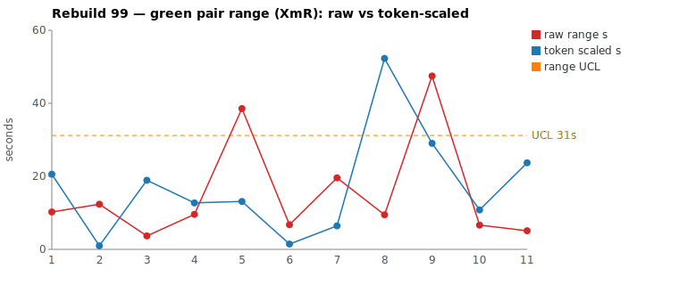
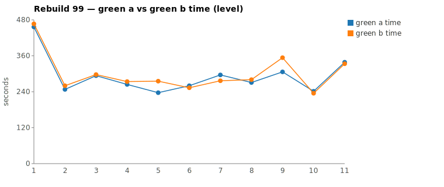

* TOC
{:toc}

---

# Context

This is a batch-level companion to [pbc-83][5], [pbc-84][4], [pbc-85][13], [pbc-86][15], [pbc-87][18], [pbc-88][19], [pbc-90][22], [pbc-92][26], [pbc-93][27], [pbc-94][29], [pbc-95][30], [pbc-96][32], [pbc-97][33], and [pbc-98][34], using the same in-run pair methodology: since [issue #434][7] every Darmok scenario runs its green phase **twice** — worktree `_a` and `_b`, both branched from the *same red commit*, minutes apart — so the pair-range `|green_a − green_b|` from one metrics row nets out model-of-the-day, red commit, and server window, leaving **work** versus **per-token generation rate**. The charted quantity is the **Selected range** `min(raw, token-scaled)` fixed in [pbc-94][29].

**Rebuild99's contribution is the first reviewed run that is *clean on both detectors*.** Every prior reviewed run carried at least one `Functional diff between pair` warn — [pbc-97][33] had two (both on mid-pack scenarios the range pick missed), [pbc-98][34] had one (the chronically-ambiguous text-parameter-set family). Rebuild99 has **zero**: the run-wide functional-diff scan returns nothing, so no pair committed behaviourally divergent code. And the range chart's two loudest pairs both resolve to common cause under the ruler — one a rate-plus-exploration difference that **converged**, one an almost-pure rate phantom. There is no assignable cause by *either* detector. Per the methodology that is a **correct, complete** result, not a failed hunt: a run can be genuinely in statistical control, and this one is.

Rebuild99 ran the full Issues validation family — only-issues, file-issues, workspace-issues, and the step-object / step-definition / step-parameters / text-element sub-scenarios. Picked by the sheet's top-2 (widest `|green_a − green_b|`, which agree with the top-2 by Selected this run), the two pairs are a **both-common-cause** batch:

| Scenario | Commit | Green `_a` | Green `_b` | Raw range | Token-scaled | **Selected** | Verdict |
|---|---|---|---|---|---|---|---|
| Step Parameters - 4 - Parameter combination doesn't exist | `8b861f7` | **5:06** | 5:53 | 47,481 ms | 29 s | **29 s** (scaled) | **common cause — real exploration-volume difference (18.2 % NET, one extra mvn cycle) that converged on identical committed code, no functional diff** |
| Body row Cell names can be any case validation | `73a8014` | **3:56** | 4:35 | 38,553 ms | 13 s | **13 s** (scaled) | **common cause — near-equivalent work (10.1 % NET), the 39 s clock gap is almost all generation rate; converged, no functional diff** |

(Bold = the winning half, brought back and refactored — `_a` in both pairs, the faster half. Both rows are `scaled`: token-scaled < raw, so the ruler discards the rate portion of the clock gap.) Over all **eleven** deduped run-order rows (nothing excluded — nothing is assignable this run) the XmR limits on **Selected** are `range_mean` **8.6 s**, `range_MR_bar` **8.5 s**, `range_UCL` **31 s**. **No row breaches.** The widest Selected point is Pair 1 at **29 s**, sitting just under the 31 s UCL; Pair 2's 13 s sits well below it. The two rankings (raw and Selected) agree at the top this run — Step Parameters-4 and Body row are the two widest by both — but both demote under the ruler.

*(Data note: the pair-range Google Sheet tab (gid `912411958`) computes the same eleven Selected values and reports `range_UCL` **31.20 s**; the chart script deduped to the identical eleven rows and computes `range_UCL` **31 s**. The two dashboards agree on every value this run — no zero-range dedup discrepancy of the kind [pbc-98][34] noted.)*

---

# Charts

Scenarios are numbered in run order; the tables below say which index each is. The Moving-Range chart plots **raw** (red) and **token-scaled** (blue) together so `Selected` — their lower envelope — is visible, with the UCL (off Selected, nothing excluded) as the dashed orange line. The Green chart is the absolute level.





---

# The token-scaled pair-range (recap)

Wall-clock fuses **real work** (≈ green output tokens) with the **per-token generation rate** (server load, queue, context-prefill jitter — uncontrollable). The full token-scaled derivation is in [pbc-83][5]; [pbc-90][22] added the NET refinement (deduct Edit/Write/TodoWrite bookkeeping) and [pbc-94][29] fixed the selection rule:

- `raw` = `|a − b|`, the wall-clock gap.
- `net_x` = `raw_tokens_x − edit_x − todo_x`, stripping verbose TodoWrite re-emissions and whole-method Edit payloads.
- `token-scaled` = `|net_a − net_b| × fast_time / fast_raw`, the gap implied by **work** tokens at the faster half's rate.
- **`Selected = min(raw, token-scaled)`.** Scaling only removes variation (rate, bookkeeping); a token-scaled value larger than the clock gap is a phantom, so we keep the clock.

Both reviewed pairs this run land on the **`scaled`** side of the `min` — token-scaled below the clock — so both keep the work-attributable value and discard rate jitter. Pair 1's 47 s clock carries a real 29 s of work difference (18.2 % NET) plus 18 s of rate; Pair 2's 39 s clock is almost all rate — only 13 s survives as work. Neither exercises the `raw`-kept branch [pbc-98][34]'s Pair 2 illustrated (token-scaled > raw); this run the clock was always the looser bound.

---

# Pair 1 — `8b861f7` (Step Parameters - 4 - Parameter combination doesn't exist): the widest Selected, converged (common cause)

The run's **widest raw** range (47 s, run index 9) *and* its **widest Selected** (29 s). The mojo logged **`Green: No functional diff between pair`**, winner `_a` (the faster half).

| | `_a` 529e1dfa | `_b` cf7c24d1 |
|---|---|---|
| Green wall-clock | **5:06** | 5:53 |
| Green output tokens | 8,892 | 10,986 |
| **NET tokens** | 3,790 | 4,633 |
| Read / Grep | 11 / 7 | 13 / 7 |
| Read tool-result bytes (input) | 118,996 | 123,939 |
| Writes / Edits | 2 / 2 | 2 / 3 |
| `mvn verify` cycles | 2 | **3** |

Output tokens differ **19.1 %** and **NET 18.2 %** — both over the 15 % threshold; the halves did materially different-volume work. The raw time-range is 15.5 % of the faster half, so time reads "different" and tokens read "different": the [pbc-94][29] decision matrix's CELL 3 — *real work difference, investigate*. The chart value is **token-scaled 29 s** (< raw 47 s), because scaling the 18.2 % NET gap to the faster half's rate accounts for 29 s of the 47 s clock and leaves 18 s as rate. No stall — every per-minute bucket is non-zero in both halves (`_a` bottoms at 552 in its `mvn`-tail minute, `_b` at 400), so the extra time is exploration + one more verify cycle, not a hang.

The divergence walk shows the extra work led to the *same place*, not a different one:

```
identical through ~call 10 (ToolSearch→TodoWrite seed, 3 site/uml reads,
      grep "COMPILATION ERROR" / "Guice configuration errors")
_a 529e1dfa: reads jacoco-shortlist, grep "step parameters don't exist",
             Glob **/dsl/issues/*.java, 3 reads, 2 Writes, 2 Edits, 2 mvn
_b cf7c24d1: Globs RowIssueDetector / RowIssue* / issues/*.java,
             greps "interface IRow" + "interface IStepParameters",
             2 Writes, then Edit→mvn→Read→Edit→mvn→mvn (3 Edits, 3 mvn)
```

Both committed the **identical rule**: extend the `ValidateActionImpl` cascade with the step-parameters parameter-combination validation plus the matching detector method and enum type. `_b` simply globbed the issues package more widely, probed two interfaces `_a` never opened, and paid for **one extra `mvn verify` cycle** (3 vs 2) — its second edit didn't compile first time. That is a real ~18 % more NET exploration, but it reached the code `_a` wrote after a shorter look, and the functional-diff gate stayed silent.

**Verdict: common cause — no fix; stays in the limits.** Its 29 s Selected is the run's widest and sits just under the 31 s UCL. This is a near-miss of the [pbc-96][32] kind: a wide range that *converged this run*. Convergence can be luck rather than proof of a well-pinned scenario, but the per-pair walk finds no design disagreement and the functional-diff scan is silent, so there is no assignable cause to act on. Excluding it would be tampering.

---

# Pair 2 — `73a8014` (Body row Cell names can be any case validation): the rate phantom (common cause)

The run's **second-widest raw** range (39 s, run index 5), which demotes to **13 s Selected** — the sharpest rate-collapse of the run. The mojo logged **`Green: No functional diff between pair`**, winner `_a`.

| | `_a` f57c502b | `_b` 2eaf9366 |
|---|---|---|
| Green wall-clock | **3:56** | 4:35 |
| Green output tokens | 6,502 | 7,544 |
| **NET tokens** | 3,222 | 3,582 |
| Read / Grep | 14 / 7 | 11 / 9 |
| Read tool-result bytes (input) | **151,565** | 116,232 |
| Writes / Edits | 0 / 1 | 0 / 1 |
| `mvn verify` cycles | 2 | 2 |

Output tokens differ **13.8 %** and **NET 10.1 %** — inside / at the edge of the threshold; the halves did near-equivalent work. The raw time-range is 16.3 % of the faster half, so time reads "different" while tokens read "similar-ish": the decision matrix's CELL 2/3 boundary — *mostly a rate cause*. The chart value is **token-scaled 13 s** (< raw 39 s): scaling the 10.1 % NET gap to the faster rate accounts for only 13 s, so **26 s of the 39 s clock gap is pure generation rate**. The tell is decisive — **the faster half `_a` read *more* bytes** (151 KB vs 116 KB, 14 Read vs 11), and both did exactly 1 Edit and 2 mvn cycles. If the time gap were exploration, the slower half would have read more; instead the slower half read *less*, so the gap is rate, not work. No stall — every per-minute bucket is non-zero in both halves.

The walk confirms the two halves did the same thing by two near-identical routes:

```
identical through ~call 9 (ToolSearch→TodoWrite seed, uml reads,
      grep "COMPILATION ERROR" / "Guice configuration errors")
_a f57c502b: read-heavy (14 Read / 151 KB), reads jacoco-shortlist + files,
             grep "interface IRow" / "interface ITable", 1 Edit, 2 mvn
_b 2eaf9366: grep-heavy (9 Grep), grep BUILD / "Tests run", grep IRow / ITable,
             1 Edit, 2 mvn
```

Both committed the **identical rule**: extend the `ValidateActionImpl` cascade with the body-row case-insensitive cell-name validation and its detector. The only difference is style — `_a` leaned on Reads, `_b` on Greps — reaching the same one-Edit fix. The functional-diff gate was silent; the two halves converged.

**Verdict: common cause — no fix; stays in the limits.** The 13 s Selected sits far under the 31 s UCL. The 39 s raw that ranked it #2 on the sheet was generation-rate jitter over equivalent work — the phantom the ruler exists to discard.

---

# Batch synthesis — two demoted pairs, zero functional diffs, a run in control

Rebuild99's two worst raw pairs are one from the workspace-issues subtree (Step Parameters-4) and one from the only-issues subtree (Body row), and together they show the run is genuinely in statistical control:

1. **Pair 1 is a converged work difference.** 47 s raw, 18.2 % NET, one extra `mvn` cycle → a real exploration-volume gap that Selects to 29 s, yet the halves committed **byte-identical code**. Wide-but-converged, sub-UCL.
2. **Pair 2 is a rate phantom.** 39 s raw, 10.1 % NET, and the *faster* half read *more* bytes → the clock gap is generation rate, and `min` demotes it to 13 s. Same lesson as [pbc-97][33]'s raw leaders.
3. **The functional-diff scan is empty.** Zero `Green: Functional diff between pair` warns run-wide — the first reviewed run with none. So the direct behavioural detector agrees with the range detector: no scenario admitted more than one conforming answer this run.

The methodological point completes the [pbc-97][33]/[pbc-98][34] arc. Pbc-97 showed the raw top-2 can be phantoms; pbc-98 showed even a range that *survives* the ruler can be common cause; **Rebuild99 shows what "fully in control" looks like — both detectors silent at once.** That is a first, and it matters because it demonstrates the review can return a clean bill of health, not only findings. A batch whose verdict is "both common cause, no functional diffs — no action" is the methodology working, not the methodology finding nothing to do.

---

# The Fix, or Why No Fix

**No fix — both pairs common cause, and no functional diff anywhere in the run.** Pair 1 did a real exploration-volume difference (18.2 % NET, one extra `mvn` cycle) but **converged on byte-identical committed code**; its 29 s Selected is the run's widest yet sub-UCL. Pair 2's 39 s raw is almost all generation rate (the faster half read *more*), demoting to 13 s. Neither traces to a scenario defect: excluding either — or "fixing" a scenario whose two halves already agree — would be tampering, reacting to noise as if it were signal.

No scenario-level input change is warranted, and no prompt, harness, or model change is ever proposed. The chart generator (`rgr-review-charts.py`) computed `Selected = min(raw, token-scaled)` per row, charted raw + token-scaled + UCL, and ran with **no** `--exclude` argument — nothing this run is an identified assignable cause. Unlike [pbc-98][34], there is not even a spec-*example* follow-up to name: the run produced no functional diff and no exploration-heavy half that had to reverse-engineer an undocumented rule from source. The one measurement-level note is a *positive* one — the sheet and chart agree on the UCL (31.20 s / 31 s) this run, with no zero-range dedup gap to reconcile.

---

# Functional Diffs Found

A `Green: Functional diff between pair` warn fires when the two green halves committed **behaviourally divergent** code that *both* pass the current test — so each warn names a **differentiating input the scenario does not pin**, which is exactly the raw material for creating or tightening a Test-Case. This list is **run-wide** (every scenario, not just the reviewed top-2), because a functional diff routinely lands on a scenario whose pair-range is mid-pack.

**None this run — no pair committed behaviourally divergent code.** `.claude/scripts/rgr-review-functional-diffs.sh 99` returned **0** warns. Every scenario whose pair ran twice committed byte-identical code across `_a` and `_b`, including the two reviewed pairs (both `No functional diff between pair`) and the text-parameter-set family that fired a warn in both [pbc-97][33] and [pbc-98][34]. There is no differentiating-input signal to feed the downstream Test-Case authoring skill from this run.

---

# Mapping to the Research

| Predicted ([pbc-research][2]) | Observed across Rebuild99 |
|---|---|
| Wide pair-range fires the signal | the sheet fired on Step Parameters-4 (47 s) and Body row (39 s); Pair 1 demoted to 29 s, Pair 2 to 13 s (both scaled) |
| A breach of the limit marks a special cause | **no breach** — every Selected point, including the 29 s leader, sits under the 31 s UCL; the process is in control |
| The special cause is in the input, not the system | n/a — no special cause by either detector; nothing to fix |
| Both halves pass the same test | yes — all four halves passed verify, and both reviewed pairs committed **byte-identical** rules (converged) |
| Two work-trees differ | Pair 1: in exploration volume (`_b` globbed wider + one extra mvn, 18.2 % more NET) but reached the same rule; Pair 2: only in style/rate (the *faster* half read more bytes) — no design divergence either |

---

# Findings by Variable

*Each subsection records this run's findings about one [Wheeler variable][3].*

## green time pair range

Charted on `Selected = min(raw, token-scaled)` per [pbc-94][29]. Limits over all 11 deduped rows (nothing excluded): mean 8.6 s, MRbar 8.5 s, UCL 31 s. No row breaches. Both reviewed pairs land on the `scaled` branch of the `min` (token-scaled < raw): Pair 1's 47 s → 29 s (18 s rate stripped from a real work difference), Pair 2's 39 s → 13 s (26 s rate stripped from equivalent work). The widest Selected is Pair 1 at 29 s, just inside the 31 s UCL.

## green time pair range moving range

MRbar 8.5 s — back to the Rebuild97-scale tightness after Rebuild98's 19.1 s. The MR chain's two largest links flank the widest Selected point: 20 s into Pair 1 (index 8→9, 9 s→29 s) and 22 s out of it (index 9→10, 29 s→7 s). MR-UCL (3.267 × MRbar ≈ 28 s) is not breached; both links sit under it, so even the transition into the run's widest point is common cause.

## green time

Claude-only per [#568][23]. No absolute-level excursion this run. Pair 1's levels (5:06 / 5:53) sit mid-pack among the workspace-issues scenarios; Pair 2's (3:56 / 4:35) are among the run's faster greens. The recurring subtree-opener warm-up cost seen in prior runs is present on `1 - Validation for Only Issues - 1` (index 1) but that pair is a benign 10 s Selected and not reviewed.

## scale & green tokens

Both reviewed pairs are `scaled`. Pair 1's 47 s raw rides on an 18.2 % NET gap → a real work difference the ruler *keeps* 29 s of. Pair 2's 39 s raw rides on a 10.1 % NET gap → almost pure rate, scaled to 13 s. The diagnostic tell of the run is Pair 2's **faster half reading more input bytes** (151 KB vs 116 KB) — direct evidence the clock gap is rate, not exploration, since the slower half explored *less*.

## functional diff between pair

**Silent run-wide — zero warns**, the first reviewed run with none. On both reviewed pairs, silence is corroborated by convergence: both committed byte-identical rules. Notably the text-parameter-set family (`Step object step definition parameter set for text doesn't exist`), which fired a functional diff in both [pbc-97][33] and [pbc-98][34], ran green this run **without** a warn — one clean run does not clear a chronically-ambiguous scenario (convergence can be luck), but it does mean the run-wide scan has no differentiating-input signal to emit this time.

## surviving vs phantom range (from pbc-98)

Neither reviewed pair is a `raw`-kept **surviving** range this run — both token-scaled values fell below the clock, so both are `scaled`. Rebuild99 therefore exercises only the phantom-collapse branch of the `min`, the complement of [pbc-98][34]'s Pair 2. The distinction the prior run established still holds: "wide raw" and "assignable" are independent, and here every wide raw demoted.

## silent stall / timeout (recurring)

No stall in any of the four halves. Every per-minute bucket is non-zero; the softest minutes align with `mvn verify` cycles or the green-compile→green-verify `--resume` seam. ([#569][24] remains open, no new data.)

## green-window attribution

All four halves' surveys were clipped to each half's last green `end_turn` per the [#570][25] rule; no phantom worktree escapes or refactor-read contamination appeared. Refactor phases logged `No changes, skipping verify` for both commits — the winners' brought-back code needed no further edits.

## a clean run (new this run)

Rebuild99 is the first reviewed batch clean on **both** detectors simultaneously: no Selected breach and no functional diff run-wide. It establishes the null result as a first-class outcome — the review can certify a run in control, not only surface findings. The value of the run-wide functional-diff scan is unchanged: it is precisely because the scan is cheap and independent of the range pick that an *empty* scan is trustworthy evidence of control rather than an artefact of looking in the wrong place.

---

# Open Questions From This Case

- **How often is a clean run actually clean vs under-sampled?** Rebuild99 is one run of each scenario's pair. A chronically-ambiguous scenario (the text-parameter-set family) ran green without a functional diff here — convergence by luck, not proof of a fix. A recurrence ledger (see below) would let a clean run be read as "in control *this sample*" without over-claiming the underlying scenarios are all well-pinned.
- **Should the run-wide functional-diff scan track recurrence across runs?** Carried forward from [pbc-98][34]: `Step object step definition parameter set for text doesn't exist` fired in runs 97 and 98 and was silent in 99. A per-scenario recurrence counter would distinguish "silent because pinned" from "silent because it happened to converge," which a single clean run cannot.
- **Is there a leading indicator that a wide-but-converged pair (Pair 1) will eventually split?** Pair 1 kept 29 s Selected on a real 18.2 % NET exploration gap yet converged. A ledger of "wide Selected + converged" scenarios, watched across runs, would show whether such near-misses are the ones that later produce functional diffs — turning the timing signal into an early warning for the behavioural one.

---

[2]: wheeler-understanding-variation
[3]: wheeler-understanding-variation
[4]: 84
[5]: 83
[7]: https://github.com/farhan5248/sheep-dog-main/issues/434
[13]: 85
[15]: 86
[18]: 87
[19]: 88
[22]: 90
[23]: https://github.com/farhan5248/sheep-dog-main/issues/568
[24]: https://github.com/farhan5248/sheep-dog-main/issues/569
[25]: https://github.com/farhan5248/sheep-dog-main/issues/570
[26]: 92
[27]: 93
[29]: 94
[30]: 95
[32]: 96
[33]: 97
[34]: 98
